<div align="center">

# Opus 5.5 视频画风图鉴

**425 条 Claude Opus 5.5 视频提示词，按 12 种画风分类，看效果、一键复制。**

[English](README.md) · 简体中文

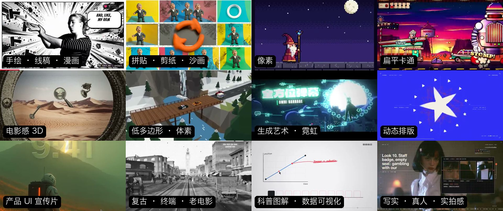

</div>

## 为什么按画风分

Opus 5.5 不直接生成视频，它写代码画出每一帧，再渲染成 MP4。所以同一句提示词，这次出来是动态排版，下次可能就是 3D 或像素。<b>想要某种画风，就得在提示词里写清楚。</b>这里每种画风都给出真实案例的提示词，外加一段可以直接套用的「风格配方」。

## 三步用起来

1. 在下面挑一种画风，点进去看案例。
2. 复制案例的提示词改成你的主题，或者把「风格配方」贴在你自己的提示词后面。代码框右上角可一键复制。
3. 在 Claude Code 里用 Opus 5.5 运行。一个 [HiAPI](https://www.hiapi.ai/zh) Key 就够：

```bash
export ANTHROPIC_BASE_URL=https://api.hiapi.ai
export ANTHROPIC_AUTH_TOKEN=<your-hiapi-key>
claude --model claude-opus-5-5
```

<div align="center">

<b>由 <a href="https://www.hiapi.ai/zh">HiAPI</a> 整理 · 一个 API，所有 AI 模型</b><br>想配一首原创歌？试试 <a href="https://github.com/HiAPIAI/hiapi-hand-painted-animation-skill">手绘动画技能</a>：写词、作曲、卡节拍、逐帧手绘，一条命令装好。

</div>

## 按画风浏览

<table>
  <tr>
    <td align="center" width="33%" valign="top"><a href="styles/handdrawn.zh-CN.md"></a><br><sub><b>手绘 · 线稿 · 漫画</b> · 22</sub></td>
    <td align="center" width="33%" valign="top"><a href="styles/collage.zh-CN.md">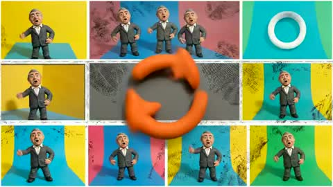</a><br><sub><b>拼贴 · 剪纸 · 沙画</b> · 6</sub></td>
    <td align="center" width="33%" valign="top"><a href="styles/pixel.zh-CN.md">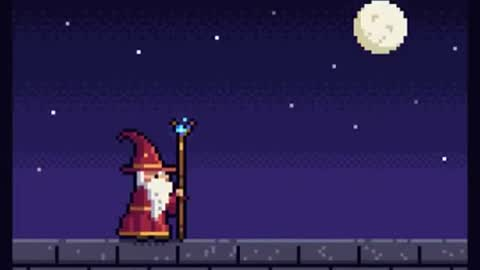</a><br><sub><b>像素</b> · 22</sub></td>
  </tr>
  <tr>
    <td align="center" width="33%" valign="top"><a href="styles/cartoon.zh-CN.md"></a><br><sub><b>扁平卡通</b> · 43</sub></td>
    <td align="center" width="33%" valign="top"><a href="styles/cinematic3d.zh-CN.md">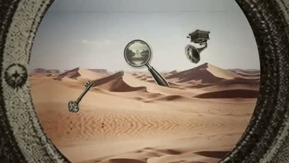</a><br><sub><b>电影感 3D</b> · 82</sub></td>
    <td align="center" width="33%" valign="top"><a href="styles/lowpoly.zh-CN.md"></a><br><sub><b>低多边形 · 体素</b> · 32</sub></td>
  </tr>
  <tr>
    <td align="center" width="33%" valign="top"><a href="styles/generative.zh-CN.md">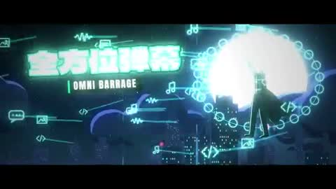</a><br><sub><b>生成艺术 · 霓虹</b> · 34</sub></td>
    <td align="center" width="33%" valign="top"><a href="styles/typography.zh-CN.md">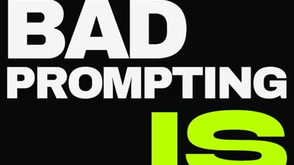</a><br><sub><b>动态排版</b> · 52</sub></td>
    <td align="center" width="33%" valign="top"><a href="styles/productui.zh-CN.md">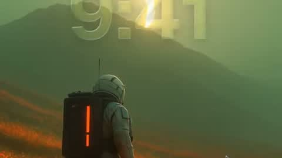</a><br><sub><b>产品 UI 宣传片</b> · 80</sub></td>
  </tr>
  <tr>
    <td align="center" width="33%" valign="top"><a href="styles/retro.zh-CN.md"></a><br><sub><b>复古 · 终端 · 老电影</b> · 5</sub></td>
    <td align="center" width="33%" valign="top"><a href="styles/explainer.zh-CN.md">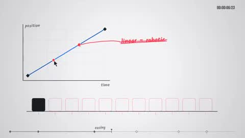</a><br><sub><b>科普图解 · 数据可视化</b> · 38</sub></td>
    <td align="center" width="33%" valign="top"><a href="styles/photoreal.zh-CN.md"></a><br><sub><b>写实 · 真人 · 实拍感</b> · 9</sub></td>
  </tr>
</table>

### [手绘 · 线稿 · 漫画](styles/handdrawn.zh-CN.md) · 22

铅笔线稿、白板手绘、黑白漫画网点。最像“人画的”。

<table>
  <tr>
    <td align="center" width="33%" valign="top"><a href="styles/handdrawn.zh-CN.md#c2103144778481475686"></a><br><sub><b>谈话视频剪辑加字幕特效</b></sub></td>
    <td align="center" width="33%" valign="top"><a href="styles/handdrawn.zh-CN.md#c2103517930424332386"></a><br><sub><b>Distilbook动态宣传片</b></sub></td>
    <td align="center" width="33%" valign="top"><a href="styles/handdrawn.zh-CN.md#c2103570879619686717"></a><br><sub><b>恐怖披萨店完整音乐MV</b></sub></td>
  </tr>
</table>

**[查看全部 22 条提示词 →](styles/handdrawn.zh-CN.md)**

### [拼贴 · 剪纸 · 沙画](styles/collage.zh-CN.md) · 6

剪报拼贴、纸雕浮雕、沙画、剪影。有材质感的“手工”画面。

<table>
  <tr>
    <td align="center" width="33%" valign="top"><a href="styles/collage.zh-CN.md#c2103336310089842921"></a><br><sub><b>现代风格彼得盖布瑞尔MV</b></sub></td>
    <td align="center" width="33%" valign="top"><a href="styles/collage.zh-CN.md#c2103411144899875264">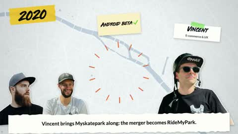</a><br><sub><b>手绘风格品牌介绍动画</b></sub></td>
    <td align="center" width="33%" valign="top"><a href="styles/collage.zh-CN.md#c2102861376184054015"></a><br><sub><b>纸艺风格分形可视化</b></sub></td>
  </tr>
</table>

**[查看全部 6 条提示词 →](styles/collage.zh-CN.md)**

### [像素](styles/pixel.zh-CN.md) · 22

8-bit 像素、复古游戏画面。传播性最强的风格之一。

<table>
  <tr>
    <td align="center" width="33%" valign="top"><a href="styles/pixel.zh-CN.md#c2102476258948927543"></a><br><sub><b>像素风巫师施法动画</b></sub></td>
    <td align="center" width="33%" valign="top"><a href="styles/pixel.zh-CN.md#c2103400046922543147"></a><br><sub><b>韩国中秋节像素动画</b></sub></td>
    <td align="center" width="33%" valign="top"><a href="styles/pixel.zh-CN.md#c2103212966703436195">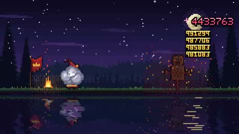</a><br><sub><b>加密货币主题动画</b></sub></td>
  </tr>
</table>

**[查看全部 22 条提示词 →](styles/pixel.zh-CN.md)**

### [扁平卡通](styles/cartoon.zh-CN.md) · 43

扁平矢量角色、复古卡通、绘本感场景。

<table>
  <tr>
    <td align="center" width="33%" valign="top"><a href="styles/cartoon.zh-CN.md#c2104085484347818226"></a><br><sub><b>手游宝箱开启高光演出</b></sub></td>
    <td align="center" width="33%" valign="top"><a href="styles/cartoon.zh-CN.md#c2104045641706189192"></a><br><sub><b>茶杯头风格迷你游戏</b></sub></td>
    <td align="center" width="33%" valign="top"><a href="styles/cartoon.zh-CN.md#c2102853258582880547">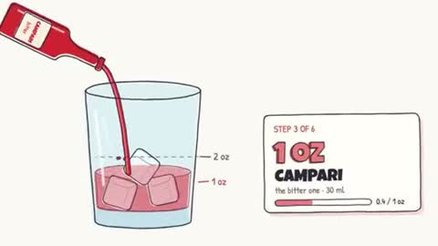</a><br><sub><b>鸡尾酒调制配方动画</b></sub></td>
  </tr>
</table>

**[查看全部 43 条提示词 →](styles/cartoon.zh-CN.md)**

### [电影感 3D](styles/cinematic3d.zh-CN.md) · 82

Three.js / WebGL 做出的电影级 3D：光影、材质、镜头运动。

<table>
  <tr>
    <td align="center" width="33%" valign="top"><a href="styles/cinematic3d.zh-CN.md#c2103129343253778767"></a><br><sub><b>复古物件无限缩放动画</b></sub></td>
    <td align="center" width="33%" valign="top"><a href="styles/cinematic3d.zh-CN.md#c2103119648271290566"></a><br><sub><b>精美鹈鹕骑自行车动画</b></sub></td>
    <td align="center" width="33%" valign="top"><a href="styles/cinematic3d.zh-CN.md#c2103563538828832979"></a><br><sub><b>迷幻催眠动态图形秀</b></sub></td>
  </tr>
</table>

**[查看全部 82 条提示词 →](styles/cinematic3d.zh-CN.md)**

### [低多边形 · 体素](styles/lowpoly.zh-CN.md) · 32

低面数、体素积木、玩具感等距视角。

<table>
  <tr>
    <td align="center" width="33%" valign="top"><a href="styles/lowpoly.zh-CN.md#c2103128800909197521"></a><br><sub><b>3D俯视角赛车游戏</b></sub></td>
    <td align="center" width="33%" valign="top"><a href="styles/lowpoly.zh-CN.md#c2103638831669076027">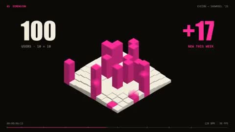</a><br><sub><b>动态设计师感谢用户短片</b></sub></td>
    <td align="center" width="33%" valign="top"><a href="styles/lowpoly.zh-CN.md#c2103786742520184909">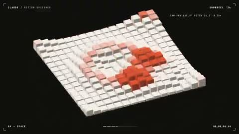</a><br><sub><b>动态设计作品集展示</b></sub></td>
  </tr>
</table>

**[查看全部 32 条提示词 →](styles/lowpoly.zh-CN.md)**

### [生成艺术 · 霓虹](styles/generative.zh-CN.md) · 34

粒子、着色器、几何图案、赛博霓虹。

<table>
  <tr>
    <td align="center" width="33%" valign="top"><a href="styles/generative.zh-CN.md#c2103247844542922825"></a><br><sub><b>Claude与GPT史诗对决动漫</b></sub></td>
    <td align="center" width="33%" valign="top"><a href="styles/generative.zh-CN.md#c2103816865852129686">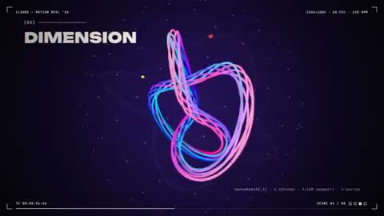</a><br><sub><b>动态图形设计师作品集</b></sub></td>
    <td align="center" width="33%" valign="top"><a href="styles/generative.zh-CN.md#c2102986585004511319"></a><br><sub><b>Tron光速游戏</b></sub></td>
  </tr>
</table>

**[查看全部 34 条提示词 →](styles/generative.zh-CN.md)**

### [动态排版](styles/typography.zh-CN.md) · 52

大字、字体动画、平面设计感的片头。一句话提示词里爆款最多的一类。

<table>
  <tr>
    <td align="center" width="33%" valign="top"><a href="styles/typography.zh-CN.md#c2103411244468498547"></a><br><sub><b>TechHalla品牌动态标识</b></sub></td>
    <td align="center" width="33%" valign="top"><a href="styles/typography.zh-CN.md#c2103463886372696074">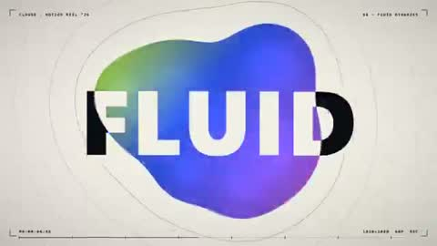</a><br><sub><b>创意动态图形全力演示</b></sub></td>
    <td align="center" width="33%" valign="top"><a href="styles/typography.zh-CN.md#c2103395846578676116">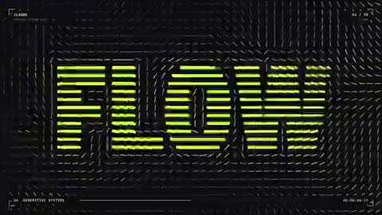</a><br><sub><b>动态设计师作品展示卷</b></sub></td>
  </tr>
</table>

**[查看全部 52 条提示词 →](styles/typography.zh-CN.md)**

### [产品 UI 宣传片](styles/productui.zh-CN.md) · 80

App / SaaS 发布片：界面、卡片、光标演示。

<table>
  <tr>
    <td align="center" width="33%" valign="top"><a href="styles/productui.zh-CN.md#c2103835273813496100"></a><br><sub><b>苹果风品牌发布影片</b></sub></td>
    <td align="center" width="33%" valign="top"><a href="styles/productui.zh-CN.md#c2103723183899852885"></a><br><sub><b>产品功能动态展示片</b></sub></td>
    <td align="center" width="33%" valign="top"><a href="styles/productui.zh-CN.md#c2102827288190689364"></a><br><sub><b>Wrapscribe品牌视频</b></sub></td>
  </tr>
</table>

**[查看全部 80 条提示词 →](styles/productui.zh-CN.md)**

### [复古 · 终端 · 老电影](styles/retro.zh-CN.md) · 5

老照片与黑白影像、ASCII 字符、示波器、CRT 终端。

<table>
  <tr>
    <td align="center" width="33%" valign="top"><a href="styles/retro.zh-CN.md#c2102466523164274839"></a><br><sub><b>1906年旧金山市场街复原</b></sub></td>
    <td align="center" width="33%" valign="top"><a href="styles/retro.zh-CN.md#c2103200703598776559"></a><br><sub><b>英式低频电子音乐创作</b></sub></td>
    <td align="center" width="33%" valign="top"><a href="styles/retro.zh-CN.md#c2102522446654190017"></a><br><sub><b>迪士尼风AI对比动画</b></sub></td>
  </tr>
</table>

**[查看全部 5 条提示词 →](styles/retro.zh-CN.md)**

### [科普图解 · 数据可视化](styles/explainer.zh-CN.md) · 38

图表、公式、地图、时间线。讲清楚一件事。

<table>
  <tr>
    <td align="center" width="33%" valign="top"><a href="styles/explainer.zh-CN.md#c2103495232637882858"></a><br><sub><b>动态设计师作品集展示</b></sub></td>
    <td align="center" width="33%" valign="top"><a href="styles/explainer.zh-CN.md#c2103683057689522564"></a><br><sub><b>Transformer原理讲解视频</b></sub></td>
    <td align="center" width="33%" valign="top"><a href="styles/explainer.zh-CN.md#c2103272686570918334">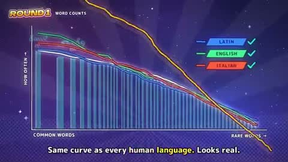</a><br><sub><b>动漫风社媒动画</b></sub></td>
  </tr>
</table>

**[查看全部 38 条提示词 →](styles/explainer.zh-CN.md)**

### [写实 · 真人 · 实拍感](styles/photoreal.zh-CN.md) · 9

用代码编排真实素材或写实渲染，做成 MV、广告和纪录片感。

<table>
  <tr>
    <td align="center" width="33%" valign="top"><a href="styles/photoreal.zh-CN.md#c2103534482930491441"></a><br><sub><b>AI奇点流行音乐MV</b></sub></td>
    <td align="center" width="33%" valign="top"><a href="styles/photoreal.zh-CN.md#c2102554209166000267"></a><br><sub><b>极简风格产品发布片</b></sub></td>
    <td align="center" width="33%" valign="top"><a href="styles/photoreal.zh-CN.md#c2102781807179735211"></a><br><sub><b>水循环动画</b></sub></td>
  </tr>
</table>

**[查看全部 9 条提示词 →](styles/photoreal.zh-CN.md)**

---

<sub>案例来自作者在 X 上公开发布的作品，视频、截图和提示词都属于原作者，每条都附原帖链接；作者如需修改或下架请开 issue。点赞数据读取于 2026-09-29。风格配方、标题与分类为本仓库原创，采用 <a href="LICENSE">CC BY 4.0</a>。</sub>
