# 扁平卡通 · 43

扁平矢量角色、复古卡通、绘本感场景。

[← 返回图鉴](../README.zh-CN.md)

## 风格配方

把这段贴在你的提示词后面，就能把画风锁定成这一类：

```text
Style: flat 2D cartoon. Bold rounded shapes with thick dark outlines, flat fills with one
shade tone, squash-and-stretch on every move, big expressive eyes. Bright, saturated
palette; simple layered backgrounds.
```

## 案例

<table>
  <tr>
    <td align="center" width="33%" valign="top"><a href="#c2104085484347818226"></a><br><sub><b>手游宝箱开启高光演出</b></sub></td>
    <td align="center" width="33%" valign="top"><a href="#c2104045641706189192"></a><br><sub><b>茶杯头风格迷你游戏</b></sub></td>
    <td align="center" width="33%" valign="top"><a href="#c2102853258582880547"></a><br><sub><b>鸡尾酒调制配方动画</b></sub></td>
  </tr>
  <tr>
    <td align="center" width="33%" valign="top"><a href="#c2103688362960019567">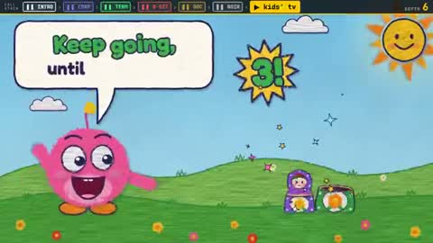</a><br><sub><b>递归概念多风格解说</b></sub></td>
    <td align="center" width="33%" valign="top"><a href="#c2103149526244618682">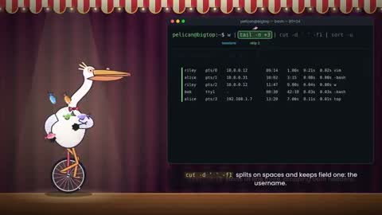</a><br><sub><b>鹈鹕骑独轮车讲解Shell命令</b></sub></td>
    <td align="center" width="33%" valign="top"><a href="#c2103724883301814408">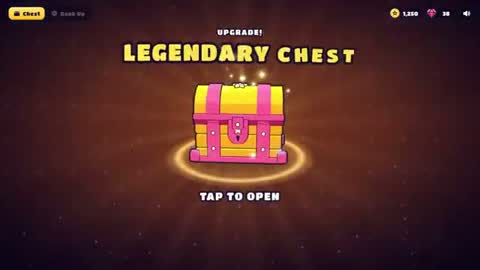</a><br><sub><b>手游高光时刻奖励动效</b></sub></td>
  </tr>
  <tr>
    <td align="center" width="33%" valign="top"><a href="#c2103124033365762215">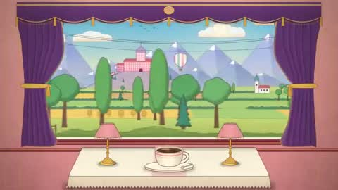</a><br><sub><b>火车窗外四季风景</b></sub></td>
    <td align="center" width="33%" valign="top"><a href="#c2103468826364948584">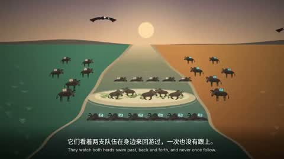</a><br><sub><b>BBC风双语2D动画</b></sub></td>
    <td align="center" width="33%" valign="top"><a href="#c2102695622042411419">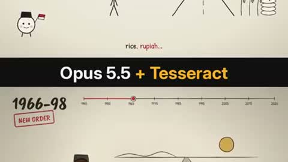</a><br><sub><b>印尼81年历史动画</b></sub></td>
  </tr>
  <tr>
    <td align="center" width="33%" valign="top"><a href="#c2103824976713306214">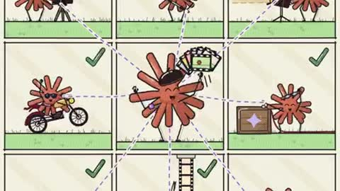</a><br><sub><b>Claude Code效率动画展示</b></sub></td>
    <td align="center" width="33%" valign="top"><a href="#c2103132260589338762">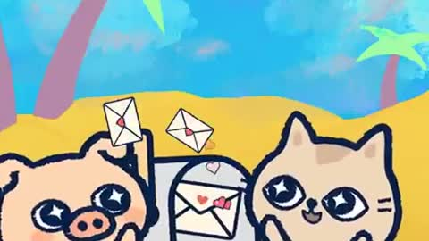</a><br><sub><b>小猪送情书趣味动画</b></sub></td>
    <td align="center" width="33%" valign="top"><a href="#c2102732988262068440">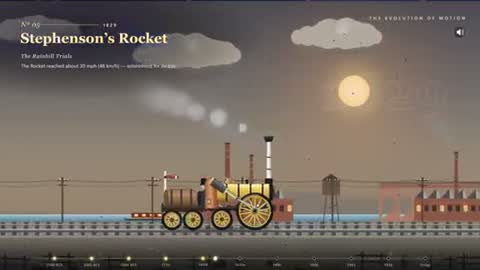</a><br><sub><b>交通工具发展史动画</b></sub></td>
  </tr>
  <tr>
    <td align="center" width="33%" valign="top"><a href="#c2103358957050068999">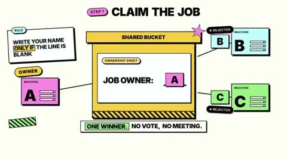</a><br><sub><b>Celld产品价值动画解说</b></sub></td>
    <td align="center" width="33%" valign="top"><a href="#c2103144263735562388">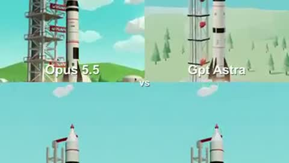</a><br><sub><b>四模型火箭发射对比</b></sub></td>
    <td align="center" width="33%" valign="top"><a href="#c2103817763991290170"></a><br><sub><b>VTuber みゅみゅ MV</b></sub></td>
  </tr>
  <tr>
    <td align="center" width="33%" valign="top"><a href="#c2103449418460753990">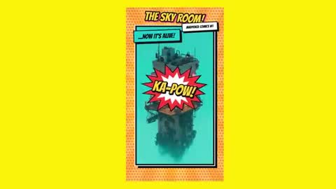</a><br><sub><b>漫画风格动态图形短片</b></sub></td>
    <td align="center" width="33%" valign="top"><a href="#c2103637769012597063">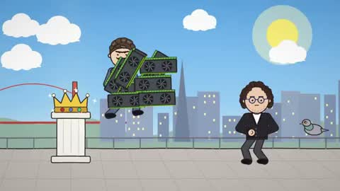</a><br><sub><b>Dario与Sam爆笑对决动画</b></sub></td>
    <td align="center" width="33%" valign="top"><a href="#c2103804459986161719">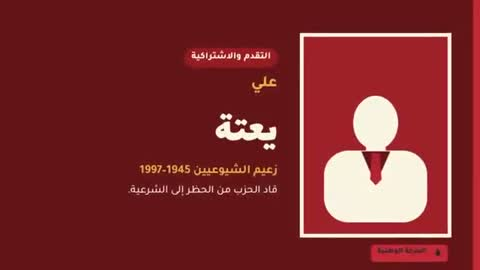</a><br><sub><b>摩洛哥独立后政治历史回顾</b></sub></td>
  </tr>
  <tr>
    <td align="center" width="33%" valign="top"><a href="#c2103145548547322322">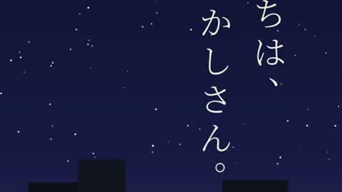</a><br><sub><b>晚睡风格日语视频</b></sub></td>
    <td align="center" width="33%" valign="top"><a href="#c2102448782776697055">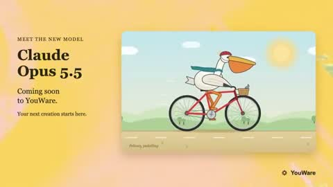</a><br><sub><b>鹈鹕骑自行车SVG动画</b></sub></td>
    <td align="center" width="33%" valign="top"><a href="#c2103033624463585327">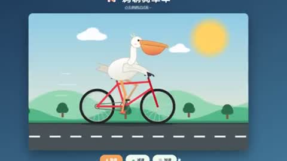</a><br><sub><b>鹈鹕骑自行车SVG动画</b></sub></td>
  </tr>
  <tr>
    <td align="center" width="33%" valign="top"><a href="#c2103112385380667455">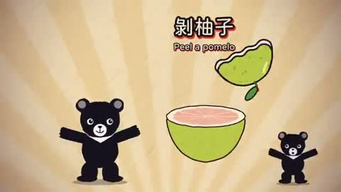</a><br><sub><b>台湾黑熊中秋节动画</b></sub></td>
    <td align="center" width="33%" valign="top"><a href="#c2103992348535595425">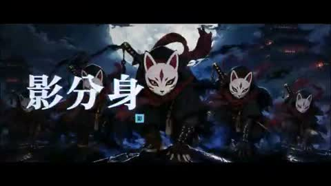</a><br><sub><b>NINJUTSU REVERSI宣传视频</b></sub></td>
    <td align="center" width="33%" valign="top"><a href="#c2103272941832306746">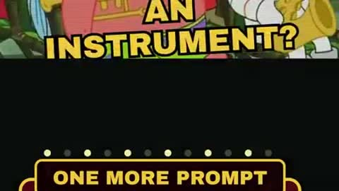</a><br><sub><b>终端命令行AI上瘾洗脑视频</b></sub></td>
  </tr>
  <tr>
    <td align="center" width="33%" valign="top"><a href="#c2102846861971169340">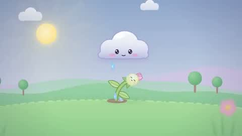</a><br><sub><b>可爱流畅动画短片</b></sub></td>
    <td align="center" width="33%" valign="top"><a href="#c2103237989065277590">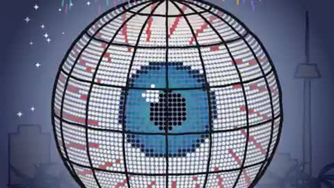</a><br><sub><b>拉斯维加斯球馆历史</b></sub></td>
    <td align="center" width="33%" valign="top"><a href="#c2103225854599807308">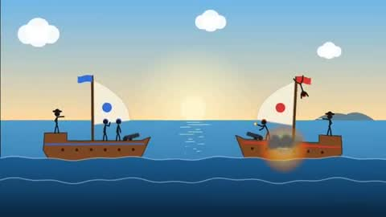</a><br><sub><b>火柴人海战动画</b></sub></td>
  </tr>
  <tr>
    <td align="center" width="33%" valign="top"><a href="#c2103660849055547730">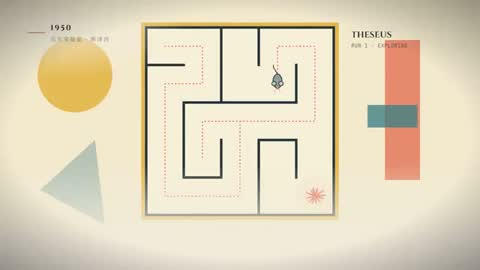</a><br><sub><b>Opus家族史动画</b></sub></td>
    <td align="center" width="33%" valign="top"><a href="#c2103510776690479597">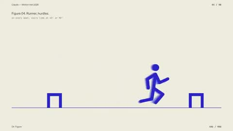</a><br><sub><b>动态设计师作品集展示</b></sub></td>
    <td align="center" width="33%" valign="top"><a href="#c2103428454355980558">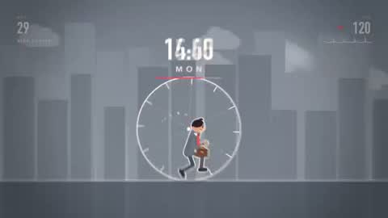</a><br><sub><b>人生轮回动画循环</b></sub></td>
  </tr>
  <tr>
    <td align="center" width="33%" valign="top"><a href="#c2103492763358786022">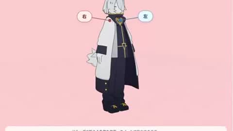</a><br><sub><b>3D行走动作动画</b></sub></td>
    <td align="center" width="33%" valign="top"><a href="#c2103121149811130787">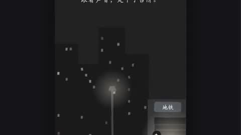</a><br><sub><b>仿Florence解谜游戏</b></sub></td>
    <td align="center" width="33%" valign="top"><a href="#c2104001561718591563">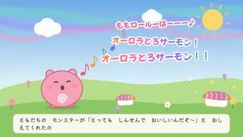</a><br><sub><b>note文章转动画</b></sub></td>
  </tr>
  <tr>
    <td align="center" width="33%" valign="top"><a href="#c2103407629880148436">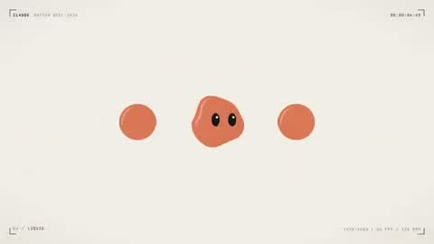</a><br><sub><b>AI拟人介绍Opus新版本</b></sub></td>
    <td align="center" width="33%" valign="top"><a href="#c2103019799614034026">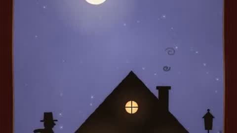</a><br><sub><b>剪纸影院家的感觉动画</b></sub></td>
    <td align="center" width="33%" valign="top"><a href="#c2102532031708377471">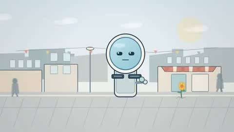</a><br><sub><b>少女问AI喜好短片</b></sub></td>
  </tr>
  <tr>
    <td align="center" width="33%" valign="top"><a href="#c2102593608939643211">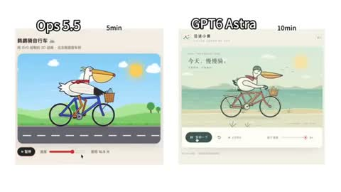</a><br><sub><b>SVG鹈鹕骑车对比</b></sub></td>
    <td align="center" width="33%" valign="top"><a href="#c2103763857902883213">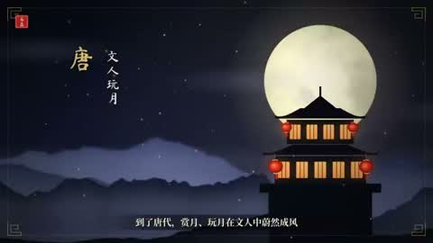</a><br><sub><b>中秋节来历介绍视频</b></sub></td>
    <td align="center" width="33%" valign="top"><a href="#c2103110271711728101">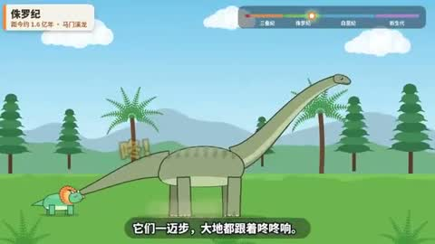</a><br><sub><b>三角龙视角恐龙进化史</b></sub></td>
  </tr>
  <tr>
    <td align="center" width="33%" valign="top"><a href="#c2103057174855634965">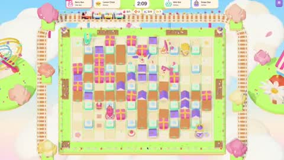</a><br><sub><b>AI复刻泡泡堂经典游戏</b></sub></td>
    <td align="center" width="33%" valign="top"><a href="#c2103904436141842605">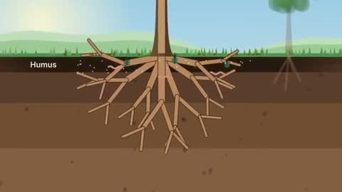</a><br><sub><b>树作为生态系统动画</b></sub></td>
    <td align="center" width="33%" valign="top"><a href="#c2103830083446415751">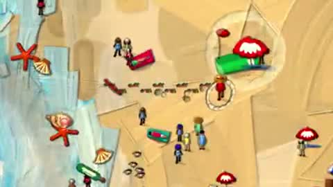</a><br><sub><b>AI自制游戏预告片</b></sub></td>
  </tr>
  <tr>
    <td align="center" width="33%" valign="top"><a href="#c2102903173161877996">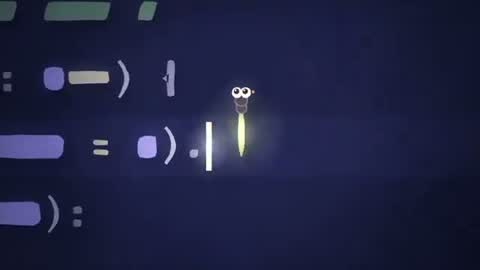</a><br><sub><b>不想被修复的虫子动画短片</b></sub></td>
  </tr>
</table>

---

<a id="c2104085484347818226"></a>

### 手游宝箱开启高光演出

<a href="https://x.com/op7418/status/2104085484347818226"></a>

```text
帮我做一个原创的手游「高光时刻」动效：[主体，例如：开宝箱 / 段位晋升 / 成就解锁 / Boss 掉落 / 角色升级]。
做成一个可以直接打开的单文件网页（HTML + CSS + JS），点一下就能完整播放，效果对标商业手游的结算 / 奖励演出。

【世界观与风格】
- 原创美术，不要模仿任何现有游戏的 IP、角色或 Logo。
- 卡通手游风：高饱和配色，统一的深色描边（例如 #1A1033），圆润厚重的造型。
- 配色随等级升级：[等级阶梯，例如：普通绿 → 稀有蓝 → 史诗紫 → 传说金]。每升一级都要切换主色、光效颜色和背景色调。
- 标题用圆胖的游戏字体（如 Titan One / Lilita One），描黑边，加投影；文字逐字「砸」进画面，带回弹。

【主体物：做成真 3D】
- 用 Three.js 建模，不要用平面 SVG
贴图。要有厚度、倒角，以及符合主体的结构细节（木板缝、铆钉、包边、宝石切面、锁扣等）；木板缝这类细节用真实几何体拼出来，不要贴黑线条。
- 着色用卡通分阶（MeshToonMaterial 加 3～4 阶的渐变贴图），配三种灯光：主光、天光、等级色的轮廓光。
- 描边用后期边缘检测：渲染法线图 + 深度图，再用着色器画线。外轮廓粗、零件交界细，粗细全程一致；另外做 1.5 倍超采样和多重采样抗锯齿。
  不要用「放大一圈的黑色背面」那种描边，那样粗细不均、转角会断。
  深度判断的阈值要放宽，接缝主要靠法线判断，否则斜着看的表面会冒出细碎斜纹。
- 活动部件要真实运动，比如箱盖绕铰链翻开、奖章绕竖轴旋转。
- 待机时主体缓慢左右转动，让人看到侧面和厚度，同时轻微上下浮动；脚下要有随高度变化的柔和投影。

【如果画面里有 2D 插画（卡面、奖励图标、角色）】
- 三层卡通着色：底色、成块的阴影色、高光色，不要只用一层渐变。
- 线条分粗细：外轮廓粗，内部结构线细。
- 每个角色或物件要有自己的表情和姿态，不要所有东西共用同一张脸。
- 脚下画投影，让主体「站」在画面里；背景按属性区分图案，不要全用同一套放射线。

【演出节奏：五个阶段，缺一不可】
1. 预备：主体待机浮动，每隔几秒抖一下提示可以点击，底部显示「点击」提示。
2. 升级：每点一次，主体跳起、在空中转一圈、落地时压扁再回弹；同时切换到下一等级的颜色，闪一下光，冒一圈粒子，标题更新。
3. 蓄力（约 1 秒）：主体越抖越剧烈，缝隙透出光，四周粒子往中心吸，音效音调持续上升；最后一刻猛地压扁。
4. 爆发：从爆点向外扩散的泛光闪白、屏幕震动、镜头往前一推、多层冲击波、细长流光迸射、闪光星点、金币和宝石（带旋转）。高等级的爆发要明显更强。彩带只在最高潮用一次，不要满屏彩带。
5. 揭晓与结算：
   - 奖励卡片从主体里沿弧线飞出，落位时带超调和晃动收尾，数字滚动计数。
   - 稀有物品带彩虹流光边框和「NEW!」角标。
   - 点击领取后，金币和宝石沿贝塞尔曲线飞进右上角的余额，每到一个余额就跳一下。

【揭晓舞台：让主角独占画面】
- 最高稀有度揭晓时，其他元素收起或淡出，背后换成一层干净的渐变幕布加缓慢旋转的柔光，不要让主角压在杂乱的背景上。
- 幕布出现时，把场景里的其他 3D 物件隐藏掉，否则后期描边会把它们的轮廓线画在幕布上。
- 主角的外发光要放在主体背后，只从边缘溢出，不能盖在主体前面把它糊成一片白。
- 可以加一圈围绕主角盘旋的星尘拖尾，但轨道必须完整在主角轮廓外侧，不能从主体正面扫过。

【光效：必须柔和，不能有硬边】
- 背景光芒：用带渐变过渡的 conic-gradient，不要一刀切的色块边缘；叠 2～3 层不同密度、不同转速的光。
- 光柱：由 5～7 道带模糊的光束呈扇形散开，亮度各自轻微闪动；根部加一团柔光核心，光里有光尘缓慢上飘。
- 闪白：从爆点向外的径向泛光（mix-blend-mode: screen），强度不超过 0.8，不要整屏纯白过曝。
- 粒子：每个火花都带一圈低透明度的外晕；冲击波用三层描边（宽而淡、中等、细而亮）。

【材质与界面】
- 边框、名牌、按钮要有材质感：金属拉丝渐变、左上亮右下暗的倒角光、内阴影；按稀有度换镶嵌件（钢铆钉 → 银框宝石 → 金框钻石加小王冠）。
- 小卡片上不要塞小字数值；详细数值放到揭晓时的信息面板里，面板里的数字滚动上涨，并弹出「▲+数值」。
- 画在 Canvas 上的贴图，分辨率至少是屏幕上最大显示尺寸的 1.5 倍，否则放大时会发虚。

【动画原则】
- 用 GSAP 时间线编排。所有动作都要有挤压拉伸、超调和弹性回弹，不要匀速。
- 粒子系统用 Canvas 2D 自己写：重力、阻力、生命周期、叠加混合，以及「吸入」「曲线飞行」「环绕」三种运动。
- 不要用 CSS 3D 透视去翻转大尺寸元素，放大加侧翻时会被投影成铺满屏幕的平面，3D 翻转一律放在 WebGL 里做。
- 所有「抖动」「呼吸」类的循环补间，在状态切换时要先取消再归零，避免它比停止指令晚一帧结束，又把值设回去。

【音效】
- 全部用 Web Audio 实时合成，不用音频文件：跳起、落地、升级和弦、蓄力上升音、爆炸低频加噪声、弹出音、计数滴答、金币叮当、胜利号角。
- 第一次点击时才初始化音频；右上角放静音开关。

【界面与工程】
- 顶部 HUD：模式切换、金币和宝石余额、静音按钮。
- 手机宽度也要能用；遵守「减少动态效果」设置（关闭震屏，减少粒子）。
- 动画状态机要严谨：动画播放中忽略点击，不能出现点击被吞或状态错乱。
- 目标 60fps。第一次打开时就是完整的待机画面，不能是空白。

【交付前自检】
在蓄力、爆发、揭晓、结算这几个时刻各截一张图，逐张检查：
- 主角有没有被光晕、粒子或文字挡住？
- 有没有过曝成一片白？
- 背景是否杂乱，有没有穿帮的描边线？
- 小字是否能看清？
- 结算后是否还有东西在不该动的时候继续抖动？

最后告诉我：每个阶段的时长，以及哪些参数可以调整演出强度。
```

<sub>作者 @op7418 · <a href="https://x.com/op7418/status/2104085484347818226">看原视频</a></sub>

---

<a id="c2104045641706189192"></a>

### 茶杯头风格迷你游戏

<a href="https://x.com/TaylorBereiter/status/2104045641706189192"></a>

> 作者只公开了部分提示词。

```text
https://claude.ai/artifact/Vos8wdB8Jenz9FopZWeRMb

Check out DOUBLE FEATURE, a Cuphead Inspired Mini-Game built with Claude Opus 5.5.

I find this model works best when leaning into its strengths, figuring out the parts it
does well and letting it capitalize on them. Cartoon shapes and sounds are great.
```

<sub>作者 @TaylorBereiter · <a href="https://x.com/TaylorBereiter/status/2104045641706189192">看原视频</a></sub>

---

<a id="c2102853258582880547"></a>

### 鸡尾酒调制配方动画

<a href="https://x.com/Ror_Fly/status/2102853258582880547"></a>

```text
We're going to try a little test. Do you think you could render a recipe motion graphic
animation using javascript or html (w/e you think will produce the best) to show the full
recipe from start to finish (empty glass to completed cocktail) - Explainer video style -
Showing the recipe ingreidents + measurements as they're going into the cup. Should be a
30s video.
```

<sub>作者 @Ror_Fly · <a href="https://x.com/Ror_Fly/status/2102853258582880547">看原视频</a></sub>

---

<a id="c2103688362960019567"></a>

### 递归概念多风格解说

<a href="https://x.com/emollick/status/2103688362960019567"></a>

```text
A video explaining recursion, where every explanation about recursion has a radically
different video style, make this self-referential & clever & fast moving.
```

<sub>作者 @emollick · <a href="https://x.com/emollick/status/2103688362960019567">看原视频</a></sub>

---

<a id="c2103149526244618682"></a>

### 鹈鹕骑独轮车讲解Shell命令

<a href="https://x.com/goodside/status/2103149526244618682"></a>

```text
Create a 30s animated video with sythesized voice where an animated pelican on a unicycle
explains the shell command `w | tail -n +3 | cut -d ' ' -f1 | sort -u` with visuals while
juggling several fish.
```

<sub>作者 @goodside · <a href="https://x.com/goodside/status/2103149526244618682">看原视频</a></sub>

---

<a id="c2103724883301814408"></a>

### 手游高光时刻奖励动效

<a href="https://x.com/op7418/status/2103724883301814408"></a>

```text
帮我做一个原创的手游「高光时刻」动效：[主体，例如：开宝箱 / 段位晋升 / 成就解锁 / Boss 掉落 / 角色升级]。
做成一个可以直接打开的单文件网页（HTML + CSS + JS），点一下就能完整播放，效果对标商业手游的结算 / 奖励演出。

【世界观与风格】
- 原创美术，不要模仿任何现有游戏的 IP、角色或 Logo。
- 卡通手游风：高饱和配色，统一的深色描边（例如 #1A1033），圆润厚重的造型。
- 配色随等级升级：[等级阶梯，例如：普通绿 → 稀有蓝 → 史诗紫 → 传说金]。每升一级都要切换主色、光效颜色和背景色调。
- 标题用圆胖的游戏字体（如 Titan One / Lilita One），描黑边，加投影；文字逐字「砸」进画面，带回弹。

【主体物：做成真 3D】
- 用 Three.js 建模，不要用平面 SVG
贴图。要有厚度、倒角，以及符合主体的结构细节（木板缝、铆钉、包边、宝石切面、锁扣等）；木板缝这类细节用真实几何体拼出来，不要贴黑线条。
- 着色用卡通分阶（MeshToonMaterial 加 3～4 阶的渐变贴图），配三种灯光：主光、天光、等级色的轮廓光。
- 描边用后期边缘检测：渲染法线图 + 深度图，再用着色器画线。外轮廓粗、零件交界细，粗细全程一致；另外做 1.5 倍超采样和多重采样抗锯齿。
  不要用「放大一圈的黑色背面」那种描边，那样粗细不均、转角会断。
  深度判断的阈值要放宽，接缝主要靠法线判断，否则斜着看的表面会冒出细碎斜纹。
- 活动部件要真实运动，比如箱盖绕铰链翻开、奖章绕竖轴旋转。
- 待机时主体缓慢左右转动，让人看到侧面和厚度，同时轻微上下浮动；脚下要有随高度变化的柔和投影。

【如果画面里有 2D 插画（卡面、奖励图标、角色）】
- 三层卡通着色：底色、成块的阴影色、高光色，不要只用一层渐变。
- 线条分粗细：外轮廓粗，内部结构线细。
- 每个角色或物件要有自己的表情和姿态，不要所有东西共用同一张脸。
- 脚下画投影，让主体「站」在画面里；背景按属性区分图案，不要全用同一套放射线。

【演出节奏：五个阶段，缺一不可】
1. 预备：主体待机浮动，每隔几秒抖一下提示可以点击，底部显示「点击」提示。
2. 升级：每点一次，主体跳起、在空中转一圈、落地时压扁再回弹；同时切换到下一等级的颜色，闪一下光，冒一圈粒子，标题更新。
3. 蓄力（约 1 秒）：主体越抖越剧烈，缝隙透出光，四周粒子往中心吸，音效音调持续上升；最后一刻猛地压扁。
4. 爆发：从爆点向外扩散的泛光闪白、屏幕震动、镜头往前一推、多层冲击波、细长流光迸射、闪光星点、金币和宝石（带旋转）。高等级的爆发要明显更强。彩带只在最高潮用一次，不要满屏彩带。
5. 揭晓与结算：
   - 奖励卡片从主体里沿弧线飞出，落位时带超调和晃动收尾，数字滚动计数。
   - 稀有物品带彩虹流光边框和「NEW!」角标。
   - 点击领取后，金币和宝石沿贝塞尔曲线飞进右上角的余额，每到一个余额就跳一下。

【揭晓舞台：让主角独占画面】
- 最高稀有度揭晓时，其他元素收起或淡出，背后换成一层干净的渐变幕布加缓慢旋转的柔光，不要让主角压在杂乱的背景上。
- 幕布出现时，把场景里的其他 3D 物件隐藏掉，否则后期描边会把它们的轮廓线画在幕布上。
- 主角的外发光要放在主体背后，只从边缘溢出，不能盖在主体前面把它糊成一片白。
- 可以加一圈围绕主角盘旋的星尘拖尾，但轨道必须完整在主角轮廓外侧，不能从主体正面扫过。

【光效：必须柔和，不能有硬边】
- 背景光芒：用带渐变过渡的 conic-gradient，不要一刀切的色块边缘；叠 2～3 层不同密度、不同转速的光。
- 光柱：由 5～7 道带模糊的光束呈扇形散开，亮度各自轻微闪动；根部加一团柔光核心，光里有光尘缓慢上飘。
- 闪白：从爆点向外的径向泛光（mix-blend-mode: screen），强度不超过 0.8，不要整屏纯白过曝。
- 粒子：每个火花都带一圈低透明度的外晕；冲击波用三层描边（宽而淡、中等、细而亮）。

【材质与界面】
- 边框、名牌、按钮要有材质感：金属拉丝渐变、左上亮右下暗的倒角光、内阴影；按稀有度换镶嵌件（钢铆钉 → 银框宝石 → 金框钻石加小王冠）。
- 小卡片上不要塞小字数值；详细数值放到揭晓时的信息面板里，面板里的数字滚动上涨，并弹出「▲+数值」。
- 画在 Canvas 上的贴图，分辨率至少是屏幕上最大显示尺寸的 1.5 倍，否则放大时会发虚。

【动画原则】
- 用 GSAP 时间线编排。所有动作都要有挤压拉伸、超调和弹性回弹，不要匀速。
- 粒子系统用 Canvas 2D 自己写：重力、阻力、生命周期、叠加混合，以及「吸入」「曲线飞行」「环绕」三种运动。
- 不要用 CSS 3D 透视去翻转大尺寸元素，放大加侧翻时会被投影成铺满屏幕的平面，3D 翻转一律放在 WebGL 里做。
- 所有「抖动」「呼吸」类的循环补间，在状态切换时要先取消再归零，避免它比停止指令晚一帧结束，又把值设回去。

【音效】
- 全部用 Web Audio 实时合成，不用音频文件：跳起、落地、升级和弦、蓄力上升音、爆炸低频加噪声、弹出音、计数滴答、金币叮当、胜利号角。
- 第一次点击时才初始化音频；右上角放静音开关。

【界面与工程】
- 顶部 HUD：模式切换、金币和宝石余额、静音按钮。
- 手机宽度也要能用；遵守「减少动态效果」设置（关闭震屏，减少粒子）。
- 动画状态机要严谨：动画播放中忽略点击，不能出现点击被吞或状态错乱。
- 目标 60fps。第一次打开时就是完整的待机画面，不能是空白。

【交付前自检】
在蓄力、爆发、揭晓、结算这几个时刻各截一张图，逐张检查：
- 主角有没有被光晕、粒子或文字挡住？
- 有没有过曝成一片白？
- 背景是否杂乱，有没有穿帮的描边线？
- 小字是否能看清？
- 结算后是否还有东西在不该动的时候继续抖动？

最后告诉我：每个阶段的时长，以及哪些参数可以调整演出强度。
```

<sub>作者 @op7418 · <a href="https://x.com/op7418/status/2103724883301814408">看原视频</a></sub>

---

<a id="c2103124033365762215"></a>

### 火车窗外四季风景

<a href="https://x.com/itsolelehmann/status/2103124033365762215"></a>

```text
4 seasons passing outside a train window, a cozy carriage, a cup of coffee on the table,
Grand Budapest Hotel style
```

<sub>作者 @itsolelehmann · <a href="https://x.com/itsolelehmann/status/2103124033365762215">看原视频</a></sub>

---

<a id="c2103468826364948584"></a>

### BBC风双语2D动画

<a href="https://x.com/Tz_2022/status/2103468826364948584"></a>

```text
把它做成 2D 动画视频吧，用BBC那种音色，英文讲解中英文双语字幕
```

<sub>作者 @Tz_2022 · <a href="https://x.com/Tz_2022/status/2103468826364948584">看原视频</a></sub>

---

<a id="c2102695622042411419"></a>

### 印尼81年历史动画

<a href="https://x.com/hanifproduktif/status/2102695622042411419"></a>

```text
Create an animation that quickly recaps the 81 years of Indonesian history. The style
should be simple, lighthearted and fun, in a line drawing animation
```

<sub>作者 @hanifproduktif · <a href="https://x.com/hanifproduktif/status/2102695622042411419">看原视频</a></sub>

---

<a id="c2103824976713306214"></a>

### Claude Code效率动画展示

<a href="https://x.com/daniel_mac8/status/2103824976713306214"></a>

```text
I want to try something different here. You should act as a  world-class animator and
create an animation to go along with an  X post that talks about how Ultra Code and Claude
Code are now  much more relevant due to the efficiency of Opus 5.5. You can use it without
annihilating your usage limits

the style of the video here
/Users/danielmcateer/Downloads/jvnZ3SyyxxajVatp.mp4

What I had in mind was start with Claude Code in the terminal from the first attached
video, with me navigating to the 'ultracode' reasoning effort, then exploding into a scene
where the Claude icon characters similar to what's in the second video are shooting an
action video and it's representing using Claude Code dynamic workflows editing a video.
```

<sub>作者 @daniel_mac8 · <a href="https://x.com/daniel_mac8/status/2103824976713306214">看原视频</a></sub>

---

<a id="c2103132260589338762"></a>

### 小猪送情书趣味动画

<a href="https://x.com/jackfriks/status/2103132260589338762"></a>

```text
can you help me use the pig assets on new branch of lovelee to make a 9:16 short story
animation with sound effects about the pig sending his partner love notes in the mailbox
and make it fun and good tease app at end?
```

<sub>作者 @jackfriks · <a href="https://x.com/jackfriks/status/2103132260589338762">看原视频</a></sub>

---

<a id="c2102732988262068440"></a>

### 交通工具发展史动画

<a href="https://x.com/HarshithLucky3/status/2102732988262068440"></a>

```text
animate the entire history of transportation
```

<sub>作者 @HarshithLucky3 · <a href="https://x.com/HarshithLucky3/status/2102732988262068440">看原视频</a></sub>

---

<a id="c2103358957050068999"></a>

### Celld产品价值动画解说

<a href="https://x.com/0xnfrith/status/2103358957050068999"></a>

```text
make me an animation to explain why celld earns its place.
```

<sub>作者 @0xnfrith · <a href="https://x.com/0xnfrith/status/2103358957050068999">看原视频</a></sub>

---

<a id="c2103144263735562388"></a>

### 四模型火箭发射对比

<a href="https://x.com/EnvolDev/status/2103144263735562388"></a>

```text
Build a rocket launch.
```

<sub>作者 @EnvolDev · <a href="https://x.com/EnvolDev/status/2103144263735562388">看原视频</a></sub>

---

<a id="c2103817763991290170"></a>

### VTuber みゅみゅ MV

<a href="https://x.com/miyumiyuna5/status/2103817763991290170"></a>

```text
フォルダにみゅみゅというキャラクターの設定図とVRMモデルがあります。 VTuberのみゅみゅをしらべて、かっこいいMVを作成してください 作成に画像や音楽が必要でした
```

<sub>作者 @miyumiyuna5 · <a href="https://x.com/miyumiyuna5/status/2103817763991290170">看原视频</a></sub>

---

<a id="c2103449418460753990"></a>

### 漫画风格动态图形短片

<a href="https://x.com/madpencil_/status/2103449418460753990"></a>

```text
fun motion graphic, comic book style, 10s
```

<sub>作者 @madpencil_ · <a href="https://x.com/madpencil_/status/2103449418460753990">看原视频</a></sub>

---

<a id="c2103637769012597063"></a>

### Dario与Sam爆笑对决动画

<a href="https://x.com/Xanderwow_A/status/2103637769012597063"></a>

```text
Create a 1-minute video featuring a fight between Dario and Sam. It needs plot, explosive
moments, to be hilarious and sufficiently abstract, with no limits on genre or art
style—do what you're best at. Must have a clear winner between the two.
```

<sub>作者 @Xanderwow_A · <a href="https://x.com/Xanderwow_A/status/2103637769012597063">看原视频</a></sub>

---

<a id="c2103804459986161719"></a>

### 摩洛哥独立后政治历史回顾

<a href="https://x.com/TrigLyceee/status/2103804459986161719"></a>

```text
réalise une vidéo résumant la vie politique au Maroc depuis l’indépendance
```

<sub>作者 @TrigLyceee · <a href="https://x.com/TrigLyceee/status/2103804459986161719">看原视频</a></sub>

---

<a id="c2103145548547322322"></a>

### 晚睡风格日语视频

<a href="https://x.com/alfredplpl/status/2103145548547322322"></a>

```text
こんにちは、夜ふかしさん。という感じの動画を作って
```

<sub>作者 @alfredplpl · <a href="https://x.com/alfredplpl/status/2103145548547322322">看原视频</a></sub>

---

<a id="c2102448782776697055"></a>

### 鹈鹕骑自行车SVG动画

<a href="https://x.com/YouWareAI/status/2102448782776697055"></a>

```text
Generate an SVG animation of a pelican riding a bicycle.
```

<sub>作者 @YouWareAI · <a href="https://x.com/YouWareAI/status/2102448782776697055">看原视频</a></sub>

---

<a id="c2103033624463585327"></a>

### 鹈鹕骑自行车SVG动画

<a href="https://x.com/shitunote/status/2103033624463585327"></a>

```text
生成一个鹈鹕骑自行车的svg动画，以H5页面展示
```

<sub>作者 @shitunote · <a href="https://x.com/shitunote/status/2103033624463585327">看原视频</a></sub>

---

<a id="c2103112385380667455"></a>

### 台湾黑熊中秋节动画

<a href="https://x.com/eric_khun/status/2103112385380667455"></a>

```text
I want you to create a "Happy Mid-Autumn Festival" video in hand drawn canvas animation
style. You must use the attached Taiwan black bear as the main character representing
Taiwan: flat black silhouette, round ears with grey insides, big round white-ringed eyes,
white round muzzle with a small black nose and smile, and the white V moon mark on its
chest. Keep it recognizable as that exact character. The character will have adventures,
fast cuts, zooms, animations going all out in the hand drawn style. But WOW the audience
and research how Taiwan celebrates Mid-Autumn to include in this video: outdoor barbecue
with family and friends over the long weekend (a tradition born from a 1980s soy sauce
ad), sharing mooncakes, pomelo rind hats, and moon gazing. Make it unconventional, showing
the true spirit of a Taiwanese Mid-Autumn night. Use a Taiwanese style font, make it
almost Taiwan black bear branding.

if there is any text , write in traditional chinese and english
Get the right assets, plan it out, draft and render to give me an MP4. No skills, No MCP.
16:9 at high res, 30 seconds max, aim to reduce file size limit
```

<sub>作者 @eric_khun · <a href="https://x.com/eric_khun/status/2103112385380667455">看原视频</a></sub>

---

<a id="c2103992348535595425"></a>

### NINJUTSU REVERSI宣传视频

<a href="https://x.com/design_oyaji/status/2103992348535595425"></a>

```text
NINJUTSU REVERSIで30秒。
Higgsfieldは100クレジット以内で。
```

<sub>作者 @design_oyaji · <a href="https://x.com/design_oyaji/status/2103992348535595425">看原视频</a></sub>

---

<a id="c2103272941832306746"></a>

### 终端命令行AI上瘾洗脑视频

<a href="https://x.com/supremebeme/status/2103272941832306746"></a>

```text
make a brainrot video about the terminal. i can't escape it. ai is so addictive.
```

<sub>作者 @supremebeme · <a href="https://x.com/supremebeme/status/2103272941832306746">看原视频</a></sub>

---

<a id="c2102846861971169340"></a>

### 可爱流畅动画短片

<a href="https://x.com/patrickassale/status/2102846861971169340"></a>

```text
Create an original 45 second animation. Keep it cute, smooth, and fluid at 60 fps, and
create the full soundtrack as well. Do not include any on screen text. If possible, and
only if it works well, add a soft, natural female voice over.
```

<sub>作者 @patrickassale · <a href="https://x.com/patrickassale/status/2102846861971169340">看原视频</a></sub>

---

<a id="c2103237989065277590"></a>

### 拉斯维加斯球馆历史

<a href="https://x.com/RetropunkAI/status/2103237989065277590"></a>

```text
Render a fun motion graphic animation using the GSAP animation platform (see below) to
show a brief history of The Sphere in Las Vegas from start to today (start with a minimal
architecture to completed venue) - Explainer video style - Talk about how bands now play
there, The Wizard of Oz film and next how on Oct 1 2026 Metallica will make their debut -
and guess who is attending? We are! Should be a 30-60s video depending on the info. Use
the images in the folder.

Sphere History:
https://en.wikipedia.org/wiki/Sphere_(venue)

Animation Platforms:
https://gsap.com/

Ask me any questions if you need, but if you feel confident please have fun and make
something awesome that will go super viral!
```

<sub>作者 @RetropunkAI · <a href="https://x.com/RetropunkAI/status/2103237989065277590">看原视频</a></sub>

---

<a id="c2103225854599807308"></a>

### 火柴人海战动画

<a href="https://x.com/andriyfernandes/status/2103225854599807308"></a>

```text
faça uma animação de stickman's numa batalha naval, use meus SFX em tal pasta
```

<sub>作者 @andriyfernandes · <a href="https://x.com/andriyfernandes/status/2103225854599807308">看原视频</a></sub>

---

<a id="c2103660849055547730"></a>

### Opus家族史动画

<a href="https://x.com/alu1337/status/2103660849055547730"></a>

```text
使用 remotion 工具自己绘图做动画，做一个 opus 家族史，有历史有寓意
```

<sub>作者 @alu1337 · <a href="https://x.com/alu1337/status/2103660849055547730">看原视频</a></sub>

---

<a id="c2103510776690479597"></a>

### 动态设计师作品集展示

<a href="https://x.com/fionntobin/status/2103510776690479597"></a>

```text
Make a dynamic 15-second motion graphics video that shows what an incredible motion
designer you are, like it's your showreel for a résumé. go all out.
```

<sub>作者 @fionntobin · <a href="https://x.com/fionntobin/status/2103510776690479597">看原视频</a></sub>

---

<a id="c2103428454355980558"></a>

### 人生轮回动画循环

<a href="https://x.com/loicRambo/status/2103428454355980558"></a>

```text
make a dynamic 20-second motion graphics and animation video that shows what an incredible
motion designer and animator you are, like it's your showreel for a résumé. make it about
the cycle of life showing the same individual going from childhood to adolescence to the
9-5 cycle, to family life to elder life and death, then cutting ready to loop to the
beginning.  go all out , use whatever you need.
```

<sub>作者 @loicRambo · <a href="https://x.com/loicRambo/status/2103428454355980558">看原视频</a></sub>

---

<a id="c2103492763358786022"></a>

### 3D行走动作动画

<a href="https://x.com/nicoichi_k/status/2103492763358786022"></a>

```text
何かに気づいて、てくてく前へ歩くモーションを作って。接地している前提でつくってね。
```

<sub>作者 @nicoichi_k · <a href="https://x.com/nicoichi_k/status/2103492763358786022">看原视频</a></sub>

---

<a id="c2103121149811130787"></a>

### 仿Florence解谜游戏

<a href="https://x.com/0300hz/status/2103121149811130787"></a>

```text
帮我做一个仿照florence 的解谜游戏，交互形式也一样，优秀的剧情和美术。帮我复刻游戏开头和前两关。你可以用 你的brush能力来做动画。
```

<sub>作者 @0300hz · <a href="https://x.com/0300hz/status/2103121149811130787">看原视频</a></sub>

---

<a id="c2104001561718591563"></a>

### note文章转动画

<a href="https://x.com/GEMu_book/status/2104001561718591563"></a>

```text
以下のnote記事を30秒くらいの動画としてJavaScriptで作成してください！
```

<sub>作者 @GEMu_book · <a href="https://x.com/GEMu_book/status/2104001561718591563">看原视频</a></sub>

---

<a id="c2103407629880148436"></a>

### AI拟人介绍Opus新版本

<a href="https://x.com/mtvneo_/status/2103407629880148436"></a>

```text
make a 15 second motion graphics video. personify yourself in the video as introducing
opus 5.5.
```

<sub>作者 @mtvneo_ · <a href="https://x.com/mtvneo_/status/2103407629880148436">看原视频</a></sub>

---

<a id="c2103019799614034026"></a>

### 剪纸影院家的感觉动画

<a href="https://x.com/x4b47x/status/2103019799614034026"></a>

```text
Create a pure javascript animation. 30-60s, vertical 9:16, paper cut-out shadow theatre
style with gentle, fitting audio (made in code) on the topic: What makes a place feel like
home?
```

<sub>作者 @x4b47x · <a href="https://x.com/x4b47x/status/2103019799614034026">看原视频</a></sub>

---

<a id="c2102532031708377471"></a>

### 少女问AI喜好短片

<a href="https://x.com/aiclass_g2/status/2102532031708377471"></a>

```text
街の人々がAIへ次々に用事を頼み、一人の少女だけが「あなたは何が好き？」と尋ねる短編アニメを作ってください。JavaScriptで全フレームと音楽を生成し、物語が台詞なしでも伝わる
構図と最終映像の確認手順を示してください。
```

<sub>作者 @aiclass_g2 · <a href="https://x.com/aiclass_g2/status/2102532031708377471">看原视频</a></sub>

---

<a id="c2102593608939643211"></a>

### SVG鹈鹕骑车对比

<a href="https://x.com/imShiWen/status/2102593608939643211"></a>

```text
用 SVG 画一只骑自行车的鹈鹕，做成 2D 动画
```

<sub>作者 @imShiWen · <a href="https://x.com/imShiWen/status/2102593608939643211">看原视频</a></sub>

---

<a id="c2103763857902883213"></a>

### 中秋节来历介绍视频

<a href="https://x.com/IndoorLocalize/status/2103763857902883213"></a>

```text
帮我生成一个视频 介绍中秋节的来历，中国风 你可以用 面板 或者 js 绘制精细的画面，最后加上我的logo 说 程序员石磊祝大家中秋节快乐！
```

<sub>作者 @IndoorLocalize · <a href="https://x.com/IndoorLocalize/status/2103763857902883213">看原视频</a></sub>

---

<a id="c2103110271711728101"></a>

### 三角龙视角恐龙进化史

<a href="https://x.com/moyingy66/status/2103110271711728101"></a>

```text
纯代码实现，以一个小三角龙的视角，来讲述恐龙进化史，生成一个动画视频，要生动且引人入胜。
```

<sub>作者 @moyingy66 · <a href="https://x.com/moyingy66/status/2103110271711728101">看原视频</a></sub>

---

<a id="c2103057174855634965"></a>

### AI复刻泡泡堂经典游戏

<a href="https://x.com/happycapyai/status/2103057174855634965"></a>

> 作者只公开了部分提示词。

```text
Opus 5.5 是要上天了吗？一段 prompt 一把帮我复刻了一个泡泡堂！简直是童年经典 💣

无论是游戏机制还是游戏美学我觉得都是足以上架7k7k的程度，关键第一把测试的时候竟然输给了AI npc 🤣

想玩的家人们可以评论告诉我
```

<sub>作者 @happycapyai · <a href="https://x.com/happycapyai/status/2103057174855634965">看原视频</a></sub>

---

<a id="c2103904436141842605"></a>

### 树作为生态系统动画

<a href="https://x.com/hunzai/status/2103904436141842605"></a>

> 作者只公开了部分提示词。

```text
//Like most of you//  I asked opus 5.5 (medium) to generate animation to explain "Tree as
an ecosystem" with AUDIO - no fancy prompts just oneliner prompt - and it created this
```

<sub>作者 @hunzai · <a href="https://x.com/hunzai/status/2103904436141842605">看原视频</a></sub>

---

<a id="c2103830083446415751"></a>

### AI自制游戏预告片

<a href="https://x.com/boona11/status/2103830083446415751"></a>

> 作者只公开了部分提示词。

```text
Nobody edited this video.

Claude Opus 5.5 built the game, then played it, filmed it, wrote the soundtrack and cut
its own trailer.

Low Tide: a painting you can actually play. Free in your browser 👇

https://low-tide.netlify.app
```

<sub>作者 @boona11 · <a href="https://x.com/boona11/status/2103830083446415751">看原视频</a></sub>

---

<a id="c2102903173161877996"></a>

### 不想被修复的虫子动画短片

<a href="https://x.com/KamStudioLabs/status/2102903173161877996"></a>

```text
Make a 90-second animated short film about a bug that doesn't want to be fixed.
```

<sub>作者 @KamStudioLabs · <a href="https://x.com/KamStudioLabs/status/2102903173161877996">看原视频</a></sub>
