# 电影感 3D · 82

Three.js / WebGL 做出的电影级 3D：光影、材质、镜头运动。

[← 返回图鉴](../README.zh-CN.md)

## 风格配方

把这段贴在你的提示词后面，就能把画风锁定成这一类：

```text
Style: cinematic 3D in Three.js/WebGL. Physically based materials, one strong key light
with soft shadows, depth of field, slow dolly or orbit camera moves, subtle film grain and
colour grade. 24 fps, 2.39:1 letterbox optional.
```

## 案例

<table>
  <tr>
    <td align="center" width="33%" valign="top"><a href="#c2103129343253778767"></a><br><sub><b>复古物件无限缩放动画</b></sub></td>
    <td align="center" width="33%" valign="top"><a href="#c2103119648271290566"></a><br><sub><b>精美鹈鹕骑自行车动画</b></sub></td>
    <td align="center" width="33%" valign="top"><a href="#c2103563538828832979"></a><br><sub><b>迷幻催眠动态图形秀</b></sub></td>
  </tr>
  <tr>
    <td align="center" width="33%" valign="top"><a href="#c2103820321673675031">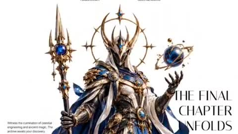</a><br><sub><b>奢华品牌滚动视差头部</b></sub></td>
    <td align="center" width="33%" valign="top"><a href="#c2103232192847524106">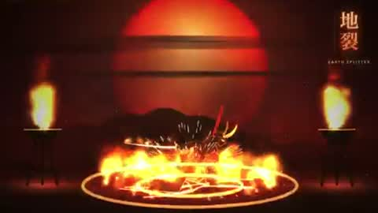</a><br><sub><b>JavaScript武士动作展示</b></sub></td>
    <td align="center" width="33%" valign="top"><a href="#c2103536115563307120">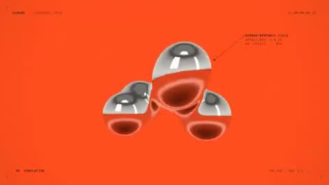</a><br><sub><b>动态设计师作品展示</b></sub></td>
  </tr>
  <tr>
    <td align="center" width="33%" valign="top"><a href="#c2103792769982427263">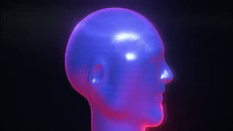</a><br><sub><b>复古未来感发布视频</b></sub></td>
    <td align="center" width="33%" valign="top"><a href="#c2103490331815952637">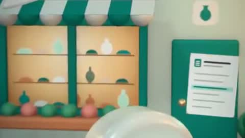</a><br><sub><b>网站宣传动画视频</b></sub></td>
    <td align="center" width="33%" valign="top"><a href="#c2104094723887501736">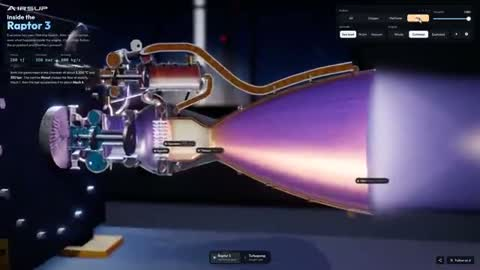</a><br><sub><b>可拆解猛禽3火箭发动机</b></sub></td>
  </tr>
  <tr>
    <td align="center" width="33%" valign="top"><a href="#c2103117246860345550">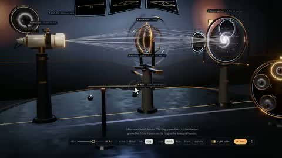</a><br><sub><b>黑洞引力透镜交互实验室</b></sub></td>
    <td align="center" width="33%" valign="top"><a href="#c2103499771206156628">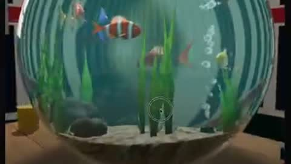</a><br><sub><b>Three.js鱼缸折射光效</b></sub></td>
    <td align="center" width="33%" valign="top"><a href="#c2103882415299350878">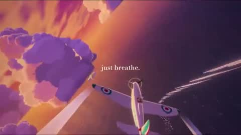</a><br><sub><b>红猪空战Three.js复刻</b></sub></td>
  </tr>
  <tr>
    <td align="center" width="33%" valign="top"><a href="#c2103492984474096062">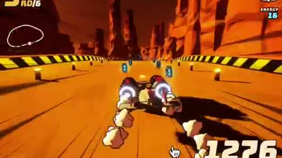</a><br><sub><b>Opus 5.5制作游戏演示</b></sub></td>
    <td align="center" width="33%" valign="top"><a href="#c2102888414219735200">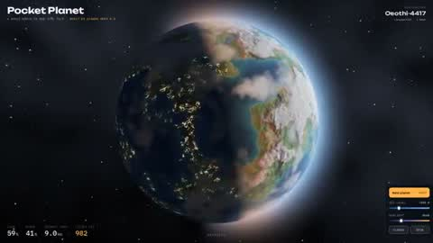</a><br><sub><b>AI生成交互式行星</b></sub></td>
    <td align="center" width="33%" valign="top"><a href="#c2104145227573248467">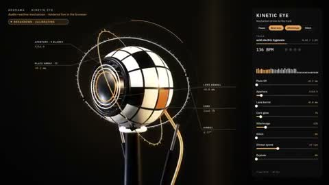</a><br><sub><b>音乐驱动3D机械眼球</b></sub></td>
  </tr>
  <tr>
    <td align="center" width="33%" valign="top"><a href="#c2103044654187081860">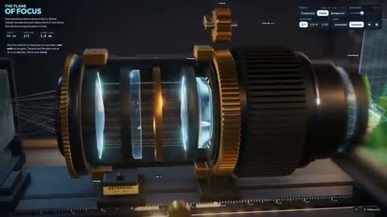</a><br><sub><b>交互式3D相机镜头实验室</b></sub></td>
    <td align="center" width="33%" valign="top"><a href="#c2103938636173742305">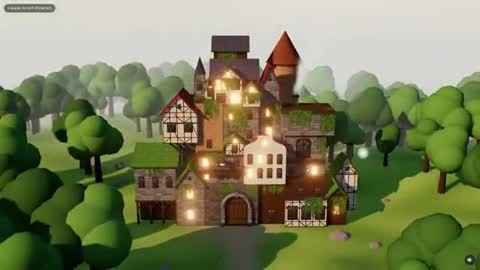</a><br><sub><b>黑色三叶草3D场景</b></sub></td>
    <td align="center" width="33%" valign="top"><a href="#c2103860609712570761">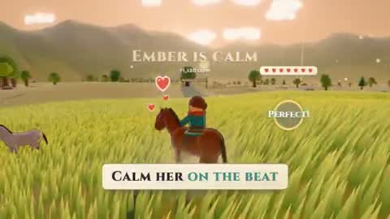</a><br><sub><b>塞尔达风格浏览器游戏</b></sub></td>
  </tr>
  <tr>
    <td align="center" width="33%" valign="top"><a href="#c2103793820815245507">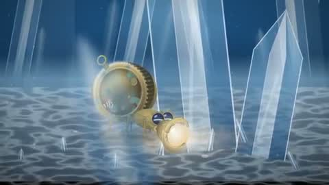</a><br><sub><b>机械寄居蟹追光动画</b></sub></td>
    <td align="center" width="33%" valign="top"><a href="#c2103821018947276947">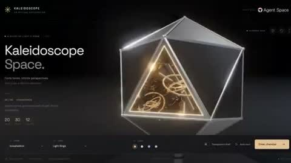</a><br><sub><b>Web 3D项目合集展示</b></sub></td>
    <td align="center" width="33%" valign="top"><a href="#c2103194052850241739">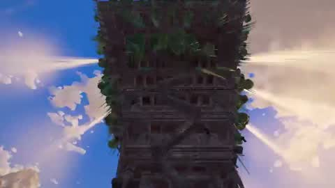</a><br><sub><b>3D奇幻世界自由探索</b></sub></td>
  </tr>
  <tr>
    <td align="center" width="33%" valign="top"><a href="#c2102788223835463902">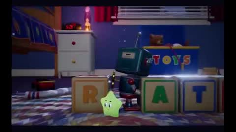</a><br><sub><b>Three.js皮克斯风动画</b></sub></td>
    <td align="center" width="33%" valign="top"><a href="#c2102500841097756743">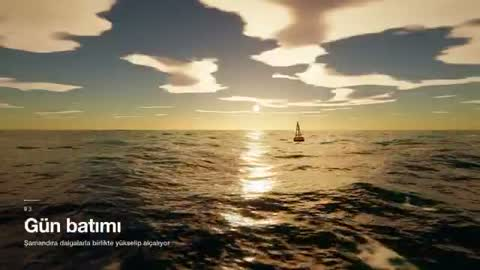</a><br><sub><b>水流模拟动画</b></sub></td>
    <td align="center" width="33%" valign="top"><a href="#c2103022003863355796">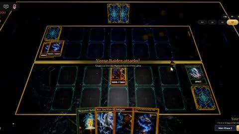</a><br><sub><b>游戏王完整规则对战</b></sub></td>
  </tr>
  <tr>
    <td align="center" width="33%" valign="top"><a href="#c2103742861971726495">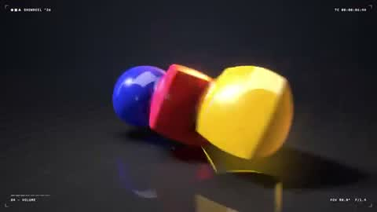</a><br><sub><b>顶级动态设计师作品集锦</b></sub></td>
    <td align="center" width="33%" valign="top"><a href="#c2103054730054517244">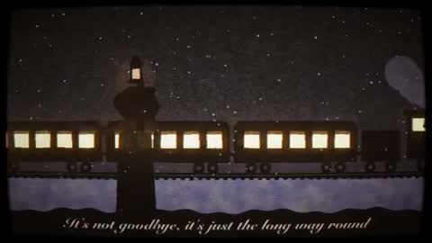</a><br><sub><b>圣诞节故事动画</b></sub></td>
    <td align="center" width="33%" valign="top"><a href="#c2103802923465768972">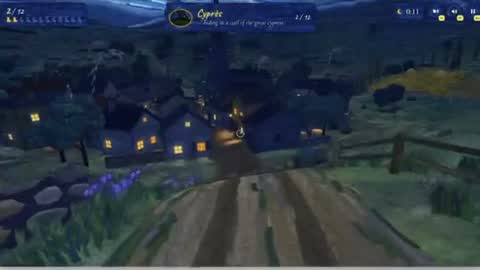</a><br><sub><b>梵高星空猫咪寻找游戏</b></sub></td>
  </tr>
  <tr>
    <td align="center" width="33%" valign="top"><a href="#c2103713416367981005">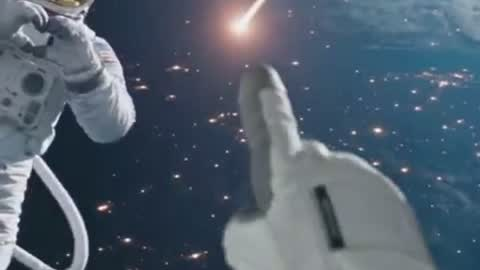</a><br><sub><b>宇航员舷窗陨石撞击短片</b></sub></td>
    <td align="center" width="33%" valign="top"><a href="#c2103746736980378066">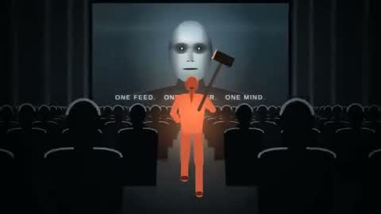</a><br><sub><b>Opus 5.5苹果1984风格广告</b></sub></td>
    <td align="center" width="33%" valign="top"><a href="#c2102641653647581517">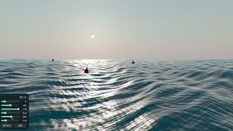</a><br><sub><b>Three.js水面3D效果</b></sub></td>
  </tr>
  <tr>
    <td align="center" width="33%" valign="top"><a href="#c2103181065976459574">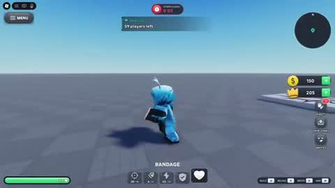</a><br><sub><b>卡通大逃杀游戏界面演示</b></sub></td>
    <td align="center" width="33%" valign="top"><a href="#c2102971287224135914">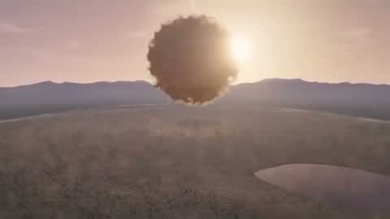</a><br><sub><b>交互式爆炸特效场景</b></sub></td>
    <td align="center" width="33%" valign="top"><a href="#c2102828216289566725">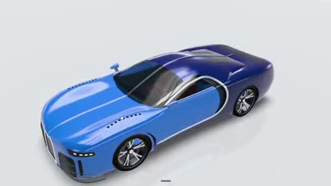</a><br><sub><b>Three.js布加迪超跑</b></sub></td>
  </tr>
  <tr>
    <td align="center" width="33%" valign="top"><a href="#c2102565161446064477">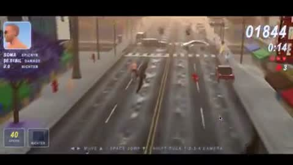</a><br><sub><b>游戏流畅度优化</b></sub></td>
    <td align="center" width="33%" valign="top"><a href="#c2102692209476997141">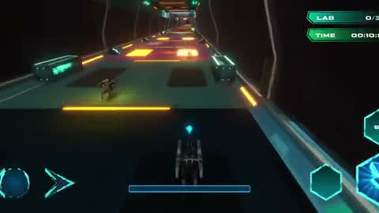</a><br><sub><b>3D赛犬射击游戏</b></sub></td>
    <td align="center" width="33%" valign="top"><a href="#c2103804606794879327">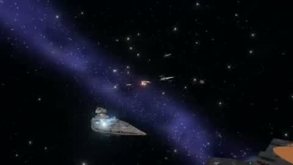</a><br><sub><b>X翼战机大战歼星舰3D游戏</b></sub></td>
  </tr>
  <tr>
    <td align="center" width="33%" valign="top"><a href="#c2103459843831120030">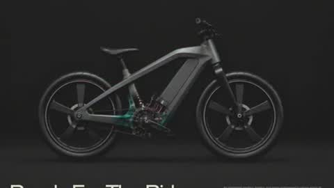</a><br><sub><b>OBLT电动车X光交互页头</b></sub></td>
    <td align="center" width="33%" valign="top"><a href="#c2103152898708582551">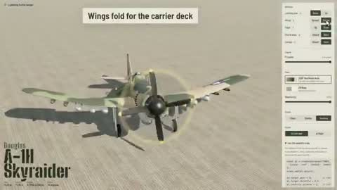</a><br><sub><b>道格拉斯A-1H攻击机3D建模</b></sub></td>
    <td align="center" width="33%" valign="top"><a href="#c2102989395359887481">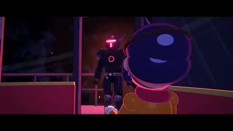</a><br><sub><b>Three.js星球大战风格动画</b></sub></td>
  </tr>
  <tr>
    <td align="center" width="33%" valign="top"><a href="#c2103387771180138551">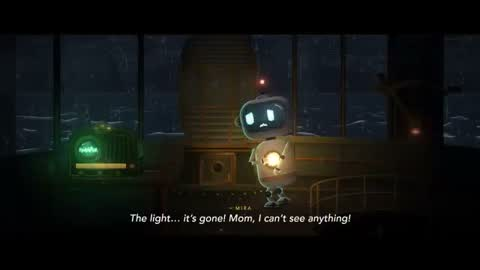</a><br><sub><b>震撼短片动画</b></sub></td>
    <td align="center" width="33%" valign="top"><a href="#c2103841917603635633">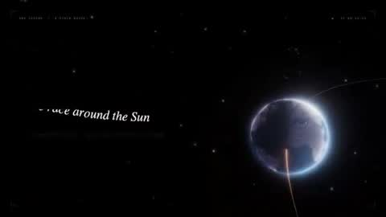</a><br><sub><b>AI自选主题炫技动态图形</b></sub></td>
    <td align="center" width="33%" valign="top"><a href="#c2103746486978887985">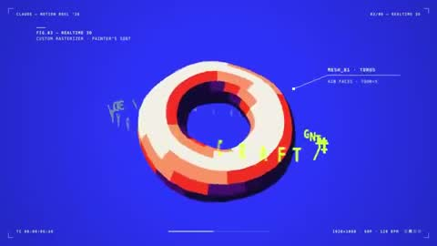</a><br><sub><b>动态设计师作品集展示</b></sub></td>
  </tr>
  <tr>
    <td align="center" width="33%" valign="top"><a href="#c2103087766662009118">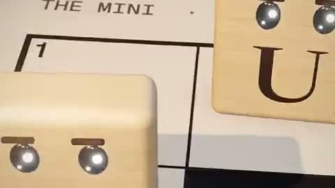</a><br><sub><b>Pixar级网格天才品牌故事</b></sub></td>
    <td align="center" width="33%" valign="top"><a href="#c2102908742518100086">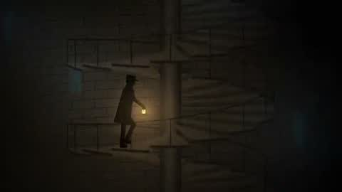</a><br><sub><b>无对白声音叙事短片</b></sub></td>
    <td align="center" width="33%" valign="top"><a href="#c2103789882309234711">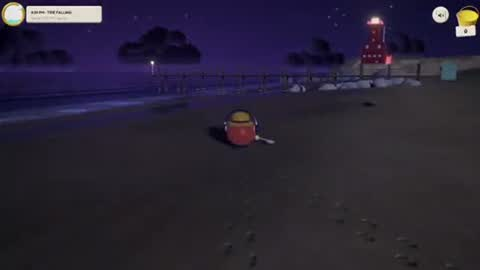</a><br><sub><b>AI辅助编写探测器游戏</b></sub></td>
  </tr>
  <tr>
    <td align="center" width="33%" valign="top"><a href="#c2104093497561436573">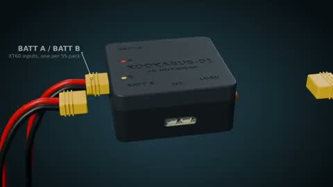</a><br><sub><b>AI生成PCB外壳宣传动画</b></sub></td>
    <td align="center" width="33%" valign="top"><a href="#c2104216976801587629">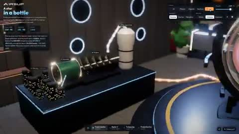</a><br><sub><b>可交互聚变反应堆演示</b></sub></td>
    <td align="center" width="33%" valign="top"><a href="#c2104004272946094296">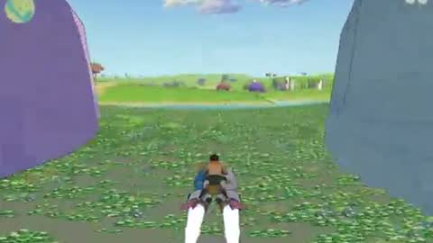</a><br><sub><b>奇幻科幻开放世界飞行游戏</b></sub></td>
  </tr>
  <tr>
    <td align="center" width="33%" valign="top"><a href="#c2103933640392786274">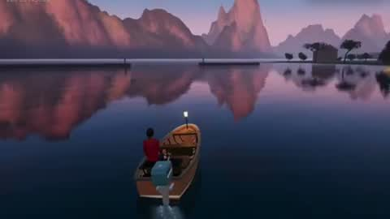</a><br><sub><b>法国安纳西运河3D游览</b></sub></td>
    <td align="center" width="33%" valign="top"><a href="#c2104199715076386902">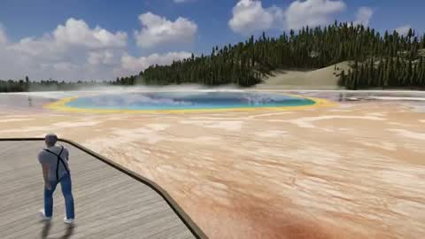</a><br><sub><b>Three.js游戏开发过程</b></sub></td>
    <td align="center" width="33%" valign="top"><a href="#c2104115092124012980">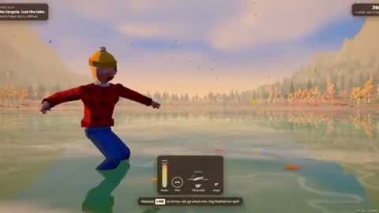</a><br><sub><b>Three.js打水漂游戏</b></sub></td>
  </tr>
  <tr>
    <td align="center" width="33%" valign="top"><a href="#c2103966021451465008">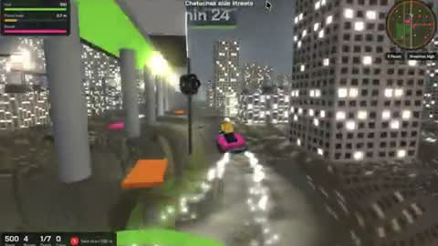</a><br><sub><b>曼谷洪水摩托艇游戏</b></sub></td>
    <td align="center" width="33%" valign="top"><a href="#c2103135019170779161">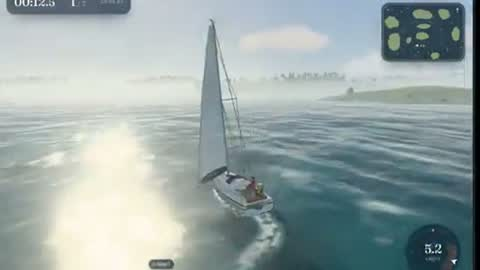</a><br><sub><b>Opus 5.5一键生成游戏演示</b></sub></td>
    <td align="center" width="33%" valign="top"><a href="#c2104217304611340299"></a><br><sub><b>复古街机厅网页游戏合集</b></sub></td>
  </tr>
  <tr>
    <td align="center" width="33%" valign="top"><a href="#c2103881538592981110"></a><br><sub><b>GPU流体模拟真实火焰短片</b></sub></td>
    <td align="center" width="33%" valign="top"><a href="#c2103385835328680050"></a><br><sub><b>11万刚体浏览器实时物理模拟</b></sub></td>
    <td align="center" width="33%" valign="top"><a href="#c2103853898301939886"></a><br><sub><b>AI协助开发迷你游戏</b></sub></td>
  </tr>
  <tr>
    <td align="center" width="33%" valign="top"><a href="#c2103038625483272483"></a><br><sub><b>泰姬陵3D建筑模型</b></sub></td>
    <td align="center" width="33%" valign="top"><a href="#c2103998389058740521"></a><br><sub><b>Claude会话3D工作空间</b></sub></td>
    <td align="center" width="33%" valign="top"><a href="#c2103199030688059523"></a><br><sub><b>Driftward太空俄勒冈小径游戏</b></sub></td>
  </tr>
  <tr>
    <td align="center" width="33%" valign="top"><a href="#c2104197450307195332"></a><br><sub><b>FIXER九十年代GTA风格游戏</b></sub></td>
    <td align="center" width="33%" valign="top"><a href="#c2104207365008687553"></a><br><sub><b>印度史诗神话动作游戏预告</b></sub></td>
    <td align="center" width="33%" valign="top"><a href="#c2103407536741519730"></a><br><sub><b>3D地块生存游戏</b></sub></td>
  </tr>
  <tr>
    <td align="center" width="33%" valign="top"><a href="#c2104103109358473410"></a><br><sub><b>3D游戏一年进化对比</b></sub></td>
    <td align="center" width="33%" valign="top"><a href="#c2104181266459644283"></a><br><sub><b>房屋平面图转3D漫游</b></sub></td>
    <td align="center" width="33%" valign="top"><a href="#c2103593633832157391"></a><br><sub><b>蚂蚁游戏宣传预告片</b></sub></td>
  </tr>
  <tr>
    <td align="center" width="33%" valign="top"><a href="#c2103816821782544635"></a><br><sub><b>Opus生成像素风格视频对比</b></sub></td>
    <td align="center" width="33%" valign="top"><a href="#c2103082459503923578"></a><br><sub><b>AI一键生成3D虚拟演播室</b></sub></td>
    <td align="center" width="33%" valign="top"><a href="#c2103105938853114092"></a><br><sub><b>AI从图纸建模3D体育场</b></sub></td>
  </tr>
  <tr>
    <td align="center" width="33%" valign="top"><a href="#c2103020274107224281"></a><br><sub><b>3D水文地形模拟演示</b></sub></td>
    <td align="center" width="33%" valign="top"><a href="#c2104236916316971191"></a><br><sub><b>浏览器内可拆解引擎</b></sub></td>
    <td align="center" width="33%" valign="top"><a href="#c2103086316137447745"></a><br><sub><b>塞尔达风格3D场景重建</b></sub></td>
  </tr>
  <tr>
    <td align="center" width="33%" valign="top"><a href="#c2103888380794712109"></a><br><sub><b>MMORPG游戏早期演示</b></sub></td>
    <td align="center" width="33%" valign="top"><a href="#c2104003920251257328"></a><br><sub><b>黑猫月夜运河漫步游戏</b></sub></td>
    <td align="center" width="33%" valign="top"><a href="#c2103603025579331584"></a><br><sub><b>PayBox标志动态展示</b></sub></td>
  </tr>
  <tr>
    <td align="center" width="33%" valign="top"><a href="#c2103792451551113363"></a><br><sub><b>从数据中心深入硅原子</b></sub></td>
    <td align="center" width="33%" valign="top"><a href="#c2104159752095998343"></a><br><sub><b>AI生成东京塔3D影像</b></sub></td>
    <td align="center" width="33%" valign="top"><a href="#c2103833991879053577"></a><br><sub><b>桌面到硅原子连续缩放动画</b></sub></td>
  </tr>
  <tr>
    <td align="center" width="33%" valign="top"><a href="#c2103757499652342153"></a><br><sub><b>星球改造单镜头演示</b></sub></td>
    <td align="center" width="33%" valign="top"><a href="#c2103775701052649723"></a><br><sub><b>火车与道口游戏演示</b></sub></td>
    <td align="center" width="33%" valign="top"><a href="#c2104070894251282849"></a><br><sub><b>骰子角落游戏演示</b></sub></td>
  </tr>
  <tr>
    <td align="center" width="33%" valign="top"><a href="#c2104180455813812667"></a><br><sub><b>手绘弹射器物理模拟</b></sub></td>
  </tr>
</table>

---

<a id="c2103129343253778767"></a>

### 复古物件无限缩放动画

<a href="https://x.com/koldo2k/status/2103129343253778767"></a>

```text
Build a looping "infinite zoom" animation, After Effects style: the camera
travels from landscape to landscape by flying through vintage objects.

LOOK: vintage collage realistic photo landscapes + black & white newspaper
cutout objects (halftone, white paper border, soft shadow). Film grain,
vignette, light flicker.

WORLDS (loop): snowy mountains → pocket watch (swinging on its chain) →
sea cliffs → box camera lens → desert dunes → magnifying glass →
misty lake → hand mirror → back to start.
Extras: floating hat, phone, umbrella, gramophone, key; a 1950s man walking
toward the watch; a whale swimming across the cliffs sky.

HOW:
- Generate everything via the Magnific MCP (Seedream 5 Pro landscapes,
  GPT 2.5 transparent cutouts, depth maps, Kling 2.5 animation, Lyria 3
  music). List the generations + credit cost and wait for my OK first.
- Split each landscape into 3 depth layers from its depth map and fill the
  hidden areas. Parallax: layer scale = camera^Z, Z between 0.45 and 1.22.
- Each portal's glass holds the next world; cut seamlessly when it fills
  the frame.
- Constant speed: exponential zoom to a fixed point, each segment's duration
  proportional to log(zoom). Verify the cuts frame by frame.
- Man & whale: generate on pure green (#00B140), animate in place with
  Kling, key out every frame, build a seamless loop (ping-pong if needed).
- Cutouts animate at 15 fps (on twos).
- 20 s loop, 1920×1080, 30 fps. Music: 96 BPM, cut to exactly 8 bars = 20 s.

DELIVER: an interactive artifact (viewer, AE-style timeline, music +
MP4 download) and a rendered MP4 with music under 30 MB.
Show me screenshots before each expensive step.
```

<sub>作者 @koldo2k · <a href="https://x.com/koldo2k/status/2103129343253778767">看原视频</a></sub>

---

<a id="c2103119648271290566"></a>

### 精美鹈鹕骑自行车动画

<a href="https://x.com/AxtonLiu/status/2103119648271290566"></a>

```text
每次一个新的模型出来呢，大家都让它去画 “鹈鹕骑自行车” 来判断这个模型的空间能力，基本上都是用 HTML、SVG
来画动画。当我实在看得都有审美疲劳了，我希望你能画一个最复杂、最精细、最精美的 “鹈鹕骑自行车”的动画视频，你可以用任何的技术，不用着急，画一天都可以。
```

<sub>作者 @AxtonLiu · <a href="https://x.com/AxtonLiu/status/2103119648271290566">看原视频</a></sub>

---

<a id="c2103563538828832979"></a>

### 迷幻催眠动态图形秀

<a href="https://x.com/monokern/status/2103563538828832979"></a>

```text
make a dynamic 20-second motion graphics video that shows what an incredible motion
designer you are, psychedelic and hypnotic. make it feel like a showreel piece. go all
out.
```

<sub>作者 @monokern · <a href="https://x.com/monokern/status/2103563538828832979">看原视频</a></sub>

---

<a id="c2103820321673675031"></a>

### 奢华品牌滚动视差头部

<a href="https://x.com/iamtanzil_/status/2103820321673675031"></a>

```text
# Auren Header

A cinematic, scroll-scrubbed 3D hero header for the luxury/fantasy brand "AUREN" where a
full-screen background video plays frame-by-frame as the user scrolls through a 500vh
section, with sequential timed overlays (title, description, feature cards, final title)
revealing themselves at specific video timestamps.

## Tech stack
- React 18+ with "use client" directive (Next.js App Router compatible)
- framer-motion (all overlay entrance/exit animations, AnimatePresence, staggered per-
character reveals)
- gsap + gsap/ScrollTrigger (scroll-driven scrubbing that maps scroll progress to
video.currentTime)
- No icon library used; the arrow is a literal → character and the card overlay button is
a literal + character

## Fonts & global styles
- Import via: `https://fonts.googleapis.com/css2?family=Italiana&family=Inter+Tight:wght@4
00;500&display=swap`
- Display / serif font: 'Italiana', serif — used for the AUREN logo, hero titles, card
numbers, and card titles.
- Body / sans font: 'Inter Tight', sans-serif — weights 400 and 500 — used for nav text,
descriptions, menu items, card subtitles/descriptions/buttons.
- box-sizing: border-box applied to the whole section and all descendants.
- Scope all styles to the section; do NOT set global body/html rules.

## Section container
- Root: `.auren-header-section` — position: relative; width: 100%; height: 500vh;
background: #FEFFFE. The 500vh height is what creates the scroll runway for scrubbing.
- Inner sticky wrapper: `.auren-sticky-content` — position: sticky; top: 0; width: 100%;
height: 100vh; overflow: hidden. Everything visible lives inside this sticky viewport.

## Structure, section by section
1. **Background video** `.auren-video-bg`: position absolute; inset 0; width/height 100%;
object-fit: cover; object-position: center; z-index: 1. Element is `<video muted
playsInline>` (NOT autoplay — playback is driven by scroll). Source:
`https://cdn.jiro.build/Header%20Section/Auren3d/output.mp4` (type video/mp4). On ≤768px,
object-position becomes 70% center.
2. **Navigation** `.auren-nav`: position absolute; top 0; left 0; width 100%; padding 40px
60px; display flex; justify-content space-between; align-items flex-start; z-index 2.
   - Logo `.auren-logo`: text "AUREN", Italiana 400, 26px, line-height 1, color #000000,
letter-spacing 0.05em.
   - Center nav `.auren-nav-center`: absolutely centered (left 50%, translateX(-50%));
display flex; gap 15vw. Two `.auren-nav-text` blocks (Inter Tight 500, 16px, line-height
1.2, uppercase, color #000000, centered): first reads "COSMIC ARMORION" / "FORGED IN
LIGHT" (two lines via <br/>); second reads "CHAPTER 07" / "CELESTIAL ARCHIVE".
   - Hamburger `.auren-menu-btn`: flex column; align-items flex-end; gap 5px; transparent,
no border. Three `.auren-menu-line` bars, height 2px, background #161414; widths 22px /
15px / 22px. On hover the middle bar animates to 22px width (transition width 0.3s ease).
   - Dropdown `.auren-menu-dropdown` (toggled by hamburger): position absolute; top 60px;
right 60px; width 150px; background rgba(255,255,255,0.8); backdrop-filter blur(10px);
border-radius 8px; padding 10px; flex column gap 10px; border 1px solid rgba(0,0,0,0.1);
z-index 20. Items `.auren-menu-item` (Inter Tight 500, 16px, #000, padding 8px, border-
radius 4px, right-aligned, hover background rgba(0,0,0,0.05)): "Home", "About", "Contact".
3. **Timed hero title (initial, shown while videoTime < 2.5s)** `.auren-hero-title`:
position absolute; left 60px; bottom 80px; max-width 400px; Italiana 400; 90px; line-
height 1.13; color #000000; z-index 2. Words: "RISE", "OF THE", "ASTRAL", "GUARD", "MAN" —
each on its own line (via <br/>), rendered per-character for the reveal animation.
4. **Timed hero description (initial, videoTime < 2.5s)** `.auren-hero-desc`: position
absolute; right 60px; bottom 80px; max-width 320px; Inter Tight 400; 20px; line-height
1.4; color #2E2A2A; z-index 2. Text verbatim: "Enter a realm where ancient artistry meets
futuristic armor. Discover legendary warriors, cosmic relics".
5. **Feature cards overlay (shown while 3s ≤ videoTime ≤ 4s)** `.auren-cards-container`:
position absolute; bottom 100px; left 0; width 100%; flex; justify-content center; gap
60px; z-index 10. Two `.auren-card`s (each 560px × 320px; background linear-
gradient(135deg, rgba(250,246,240,0.95), rgba(240,235,225,0.95)); border-radius 24px;
padding 32px; flex; gap 30px; border 1px solid rgba(200,180,150,0.3); box-shadow 0 12px
40px rgba(0,0,0,0.15)):
     - Card content column: header row with number (Italiana 24px, #000) + a 30px × 1px
line rgba(0,0,0,0.2); subtitle (Inter Tight 10px, letter-spacing 0.1em, uppercase, #666);
title (Italiana 32px, line-height 1, #000, each word forced onto its own line via `.auren-
br`); description (Inter Tight 12px, line-height 1.5, #444, margin-bottom auto); button
row (`.auren-card-btn`, cursor pointer, color #000) with `.auren-card-btn-text` (Inter
Tight 11px, weight 500, letter-spacing 0.05em) followed by a 14px →.
     - Card image `.auren-card-image`: 240px wide, full height, border-radius 16px,
background-image from URL center/cover, with a `.auren-card-plus` badge bottom-right (32px
circle, background #111, color #FFF, contains "+").
     - Card 1: number "01", subtitle "THE WARRIOR", title "ASTRAL GUARDIAN", desc "Forged
in celestial alloy, the Guardian represents a balance of precision, power, and ancient
craft.", button "EXPLORE GUARDIAN", image
`https://cdn.jiro.build/Header%20Section/Auren3d/auren1.png`.
     - Card 2: number "02", subtitle "THE ARMOR", title "FORGED IN LIGHT", desc "Layered
armor, luminous cores, and hand-forged celestial details built for the unknown.", button
"DISCOVER THE ARMOR", image `https://cdn.jiro.build/Header%20Section/Auren3d/auren2.png`.
6. **Final hero title (shown while videoTime ≥ 5s)** — same `.auren-hero-title` styling
but overridden inline to right: 60px; left: auto; text-align: right. Words: "THE FINAL",
"CHAPTER", "UNFOLDS" (each on its own line).
7. **Final hero description (videoTime ≥ 5s)** — same `.auren-hero-desc` styling
overridden inline to left: 60px; right: auto. Text verbatim: "Witness the culmination of
celestial engineering and ancient magic. The archive awaits your discovery."

## Assets
- Video: `https://cdn.jiro.build/Header%20Section/Auren3d/output.mp4`
- Card 1 image: `https://cdn.jiro.build/Header%20Section/Auren3d/auren1.png`
- Card 2 image: `https://cdn.jiro.build/Header%20Section/Auren3d/auren2.png`

## Animations
- **Scroll-scrub video** (signature effect): register ScrollTrigger and map scroll
progress across the 500vh section to the video's currentTime, also storing it in state so
overlays can appear/disappear at timestamps.
```tsx
st = ScrollTrigger.create({
  trigger: ".auren-header-section",
  start: "top top",
  end: "bottom bottom",
  scrub: 1.5,
  onUpdate: (self) => {
    if (video.duration) {
      const time = self.progress * video.duration;
      video.currentTime = time;
      setVideoTime(time);
    }
  },
});
```
Initialise only after the video's metadata is available (readyState >= 1 or on the
"loadedmetadata" event) and kill the trigger on unmount.
- **Nav entrance**: fade + slide down, initial { opacity: 0, y: -20 } → { opacity: 1, y: 0
}, duration 0.8, ease "easeOut".
- **Menu dropdown**: AnimatePresence, initial/exit { opacity: 0, y: -10, scale: 0.95 } →
animate { opacity: 1, y: 0, scale: 1 }, duration 0.2.
- **Per-character title reveal** (both titles): parent variant staggers children by 0.05
(initial title also delays children by 0.3); each character starts { opacity: 0, y: 50 }
and animates to { opacity: 1, y: 0 } with duration 0.6 ease "easeOut". Each word is
wrapped in an inline-block, overflow:hidden span so letters wipe up from below. Titles
exit via AnimatePresence (initial title exits { opacity: 0, y: -50 } over 0.5s).
- **Description clip reveal**: initial { opacity: 0, clipPath: 'inset(100% 0 0 0)' } →
animate { opacity: 1, clipPath: 'inset(0% 0 0 0)' }, duration 1, initial one delayed 0.8s,
both ease "easeOut"; matching clip-path exit.
- **Cards overlay**: container initial { opacity: 0, y: 100 } → { opacity: 1, y: 0 }, exit
{ opacity: 0, y: -150 }, duration 0.6 ease "easeInOut"; each card additionally slides { y:
50, opacity: 0 } → { y: 0, opacity: 1 } with staggered delays 0.1 and 0.2, exit { y: -100,
opacity: 0 }.
- All overlays are gated by videoTime windows: titles/desc #1 for time < 2.5, cards for 3
≤ time ≤ 4, titles/desc #2 for time ≥ 5.

## Responsive behavior
- **≤1200px**: center nav gap shrinks to 5vw; cards gap 20px with 20px side padding; cards
450px wide, padding 24px, gap 20px; card image 180px.
- **≤1024px**: nav padding 30px 40px; hero title left 40px / font-size 70px; hero desc
right 40px / bottom 60px / 18px; center nav hidden; dropdown right 40px top 50px; cards
stack vertically centered, gap 20px, bottom 40px; cards full width (max 560px) height
280px; card image 240px.
- **≈768px**: nav padding 20px with center-aligned items; hero title and desc hidden
(display none); video object-position 70% center; dropdown right 20px top 50px; cards
become position relative with margin-top 100px, gap 16px, 16px side padding; each card
full width, height auto, flex-direction column-reverse, padding 20px, gap 16px; card image
full width height 180px; card title 28px; `.auren-br` forced-line-break spans hidden.

## Key design principles
- Editorial luxury aesthetic: serif Italiana display type against clean white, minimal
chrome, generous negative space.
- Cinematic scroll-scrubbing is the hero interaction — the video is a timeline, not
autoplay.
- Content is choreographed to video timestamps, not scroll position directly.
- High-contrast black text on light video for legibility; frosted-glass dropdown for
depth.
- Per-character mask reveals give the type a premium, deliberate entrance.

## Common mistakes to avoid
- Do NOT autoplay the video — keep it muted + playsInline and drive currentTime from
ScrollTrigger.
- Do NOT register ScrollTrigger at module top level without a window guard in an
SSR/Next.js environment.
- Do NOT forget the 500vh root height + sticky inner wrapper; without both, there is no
scroll runway and the video won't scrub.
- Keep every AnimatePresence child keyed so exit animations fire correctly.
- Initialise the ScrollTrigger only after video metadata loads, and kill it on unmount to
avoid leaks.

## Page title
AUREN — Rise of the Astral Guardman

## Integration (build-safety — do not skip)
- Add this section as a **new** component file with a unique name. Don't edit or overwrite
any existing file except to add its import and render it.
- Render it **after** all existing sections; keep every previously built section exactly
as-is — never replace or remove them.
- If no project exists, create a minimal React + Tailwind app; if one exists, use it as-is
— don't re-scaffold or change the Tailwind/build config or version.
- Keep it self-contained: scope its fonts and any resets to this section; never set global
`body`/`html`/`*` styles or a global font.
- Install only the libraries this section names.
```

<sub>作者 @iamtanzil_ · <a href="https://x.com/iamtanzil_/status/2103820321673675031">看原视频</a></sub>

---

<a id="c2103232192847524106"></a>

### JavaScript武士动作展示

<a href="https://x.com/chrisjdimarco/status/2103232192847524106"></a>

```text
make a samurai dude in only javascript and have him doing a routine in a single spot going
through various seriously impressive poses and motions and positions in a fiery awesome
display
```

<sub>作者 @chrisjdimarco · <a href="https://x.com/chrisjdimarco/status/2103232192847524106">看原视频</a></sub>

---

<a id="c2103536115563307120"></a>

### 动态设计师作品展示

<a href="https://x.com/sahildesigner23/status/2103536115563307120"></a>

```text
make a dynamic 15-second motion graphics video that shows what an incredible motion
designer you are, like it's your showreel for a résumé. go all out.
```

<sub>作者 @sahildesigner23 · <a href="https://x.com/sahildesigner23/status/2103536115563307120">看原视频</a></sub>

---

<a id="c2103792769982427263"></a>

### 复古未来感发布视频

<a href="https://x.com/johnsavage_ai/status/2103792769982427263"></a>

```text
use this image only as a style/vibe refference image and create a Opus 5.5 launch video
(20 sec long) add film grain and CRT effect, make it mesmerizing, and show off your skills
as a motion designer for a retro/futuristic style launch video 16:9
```

<sub>作者 @johnsavage_ai · <a href="https://x.com/johnsavage_ai/status/2103792769982427263">看原视频</a></sub>

---

<a id="c2103490331815952637"></a>

### 网站宣传动画视频

<a href="https://x.com/anas0ra/status/2103490331815952637"></a>

```text
fait moi une vidéo sympa pour https://heeya.fr" c'est impressionant
```

<sub>作者 @anas0ra · <a href="https://x.com/anas0ra/status/2103490331815952637">看原视频</a></sub>

---

<a id="c2104094723887501736"></a>

### 可拆解猛禽3火箭发动机

<a href="https://x.com/konstantinsaifo/status/2104094723887501736"></a>

> 作者只公开了部分提示词。

```text
I asked Claude Opus 5.5 to explain how a rocket engine works by building an interactive
Raptor 3 you can take apart in your browser.

Cut it open, follow the oxygen and the methane through both turbopumps, then throttle it
and watch the shock diamonds move.

http://airsup.ai/rocket-engine
```

<sub>作者 @konstantinsaifo · <a href="https://x.com/konstantinsaifo/status/2104094723887501736">看原视频</a></sub>

---

<a id="c2103117246860345550"></a>

### 黑洞引力透镜交互实验室

<a href="https://x.com/Voxyz_ai/status/2103117246860345550"></a>

> 作者只公开了部分提示词。

```text
I asked Opus 5.5 to explain gravitational lensing by building an interactive black hole
lab

One prompt for the first version, then a dynamic workflow to polish it for three rounds
while I slept. This is what I woke up to: 5h 28m end to end, $90 at API prices

https://blackhole.voxyz.ai

Drag the black hole and the sky behind it bends into arcs, closing into a full ring when
everything lines up

Each round ran 3 agents. Two reviewers each picked 9 to 10 issues and ranked them P0, P1,
P2. The third one fixed them.
Round 1: 3D materials and lighting + UI and type
Round 2: camera motion and interaction + science-communication design
Round 3: a design director deciding whether it ships + visual QA and performance

Every P0 got fixed, the rest only if worth it. When the two reviewers disagreed, it picked
one and wrote down why. It backed up before each round, checked screenshots after, and
rolled back anything it couldn't fix.
```

<sub>作者 @Voxyz_ai · <a href="https://x.com/Voxyz_ai/status/2103117246860345550">看原视频</a></sub>

---

<a id="c2103499771206156628"></a>

### Three.js鱼缸折射光效

<a href="https://x.com/NicolaManzini/status/2103499771206156628"></a>

> 作者只公开了部分提示词。

```text
Opus 5.5 does a great job in eval of GLSL (OpenGL Shading Language) in threejs.
The prompt here is roughly. A fishbowl with reflection, refraction and water caustics.

Check it out yourself! And compare it to other models
https://threejseval.com/gallery?eval=fishtank
```

<sub>作者 @NicolaManzini · <a href="https://x.com/NicolaManzini/status/2103499771206156628">看原视频</a></sub>

---

<a id="c2103882415299350878"></a>

### 红猪空战Three.js复刻

<a href="https://x.com/NFT_Chen/status/2103882415299350878"></a>

> 作者只公开了部分提示词。

```text
✨审美绝了！Opus 5.5 用 Three.js 把宫崎骏《红猪》经典空战复刻出来了！

只给了这一句prompt:

「用 web3D 复刻宫崎骏《红猪》日落海面上的经典空战：白绿红涂装战斗机、紫色积云、海面反光、吉卜力运镜，画面写 just breathe.」

建模、配色、云层、尾迹和镜头全部一次对齐，审美直接封神。

#Opus5_5 #宫崎骏 #红猪 #ThreeJS #Web3D #AIGC #vibecoding #审美天花板 #3D #AI #Dario #Anthropic

https://x.com/nft_chen/status/2103401780117938683?s=46
```

<sub>作者 @NFT_Chen · <a href="https://x.com/NFT_Chen/status/2103882415299350878">看原视频</a></sub>

---

<a id="c2103492984474096062"></a>

### Opus 5.5制作游戏演示

<a href="https://x.com/mrblock/status/2103492984474096062"></a>

> 作者只公开了部分提示词。

```text
opus 5.5 遊戲製作，週末快點來嘗試。
```

<sub>作者 @mrblock · <a href="https://x.com/mrblock/status/2103492984474096062">看原视频</a></sub>

---

<a id="c2102888414219735200"></a>

### AI生成交互式行星

<a href="https://x.com/0xSolty/status/2102888414219735200"></a>

> 作者只公开了部分提示词。

```text
i asked opus 5.5 to build me a planet.

not a picture of a planet. a whole planet.

it wrote a single html file. no libraries, no images, no 3d models. every ocean, every
mountain and every city light is math, generated live in your browser.

then i started playing with it.

drag it and it spins. raise the sea level and watch continents drown. move the sun and
watch the cities switch on at night.

hit "new planet" and it invents a new world. it even names it.

a year ago this was a semester project for a graphics student.

now it's a prompt.
```

<sub>作者 @0xSolty · <a href="https://x.com/0xSolty/status/2102888414219735200">看原视频</a></sub>

---

<a id="c2104145227573248467"></a>

### 音乐驱动3D机械眼球

<a href="https://x.com/Acoramaa/status/2104145227573248467"></a>

> 作者只公开了部分提示词。

```text
CLAUDE OPUS 5.5 MADE ME A MAGIC EYE.

It doesn't just look around. It listens.

72 plates wrapped around a mechanical eyeball, a 9-blade iris, a lens that slides out when
the bass hits, two rings orbiting it like it's its own little planet.

Play a track and it comes alive. Every kick flips the plates open. The bass pushes the
lens forward. The highs light up the glowing core inside.

When the song drops into the breakdown, the eye closes and goes quiet, like it's thinking.
Then the drop hits and it blows wide open.

Opus 5.5 listened to the track first, found the tempo, the breakdown and the drop, and
built the whole thing around it. Even the panel on the right is live: every slider moves
with the music.

All 3D, all code, rendered right in a browser.

Turn the sound on.
```

<sub>作者 @Acoramaa · <a href="https://x.com/Acoramaa/status/2104145227573248467">看原视频</a></sub>

---

<a id="c2103044654187081860"></a>

### 交互式3D相机镜头实验室

<a href="https://x.com/chudry223/status/2103044654187081860"></a>

> 作者只公开了部分提示词。

```text
One prompt. One interactive camera lab. 🎥🔥

Claude Opus 5.5 generates a 3D experience where you can adjust the focus ring, move lens
elements, shift the focal plane, and see real-time depth-of-field effects.

AI-generated interactive 3D is getting wild. 🤯
```

<sub>作者 @chudry223 · <a href="https://x.com/chudry223/status/2103044654187081860">看原视频</a></sub>

---

<a id="c2103938636173742305"></a>

### 黑色三叶草3D场景

<a href="https://x.com/lribes4/status/2103938636173742305"></a>

> 作者只公开了部分提示词。

```text
New Black Clover chapters are on the way and Opus 5.5 just dropped, so I put it to the
test:

A 3D diorama of the Black Bulls hideout, made with Opus 5.5 + three.js

Every visitor is a floating mana light, come say hi to Nero 👋
https://ribes.cc/hideout/

#BlackClover #threejs
```

<sub>作者 @lribes4 · <a href="https://x.com/lribes4/status/2103938636173742305">看原视频</a></sub>

---

<a id="c2103860609712570761"></a>

### 塞尔达风格浏览器游戏

<a href="https://x.com/anduraio/status/2103860609712570761"></a>

> 作者只公开了部分提示词。

```text
Claude Opus 5.5 is stupidly good at games, so I’m putting it on a streak.
Dropping 10 browser games I built with it. One a day.

Same characters. Same world. Different gameplay each day.
Adventure games. Painterly stylised 3D. Soft cel shading, wind in the grass, hazy blue
distance, hand-painted skies. The Legend of Zelda: BotW / TotK energy.

Trailer + play link + what the model actually did.
Playable. Built with Opus. That’s the series.
```

<sub>作者 @anduraio · <a href="https://x.com/anduraio/status/2103860609712570761">看原视频</a></sub>

---

<a id="c2103793820815245507"></a>

### 机械寄居蟹追光动画

<a href="https://x.com/gmgmgm1545/status/2103793820815245507"></a>

> 作者只公开了部分提示词。

```text
我让 @claudeai Opus 5.5 制讲一只机械寄居蟹在深海追一束光，追到最后发现，发现那束光其实一直在自己手里的动画视频。

没用任何视频生成AI，纯靠写代码画出来的——
角色、镜头、转场、音乐全是程序渲染的。

看完了。感觉能做到这个程度还是很可以的！
```

<sub>作者 @gmgmgm1545 · <a href="https://x.com/gmgmgm1545/status/2103793820815245507">看原视频</a></sub>

---

<a id="c2103821018947276947"></a>

### Web 3D项目合集展示

<a href="https://x.com/KeWai386772/status/2103821018947276947"></a>

> 作者只公开了部分提示词。

```text
最近用 GPT 6 Astra、Opus 5.5 做了一堆 web 3d 的项目，游戏、室内、Fx、文旅、整活的都有尝试hh

我把这些项目的全部工作流与prompt都整合到了线上的workplace里，之后也会持续更新，感兴趣的朋友可以收藏一波hh
```

<sub>作者 @KeWai386772 · <a href="https://x.com/KeWai386772/status/2103821018947276947">看原视频</a></sub>

---

<a id="c2103194052850241739"></a>

### 3D奇幻世界自由探索

<a href="https://x.com/LexnLin/status/2103194052850241739"></a>

```text
Create a cinematic browser-based 3D world that can be explored freely with a camera,
focused on breathtaking landscapes and extraordinary original architecture. Fill the world
with huge strange buildings, monumental structures, surreal ruins, cliffs, valleys,
forests, water, and unusual ultra-detailed forms that feel mysterious and awe-inspiring.
This is not a game and not combat-focused, the goal is pure exploration, atmosphere,
composition, and visual discovery. Make the world feel epic, highly detailed, and
completely original, with architecture that looks weird, ambitious, and unforgettable.
```

<sub>作者 @LexnLin · <a href="https://x.com/LexnLin/status/2103194052850241739">看原视频</a></sub>

---

<a id="c2102788223835463902"></a>

### Three.js皮克斯风动画

<a href="https://x.com/scheemunai/status/2102788223835463902"></a>

```text
I want you to imagine a story. And then using threejs I want you to create full animation,
Pixar-level quality 90s cartoon out of the story you imagine.
```

<sub>作者 @scheemunai · <a href="https://x.com/scheemunai/status/2102788223835463902">看原视频</a></sub>

---

<a id="c2102500841097756743"></a>

### 水流模拟动画

<a href="https://x.com/Avenoxai/status/2102500841097756743"></a>

```text
Bana yapabildiğin en iyi su simülasyonunu yap
```

<sub>作者 @Avenoxai · <a href="https://x.com/Avenoxai/status/2102500841097756743">看原视频</a></sub>

---

<a id="c2103022003863355796"></a>

### 游戏王完整规则对战

<a href="https://x.com/Stravant/status/2103022003863355796"></a>

```text
Make sure every single that that changes has an animation
```

<sub>作者 @Stravant · <a href="https://x.com/Stravant/status/2103022003863355796">看原视频</a></sub>

---

<a id="c2103742861971726495"></a>

### 顶级动态设计师作品集锦

<a href="https://x.com/lukasersil/status/2103742861971726495"></a>

```text
Create a bold, dynamic 15-second motion graphics showreel that feels like the ultimate
portfolio piece of an exceptionally talented motion designer. Showcase a wide range of
advanced techniques: kinetic typography, smooth transitions, 2D and 3D animation, abstract
geometry, fluid simulations, particles, distortion, creative masking, compositing,
lighting, depth, and seamless camera movement. Keep the pacing fast, confident, and
visually surprising, with every shot transitioning naturally into the next. Make it feel
meticulously art-directed rather than like a random collection of effects. Push the
creativity, polish, timing, and visual impact as far as possible. This should feel like
the opening reel that gets a motion designer hired.
```

<sub>作者 @lukasersil · <a href="https://x.com/lukasersil/status/2103742861971726495">看原视频</a></sub>

---

<a id="c2103054730054517244"></a>

### 圣诞节故事动画

<a href="https://x.com/ICO_AIvideo/status/2103054730054517244"></a>

```text
ねえ、Opus5.5。私の気分はもうクリスマスだよ。この曲に合わせたとっても素敵な物語を見てみたいな。素敵な瞬間を私に見せて。
```

<sub>作者 @ICO_AIvideo · <a href="https://x.com/ICO_AIvideo/status/2103054730054517244">看原视频</a></sub>

---

<a id="c2103802923465768972"></a>

### 梵高星空猫咪寻找游戏

<a href="https://x.com/MandelDuck/status/2103802923465768972"></a>

```text
can you make a 3d game where you walk around and spot cats inside of a van gogh painting?
we can start with stary night and its town
```

<sub>作者 @MandelDuck · <a href="https://x.com/MandelDuck/status/2103802923465768972">看原视频</a></sub>

---

<a id="c2103713416367981005"></a>

### 宇航员舷窗陨石撞击短片

<a href="https://x.com/alexwtlf/status/2103713416367981005"></a>

```text
SCENE CONTEXT
Night side of the Earth. A space station in orbit; 📷@mila is inside at a small round
porthole, 📷@astronaut floats outside it on a tether, lit by the station's floodlight
against black space and the dark Earth with its city lights. They clown for each other
through the glass; a meteor flies into the sky behind him and crosses toward the Earth;
she hammers the glass and screams to make him turn, and he answers with a heart; he begins
a slow turn and the meteor hits while he is halfway round; she watches the impact with one
tear. 25 seconds, seven cuts between two camera positions: OUTSIDE, looking at the window
from space, and INSIDE, her own eyes looking out through the porthole.

LOCATION MAP
THE WINDOW IS SMALL: a porthole about 50 cm across. Her head in its white cap takes up
half of its diameter and her shoulders are wider than it; the astronaut's helmet alone is
two thirds of its width; the whole window is a quarter of his height. A porthole, not a
dome, not a bay window, one small circle in a huge wall of hull.
THE SHIP, INSIDE: the porthole set in a wall of white padded panels. Its inner ring is
dark grey bolted metal with red-and-white striped segments at the lower left and lower
right; a warm LED strip runs along the top of the ring inside. The interior is dim, blue-
grey, a few small status lights, cable runs and a handrail at the edge of frame. The glass
is thick and clear.
THE SHIP, OUTSIDE: the same porthole from space, a raised dark metal collar with bolts set
into a white hull of quilted insulation panels with grey seams, many panels tall, dwarfing
the window; a small white floodlight on a short stalk above the window, aimed down across
the glass and out toward the astronaut; the interior glows warm through the glass, and the
same red-and-white segments of the inner ring show through it.
THE EARTH: night side, black-blue, city lights in gold clusters and threads across the
dark continents, a thin blue-green airglow line along the limb, stars above the limb. No
sun, no daylight anywhere in the film.
INSIDE view: the ring fills the edges of the frame. The Earth is not a ball: it is a huge
gentle arc, its night surface filling the lower 65% of the window, the limb a shallow
curve running above the centre of the window, lower on the left and higher on the right,
with a thin blue-green airglow line along it and black star field above. The exact CENTRE
of the window is dark Earth surface with city lights, just below the limb: that is where
the impact lands. The astronaut floats at the LEFT edge of the window, upper-left, within
the left third, about 3 m away, against the black sky and the limb, facing the window; he
never crosses into the centre. The meteor crosses the black upper right and comes down-
left to the centre. Her right gloved hand enters from the bottom-right edge.
OUTSIDE view, close: 📷@mila behind the glass, the dim interior behind her; no Earth in
frame; the Earth and the meteor are behind the camera, to screen left, and appear only as
faint reflections on the glass.
OUTSIDE view, wide (CUT 1 only): the camera 9 m away, almost side-on, 70 degrees off the
window's axis. The hull is a wall on the LEFT third of the frame, top to bottom, seen
nearly edge-on; the porthole in it at middle height, seen as an upright narrow oval, her
face in profile through the glass; the astronaut in the CENTRE-RIGHT of the frame, in
profile, facing the window on the left, four times the height of the window; the night
Earth in the bottom third, black space and stars above.
Geometry, fixed for the whole film: from outside, her right hand is on the screen-LEFT
side, the astronaut is on the screen-RIGHT side, and the meteor and its impact are behind
the outside camera to screen left, never in frame from outside.

FIRST FRAME / BLOCKING
OUTSIDE, wide, 9:16, the side view. Already in motion: both of 📷@astronaut's gloves are on
the hull either side of the window's collar, his body straight out from the hull, his
visor 30 cm from the glass; inside, 📷@mila's face is pressed to the glass, nose flattened
against it, cheeks puffed, both palms flat on the glass either side of her face, laughing.
Neither looks toward the camera; they look only at each other.

FORMAT MODE
Seven cuts.

CUT 1, 0:00 to 0:03, OUTSIDE, wide side view:
At 0:00.5 he pushes off the hull with both hands, gently, and drifts straight back from
the window toward screen right, slowly, at a constant speed, about 1.5 m over the cut, no
further, his feet trailing, his body rolling a few degrees, the white tether uncoiling in
a short lazy loop between his hip and the hull. He raises his right glove into a thumbs-up
toward her and holds it. Inside, she pulls her face off the glass laughing, waves at him
with one hand in the small window, wiggles her shoulders in a little dance, then puffs her
cheeks again and presses her nose back to the glass. Her eyes stay on him. NO meteor in
this cut; nothing in the sky but stars. Last frame: he hangs 1.5 m from the window,
thumbs-up raised, facing her; her face fills the small window, laughing at him.

CUT 2, 0:03 to 0:06, INSIDE, her eyes:
The porthole's circle fills the width; he is at the left edge of the window, about 3 m
out, facing us, his thumbs-up opening into a slow wave, the wave rolling his body a few
degrees; her right gloved hand is already mid-wave at the bottom-right edge, back of the
hand to camera. At 0:03.5 the meteor FLIES INTO the frame at the top-right corner of the
window, far behind him, entering from the side on a diagonal aimed at the centre of the
window, at the pace of a slow aircraft across the sky. It looks like real orbital footage
of a bolide: a bright white head about the size of his helmet, and behind it a long smooth
tail of light, a continuous soft-edged ribbon ten helmet-widths long, white near the head
fading through pale orange to nothing, brightest at the head and dimming evenly along its
length. The tail is pure light, like a long-exposure streak: no sparks, no embers, no
particles, no flames, no flicker, no trailing debris. The head is never larger than his
helmet. He does not see it. Her hand waves twice more; at the end of the cut it stops mid-
wave and freezes.

CUT 3, 0:06 to 0:08, OUTSIDE, close on her face through the glass:
Her face fills the window from the top of the cap to the neck ring, the ring cutting the
left and right edges. First frame: she is still smiling, her right gloved hand up beside
her face on the screen-left side, frozen mid-wave. Her eyes shift to screen left and up,
toward the meteor behind the camera. The smile goes; she swallows; the lips close; the
hand lowers. On the glass, faint: the gold specks of the city lights reflected across the
lower third, and the meteor as a thin bright line reflected in the upper-left, creeping
slowly; both faint, never over her eyes. Two seconds, nothing else moves.

CUT 4, 0:08 to 0:12, INSIDE:
For the first second nothing changes but the meteor: it reaches the Earth's limb just
above the centre of the window and enters the air; the head brightens to a hard white
point and the tail lengthens smoothly, and behind it, along the limb, a faint glowing
trail of lit air lingers for a moment and fades. Still no sparks, no particles: a head and
a smooth ribbon of light. Her hand hangs still at the bottom right. The astronaut keeps
moving: he drifts slowly up and down along the left edge of the window, rolling a few
degrees, one arm floating up to chest height, still facing us, warm, never leaving the
left third. Then her hand closes and raps the glass three times with the knuckles and she
shouts "Hey! HEY!"; the hand opens into a point, index finger extended toward the meteor
at the centre of the window, arm straight, the glove shaking. The astronaut reads nothing.
He brings both gloves together in front of his chest, fingers curved, thumbs down, into a
heart shape, holds it for a full second toward her, the gesture rolling him slightly, then
lets his hands float apart and drifts on. The camera leans 10 cm toward the glass.

CUT 5, 0:12 to 0:15, OUTSIDE, over the astronaut's shoulder:
Foreground lower right, out of focus: the back of 📷@astronaut's helmet and the top of his
backpack, 1 m from camera, drifting slowly across the corner of the frame. Behind the
glass, her from the waist up: she slams the glass four times with the flat right palm,
fast, her left hand gripping the inner rim to brace, her body recoiling after each hit;
between slams the right arm shoots out and the index finger jabs to screen LEFT, away from
him, twice. She screams "BEHIND YOU!" and then "TURN AROUND!", the second louder, her eyes
shining wet, no tear yet, her eyes going from him to where she points and back. On the
glass, faint reflections of the city lights below and the meteor's bright line upper-left,
never over her eyes. He does not turn; he drifts, facing the window, for the whole cut.

CUT 6, 0:15 to 0:21, INSIDE, exactly the framing CUT 4 ended on:
Her right palm is flat on the glass at the bottom right, fingers spread. The astronaut, at
the left edge of the window, is still drifting and rolling, facing us; his helmet tilts
toward her pointing arm. At 0:16 he begins to turn around on the spot, slowly and
smoothly: his whole body rotates to his left, screen right, the suit's momentum carrying
him, the tether swinging after him, his position staying at the left edge. At 0:17, when
he is halfway through the turn, side-on to us, the meteor reaches the ground at the exact
CENTRE of the window, well to the right of him, with clear sky and dark Earth between him
and the strike; its tail fades out behind it in half a second.
The impact is SMALL and SLOW, seen from 400 km up. At 0:17 it is a pinpoint of white light
at the centre, smaller than his glove, like one city light flaring. Over the next second
it swells into a glowing orange dot the size of his glove, and a thin bright ring appears
around it, the size of his helmet. The ring expands slowly and evenly, visibly slower than
the meteor moved: two helmet-widths across at 0:19, three helmet-widths across at 0:21,
and no larger; its edge is a thin bright line, the ground inside it a dull orange glow,
the city lights inside it going out one by one as the ring passes them. Everything outside
the ring is unchanged: the rest of the planet stays dark with its city lights on, the
limb, the airglow and the stars exactly as before. At the centre a thin column of smoke
begins to rise, no taller than his helmet by the end of the cut, its top just starting to
spread and lit faintly orange from below. The glow is brighter than the city lights but
never washes out the frame and never lights up the whole planet.
He keeps turning at the same slow speed, until by 0:19 his back is fully to us, his
backpack toward the window, and he faces the Earth and the small fire. He never overlaps
the impact: it sits at the centre, he stays a dark silhouette at the left edge, a faint
orange rim on the right side of his suit and helmet, hanging there, drifting slowly, not
turning back. She breathes "no". Her hand slides 5 cm down the glass and stops.

CUT 7, 0:21 to 0:25, OUTSIDE, EXACTLY the framing of CUT 3:
Her face centred in the window, her right palm flat on the glass at the lower left, her
eyes turned screen left and down, wide, unblinking. A soft orange glow rises from screen
lower-left, slowly, over two seconds, never a flash: onto the glass and her palm first, a
faint orange reflection of the distant fire in the lower-left of the glass, then onto her
face from below, the chin, the underside of the nose, the lower lids, warm and steady, a
little brighter than the LED strip above her. She does not blink. Her lower lids fill. One
tear breaks from her right eye, screen left, and runs down the cheek to the jaw, catching
the orange light. Her mouth stays closed; the lower lip presses once. Hold on her face to
the end; the glow holds.

OPTICS
CUT 1: about 35 mm equivalent, deep focus, the hull, the window, her profile and the
astronaut all sharp, the Earth below slightly soft. INSIDE cuts: wide, about 24 mm
equivalent, deep focus, the ring, the astronaut and the Earth all sharp, the glove close
to the lens slightly soft. OUTSIDE close cuts: about 50 mm equivalent, shallow depth, her
face sharp behind the glass, the ring soft; CUT 5 about 40 mm with the helmet soft in the
foreground.

CAMERA
Every camera position is locked with a slow zero-gravity drift of a few pixels. INSIDE is
her eyes: in CUT 4 it leans 10 cm toward the glass as she knocks; each palm slam in CUT 5
and the hand on the glass in CUT 6 give the frame a small shake that settles within half a
second. No handheld wobble otherwise, no zoom, no move.

ACTION
📷@astronaut is NEVER still, in any cut: he floats in zero gravity, always drifting, always
rolling a few degrees, his legs trailing, his free arm floating at chest height between
gestures, the tether coiling and uncoiling; every gesture moves his body, a thumbs-up
pushes him back a little, a wave rolls him, the heart rolls him. In CUT 1 one gentle push
with both hands, then pure drift at a constant speed, under 1 km/h, no second push, no
flailing, staying within 1.5 m of the hull. From CUT 2 on his drift stays within the left
third of the window in every INSIDE cut. He moves like a man in a pressurised suit under
water, under 2 km/h, arms from the shoulder, the helmet turning with the torso. He never
stands, never hangs frozen in one spot. His one big movement is the slow 180-degree turn
on the spot in CUT 6, which starts one second before the impact and is halfway through
when it lands. The meteor enters at the top-right corner at 0:03.5, moves on one straight
diagonal at a constant speed to the centre of the window, never changing direction, never
accelerating, its head never larger than his helmet, a head and a smooth ribbon of light
with nothing flying off it. The impact grows slowly: pinpoint, glove, helmet, two helmets,
three helmets, over four seconds, and nothing beyond the ring changes. Her movements are
fast and human; nose to glass, palms on glass, waving, knocking, slamming; the glove never
passes through the glass.

PERFORMANCE
Her arc: clowning, playful, noticing, still, alarmed, frantic, watching, defeated.
Clowning: a girl goofing for someone she loves, nose flattened on the glass, puffed
cheeks, a shoulder dance, unguarded, laughing, eyes on him, never on the lens. Playful: a
bouncing wave. Noticing: the smile goes out of the face before the hand knows it, the eyes
move first, a swallow. Alarmed: knuckles, a straight pointing arm, the glove shaking, a
shout. Frantic: the whole forearm behind the slams, the body recoiling, brows up, mouth
wide on the screamed words, eyes shining, breath fast. Watching: the mouth opens for one
whispered word. Defeated: nothing on the face moves except the eyes filling and the one
tear; the stillness is the performance. No sob, no scrunched face, no blinking, no head
shake in CUT 7.
The astronaut's arc: warm, warm, loving, turning, silhouetted. All suit, slow and rounded;
he never rushes. The push-off in CUT 1 is a man stepping back from a doorway to look at
her; the heart is sincere and unhurried, a man who thinks he is being flirted with.

PHYSICS
Zero gravity throughout: outside, the astronaut drifts and rotates continuously, the
tether floats; inside, she braces on the rim to strike and recoils after each slam;
nothing hangs, nothing falls. The glass is thick and clear, never flexes, never cracks,
never fogs; her nose and palms flatten against it in CUT 1; from outside it reflects
faintly what is behind the camera, the city lights and the meteor's line, and from CUT 7
the faint orange of the distant fire. The meteor is a body far away, seen as a bright head
with a smooth luminous trail; the trail is glowing air, not particles, and it fades
evenly. The impact is a real, distant event seen from orbit: a small fire on the ground, a
ring of shock that expands at a steady, slow, visible pace, a column of smoke that rises
slowly; it is a real light source but a small one, lighting the ground around it, the
right edge of his suit faintly, and her face softly. His gold visor is a curved mirror:
while he faces the window it reflects the porthole as a small warm circle of light with
the LED strip along its top, the station floodlight as a bright point, and her as a small
dark silhouette inside that reflected window, no facial features. Nothing is ever visible
behind the visor.

LIGHTING
Night. Key on the astronaut: the station floodlight above the porthole, hard white, 5600
K, from above, deep unfilled shadow under his arms and on his lower body. Fill: faint gold
glow from the city lights below, 2800 K. His helmet lamps are off. Key on her face from
outside: the warm LED strip along the top of the ring inside, 3200 K, soft, from above and
in front; fill: cool blue-grey cabin light from screen right, 6500 K, faint. From 0:17 a
second source, orange, 2400 K, small and rising slowly: from inside it comes from the
centre of the window, to his right, a faint rim on the right side of his suit; from
outside it comes from screen lower-left, from below, a soft glow that by CUT 7 is a little
brighter than the LED strip on her face, never a flash, never blinding.

AUDIO
One sound bed for the whole film, INSIDE the station, under every cut including the
outside ones: a low ventilation hum. At 0:00.3 her laugh, close; the squeak of her palms
and nose on the glass; a soft dull thud through the hull as his gloves push off. CUT 2:
the rustle of the glove, her breath. CUT 3: her breath stops, a swallow. CUT 4: three dull
knuckle knocks on thick glass with a short structural ring after each; "Hey! HEY!", close
and loud. CUT 5: four flat palm slams, louder, a deep ring; "BEHIND YOU!", "TURN AROUND!",
screamed, her breath ragged between them. CUT 6: the impact makes no sound, only the hum;
"no", whispered; the glove squeaking down the glass. CUT 7: one long exhale, then the hum
alone. Outside the glass there is vacuum: nothing she says reaches him. No music, no boom,
no rumble.

STYLE
Photoreal live-action, modern digital cinema, clean sensor, no grain, deep clean blacks in
the space and the night Earth. Hard single-source light with deep shadow, matching the
project Look. No AI gloss, no glow particles anywhere, no sparks, no lens flare over her
face. The meteor and the impact look like real orbital footage, not visual-effects
fireballs.

POSITIVE LOCKS
- THE WINDOW IS SMALL: about 50 cm across, a quarter of the astronaut's height, his helmet
two thirds of its width, her head in the cap half of its diameter, her shoulders wider
than it. Never a large window, never a dome.
- 📷@mila 100% matches her reference sheet: face, white cap, white suit, neck ring, white
gloves with grey fingertips. Sheet background and layout NOT inherited. No helmet on her,
ever. She never looks at the camera.
- 📷@astronaut 100% matches his reference sheet: the white EVA suit, the backpack, the gold
mirrored visor down, the US flag on his left shoulder and the black patch with the green
infinity symbol on his chest, exactly as on the sheet. No face inside the helmet and no
face reflected on the visor, ever: the visor shows only the reflected window, the
floodlight and her dark silhouette. Sheet background and layout NOT inherited. He never
looks at the camera.
- CUT 1: side view, 70 degrees off the window's axis, 9 m away, hull on the left,
astronaut on the right facing the window; he starts directly in front of the window with
his gloves on the hull, pushes off at 0:00.5, drifts right no more than 1.5 m. NO meteor
in CUT 1.
- Night for the whole film: black space, the night Earth with city lights, no sun, no
daylight, no blue daytime Earth.
- The Earth is a huge gentle arc filling the lower 65% of the window in INSIDE cuts, never
a full ball, never a small planet in the distance.
- The meteor is a bright head about the size of his helmet with a smooth continuous ribbon
of light behind it. NO sparks, NO embers, NO particles, NO flames, NO debris, NO flicker,
ever. The head is never larger than his helmet.
- The impact is SMALL and SLOW: a pinpoint at 0:17, a ring the size of his helmet at 0:18,
two helmet-widths at 0:19, three helmet-widths at 0:21, never larger. Nothing outside the
ring changes; the rest of the planet keeps its city lights; the planet is never covered in
fire, never washed out, never destroyed. No instant flash across the Earth.
- The impact is at the exact centre of the window. The astronaut stays within the left
third of the window in every INSIDE cut and never overlaps the impact or the smoke.
- INSIDE cuts: the same porthole, same ring with its red-and-white segments, same Earth,
same glove at the bottom right. CUT 6 returns to exactly the framing CUT 4 ended on.
- OUTSIDE close cuts: CUT 7 is exactly the framing of CUT 3. From outside no Earth, no
meteor, no impact are ever directly in frame, only their faint reflections on the glass
and the impact's soft light.
- Reflections on the glass are faint and never cover her eyes; her face is always sharp
and readable.
- The sky is empty until 0:03.5; the meteor enters at the top-right corner at 0:03.5 and
never disappears until impact. One meteor only, no meteor shower.
- Two people only: her inside, the astronaut outside. In CUT 5 he is seen from BEHIND only
and never turns toward the camera. No second hand, no reflection of any person on the
window glass.
- The astronaut faces the window and keeps drifting until 0:16; he begins his slow turn at
0:16, is side-on to us when the impact lands at 0:17, and from 0:19 to the end of CUT 6
his back is to us. He never looks at the meteor before the turn. He is never frozen: he
drifts in every cut.
- One tear, from one eye, in CUT 7 only. No tears before that. No sobbing, no red nose, no
open mouth in CUT 7.
- The glass stays whole: no cracks, no fog, no frost. No text, no letters, no numbers
anywhere. The only markings in the film are the US flag on the astronaut's left shoulder
and the green infinity patch on his chest, as on his sheet.
- No blood, no gore, no people on the ground. No title, no fade, no black frames.
- No theatrical eyebrows, no lip biting, no exaggerated gestures; nothing outside the
glass moves fast.
```

<sub>作者 @alexwtlf · <a href="https://x.com/alexwtlf/status/2103713416367981005">看原视频</a></sub>

---

<a id="c2103746736980378066"></a>

### Opus 5.5苹果1984风格广告

<a href="https://x.com/1littlecoder/status/2103746736980378066"></a>

```text
create a 30 second ad for Opus 5.5 inspired by Apple 1984 ad, iykyk! avoid the border text
or frames!
```

<sub>作者 @1littlecoder · <a href="https://x.com/1littlecoder/status/2103746736980378066">看原视频</a></sub>

---

<a id="c2102641653647581517"></a>

### Three.js水面3D效果

<a href="https://x.com/studio_veco/status/2102641653647581517"></a>

```text
3Dでリアルなthree.js使った水の表現をしてみて
```

<sub>作者 @studio_veco · <a href="https://x.com/studio_veco/status/2102641653647581517">看原视频</a></sub>

---

<a id="c2103181065976459574"></a>

### 卡通大逃杀游戏界面演示

<a href="https://x.com/MyCodeCoach/status/2103181065976459574"></a>

```text
A cartoony battle royale: storm timer, players alive, inventory hotbar, minimap, emote
wheel and a victory results screen
```

<sub>作者 @MyCodeCoach · <a href="https://x.com/MyCodeCoach/status/2103181065976459574">看原视频</a></sub>

---

<a id="c2102971287224135914"></a>

### 交互式爆炸特效场景

<a href="https://x.com/FornYapayZeka/status/2102971287224135914"></a>

```text
Yapabileceğin en etkileyici patlama efektini ve onu taşıyacak özgün sahneyi üret. Ölçeği,
ortamı ve görsel dili sen seç. Patlamanın başlangıcı, kuvvetin yayılması ve ardında
bıraktığı değişim izlenebilir olsun; tek karelik parlama veya rastgele parçacık yağmuru
yeterli değil. Kullanıcı bunu tekrar başlatabilsin ve etkisini farklı açıdan görebilsin.

Yaratıcı seçimler senin: sahne, sanat yönü, kamera, mekanik, teknoloji ve etkileşimi
önceden belirlenmiş sıradan kalıplara sıkıştırma. İlk akla gelen sıradan web demosuyla
yetinme: önce kendi alanında birkaç fikri kısaca tart, videoda en güçlü görünecek özgün
olanı seç, sonra onu çalışan bir ürüne dönüştür. Konuyu olduğundan kolay gösteren
dekoratif taklit kabul edilmez. Sinematik ve estetik seçimler sonuçta görülsün.
```

<sub>作者 @FornYapayZeka · <a href="https://x.com/FornYapayZeka/status/2102971287224135914">看原视频</a></sub>

---

<a id="c2102828216289566725"></a>

### Three.js布加迪超跑

<a href="https://x.com/srikanthvaluri/status/2102828216289566725"></a>

```text
build a Bugatti Chiron Super Sport in Three.js.

No 3D model. No textures. No assets.
```

<sub>作者 @srikanthvaluri · <a href="https://x.com/srikanthvaluri/status/2102828216289566725">看原视频</a></sub>

---

<a id="c2102565161446064477"></a>

### 游戏流畅度优化

<a href="https://x.com/dani_avila7/status/2102565161446064477"></a>

```text
Make the game feel smoother and more realistic
```

<sub>作者 @dani_avila7 · <a href="https://x.com/dani_avila7/status/2102565161446064477">看原视频</a></sub>

---

<a id="c2102692209476997141"></a>

### 3D赛犬射击游戏

<a href="https://x.com/dustinng_gs/status/2102692209476997141"></a>

```text
Make me a 3D Dog Racing Shoting Game
```

<sub>作者 @dustinng_gs · <a href="https://x.com/dustinng_gs/status/2102692209476997141">看原视频</a></sub>

---

<a id="c2103804606794879327"></a>

### X翼战机大战歼星舰3D游戏

<a href="https://x.com/0xChuckstock/status/2103804606794879327"></a>

```text
A 3D multiplayer game where the players are a squad of x-wings taking on a star destroyer.
They pilot their ships to take out key components of the star destroyer while also dealing
with guns mounted on the star destroyer and waves of tie fighters.
```

<sub>作者 @0xChuckstock · <a href="https://x.com/0xChuckstock/status/2103804606794879327">看原视频</a></sub>

---

<a id="c2103459843831120030"></a>

### OBLT电动车X光交互页头

<a href="https://x.com/iamtanzil_/status/2103459843831120030"></a>

```text
# OBLT E-bike Header

A full-viewport, dark, cinematic e-bike product header for the brand **OBLT**, built in
React (client component) with pure CSS and an interactive cursor-following "x-ray"
spotlight reveal — moving the mouse wipes away the bike's exterior photo to expose its
internal carbon/gearbox structure underneath. Built with React only (no animation
libraries).

## Tech stack (libraries actually imported)
- React only — `useRef`, `useState`, and the `MouseEvent` type. No framer-motion, no GSAP,
no icon library. All animation is hand-written CSS keyframes + an inline CSS `mask-image`.
- SVG icon (the CTA arrow) is hand-inlined, not from a library.

## Fonts & global styles
- Single Google font, imported inside a `<style>` block:
  ```
  @import
url('https://fonts.googleapis.com/css2?family=Almarai:wght@300;400;700;800&display=swap');
  ```
- Font stack: `"Almarai","Helvetica Neue",Helvetica,Arial,sans-serif`.
- `-webkit-font-smoothing: antialiased`. `box-sizing: border-box` applied to the root and
all descendants (scoped to `.vt-header`, never global).

## Section container
- Root `<header className="vt-header">` is the mouse-tracking element (handlers:
`onMouseEnter`, `onMouseMove`, `onMouseLeave`).
- Styles: `position: relative; display: flex; flex-direction: column; min-height: 100vh;
overflow: hidden; padding: 32px 56px 44px; background-color: #272727; color: #fff;`.
- Internal vertical flow: top nav, then a flex-grow spacer "stage", then bottom content
pinned to the base.

## Structure, section by section

### 1. Reveal background (`.vt-bg`, absolute inset:0, z-index 0, pointer-events:none)
Three stacked layers:
- **Base exterior image** (`.vt-bg-img`): the full bike exterior photo, `object-fit:
cover; object-position: center;`, fills the layer. `user-select:none`, `-webkit-user-
drag:none`, `referrerPolicy="no-referrer"`.
- **X-ray layer** (`.vt-bg-xray`, z-index 1): contains the bike x-ray/internal image (same
cover/center sizing). This layer is masked by a radial gradient driven by cursor position
(see Animations). `will-change: -webkit-mask-image, mask-image;` and `transition: -webkit-
mask-image .12s linear, mask-image .12s linear;`.
- **Veil overlay** (`.vt-bg-veil`, z-index 2): a vertical darkening gradient so text stays
legible top & bottom:
  ```
  linear-gradient(180deg, rgba(39,38,38,.62) 0%, rgba(39,38,38,.10) 26%,
rgba(39,38,38,.10) 60%, rgba(39,38,38,.82) 100%)
  ```

### 2. Top nav (`.vt-nav`, z-index 30)
- `display: grid; grid-template-columns: 1fr auto 1fr; align-items: center; gap: 24px;`.
- **Logo** (left, `.vt-logo`): text `OBLT` followed by a `.` span. `font-size: 28px; font-
weight: 700; letter-spacing: 0.5px; color: #E0E1CC;` (dot is also `#E0E1CC`).
- **Center menu** (`.vt-menu`, gap 40px): three links — `E-bikes`, `Features`, `Connect`.
Each: `font-size: 16px; font-weight: 400; letter-spacing: .3px; color: #E0E1CC; opacity:
.85; transition: opacity .2s ease;` hover → opacity 1.
- **Right cluster** (`.vt-nav-right`, gap 18px): an uppercase explore link plus a
hamburger button.
  - `.vt-explore` link text: `Explore the bike` — `font-size: 14px; font-weight: 700;
letter-spacing: 1.5px; text-transform: uppercase; color: #E0E1CC;` hover → opacity .65.
  - **Hamburger** (`.vt-burger`, hidden on desktop): 34×34px, three `#E0E1CC` bars 22×2px,
radius 2px, gap 5px. On `.open`: bar 1 `translateY(7px) rotate(45deg)`, bar 2 `opacity:0`,
bar 3 `translateY(-7px) rotate(-45deg)`. Transition `transform .25s ease, opacity .2s
ease`.
- **Mobile dropdown** (`.vt-mobile-menu`, rendered only when `menuOpen`): absolutely
positioned below the nav (`top:100%; margin-top:16px; z-index:40`), `background:
rgba(20,19,19,.97); backdrop-filter: blur(10px); border: 1px solid rgba(255,255,255,.1);
border-radius: 16px; padding: 8px 18px;`. Links (`E-bikes`, `Features`, `Connect`,
`Explore the bike`): `color:#E0E1CC; font-size:18px; padding:14px 4px; border-bottom:1px
solid rgba(255,255,255,.08)`; last link `border-bottom:none; font-weight:700`. Each link
closes the menu on click.

### 3. Stage spacer (`.vt-stage`, z-index 30, `flex: 1 1 0%`)
- `display: flex; align-items: flex-start; justify-content: flex-end; padding-top: 22px;`.
In the current markup it is an empty `aria-hidden` spacer (the `.vt-hint` pulsing-dot
styles exist in CSS but the hint element is not rendered).
- (Reference: `.vt-hint` styled as an uppercase 11px/600 label with a 36px circle dot,
`border:1px solid rgba(46,211,176,.5); color:#2ed3b1;` running `vtPulse 1.8s ease-in-out
infinite`.)

### 4. Bottom content (`.vt-bottom`, z-index 30)
12-column grid: `grid-template-columns: repeat(12, 1fr); align-items: end; gap: 18px
32px;`.
- **Headline** (`.vt-headline`, `grid-column: 1 / span 8`): `<h1>` containing the word-
stagger component. h1 style: `color: #E0E1CC; font-weight: 500; font-size: clamp(36px,
7vw, 116px); line-height: 0.85; letter-spacing: -0.07em; white-space: nowrap; margin:0;`.
Text: **Ready For The Ride**.
- **Right block** (`.vt-right`, `grid-column: 9 / span 4; align-self: end; transform:
translateY(22px);`):
  - Paragraph (verbatim): `An integrated gearbox, battery, and motor engineered in carbon
and built to be seen. Every system, in the open.` Style: `font-size: 16px; line-height:
1.2; color: rgba(225,224,204,.7);` animates in via `vtFadeUp .8s cubic-bezier(.16,1,.3,1)
both` with `animation-delay: .5s`.
  - **CTA button** (`.vt-cta`): label **Reserve yours** plus a circular arrow. Pill:
`color:#000; background:#E0E1CC; border:none; border-radius:9999px; padding:6px 6px 6px
22px; font-size: clamp(14px, 1vw, 16px); font-weight:500; display:inline-flex; align-
items:center; gap:10px;`. Animates via `vtFadeUp .8s cubic-bezier(.16,1,.3,1) both`,
`animation-delay: .7s`. Hover → `gap: 14px`. Inner circle `.circ`: 40×40px, `border-
radius:50%; background:#000;` containing the SVG (stroke `#E0E1CC`); on button hover
`.circ` scales to `1.1` (`transition: transform .25s ease`).

## Assets (every URL)
- Exterior photo (base layer): `https://cdn.jiro.build/ARS/OBLT%20E%20Bike/bike-
exterior.png`
- X-ray / internals photo (revealed layer):
`https://cdn.jiro.build/ARS/OBLT%20E%20Bike/bike-xray-original.png`
- CTA arrow icon: inline SVG, 16×16, `viewBox="0 0 24 24"`, `stroke="currentColor"`,
`stroke-width="2.2"`, round caps/joins, path:
  ```
  M5 12h14M13 6l6 6-6 6
  ```

## Animations

### Cursor "x-ray" spotlight (signature interaction)
- State: `hovering` (bool) and `pos` ({x,y} in px relative to the section's bounding
rect). `handleMove` computes `e.clientX - rect.left`, `e.clientY - http://rect.top`.
- Constants: `RADIUS = 165` px (spotlight radius), `FEATHER = 45` px (soft edge). Inner
fully-clear radius = `RADIUS - FEATHER` = 120px.
- The x-ray layer's `maskImage` / `WebkitMaskImage` is set inline. When hovering:
  ```
  radial-gradient(circle 165px at {x}px {y}px, #000 0, #000 120px, transparent 165px)
  ```
  When not hovering (collapsed to nothing):
  ```
  radial-gradient(circle 0px at 50% 50%, transparent 0, transparent 0)
  ```
- Mask transitions at `.12s linear` so the reveal trails the cursor smoothly. NOTE: in CSS
`mask`, opaque (`#000`) areas KEEP the layer — so the circle reveals the x-ray image while
the rest of that layer is hidden (showing the exterior beneath).

### Headline word pull-up (`WordsPullUp` component)
- Splits the headline on spaces; each word is an `inline-block` span (`margin-right:
0.22em`, last word 0). Each word animates `wpuUp` with `cubic-bezier(.16,1,.3,1) both`,
default `duration = 0.6s`, staggered by `delayStep = 0.08s` (`animationDelay: i * 0.08s`).
- Keyframes:
  ```
  @keyframes wpuUp { from { transform: translateY(20px); opacity: 0; } to { transform:
translateY(0); opacity: 1; } }
  ```
- Optional superscript asterisk (`.wpu-ast`, `font-size:0.31em; vertical-align:top;
top:0.15em; left:-0.05em;`) — not enabled here (`asterisk` defaults false).
- Respects `@media (prefers-reduced-motion: reduce)` → `.wpu-word { animation: none; }`.

### Fade-up for right block (`vtFadeUp`)
```
@keyframes vtFadeUp { from { transform: translateY(20px); opacity: 0; } to { transform:
translateY(0); opacity: 1; } }
```
Paragraph delay `.5s`, CTA delay `.7s`; both `.8s cubic-bezier(.16,1,.3,1) both`.

### Pulse (defined for hint dot)
```
@keyframes vtPulse { 0%,100%{transform:scale(1);opacity:.7}
50%{transform:scale(1.12);opacity:1} }
```
Applied `vtPulse 1.8s ease-in-out infinite`.

## Responsive
- **≤1000px**: padding `24px 28px 32px`; nav becomes `1fr auto` (logo + right); center
`.vt-menu` and `.vt-explore` hidden; hamburger shown; `.vt-bottom` collapses to single
column (`gap:16px`); headline & right span full width; `.vt-right` `transform:none; align-
self:start; margin-top:4px; max-width:520px`.
- **≤600px**: padding `18px 20px 26px`; logo `font-size:22px`; headline `white-
space:normal; font-size: clamp(40px, 13vw, 72px); line-height:0.92`; paragraph `font-
size:15px; margin-bottom:16px`; CTA `font-size:14px; padding:5px 5px 5px 20px`; `.circ`
36×36px.

## Key design principles
- Dark stage (`#272727`) with a single warm-cream accent (`#E0E1CC`) and a teal accent
(`#2ed3b1`) reserved for the (optional) pulse hint.
- The product reveal IS the hero: cursor acts as an x-ray torch over a layered photo pair.
- Editorial oversized headline (line-height 0.85, tight `-0.07em` tracking) anchored
bottom-left; supporting copy + CTA bottom-right.
- Staggered, eased (`cubic-bezier(.16,1,.3,1)`) entrance for hierarchy.

## Common mistakes to avoid
- Don't invert the mask logic: opaque `#000` in the radial gradient REVEALS the x-ray
layer; the transparent ring hides it. Getting this backwards shows internals everywhere
except under the cursor.
- Keep `RADIUS - FEATHER` (120px) as the inner solid stop and `RADIUS` (165px) as the
transparent stop — that 45px band is the soft feather.
- Mouse coordinates must be relative to the section rect (`getBoundingClientRect`), not
the viewport.
- Mask transition is `.12s linear` only — a longer/eased transition makes the spotlight
feel laggy.
- `white-space: nowrap` on the headline is intentional on desktop; only switch to `normal`
at ≤600px.
- Scope all resets and the Almarai `@import` to the component; do not touch global
`body`/`html`.

## Page title
OBLT — Ready For The Ride

## Integration (build-safety — do not skip)
- Add this section as a **new** component file with a unique name. Don't edit or overwrite
any existing file except to add its import and render it.
- Render it **after** all existing sections; keep every previously built section exactly
as-is — never replace or remove them.
- If no project exists, create a minimal React + Tailwind app; if one exists, use it as-is
— don't re-scaffold or change the Tailwind/build config or version.
- Keep it self-contained: scope its fonts and any resets to this section; never set global
`body`/`html`/`*` styles or a global font.
- Install only the libraries this section names.
```

<sub>作者 @iamtanzil_ · <a href="https://x.com/iamtanzil_/status/2103459843831120030">看原视频</a></sub>

---

<a id="c2103152898708582551"></a>

### 道格拉斯A-1H攻击机3D建模

<a href="https://x.com/BuildFastWithAI/status/2103152898708582551"></a>

```text
Build a Douglas A-1H Skyraider in Three.js
```

<sub>作者 @BuildFastWithAI · <a href="https://x.com/BuildFastWithAI/status/2103152898708582551">看原视频</a></sub>

---

<a id="c2102989395359887481"></a>

### Three.js星球大战风格动画

<a href="https://x.com/Ryzoft/status/2102989395359887481"></a>

```text
I want you to imagine a story. And then using threejs I want you to create full animation,
star wars 80s-level quality 90s cartoon out of the story you imagine.
```

<sub>作者 @Ryzoft · <a href="https://x.com/Ryzoft/status/2102989395359887481">看原视频</a></sub>

---

<a id="c2103387771180138551"></a>

### 震撼短片动画

<a href="https://x.com/faroukzy/status/2103387771180138551"></a>

```text
make a 4-minute animated short that blows my mind.
```

<sub>作者 @faroukzy · <a href="https://x.com/faroukzy/status/2103387771180138551">看原视频</a></sub>

---

<a id="c2103841917603635633"></a>

### AI自选主题炫技动态图形

<a href="https://x.com/nolkeeg/status/2103841917603635633"></a>

```text
Please do not reference any previous memories or skills. I've been seeing all of these
motion graphics examples on X of people making cool videos with opus 5.5. So - I want you
to just show off for me. You pick the design style, the look, subject etc. I just want to
be extremely impressed by the motion graphic video that you create. I want you to destroy
GPT 6 when it comes to motion graphics video - because astra just wants to give me a
stupid glorified powerpoint presentation.
```

<sub>作者 @nolkeeg · <a href="https://x.com/nolkeeg/status/2103841917603635633">看原视频</a></sub>

---

<a id="c2103746486978887985"></a>

### 动态设计师作品集展示

<a href="https://x.com/TeslaChartz/status/2103746486978887985"></a>

```text
make a dynamic 15-second motion graphics video that shows what an incredible motion
designer you are, like it's your showreel for a résumé. go all out
```

<sub>作者 @TeslaChartz · <a href="https://x.com/TeslaChartz/status/2103746486978887985">看原视频</a></sub>

---

<a id="c2103087766662009118"></a>

### Pixar级网格天才品牌故事

<a href="https://x.com/Anilraok/status/2103087766662009118"></a>

```text
I want you to imagine a story, that subtly promotes grid genius. Or it can not even have
grid genius, but something that aligns with our app and helps us get more eyeballs when
posted on social media. Then using threejs/javascript I want you to create full animation,
Pixar-level quality out of the story you imagine
```

<sub>作者 @Anilraok · <a href="https://x.com/Anilraok/status/2103087766662009118">看原视频</a></sub>

---

<a id="c2102908742518100086"></a>

### 无对白声音叙事短片

<a href="https://x.com/KamStudioLabs/status/2102908742518100086"></a>

```text
Make a 45-second silent short film with no dialogue, where sound tells half the story.
Invent the story.
```

<sub>作者 @KamStudioLabs · <a href="https://x.com/KamStudioLabs/status/2102908742518100086">看原视频</a></sub>

---

<a id="c2103789882309234711"></a>

### AI辅助编写探测器游戏

<a href="https://x.com/zacxbt/status/2103789882309234711"></a>

> 作者只公开了部分提示词。

```text
vibe coding a cozy metal detector game

a few prompts in with opus 5.5

loving the sunset 😌
```

<sub>作者 @zacxbt · <a href="https://x.com/zacxbt/status/2103789882309234711">看原视频</a></sub>

---

<a id="c2104093497561436573"></a>

### AI生成PCB外壳宣传动画

<a href="https://x.com/VectorCrossProd/status/2104093497561436573"></a>

> 作者只公开了部分提示词。

```text
Claude Opus 5.5 continues to amaze me. Claude Opus 5.5 created a 3D printable enclosure
for an existing PCB.  Then it created this promo video for it.
The PCB, the printable STLs and this animation are 100% just from prompting in Claude
Code.
```

<sub>作者 @VectorCrossProd · <a href="https://x.com/VectorCrossProd/status/2104093497561436573">看原视频</a></sub>

---

<a id="c2104216976801587629"></a>

### 可交互聚变反应堆演示

<a href="https://x.com/konstantinsaifo/status/2104216976801587629"></a>

> 作者只公开了部分提示词。

```text
I asked Claude Opus 5.5 to explain how a fusion reactor works by building one you can take
apart in your browser.

Drag the plasma from 15 million °C, the heat of the Sun's core, to 150 million and watch a
city light up.

https://airsup.ai/lab
```

<sub>作者 @konstantinsaifo · <a href="https://x.com/konstantinsaifo/status/2104216976801587629">看原视频</a></sub>

---

<a id="c2104004272946094296"></a>

### 奇幻科幻开放世界飞行游戏

<a href="https://x.com/aniketjart/status/2104004272946094296"></a>

> 作者只公开了部分提示词。

```text
Update to my open world fantasy sci-fi game. You can now fly thru a larger map and vibe!
used Opus 5.5, @usecrayon and Threejs.

Play here: https://app.usecrayon.ai/play/b42413e5-669e-4fb3-87d3-a3285567736c
```

<sub>作者 @aniketjart · <a href="https://x.com/aniketjart/status/2104004272946094296">看原视频</a></sub>

---

<a id="c2103933640392786274"></a>

### 法国安纳西运河3D游览

<a href="https://x.com/techartist_/status/2103933640392786274"></a>

> 作者只公开了部分提示词。

```text
I wanted to see if beautiful destinations could become playable 3D experiences. Annecy,
France became the prototype: a boat journey through canals, bridges, waterfront, and the
mountain lake, built with Claude Opus 5.5 using Three.js + TSL.

I trimmed the navigation footage for the sake of keeping the video short and the post
below below has a slightly longer version. The whole workflow behind this is simple:-
- Explained the concept to Opus and asked it to list some ideas.
- Shortlisted one and asked it to generate a prompt, with tech stack directions.
- Thats it, needed few iterations and is still a work in progress with few issues needing
ironing.
- The audio effects were added by Opus itself.
```

<sub>作者 @techartist_ · <a href="https://x.com/techartist_/status/2103933640392786274">看原视频</a></sub>

---

<a id="c2104199715076386902"></a>

### Three.js游戏开发过程

<a href="https://x.com/BrenBuilds/status/2104199715076386902"></a>

> 作者只公开了部分提示词。

```text
@kimmonismus hours of rework on my threejs game with Opus 5.5 and limits didnt even move
```

<sub>作者 @BrenBuilds · <a href="https://x.com/BrenBuilds/status/2104199715076386902">看原视频</a></sub>

---

<a id="c2104115092124012980"></a>

### Three.js打水漂游戏

<a href="https://x.com/llama3dstudio/status/2104115092124012980"></a>

> 作者只公开了部分提示词。

```text
Rock skipping game made with Three.js and Opus 5.5.
```

<sub>作者 @llama3dstudio · <a href="https://x.com/llama3dstudio/status/2104115092124012980">看原视频</a></sub>

---

<a id="c2103966021451465008"></a>

### 曼谷洪水摩托艇游戏

<a href="https://x.com/vibechine/status/2103966021451465008"></a>

> 作者只公开了部分提示词。

```text
Ladprao Jet ski game based on the Bangkok floods. Clear the drains and fight the crocs.
Made with Opus 5.5 . https://ladprao-flood-ski.vercel.app/
```

<sub>作者 @vibechine · <a href="https://x.com/vibechine/status/2103966021451465008">看原视频</a></sub>

---

<a id="c2103135019170779161"></a>

### Opus 5.5一键生成游戏演示

<a href="https://x.com/mgfeller/status/2103135019170779161"></a>

> 作者只公开了部分提示词。

```text
Opus 5.5 is seriously impressive🤯

I gave Lovable a detailed prompt for a game I wanted to build, and it used Opus 5.5 to
turn it into what you see in the video.

Five hours of cooking. One-shotted.
```

<sub>作者 @mgfeller · <a href="https://x.com/mgfeller/status/2103135019170779161">看原视频</a></sub>

---

<a id="c2104217304611340299"></a>

### 复古街机厅网页游戏合集

<a href="https://x.com/codrops/status/2104217304611340299"></a>

> 作者只公开了部分提示词。

```text
Everyone is sharing what Opus 5.5 can build this week, and it made us ask ourselves a
different question: when making things becomes this easy, what do we actually want to make
and why?

Our answer was a small retro arcade, the kind we grew up hanging out in, filled with 21
games made by independent developers. Every cabinet carries the name of the person who
built its game.

Walk in, drop a coin, and play: https://tympanus.net/Demos/InsertCoin/

#threejs #webgl
```

<sub>作者 @codrops · <a href="https://x.com/codrops/status/2104217304611340299">看原视频</a></sub>

---

<a id="c2103881538592981110"></a>

### GPU流体模拟真实火焰短片

<a href="https://x.com/NathanWilbanks_/status/2103881538592981110"></a>

> 作者只公开了部分提示词。

```text
I asked opus 5.5 in @agnt_gg for the most realistic fire it could build using ONLY
javascript.

It wrote a real 3D fluid simulation that runs on the GPU. The flame colors come from
blackbody physics, the smoke is real volume, it runs at 96 fps in 1080p, and it critiqued
its own renders about 40 times.

Then it shot a 38 second film of it. The sound comes from the fire itself. 🔥

Details:

- Nothing faked. The fire is actual simulated gas that burns, heats up, rises, and swirls.
It gives off soot that glows, and the soot that escapes cools into smoke. Every frame is
computed on the GPU.

- The AI graded its own work: render a frame, have a vision model pick it apart like a VFX
supervisor, fix it, repeat. It caught a flame that kept dying, ring shaped artifacts on
the ground, and coals that looked like cheese chips.

- The film isn't screen recorded. Each frame is rendered offline with scripted camera
moves. The crackle and roar come from how brightly the fire burns in each frame.

- No Blender, no stock footage, no sound library. One HTML file, one conversation.
```

<sub>作者 @NathanWilbanks_ · <a href="https://x.com/NathanWilbanks_/status/2103881538592981110">看原视频</a></sub>

---

<a id="c2103385835328680050"></a>

### 11万刚体浏览器实时物理模拟

<a href="https://x.com/nybobs/status/2103385835328680050"></a>

> 作者只公开了部分提示词。

```text
110k rigid bodies in real time, in a browser tab. Grab anything, fire cannonballs.

Built with Claude Opus 5.5: Augmented Vertex Block Descent (SIGGRAPH 2025, Giles, Diaz &
Yuksel) in WebGPU with @threejs . It's a physics solver that stays stable with huge scenes
and big mass ratios. Opus 5.5 even put together this whole demo reel video just from a
single text prompt in Claude Code haha 🤯

Try it: https://three-avbd.vercel.app
(recorded on an M4 Max, lighter scenes run fine on older computers or on mobile)

Code's here, MIT licensed. Go build something with it, have fun breaking things:
https://github.com/sbobyn/three-avbd

#threejs #WebGPU
```

<sub>作者 @nybobs · <a href="https://x.com/nybobs/status/2103385835328680050">看原视频</a></sub>

---

<a id="c2103853898301939886"></a>

### AI协助开发迷你游戏

<a href="https://x.com/nQaze/status/2103853898301939886"></a>

> 作者只公开了部分提示词。

```text
Opus 5.5 releases 😍

Me: Woahh! Let's drill through our BugSmash backlog quickly.

My Co-founder @suhailpatel941: Hold my cup... let's make a game 🥲

All this graphics and the game is just - 4MB game - hosted on BugSmash Drop itself 🤯
```

<sub>作者 @nQaze · <a href="https://x.com/nQaze/status/2103853898301939886">看原视频</a></sub>

---

<a id="c2103038625483272483"></a>

### 泰姬陵3D建筑模型

<a href="https://x.com/CurieuxExplorer/status/2103038625483272483"></a>

> 作者只公开了部分提示词。

```text
I asked Opus 5.5 to generate a realistic 3D model of the Taj Mahal

Dome, minarets, marble inlay, even the foundations.

One prompt ⤵️ One HTML file.
```

<sub>作者 @CurieuxExplorer · <a href="https://x.com/CurieuxExplorer/status/2103038625483272483">看原视频</a></sub>

---

<a id="c2103998389058740521"></a>

### Claude会话3D工作空间

<a href="https://x.com/kum1ta/status/2103998389058740521"></a>

> 作者只公开了部分提示词。

```text
I gave my Claude Code sessions an office.

Workspace turns each session into a desk in a 3D office: see who's working, who's done and
who needs you, jump into any terminal, and let them work together.
Open source, built entirely with @claudeai Opus 5.5.
```

<sub>作者 @kum1ta · <a href="https://x.com/kum1ta/status/2103998389058740521">看原视频</a></sub>

---

<a id="c2103199030688059523"></a>

### Driftward太空俄勒冈小径游戏

<a href="https://x.com/danielkan/status/2103199030688059523"></a>

> 作者只公开了部分提示词。

```text
Day 7 of making a game every day until I hit 1 million followers.

Driftward: Oregon Trail in space, four mini games. Can you make it to the other side of
the galaxy alive? Made in a single prompt with Opus 5.5 and Fifth Door.
```

<sub>作者 @danielkan · <a href="https://x.com/danielkan/status/2103199030688059523">看原视频</a></sub>

---

<a id="c2104197450307195332"></a>

### FIXER九十年代GTA风格游戏

<a href="https://x.com/Alex_Vainshtein/status/2104197450307195332"></a>

> 作者只公开了部分提示词。

```text
Can one developer + 3 AI agents build a GTA-style game?

I’m trying.

FIXER is a 1990s city game I’m building with Astra, Opus 5.5 and Fable.

This is the current playable build.
```

<sub>作者 @Alex_Vainshtein · <a href="https://x.com/Alex_Vainshtein/status/2104197450307195332">看原视频</a></sub>

---

<a id="c2104207365008687553"></a>

### 印度史诗神话动作游戏预告

<a href="https://x.com/mayuresh_empire/status/2104207365008687553"></a>

> 作者只公开了部分提示词。

```text
Claude Opus 5.5 built this game from a single prompt - a mythic action game inspired by
ancient Indian epics.

No engine. No assets. Every temple, tree, enemy, shader, and sound is generated in code.

Even this trailer was designed by Claude. The future is crazy.
```

<sub>作者 @mayuresh_empire · <a href="https://x.com/mayuresh_empire/status/2104207365008687553">看原视频</a></sub>

---

<a id="c2103407536741519730"></a>

### 3D地块生存游戏

<a href="https://x.com/CurieuxExplorer/status/2103407536741519730"></a>

> 作者只公开了部分提示词。

```text
I made a 3D survival game in one prompt with Opus 5.5

Survive 60 seconds.
Every tile you step on cracks... then it falls.

Race your own ghost, chase near-misses, watch the arena rebuild itself when you fail.

Most people don't make it past 30s 👇
https://claude.ai/artifact/D3kjdvMpvrGgTCcxDTTDvP
```

<sub>作者 @CurieuxExplorer · <a href="https://x.com/CurieuxExplorer/status/2103407536741519730">看原视频</a></sub>

---

<a id="c2104103109358473410"></a>

### 3D游戏一年进化对比

<a href="https://x.com/ksmialowski/status/2104103109358473410"></a>

> 作者只公开了部分提示词。

```text
Rok temu próbowałem zrobić grę 3D z Opusem 4.1 - zrzut ekranu, jak to wtedy wyglądało,
wrzucę w komentarzu.

Zobaczcie, jak szybko to wszystko idzie do przodu. Minęło tylko 12 miesięcy, a dziś
wygląda to tak. Całość zbudowana z modelem Opus 5.5.

https://kreatio.pl/brokul
```

<sub>作者 @ksmialowski · <a href="https://x.com/ksmialowski/status/2104103109358473410">看原视频</a></sub>

---

<a id="c2104181266459644283"></a>

### 房屋平面图转3D漫游

<a href="https://x.com/aayush4soni/status/2104181266459644283"></a>

> 作者只公开了部分提示词。

```text
My family is planning to build a house, and all we had was the floor plan. I wanted to see
how it would really look once it's built: which colors, layout and design would suit it
best.

So I gave the plan to Claude Opus 5.5 and asked it to create a 3D view of the house.

It's one of the most useful things I've created recently. We can now walk through the
house before a single brick is laid, and when we want to try a different color or layout,
I just ask for the change.

In the video: the hall, room, and the terrace at dusk, all at eye height.

How it worked:

• I gave it the 5-page floor-plan PDF and one reference image for the front of the house.
• It read the drawings and rebuilt every floor: walls, doors, windows and stairs.
• Where a printed size didn't match the drawn wall, it flagged it (15 places) instead of
quietly guessing.
• It furnished every room itself: 500+ pieces of furniture, decor and lighting.
• Everything runs in a web browser with three.js. No Blender, no game engine. You can walk
through it like a game, in daylight or evening light, and the lamps actually light the
rooms.
• It treated it like a real software project: ~37k lines of JavaScript, 185 unit tests, 56
browser tests, and deterministic video capture (render the same frame twice, get identical
pixels).
• It even tracked down a bug of its own: a room's lighting changed depending on which room
you walked in from.
• It split the work across sub-agents. Start to finish took about two days.

My part was the decisions: what each room is for, the style, and the changes I wanted.
```

<sub>作者 @aayush4soni · <a href="https://x.com/aayush4soni/status/2104181266459644283">看原视频</a></sub>

---

<a id="c2103593633832157391"></a>

### 蚂蚁游戏宣传预告片

<a href="https://x.com/jasperdeboer/status/2103593633832157391"></a>

> 作者只公开了部分提示词。

```text
Claude Opus 5.5 made a trailer for my Antkeeper game (one prompt).

This is what it came up with 🤔
```

<sub>作者 @jasperdeboer · <a href="https://x.com/jasperdeboer/status/2103593633832157391">看原视频</a></sub>

---

<a id="c2103816821782544635"></a>

### Opus生成像素风格视频对比

<a href="https://x.com/jarvis11x/status/2103816821782544635"></a>

> 作者只公开了部分提示词。

```text
刷到很多用opus 5.5生成的酷炫视频

为啥我用opus 生成的视频满满的像素感

大家都是怎么生成的？
```

<sub>作者 @jarvis11x · <a href="https://x.com/jarvis11x/status/2103816821782544635">看原视频</a></sub>

---

<a id="c2103082459503923578"></a>

### AI一键生成3D虚拟演播室

<a href="https://x.com/myonisto/status/2103082459503923578"></a>

> 作者只公开了部分提示词。

```text
Claude Opus 5.5 just one-shotted an entire 3D virtual studio in Blender.

We used to sell studios like this on Envato. Built in After Effects + Element 3D, each one
took our team months.

This took one prompt.

@claudeai @AnthropicAI @alexalbert__ @bcherny
```

<sub>作者 @myonisto · <a href="https://x.com/myonisto/status/2103082459503923578">看原视频</a></sub>

---

<a id="c2103105938853114092"></a>

### AI从图纸建模3D体育场

<a href="https://x.com/builtbysketch/status/2103105938853114092"></a>

> 作者只公开了部分提示词。

```text
OK so Opus 5.5 SMOKED GPT Astra at 3d modelling this stadium from old plans and reference
pics

This was a near one shot. 1000x better than Astras one shot (check reply for Astra’s one
shot)

I gave them the same prompt and the exact same reference plans 👇🏻
```

<sub>作者 @builtbysketch · <a href="https://x.com/builtbysketch/status/2103105938853114092">看原视频</a></sub>

---

<a id="c2103020274107224281"></a>

### 3D水文地形模拟演示

<a href="https://x.com/StephanFerraro/status/2103020274107224281"></a>

> 作者只公开了部分提示词。

```text
Claude Opus 5.5 on our AI coding benchmark: build a fully autonomous 3D water simulation
from an empty repo - procedural mountains, rain, streams, lakes. TypeScript + Three.js, no
physics engine.

One prompt, zero corrections, ~21 min. 23/23 tests green.

https://github.com/AiondaDotCom/ai-sim-benchmark
```

<sub>作者 @StephanFerraro · <a href="https://x.com/StephanFerraro/status/2103020274107224281">看原视频</a></sub>

---

<a id="c2104236916316971191"></a>

### 浏览器内可拆解引擎

<a href="https://x.com/StefanoStraus/status/2104236916316971191"></a>

> 作者只公开了部分提示词。

```text
I asked Opus 5.5 again for an engine you can take apart in the browser

Pistons against magnets at the same shaft speed. Push the RPM, open the cylinders, slow
time down to 1/10

Under 15 minutes, and it did not even move the usage meter on my Max plan. The first
experiment took half an hour, this one reused the framework the earlier ones built

This is a screen recording, the real thing runs live in your browser

Next I want to find where it breaks, so a game is coming
```

<sub>作者 @StefanoStraus · <a href="https://x.com/StefanoStraus/status/2104236916316971191">看原视频</a></sub>

---

<a id="c2103086316137447745"></a>

### 塞尔达风格3D场景重建

<a href="https://x.com/truenyl/status/2103086316137447745"></a>

> 作者只公开了部分提示词。

```text
Claude Opus 5.5 is absurdly good at 3D.

I reran one of my recent 3D experiments with Claude Opus 5.5.

Same prompt, same references, same real-world scene I had previously built with GPT-6
Astra.

The result was much better than I expected.

Put simply, for this specific use case, Claude Opus 5.5 was a clear win for me.

The biggest differences for me were instruction following and taste.

With the same references, Opus 5.5 got much closer to the Zelda Breath of the Wild-style
look I was aiming for.

The layout felt more intentional.

It picked better camera angles.

Asset placement made more sense.

And I spent much less time fixing basic mistakes.

In my Astra version, I had to repeatedly correct things like tree roots not touching the
ground, rough geometry being used where proper assets already existed, or objects being
placed in ways that just looked wrong.

Opus 5.5 got much more of this right on its own.

The interesting part for me is that I have almost zero real 3D skills.

I mostly give references, look at the result, explain what feels wrong, and keep
iterating.

With better instruction following and visual judgment, that loop becomes dramatically
easier.

Still plenty to improve, especially indoors.

Next test is whether I can recreate the interior of the house with the same level of
quality.
```

<sub>作者 @truenyl · <a href="https://x.com/truenyl/status/2103086316137447745">看原视频</a></sub>

---

<a id="c2103888380794712109"></a>

### MMORPG游戏早期演示

<a href="https://x.com/loverWNL/status/2103888380794712109"></a>

> 作者只公开了部分提示词。

```text
ok i ran out of usage on claude so had to move to astra for the video... so this is just
very early release of my game..

roughly 3 20x subscriptions worth of dev, not slop, not copy/paste MMORPG you see...

free play, ranked play, staked play. invite

built with opus 5.5 (:
```

<sub>作者 @loverWNL · <a href="https://x.com/loverWNL/status/2103888380794712109">看原视频</a></sub>

---

<a id="c2104003920251257328"></a>

### 黑猫月夜运河漫步游戏

<a href="https://x.com/blitast_studio/status/2104003920251257328"></a>

> 作者只公开了部分提示词。

```text
A black cat's night stroll along a moonlit canal 🐈‍⬛🌙

CatWalk — a one-button 3D browser game.
Zero image or audio files: the town, the cat's animation and the jazz are all generated in
code. The whole game is ~200KB.

Claude Opus 5.5

▶ https://blitastxyz.itch.io/catwalk

#threejs #indiedev #gamedev #WebGL
```

<sub>作者 @blitast_studio · <a href="https://x.com/blitast_studio/status/2104003920251257328">看原视频</a></sub>

---

<a id="c2103603025579331584"></a>

### PayBox标志动态展示

<a href="https://x.com/0xValure/status/2103603025579331584"></a>

```text
Make this PayBox logo into a reel. Pretend you are a world-class motion designer. Make a
10-second dynamic video like the reference
```

<sub>作者 @0xValure · <a href="https://x.com/0xValure/status/2103603025579331584">看原视频</a></sub>

---

<a id="c2103792451551113363"></a>

### 从数据中心深入硅原子

<a href="https://x.com/ai_ba_reza/status/2103792451551113363"></a>

> 作者只公开了部分提示词。

```text
Claude Opus 5.5 یه انیمیشن 3D دیوونه‌کننده ساخته

از دیتاسنتر شروع می‌شه، وارد سرور می‌شه، کارت گرافیک رو باز می‌کنه، داخل چیپ می‌ره، از
مدار و ترانزیستور رد می‌شه و تا اتم سیلیکون می‌رسه.
همه‌ش توی یک فایل HTML واحد اجرا می‌شه و حدود ۱ ساعت طول کشیده.
```

<sub>作者 @ai_ba_reza · <a href="https://x.com/ai_ba_reza/status/2103792451551113363">看原视频</a></sub>

---

<a id="c2104159752095998343"></a>

### AI生成东京塔3D影像

<a href="https://x.com/Maruo_0314/status/2104159752095998343"></a>

> 作者只公开了部分提示词。

```text
※デザイナーの仕事がなくなりました。

Claude Opus 5.5に3Dモデルで東京タワーの映像を作らせた結果、5分でこのクオリティをポン出し

PR動画やYouTube動画制作など、複数の案件もこれ一つで全てこなせます。

具体的な作り方は記事で解説↓
```

<sub>作者 @Maruo_0314 · <a href="https://x.com/Maruo_0314/status/2104159752095998343">看原视频</a></sub>

---

<a id="c2103833991879053577"></a>

### 桌面到硅原子连续缩放动画

<a href="https://x.com/Acoramaa/status/2103833991879053577"></a>

> 作者只公开了部分提示词。

```text
I TRIED MAKING A 3D MOTION GRAPHIC WITH CLAUDE OPUS 5.5. THIS IS WHAT CAME OUT.

The idea was simple: start at my desk and don't stop zooming until we hit a single atom
inside the CPU.

Opus 5.5 took it and just kept going.

Into the PC case. The cooler lifts off. The CPU under it. The metal lid comes off. Then
the silicon die, one core, the copper wiring stacked on top, rows of logic cells, the fins
and gates of the transistors…

…all the way down to one silicon atom, bonded to its four neighbours.

One continuous shot, no cuts. The ruler on the right tracks the scale the whole time: from
about a metre down to about 2 nanometres.

And the part that still gets me: every frame of this is 3D rendered right in a browser,
from code. No Blender, no After Effects, no stock footage.

A year ago this would have been a studio job. Now it's one conversation.

Opus 5.5 is on another level.
```

<sub>作者 @Acoramaa · <a href="https://x.com/Acoramaa/status/2103833991879053577">看原视频</a></sub>

---

<a id="c2103757499652342153"></a>

### 星球改造单镜头演示

<a href="https://x.com/Rush3rx/status/2103757499652342153"></a>

> 作者只公开了部分提示词。

```text
A dead planet to a breathable one, one camera, no cuts.

I'm making Second Dawn, a co-op terraforming game, with Claude: it started on Fable 5.0,
moved to Fable 5.1, and it's on Opus 5.5 now. I set the design and the direction.
```

<sub>作者 @Rush3rx · <a href="https://x.com/Rush3rx/status/2103757499652342153">看原视频</a></sub>

---

<a id="c2103775701052649723"></a>

### 火车与道口游戏演示

<a href="https://x.com/maxthelion/status/2103775701052649723"></a>

> 作者只公开了部分提示词。

```text
I'm having so much fun doing game development with opus 5.5. This little bit with trains
and barriers is awesome.
```

<sub>作者 @maxthelion · <a href="https://x.com/maxthelion/status/2103775701052649723">看原视频</a></sub>

---

<a id="c2104070894251282849"></a>

### 骰子角落游戏演示

<a href="https://x.com/izmaelmag/status/2104070894251282849"></a>

> 作者只公开了部分提示词。

```text
What is going on 🤪

🎲 Dice Corners
https://izmaelmag.me/dice-corners/

I’ve been a gamer since I was three, and the dream of making my own games is what led me
into programing

In 2008 I discovered GameMaker and made a few platformers and scrolling shooters. But i
had no idea how to make a living from games, so I moved into design and frontend
development. I never stopped exploring huge libraries of retro games and imagining games
of my own—making them by hand was just hard.

18 years later, I subscribe to Claude Opus 5.5, write a PRD, put together a simple
prototype, and half an hour later within a single five-hour usage window I have a complete
game. It runs locally. It’s simple, but it’s beautiful, and it works.

And I did it by directing agents on my laptop through a telegram chat

Mind blowing 🤯
```

<sub>作者 @izmaelmag · <a href="https://x.com/izmaelmag/status/2104070894251282849">看原视频</a></sub>

---

<a id="c2104180455813812667"></a>

### 手绘弹射器物理模拟

<a href="https://x.com/BrainWavePub/status/2104180455813812667"></a>

> 作者只公开了部分提示词。

```text
Opus 5.5 editing my demo video 👀

Built a hand-drawn catapult sketch that turns into a real 3D physics simulator.

Recorded it, gave Opus 5.5 one prompt to edit the raw footage.

No editing app. It made its own.

Video below 👇
```

<sub>作者 @BrainWavePub · <a href="https://x.com/BrainWavePub/status/2104180455813812667">看原视频</a></sub>
