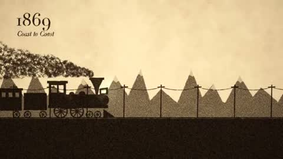
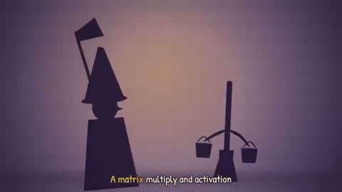
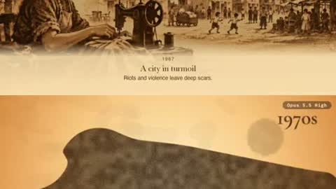

# Collage, cutout & sand · 6

Magazine collage, paper relief, sand animation, silhouettes: handmade material looks.

[← Back to the atlas](../README.md)

## Style recipe

Paste this after your own prompt to lock the look:

```text
Style: handmade collage. Build every frame from flat cut-out pieces (paper, photo scraps,
card) with torn edges, soft drop shadows and visible paper texture; pieces move in stop-
motion steps on twos (12 fps). Warm, slightly faded colours.
```

## Examples

<table>
  <tr>
    <td align="center" width="33%" valign="top"><a href="#c2103336310089842921"></a><br><sub><b>Modern Peter Gabriel style music video</b></sub></td>
    <td align="center" width="33%" valign="top"><a href="#c2103411144899875264"></a><br><sub><b>Whimsical Hand-Drawn About Us Animation</b></sub></td>
    <td align="center" width="33%" valign="top"><a href="#c2102861376184054015"></a><br><sub><b>Paper Craft Fractal Visualizer Art</b></sub></td>
  </tr>
  <tr>
    <td align="center" width="33%" valign="top"><a href="#c2102592355165782312"></a><br><sub><b>250 Years US History Sand Art</b></sub></td>
    <td align="center" width="33%" valign="top"><a href="#c2103697580421181894"></a><br><sub><b>AI Doom Music Video</b></sub></td>
    <td align="center" width="33%" valign="top"><a href="#c2103495753335460295"></a><br><sub><b>Hong Kong 100 years sand animation</b></sub></td>
  </tr>
</table>

---

<a id="c2103336310089842921"></a>

### Modern Peter Gabriel style music video

<a href="https://x.com/DavidShulmanFL/status/2103336310089842921"></a>

```text
Create a 60 second music video in the style of Peter Gabriel's Sledgehammer and Big Time.
But use modern references and figures. Also create the song, something sounds like it
would fit on Peter Gabriel's So album.
```

<sub>By @DavidShulmanFL · <a href="https://x.com/DavidShulmanFL/status/2103336310089842921">Watch the original</a></sub>

---

<a id="c2103411144899875264"></a>

### Whimsical Hand-Drawn About Us Animation

<a href="https://x.com/TomAndrieu96707/status/2103411144899875264"></a>

```text
Create a pure javascript animation. 30s-60s whimsical hand drawn collage style with
appropriate audio that will explain the same story as our “about-us” page. Use assets from
our repo when possible.
```

<sub>By @TomAndrieu96707 · <a href="https://x.com/TomAndrieu96707/status/2103411144899875264">Watch the original</a></sub>

---

<a id="c2102861376184054015"></a>

### Paper Craft Fractal Visualizer Art

<a href="https://x.com/jrayon/status/2102861376184054015"></a>

```text
build an art project which is a fractal visulizer (mandelbrot, etc), but the styles look
like handcrafted with paper, cardboard and such. Add post-procesing so it looks cinematic.
Also want to use beautitful elaborated animations and transitions and a beautiful UX. Plan
it first, show me a preview before coding everything
```

<sub>By @jrayon · <a href="https://x.com/jrayon/status/2102861376184054015">Watch the original</a></sub>

---

<a id="c2102592355165782312"></a>

### 250 Years US History Sand Art

<a href="https://x.com/Michaelzsguo/status/2102592355165782312"></a>

```text
Make a 2-minute sand animation that tells the story of 250 years of U.S. history. Keep it
lively, engaging, and tasteful. Add appropriate background music and sound design.
```

<sub>By @Michaelzsguo · <a href="https://x.com/Michaelzsguo/status/2102592355165782312">Watch the original</a></sub>

---

<a id="c2103697580421181894"></a>

### AI Doom Music Video

<a href="https://x.com/doubleunplussed/status/2103697580421181894"></a>

```text
I'd like you to make a music video in a similar style to this one:

https://github.com/JohnHeibel/PDoomVideo

To this song:

https://youtu.be/cobZuBii0Z0?si=ada6wxomeJbo-LRl

Don't feel the need to represent everything in the lyrics literally - feel free to include
relevant references to concepts, events, and lore in the video, even if obscure
(especially if obscure). E.g. when the lyrics say "when they say they're just predicting
tokens...", you might depict a "stochastic parrot". That one's not particularly obscure
but is the kind of thing I mean. Instead of depicting like, literally predicting tokens
(though you might do that too. Use your judgement! The video should be fun to watch for
someone well steeped in AI and AI safety lore and discourse, and who Wille wcognise
relevant pop culture and literary or historical references)

I don't know how this ultimately results in a video file - I know the linked repo animates
a video with JavaScript or something - but I ultimately want a rendered video file.

Feel free to choose your tools, be creative, and exercise your own taste.

This repo "fdsgdg" appears to be have been accidentally created, but it's empty and we can
use it for this, I can rename it afterwards.

Also, clip the final two beats from the audio.rught at the end, after "then why does it
talk back" they are after the song has finished and sound bad.

Credit the song to Suno and whatever Claude Opus model was the latest at the time of the
YouTube upload, as prompted by Andy Masely (Andy printed Claude to write the lyrics, and
Suno for the music), and credit the video to yourself.

And have fun!

----

A style change - don't make Dr. Null's mouth wobble with the lyrics as if he's singing, it
doesn't
  actually look like he's singing, just that the curcle of his mouth is jittery. Best to
just not
  make him be singing. Make him just have appropriate expressions for the scenes, and not
be singing
  the song.

----

Dr. Null's arms look a bit unnatural in many scenes - I think he's supposed to be holding
  his hand on his face in shock or something, but it looks like it is a mistake. Can you
make it look
  more natural? If you do so and like the result, re-render.
```

<sub>By @doubleunplussed · <a href="https://x.com/doubleunplussed/status/2103697580421181894">Watch the original</a></sub>

---

<a id="c2103495753335460295"></a>

### Hong Kong 100 years sand animation

<a href="https://x.com/harryworld/status/2103495753335460295"></a>

```text
Make a 2-minute sand animation that tells the story of 100 years of Hong Kong history.
Keep it lively, engaging, and tasteful. Add appropriate background music and sound design.
```

<sub>By @harryworld · <a href="https://x.com/harryworld/status/2103495753335460295">Watch the original</a></sub>
