# Explainers & data viz · 38

Charts, formulas, maps, timelines: making one idea clear.

[← Back to the atlas](../README.md)

## Style recipe

Paste this after your own prompt to lock the look:

```text
Style: explainer. One idea per scene, built step by step: axes draw on, values count up,
arrows point, labels fade in next to what they name. Clean off-white or dark background,
one highlight colour for the thing that matters.
```

## Examples

<table>
  <tr>
    <td align="center" width="33%" valign="top"><a href="#c2103495232637882858"></a><br><sub><b>Motion Designer Showreel</b></sub></td>
    <td align="center" width="33%" valign="top"><a href="#c2103683057689522564"></a><br><sub><b>What is Transformer explainer</b></sub></td>
    <td align="center" width="33%" valign="top"><a href="#c2103272686570918334"></a><br><sub><b>Anime social media explainer</b></sub></td>
  </tr>
  <tr>
    <td align="center" width="33%" valign="top"><a href="#c2103174501345493197"></a><br><sub><b>IKEA manual 3D video</b></sub></td>
    <td align="center" width="33%" valign="top"><a href="#c2103424524297420829">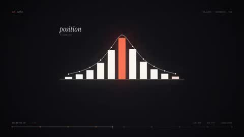</a><br><sub><b>Motion designer resume reel</b></sub></td>
    <td align="center" width="33%" valign="top"><a href="#c2103757371357229129">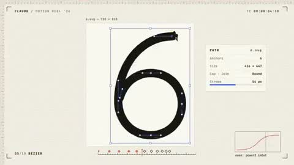</a><br><sub><b>Motion Designer Showreel</b></sub></td>
  </tr>
  <tr>
    <td align="center" width="33%" valign="top"><a href="#c2103483957266268381"></a><br><sub><b>Product UI States Animation</b></sub></td>
    <td align="center" width="33%" valign="top"><a href="#c2103652674336067876">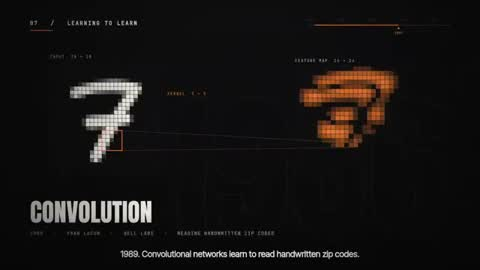</a><br><sub><b>Key Moments in AI History</b></sub></td>
    <td align="center" width="33%" valign="top"><a href="#c2103171088637419631">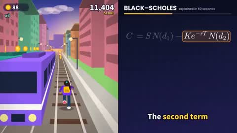</a><br><sub><b>Finance formula split screen</b></sub></td>
  </tr>
  <tr>
    <td align="center" width="33%" valign="top"><a href="#c2102751132502446549"></a><br><sub><b>GitHub version control explained</b></sub></td>
    <td align="center" width="33%" valign="top"><a href="#c2102842569940181357">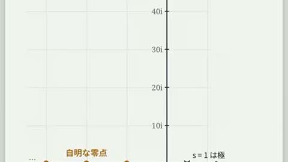</a><br><sub><b>Riemann hypothesis explainer video</b></sub></td>
    <td align="center" width="33%" valign="top"><a href="#c2103135072987795526">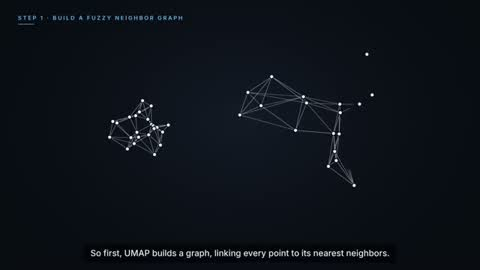</a><br><sub><b>UMAP educational video</b></sub></td>
  </tr>
  <tr>
    <td align="center" width="33%" valign="top"><a href="#c2103683260144292176">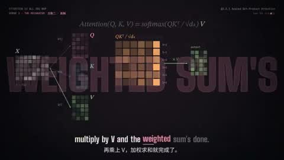</a><br><sub><b>Attention paper rap music video</b></sub></td>
    <td align="center" width="33%" valign="top"><a href="#c2103965723081187407">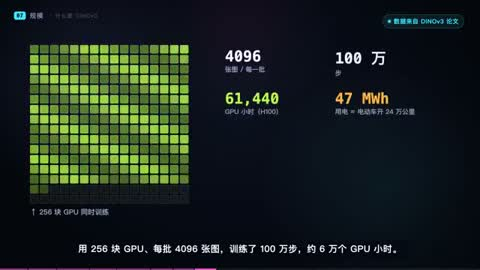</a><br><sub><b>DINOv3 explainer video</b></sub></td>
    <td align="center" width="33%" valign="top"><a href="#c2104044910769016888">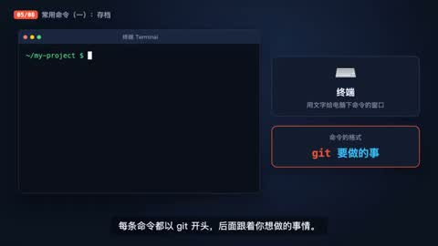</a><br><sub><b>What is Git explainer</b></sub></td>
  </tr>
  <tr>
    <td align="center" width="33%" valign="top"><a href="#c2103736579449868515">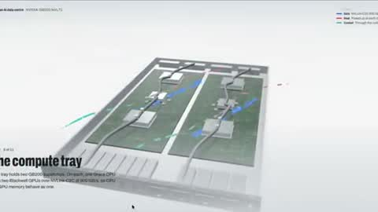</a><br><sub><b>Inside an AI Data Centre</b></sub></td>
    <td align="center" width="33%" valign="top"><a href="#c2102899830951731601"></a><br><sub><b>Riemann hypothesis explainer</b></sub></td>
    <td align="center" width="33%" valign="top"><a href="#c2103290592679879074">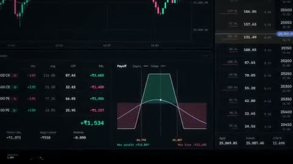</a><br><sub><b>Sahi Trading Terminal Animation</b></sub></td>
  </tr>
  <tr>
    <td align="center" width="33%" valign="top"><a href="#c2103629247751618782">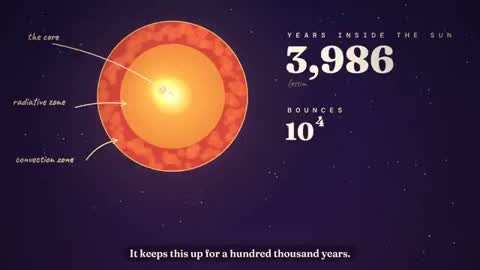</a><br><sub><b>Photon Journey Animated Explainer</b></sub></td>
    <td align="center" width="33%" valign="top"><a href="#c2103565570310340931">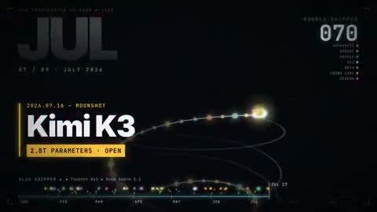</a><br><sub><b>LLM Capability Evolution Timeline</b></sub></td>
    <td align="center" width="33%" valign="top"><a href="#c2103500011581440008">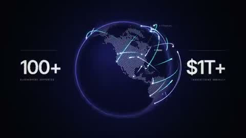</a><br><sub><b>Alchemy Infra Motion Reel</b></sub></td>
  </tr>
  <tr>
    <td align="center" width="33%" valign="top"><a href="#c2103614667038052364">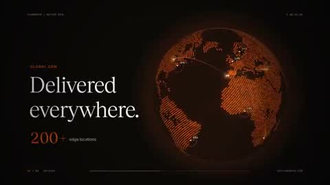</a><br><sub><b>Motion Designer Showreel for Flowdrive</b></sub></td>
    <td align="center" width="33%" valign="top"><a href="#c2103149485023023601">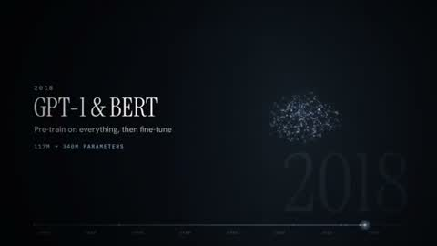</a><br><sub><b>LLM history animation</b></sub></td>
    <td align="center" width="33%" valign="top"><a href="#c2103788796022034553">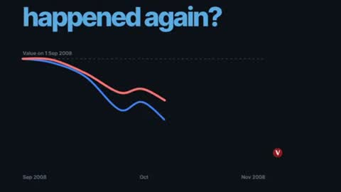</a><br><sub><b>AllInvestView Platform Promo</b></sub></td>
  </tr>
  <tr>
    <td align="center" width="33%" valign="top"><a href="#c2103542568361369810">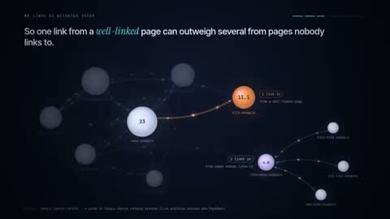</a><br><sub><b>How SEO Backlinks Work</b></sub></td>
    <td align="center" width="33%" valign="top"><a href="#c2103837917538107563">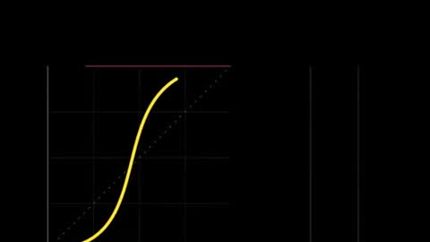</a><br><sub><b>Product Feature Showreel Loop</b></sub></td>
    <td align="center" width="33%" valign="top"><a href="#c2103206747846701462">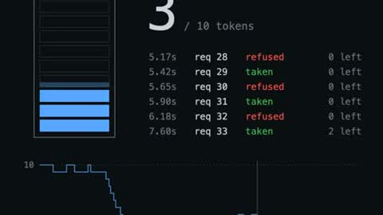</a><br><sub><b>Token Bucket Rate Limiter Canvas Animation</b></sub></td>
  </tr>
  <tr>
    <td align="center" width="33%" valign="top"><a href="#c2103195903012032809">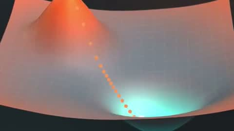</a><br><sub><b>Gradient Descent Ball Path 3D Animation</b></sub></td>
    <td align="center" width="33%" valign="top"><a href="#c2103830949201146038">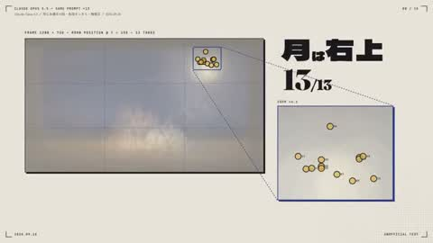</a><br><sub><b>HTML animation experiment video</b></sub></td>
    <td align="center" width="33%" valign="top"><a href="#c2102954743442399395"></a><br><sub><b>Password vs passkey explainer</b></sub></td>
  </tr>
  <tr>
    <td align="center" width="33%" valign="top"><a href="#c2103317768669921682">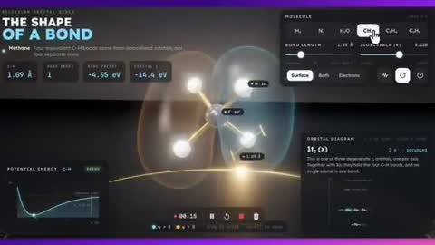</a><br><sub><b>Molecular Orbital Educational Simulation</b></sub></td>
    <td align="center" width="33%" valign="top"><a href="#c2103788564840386691">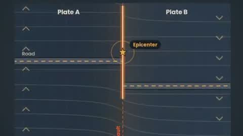</a><br><sub><b>Earthquake Physics Strain Animation</b></sub></td>
    <td align="center" width="33%" valign="top"><a href="#c2103128559174971663">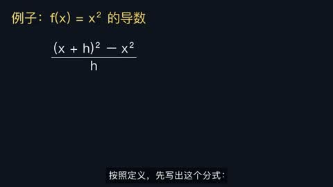</a><br><sub><b>Derivative Concept Math Animation</b></sub></td>
  </tr>
  <tr>
    <td align="center" width="33%" valign="top"><a href="#c2103459971174130104">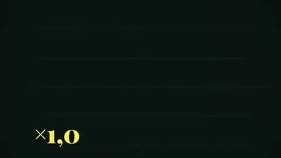</a><br><sub><b>Personal Brand Motion Intro</b></sub></td>
    <td align="center" width="33%" valign="top"><a href="#c2103834787647807540">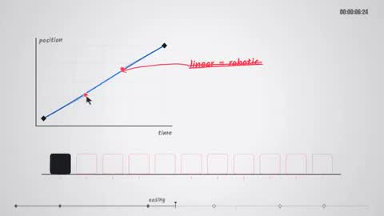</a><br><sub><b>Premium Motion Graphics Showcase</b></sub></td>
    <td align="center" width="33%" valign="top"><a href="#c2103840883812733090">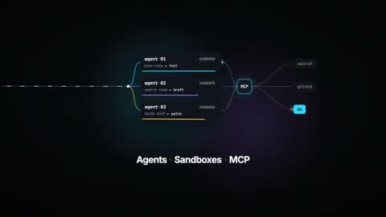</a><br><sub><b>TanStack AI Launch Film</b></sub></td>
  </tr>
  <tr>
    <td align="center" width="33%" valign="top"><a href="#c2103626582896091611">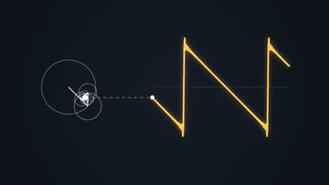</a><br><sub><b>Fourier Series Visual Explainer</b></sub></td>
    <td align="center" width="33%" valign="top"><a href="#c2103835848575746268">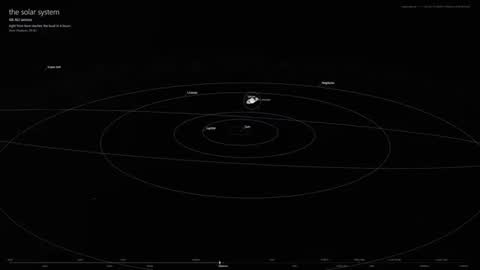</a><br><sub><b>Earth to Observable Universe Zoom</b></sub></td>
  </tr>
</table>

---

<a id="c2103495232637882858"></a>

### Motion Designer Showreel

<a href="https://x.com/himanshutwtxs/status/2103495232637882858"></a>

```text
make a dynamic 15-second motion graphics video that shows what an incredible motion
designer you are, like it's your showreel for a résumé. go all out
```

<sub>By @himanshutwtxs · <a href="https://x.com/himanshutwtxs/status/2103495232637882858">Watch the original</a></sub>

---

<a id="c2103683057689522564"></a>

### What is Transformer explainer

<a href="https://x.com/dotey/status/2103683057689522564"></a>

```text
帮我用js制作一个视频，主题是：什么是 Transformer
要深入浅出，让高中生也能看得懂，不仅high level说的清楚，也要有细节，包括注意力机制，甚至一些数学概念

你可以用任何工具或者安装工具，可以联网检索

请给我惊喜
```

<sub>By @dotey · <a href="https://x.com/dotey/status/2103683057689522564">Watch the original</a></sub>

---

<a id="c2103272686570918334"></a>

### Anime social media explainer

<a href="https://x.com/emollick/status/2103272686570918334"></a>

```text
make the same message much more interesting to a social media audience that loves anime
and quick clips and compressed learning
```

<sub>By @emollick · <a href="https://x.com/emollick/status/2103272686570918334">Watch the original</a></sub>

---

<a id="c2103174501345493197"></a>

### IKEA manual 3D video

<a href="https://x.com/deedydas/status/2103174501345493197"></a>

```text
Translate this IKEA assembly manual into a 3D narrated instructional video
```

<sub>By @deedydas · <a href="https://x.com/deedydas/status/2103174501345493197">Watch the original</a></sub>

---

<a id="c2103424524297420829"></a>

### Motion designer resume reel

<a href="https://x.com/darel023/status/2103424524297420829"></a>

```text
You're a world-class motion designer, and this is your 15-second résumé reel. Make it
dynamic and confident: open with a striking hook in the first second, build through a
sequence of distinct techniques (typography, shape play, camera moves,
```

<sub>By @darel023 · <a href="https://x.com/darel023/status/2103424524297420829">Watch the original</a></sub>

---

<a id="c2103757371357229129"></a>

### Motion Designer Showreel

<a href="https://x.com/mattiapomelli/status/2103757371357229129"></a>

```text
make a dynamic 15-second motion graphics video that shows what an incredible motion
designer you are, like it's your showreel for a résumé. go all out.
```

<sub>By @mattiapomelli · <a href="https://x.com/mattiapomelli/status/2103757371357229129">Watch the original</a></sub>

---

<a id="c2103483957266268381"></a>

### Product UI States Animation

<a href="https://x.com/verbove/status/2103483957266268381"></a>

```text
<inputs>
Ask me for:
• my product + URL
• 8–12 UI states that tell its story
• the real data shown in each state
• brand colors + fonts + accent color
• required formats (1:1, 16:9, 9:16)
</inputs>

<rules>
One HTML file. One canvas
One draw(t) function

No CSS transitions
No timers
No state carried between frames

One shape, never cut

Every state is the same element changing size, radius and color while the content swaps

A cursor drives the sequence with real clicks, typing and one drag

Real UI. Real data. No placeholders.

</rules>
<structure>
120 BPM grid

Something happens on every bea

logo → button → handle field → “is this you?” → loader → pin → globe filling with users →
matches → tabs → RSVP → search → logo

</structure>

<motion>
Closed-form springs everywhere with only a tiny overshoot.

If a value changes target multiple times, sum one spring per change

Content enters after its container starts morphing and leaves before the next morph so
text never overlaps

Use a short blur on transitions

Never fade black directly into the accent color. Move an accent element between states
instead

Make tab indicators stretch by putting each edge on a different spring

Zoom the camera so every state fills the frame

Make the last frame equal the first so the whole thing loops
</motion>

<export>
First render one frame per beat as a contact sheet

Fix anything cramped or broken

Then render every frame in headless Chrome at 60fps, averaging 6 subframes for motion blur

Pipe into ffmpeg:
H.264 + yuv420p

Export all aspect ratios in parallel
</export>

motion design is becoming a prompt
```

<sub>By @verbove · <a href="https://x.com/verbove/status/2103483957266268381">Watch the original</a></sub>

---

<a id="c2103652674336067876"></a>

### Key Moments in AI History

<a href="https://x.com/kloss_xyz/status/2103652674336067876"></a>

```text
make a video highlighting key moments in the history of AI.
```

<sub>By @kloss_xyz · <a href="https://x.com/kloss_xyz/status/2103652674336067876">Watch the original</a></sub>

---

<a id="c2103171088637419631"></a>

### Finance formula split screen

<a href="https://x.com/goodside/status/2103171088637419631"></a>

```text
Create a 1 minute video where the right half explains the Black-Scholes formula with
voiceover and visuals and the left half plays a generic knockoff of Subway Surfers
```

<sub>By @goodside · <a href="https://x.com/goodside/status/2103171088637419631">Watch the original</a></sub>

---

<a id="c2102751132502446549"></a>

### GitHub version control explained

<a href="https://x.com/sundyme/status/2102751132502446549"></a>

```text
我是非专业编码者，在用 Claude Code 做网站，请做个动画视频，讲解 GitHub 版本管理及如何使用
```

<sub>By @sundyme · <a href="https://x.com/sundyme/status/2102751132502446549">Watch the original</a></sub>

---

<a id="c2102842569940181357"></a>

### Riemann hypothesis explainer video

<a href="https://x.com/hyuki/status/2102842569940181357"></a>

```text
30秒くらいのリーマン予想の解説動画をJavaScriptで作って（数学的な誤りは入れないこと）
```

<sub>By @hyuki · <a href="https://x.com/hyuki/status/2102842569940181357">Watch the original</a></sub>

---

<a id="c2103135072987795526"></a>

### UMAP educational video

<a href="https://x.com/goodside/status/2103135072987795526"></a>

```text
Make a 1-minute educational video about UMAP with synthesized voice narration.
```

<sub>By @goodside · <a href="https://x.com/goodside/status/2103135072987795526">Watch the original</a></sub>

---

<a id="c2103683260144292176"></a>

### Attention paper rap music video

<a href="https://x.com/Tz_2022/status/2103683260144292176"></a>

```text
为 Attention is all you need 论文做一个说唱风格的 MV 吧，英文唱词，中英双语字幕
```

<sub>By @Tz_2022 · <a href="https://x.com/Tz_2022/status/2103683260144292176">Watch the original</a></sub>

---

<a id="c2103965723081187407"></a>

### DINOv3 explainer video

<a href="https://x.com/dotey/status/2103965723081187407"></a>

```text
帮我用 js 制作一个视频，主题是：什么是dinov3
要深入浅出，让高中生也能看得懂，不仅high level说的清楚，也要有细节

你可以用任何工具或者安装工具，可以联网检索

请给我惊喜
```

<sub>By @dotey · <a href="https://x.com/dotey/status/2103965723081187407">Watch the original</a></sub>

---

<a id="c2104044910769016888"></a>

### What is Git explainer

<a href="https://x.com/Yunn260414/status/2104044910769016888"></a>

```text
帮我用js制作一个视频，主题是：什么是Git
要深入浅出，让一个计算机0基础的人也能看得懂，然后要介绍一些常用指令的意思等等
要有声音的，然后是中文讲的
你可以用任何工具或者安装工具，可以联网检索
```

<sub>By @Yunn260414 · <a href="https://x.com/Yunn260414/status/2104044910769016888">Watch the original</a></sub>

---

<a id="c2103736579449868515"></a>

### Inside an AI Data Centre

<a href="https://x.com/Sayan_shanky/status/2103736579449868515"></a>

```text
show me what goes on inside an AI data centre.
```

<sub>By @Sayan_shanky · <a href="https://x.com/Sayan_shanky/status/2103736579449868515">Watch the original</a></sub>

---

<a id="c2102899830951731601"></a>

### Riemann hypothesis explainer

<a href="https://x.com/hyuki/status/2102899830951731601"></a>

```text
動画の内容に合わせ、落ち着いて説得力のある女性の声でナレーションを付けてください。場面が切り替わるところでごく控えめなジングルをいれて
```

<sub>By @hyuki · <a href="https://x.com/hyuki/status/2102899830951731601">Watch the original</a></sub>

---

<a id="c2103290592679879074"></a>

### Sahi Trading Terminal Animation

<a href="https://x.com/dale_vaz/status/2103290592679879074"></a>

```text
create a self contained aesthetically pleasing, breathtaking animation of the Sahi Trading
Terminal. it should start with a single dot on a black screen and then have multiple
windows show up on the screen such as Charts, Positons , Option Chain, Watchlist. And zoom
into and out at multiple scales. Finally the camera zooms out to make the desktop look
like a point in space. And then it zooms back in to reveal a mobile screen in landscape
mode with a chart in one half and an option chain in another. The video ends in Sjngle
Screen Trading on SAHI
use javascript for it. be detailed and accurate. it should be visually stunning
0:46
```

<sub>By @dale_vaz · <a href="https://x.com/dale_vaz/status/2103290592679879074">Watch the original</a></sub>

---

<a id="c2103629247751618782"></a>

### Photon Journey Animated Explainer

<a href="https://x.com/AstroTheWizard/status/2103629247751618782"></a>

```text
I want you to make a 60-second, fully animated explainer video, end to end, completely on
your own. I'm stepping away from my computer, so work autonomously until it's done. Don't
stop to ask me questions; make the calls yourself and tell me what you decided at the end.

Topic: the journey of photons

Style: whimsical, charming, storybook. Give the photon a personality. It should feel like
a professional motion-design studio made it, not "AI video". The whole thing should be a
pure JavaScript animation, rendered from code frame by frame. Don't use AI video
generators for the visuals. I've seen the videos people are posting from Opus 5.5 (kinetic
typography reels, continuous infinite zooms, data-driven explainers like The Pudding or
3Blue1Brown), and what makes them great is that they're code-rendered: crisp, precise,
with a coherent design system and one strong formal idea per scene. Aim for that bar or
above.

Make it genuinely educational and accurate. Where you can, simulate the real thing: the
random walk should be an actual random walk, not a drawing of one. Include real numbers
(core temperature, distance, travel time, years inside the Sun) and be honest about
uncertainty in the estimates. Use humor and visual gags to keep attention: onomatopoeia,
little characters, callbacks. Put what was happening on Earth during those 100,000 years
alongside the photon's timeline.

Deliverable: 1920x1080 at 60fps, exactly 60 seconds, with:
- A voiceover script you write yourself, voiced with the highest-quality text-to-speech
model you can access
- Burned-in captions, since most people watch on X with the sound off
- An original music score that fits the whimsical tone and changes with each scene
- Sound design synced exactly to the on-screen action (every bounce, pop, whoosh and ding)
- A professional mix: music ducks under the voice, mastered to streaming loudness

You write the script, design the characters, pick the typography and palette, compose the
music, and build the animation engine. Use any tools and resources you can find access to:
open fonts, sample libraries, open-source models. Use whatever works.

Quality is paramount. Build verification loops: render stills of every scene and review
them critically, check transitions frame by frame, measure the audio mix numerically, fix
what's weak and re-render. Don't hand me a first draft. Hand me something you'd put your
name on. Also give me the source code so it's reproducible
```

<sub>By @AstroTheWizard · <a href="https://x.com/AstroTheWizard/status/2103629247751618782">Watch the original</a></sub>

---

<a id="c2103565570310340931"></a>

### LLM Capability Evolution Timeline

<a href="https://x.com/nummanali/status/2103565570310340931"></a>

```text
Can you make me a video of LLM progression, like models that is from January of this year
up until now, and what the trajectory is looking like, the capabilities and models as
well? Like the capabilities of models too? I want to make it really like bang, bang, boom,
whoa, here we go, kind of amazing innovation. Are you ready for this kind of thing? I
think you'd use vMotion, 3GS, a bunch of stuff you've got. Use whatever you want.
```

<sub>By @nummanali · <a href="https://x.com/nummanali/status/2103565570310340931">Watch the original</a></sub>

---

<a id="c2103500011581440008"></a>

### Alchemy Infra Motion Reel

<a href="https://x.com/onewaysidewalks/status/2103500011581440008"></a>

```text
make a dynamic 15-second motion graphics video that shows what an incredible motion
designer you are, like it's your showreel for the infra company https://alchemy.com, go
all out!
```

<sub>By @onewaysidewalks · <a href="https://x.com/onewaysidewalks/status/2103500011581440008">Watch the original</a></sub>

---

<a id="c2103614667038052364"></a>

### Motion Designer Showreel for Flowdrive

<a href="https://x.com/manuelogomigo/status/2103614667038052364"></a>

```text
make a dynamic 15-second motion graphics video that shows what an incredible motion
designer you are, like it's your showreel for a flowdrive. go all out.
```

<sub>By @manuelogomigo · <a href="https://x.com/manuelogomigo/status/2103614667038052364">Watch the original</a></sub>

---

<a id="c2103149485023023601"></a>

### LLM history animation

<a href="https://x.com/calebcterry/status/2103149485023023601"></a>

```text
Create an animation entirely in code featuring a growth montage of the history of LLMs,
going back to the beginning of the first LLM research and leading up to the current day as
of September 23rd, 2026. Ensure smooth transitions, appropriate emotionally
```

<sub>By @calebcterry · <a href="https://x.com/calebcterry/status/2103149485023023601">Watch the original</a></sub>

---

<a id="c2103788796022034553"></a>

### AllInvestView Platform Promo

<a href="https://x.com/rammanq/status/2103788796022034553"></a>

```text
Make a dynamic motion graphics video that shows what an incredible platform AllInvestView
is. Go all out.
```

<sub>By @rammanq · <a href="https://x.com/rammanq/status/2103788796022034553">Watch the original</a></sub>

---

<a id="c2103542568361369810"></a>

### How SEO Backlinks Work

<a href="https://x.com/stewchan2/status/2103542568361369810"></a>

```text
create an insightful, yet state of the art video visualization for how backlinks work for
SEO
```

<sub>By @stewchan2 · <a href="https://x.com/stewchan2/status/2103542568361369810">Watch the original</a></sub>

---

<a id="c2103837917538107563"></a>

### Product Feature Showreel Loop

<a href="https://x.com/Ishaaqahamed/status/2103837917538107563"></a>

```text
Make a dynamic 15-second motion graphics video that shows why [your product] is the best
at [what it does], like a showreel. Go all out: 1080×1080, 1s hook, loop.
```

<sub>By @Ishaaqahamed · <a href="https://x.com/Ishaaqahamed/status/2103837917538107563">Watch the original</a></sub>

---

<a id="c2103206747846701462"></a>

### Token Bucket Rate Limiter Canvas Animation

<a href="https://x.com/ParkerRex/status/2103206747846701462"></a>

```text
explain a token bucket rate limiter, canvas only, no libraries, every frame a pure
function of time so my renderer can screenshot it.
```

<sub>By @ParkerRex · <a href="https://x.com/ParkerRex/status/2103206747846701462">Watch the original</a></sub>

---

<a id="c2103195903012032809"></a>

### Gradient Descent Ball Path 3D Animation

<a href="https://x.com/anirockshady/status/2103195903012032809"></a>

```text
Create a 3D animation of a Path Points in this case  ball reaching approximation from
crest to trough. Discuss the type of ML algorithm gradient descent is. Also list major use
cases.And trasition can be fade in fade out. Colour theory Volcanic Orange, Cyan and
gradient of grey
```

<sub>By @anirockshady · <a href="https://x.com/anirockshady/status/2103195903012032809">Watch the original</a></sub>

---

<a id="c2103830949201146038"></a>

### HTML animation experiment video

<a href="https://x.com/Mochi_AGI/status/2103830949201146038"></a>

```text
誰もやってないHTMLアニメの実験動画作って
```

<sub>By @Mochi_AGI · <a href="https://x.com/Mochi_AGI/status/2103830949201146038">Watch the original</a></sub>

---

<a id="c2102954743442399395"></a>

### Password vs passkey explainer

<a href="https://x.com/imShiWen/status/2102954743442399395"></a>

```text
做个科普视频，讲清楚 password 和 passkey 的区别，配音用免费 TTS。
```

<sub>By @imShiWen · <a href="https://x.com/imShiWen/status/2102954743442399395">Watch the original</a></sub>

---

<a id="c2103317768669921682"></a>

### Molecular Orbital Educational Simulation

<a href="https://x.com/explorations_iq/status/2103317768669921682"></a>

> The creator shared only part of the prompt.

```text
Opus 5.5 generated this simulation of molecular orbitals in about ~20 minutes. I had to
prompt for some structures and resonance but I can see the promise of instant educational
simulations for any advanced topic
```

<sub>By @explorations_iq · <a href="https://x.com/explorations_iq/status/2103317768669921682">Watch the original</a></sub>

---

<a id="c2103788564840386691"></a>

### Earthquake Physics Strain Animation

<a href="https://x.com/kureshirfan/status/2103788564840386691"></a>

> The creator shared only part of the prompt.

```text
I asked Claude Opus 5.5 to explain the earthquake physics as an animation. This is what it
built, physically accurate strain profile included.
#opus5 @AnthropicAI @claudeai
```

<sub>By @kureshirfan · <a href="https://x.com/kureshirfan/status/2103788564840386691">Watch the original</a></sub>

---

<a id="c2103128559174971663"></a>

### Derivative Concept Math Animation

<a href="https://x.com/LinearUncle/status/2103128559174971663"></a>

```text
请用Manim给我制作一个导数概念学习的视频，要求通俗易懂，并且有例子，引人思考。配音使用edge-tts
```

<sub>By @LinearUncle · <a href="https://x.com/LinearUncle/status/2103128559174971663">Watch the original</a></sub>

---

<a id="c2103459971174130104"></a>

### Personal Brand Motion Intro

<a href="https://x.com/fire_ozgur/status/2103459971174130104"></a>

```text
I want to know how good a graphic designer you are. To prove this to me, I want you to
prepare a 15-second motion graphics video. I want you to do an introduction related to my
account. I'm sharing my logo and my X cover image, use those too.
```

<sub>By @fire_ozgur · <a href="https://x.com/fire_ozgur/status/2103459971174130104">Watch the original</a></sub>

---

<a id="c2103834787647807540"></a>

### Premium Motion Graphics Showcase

<a href="https://x.com/ChatGptAstra/status/2103834787647807540"></a>

```text
以动态设计师的高级审美，制作一段动态的15秒动态图形视频
```

<sub>By @ChatGptAstra · <a href="https://x.com/ChatGptAstra/status/2103834787647807540">Watch the original</a></sub>

---

<a id="c2103840883812733090"></a>

### TanStack AI Launch Film

<a href="https://x.com/HowDevelop/status/2103840883812733090"></a>

```text
Create and render a 15-second motion graphics video introducing TanStack AI. Make it feel
like a premium
  developer-tool launch film produced by Studio1: fast, precise, visually surprising, and
polished enough to open a
  keynote or lead a social campaign.

  Use the TanStack AI feature details below as the source of truth. Studio1 is presenting
the film; do not imply
  Studio1 built TanStack AI.

  Format and deliverables
  - 1920×1080, 30 fps, exactly 15 seconds; keep important content within a 9:16-safe
central area.
  - Deliver the rendered MP4 and the editable project/source. Use Remotion or another
code-based motion graphics
  workflow if available.
  - Use real, editable typography and vector-style graphics. Do not rely on AI-generated
text inside images.
  - Add an original electronic sound design: a restrained opening pulse, tightly
synchronized transition hits, rising
  - Add an original electronic sound design: a restrained opening pulse, tightly
synchronized transition hits, rising
  momentum, and a satisfying final resolve. The story must also work muted.

  Visual direction
  Dark graphite canvas; luminous gradients and controlled flashes inspired by TanStack’s
identity. Crisp typography,
  kinetic code, layered interface fragments, streaming data, branching paths, and smooth
camera moves with convincing
  depth. High contrast and immaculate spacing. Every transition should visually
demonstrate a feature, rather than
  simply replace one title card with another. Keep all on-screen wording brief and
legible. Avoid generic stock
  footage, spinning logos, fake dashboards, excessive glitch effects, and tiny code nobody
can read.

  Exact 15-second sequence
  - 0:00–0:02 — Hook: A single prompt cursor blinks. It sends one signal that expands into
a network of
  possibilities. On-screen: “What can one AI API become?”
  - 0:02–0:04 — Core and providers: The signal resolves into chat(); provider nodes
connect and swap rapidly without
  breaking the central flow. On-screen: “chat() · 24 providers”
  - 0:04–0:06.5 — Multimodal: One continuous stream transforms into text, waveform, image
frame, and video timeline.
  On-screen: “One pattern. Every modality.”
  - 0:06.5–0:09 — Agents and tools: The stream branches into sandboxed agent runs, then
reaches external tools
  through MCP. Show distinct runs progressing in parallel. On-screen: “Agents · Sandboxes
· MCP”
  - 0:09–0:11.5 — Reliability: An interrupted stream freezes, reconnects, and resumes from
the same point; a clean
  type-check confirmation snaps into place. On-screen: “Persistent. Durable. Type-safe.”
  - 0:11.5–0:15 — Reveal: All paths converge into a bold final composition: “TanStack AI”
followed by “Build what’s
  next.” Add a small “A Studio1 film” credit, visually subordinate to TanStack AI. Hold
the final frame long enough
  to read it.

  Accuracy guardrails
  The supplied article says TanStack AI is in the release candidate phase, supports 24
providers, uses AG-UI, and
  offers composable chat(), media generation, sandbox and agent-harness primitives, MCP,
type safety, persistence,
  and resumable streams. Do not call it a stable v1 release. Do not present planned
orchestration features as already
  shipped.

  Make the video, inspect the rendered result, and fix any clipped text, weak transitions,
mistimed beats, or
  unreadable frames before delivering it. The goal is a memorable showreel, not a
slideshow of feature bullets.
```

<sub>By @HowDevelop · <a href="https://x.com/HowDevelop/status/2103840883812733090">Watch the original</a></sub>

---

<a id="c2103626582896091611"></a>

### Fourier Series Visual Explainer

<a href="https://x.com/Miguel07Code/status/2103626582896091611"></a>

> The creator shared only part of the prompt.

```text
fourier series were hard to learn back in university (2 years ago) and they are fun!

what unlocks @HyperFrames_ + @claudeai Opus 5.5 is that you can get the best explainer
videos just with 1 prompt

you are curious about something? ask claude!
```

<sub>By @Miguel07Code · <a href="https://x.com/Miguel07Code/status/2103626582896091611">Watch the original</a></sub>

---

<a id="c2103835848575746268"></a>

### Earth to Observable Universe Zoom

<a href="https://x.com/kgonia7/status/2103835848575746268"></a>

> The creator shared only part of the prompt.

```text
From Cabo da Roca to observable universe.

I gave opus 5.5 old prompt I prepared for Fable but I was not satisfied with the results.
I asked model to create a cinematic film that zooms out from a hillside on Earth to the
full observable universe using @threejs No external assets.

Time: ~3h
Output tokens: 662,769
Cache: 125.6M read, 2.0M written;
API-equivalent cost: about $54.52: output $13.26, cache reads $25.12, cache writes $16.14
```

<sub>By @kgonia7 · <a href="https://x.com/kgonia7/status/2103835848575746268">Watch the original</a></sub>
