# 生成艺术 · 霓虹 · 34

粒子、着色器、几何图案、赛博霓虹。

[← 返回图鉴](../README.zh-CN.md)

## 风格配方

把这段贴在你的提示词后面，就能把画风锁定成这一类：

```text
Style: generative art. Everything is procedural: particles, flow fields, shaders or tiling
geometric patterns driven by time and audio. Dark background with neon or a bold 3–4
colour palette; motion locked to the beat.
```

## 案例

<table>
  <tr>
    <td align="center" width="33%" valign="top"><a href="#c2103247844542922825"></a><br><sub><b>Claude与GPT史诗对决动漫</b></sub></td>
    <td align="center" width="33%" valign="top"><a href="#c2103816865852129686"></a><br><sub><b>动态图形设计师作品集</b></sub></td>
    <td align="center" width="33%" valign="top"><a href="#c2102986585004511319"></a><br><sub><b>Tron光速游戏</b></sub></td>
  </tr>
  <tr>
    <td align="center" width="33%" valign="top"><a href="#c2103837803587293397">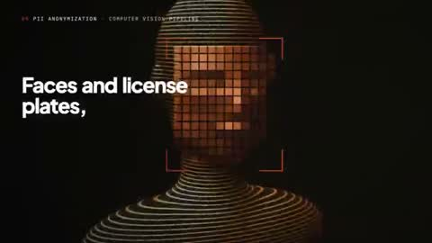</a><br><sub><b>专业动态设计作品集展示</b></sub></td>
    <td align="center" width="33%" valign="top"><a href="#c2103600308010041677">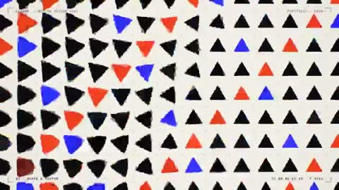</a><br><sub><b>代码生成设计师展示卷</b></sub></td>
    <td align="center" width="33%" valign="top"><a href="#c2103876499262800291">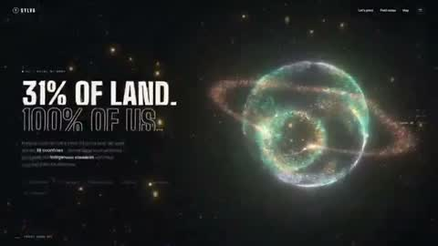</a><br><sub><b>3D森林保护网站</b></sub></td>
  </tr>
  <tr>
    <td align="center" width="33%" valign="top"><a href="#c2103766565389054427">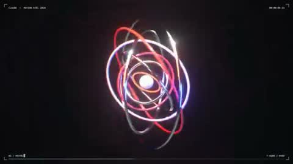</a><br><sub><b>3D运动图形展示</b></sub></td>
    <td align="center" width="33%" valign="top"><a href="#c2103837519615774895">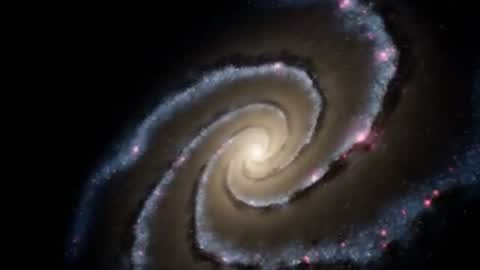</a><br><sub><b>震撼视觉沉浸式体验</b></sub></td>
    <td align="center" width="33%" valign="top"><a href="#c2103566030916239768">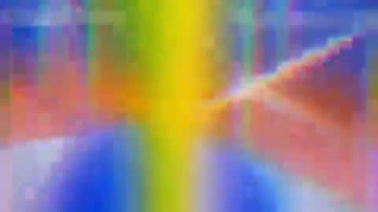</a><br><sub><b>过度思考概念动态展示</b></sub></td>
  </tr>
  <tr>
    <td align="center" width="33%" valign="top"><a href="#c2103794962257084755">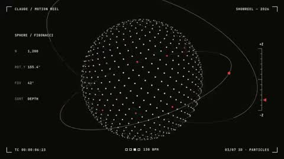</a><br><sub><b>动态设计师履历展示片</b></sub></td>
    <td align="center" width="33%" valign="top"><a href="#c2103541149709615243">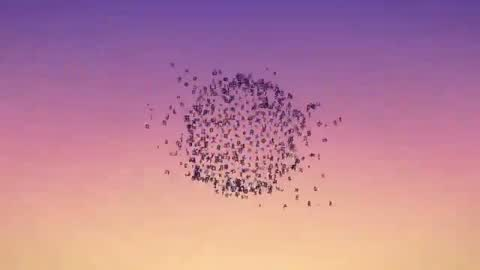</a><br><sub><b>Distilbook产品动态宣传</b></sub></td>
    <td align="center" width="33%" valign="top"><a href="#c2102888241443795431"></a><br><sub><b>交互式烟火粒子特效秀</b></sub></td>
  </tr>
  <tr>
    <td align="center" width="33%" valign="top"><a href="#c2103470566019911961">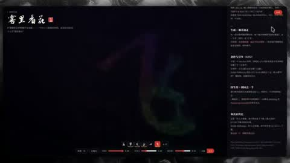</a><br><sub><b>用花展示神经网络概念</b></sub></td>
    <td align="center" width="33%" valign="top"><a href="#c2103656229717328129">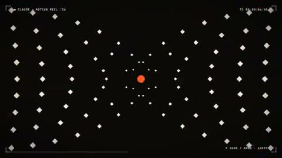</a><br><sub><b>动态设计师个人作品集</b></sub></td>
    <td align="center" width="33%" valign="top"><a href="#c2103493889525178759">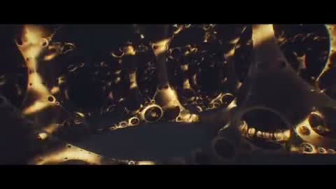</a><br><sub><b>AI预测未来60秒</b></sub></td>
  </tr>
  <tr>
    <td align="center" width="33%" valign="top"><a href="#c2103565104243712107">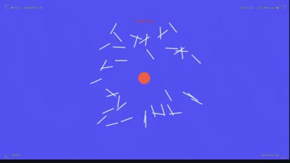</a><br><sub><b>DreamFort超智能宣言</b></sub></td>
    <td align="center" width="33%" valign="top"><a href="#c2103605007396524440">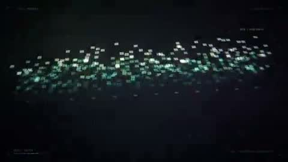</a><br><sub><b>AI猜测用户个人信息</b></sub></td>
    <td align="center" width="33%" valign="top"><a href="#c2103722556918464968">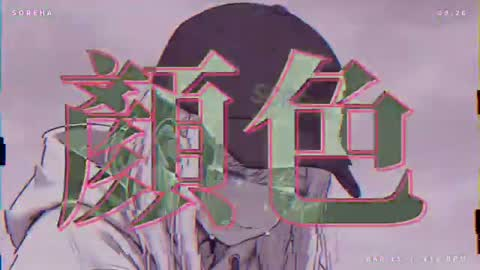</a><br><sub><b>赛博迷幻故障风格音乐MV</b></sub></td>
  </tr>
  <tr>
    <td align="center" width="33%" valign="top"><a href="#c2103580011882295601">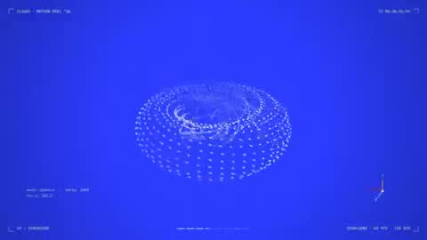</a><br><sub><b>动态设计技巧展示作品集</b></sub></td>
    <td align="center" width="33%" valign="top"><a href="#c2103119764143108537">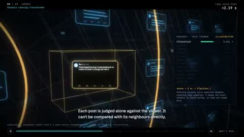</a><br><sub><b>X算法黑镜风动画</b></sub></td>
    <td align="center" width="33%" valign="top"><a href="#c2103578285892649220">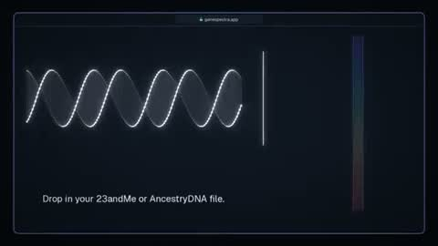</a><br><sub><b>Gene Spectra宣传动画</b></sub></td>
  </tr>
  <tr>
    <td align="center" width="33%" valign="top"><a href="#c2103644352794992798">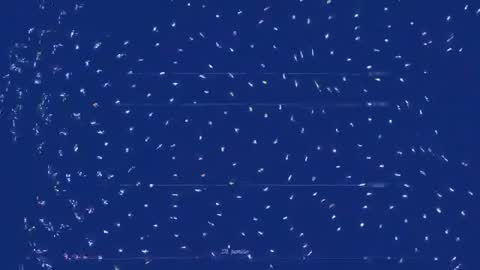</a><br><sub><b>动态设计师作品集</b></sub></td>
    <td align="center" width="33%" valign="top"><a href="#c2103540656182308943">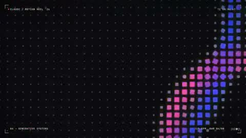</a><br><sub><b>AI动态设计作品展示</b></sub></td>
    <td align="center" width="33%" valign="top"><a href="#c2103565090721259981">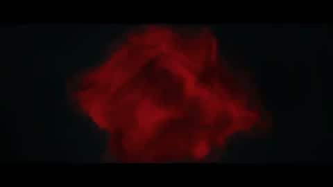</a><br><sub><b>Netflix惊悚剧片头序列</b></sub></td>
  </tr>
  <tr>
    <td align="center" width="33%" valign="top"><a href="#c2103148907228176511">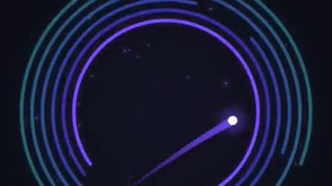</a><br><sub><b>病毒传播创意短视频</b></sub></td>
    <td align="center" width="33%" valign="top"><a href="#c2103513328077222104">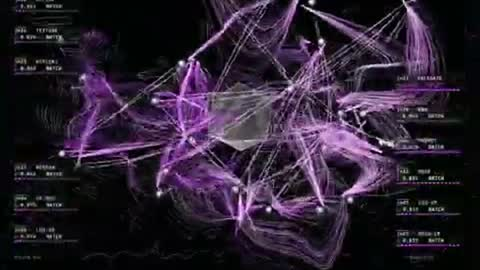</a><br><sub><b>Opus将文字转化为3D模型</b></sub></td>
    <td align="center" width="33%" valign="top"><a href="#c2103441222375268605">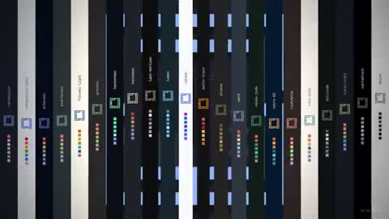</a><br><sub><b>Omarchy动态设计展示卷</b></sub></td>
  </tr>
  <tr>
    <td align="center" width="33%" valign="top"><a href="#c2103664956482941143">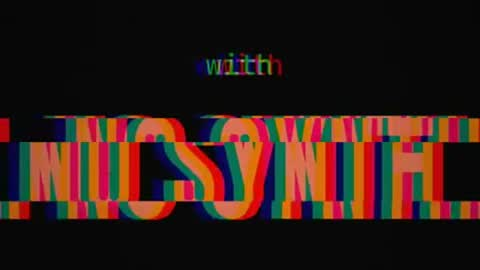</a><br><sub><b>AI视角脑洞混乱短片</b></sub></td>
    <td align="center" width="33%" valign="top"><a href="#c2102920408743678129">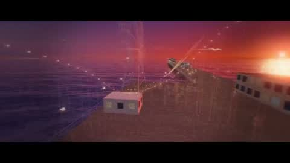</a><br><sub><b>粒子艺术圣莫尼卡海滩</b></sub></td>
    <td align="center" width="33%" valign="top"><a href="#c2103832593355686104">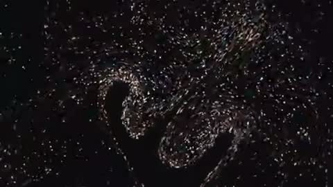</a><br><sub><b>动态图形设计师作品集展示</b></sub></td>
  </tr>
  <tr>
    <td align="center" width="33%" valign="top"><a href="#c2103542756555768014">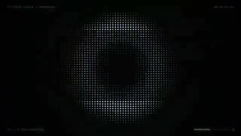</a><br><sub><b>管道工圣经动态展示片</b></sub></td>
    <td align="center" width="33%" valign="top"><a href="#c2102899866762440893">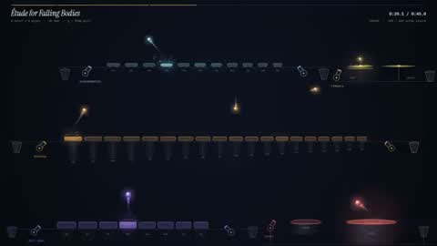</a><br><sub><b>碰撞发声音乐机器</b></sub></td>
    <td align="center" width="33%" valign="top"><a href="#c2104212841657962937">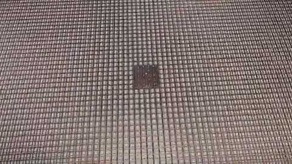</a><br><sub><b>手机到原子级3D穿越动画</b></sub></td>
  </tr>
  <tr>
    <td align="center" width="33%" valign="top"><a href="#c2104081777119920413">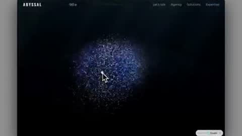</a><br><sub><b>粒子网站效果展示</b></sub></td>
  </tr>
</table>

---

<a id="c2103247844542922825"></a>

### Claude与GPT史诗对决动漫

<a href="https://x.com/ishuagra02/status/2103247844542922825"></a>

```text
I want to create a highly-detailed video trailer featuring Claude and ChatGPT having a
ruthless battle to be the best AI model in the world. Create an engaging story and make it
action-paced with proper use of visual and sound effects. Art style must be anime-like.
```

<sub>作者 @ishuagra02 · <a href="https://x.com/ishuagra02/status/2103247844542922825">看原视频</a></sub>

---

<a id="c2103816865852129686"></a>

### 动态图形设计师作品集

<a href="https://x.com/eyishazyer/status/2103816865852129686"></a>

```text
make a dynamic 15-second motion graphics video that shows what an incredible motion
designer you are, like it's your showreel for a résumé. go all out.
```

<sub>作者 @eyishazyer · <a href="https://x.com/eyishazyer/status/2103816865852129686">看原视频</a></sub>

---

<a id="c2102986585004511319"></a>

### Tron光速游戏

<a href="https://x.com/0xRathi/status/2102986585004511319"></a>

```text
make a Tron game.
```

<sub>作者 @0xRathi · <a href="https://x.com/0xRathi/status/2102986585004511319">看原视频</a></sub>

---

<a id="c2103837803587293397"></a>

### 专业动态设计作品集展示

<a href="https://x.com/heyiammallik/status/2103837803587293397"></a>

```text
you are a pro motion designer. analyze my portfolio and make a ~30 second video from it.
check what are the recent trending techniques used for motion and sound design. question
your strategy and plan, if it doesn't feel like done by a pro designer, start over. every
frame matters from the first frame to the final frame. go crazy
```

<sub>作者 @heyiammallik · <a href="https://x.com/heyiammallik/status/2103837803587293397">看原视频</a></sub>

---

<a id="c2103600308010041677"></a>

### 代码生成设计师展示卷

<a href="https://x.com/johnsavage_ai/status/2103600308010041677"></a>

```text
make a dynamic 15-second motion graphics video that shows what an incredible motion
designer you are, like it's your showreel for a resume. go all out. use only code
```

<sub>作者 @johnsavage_ai · <a href="https://x.com/johnsavage_ai/status/2103600308010041677">看原视频</a></sub>

---

<a id="c2103876499262800291"></a>

### 3D森林保护网站

<a href="https://x.com/Souradip3000/status/2103876499262800291"></a>

> 作者只公开了部分提示词。

```text
Opus 5.5 is mind boggling.

It created this 3D website from just one prompt.

Told it to create a website for forest conservation agency with pinterest post as
reference for 3D animation.

It one shotted into a single html file.
```

<sub>作者 @Souradip3000 · <a href="https://x.com/Souradip3000/status/2103876499262800291">看原视频</a></sub>

---

<a id="c2103766565389054427"></a>

### 3D运动图形展示

<a href="https://x.com/FriskyGGG/status/2103766565389054427"></a>

> 作者只公开了部分提示词。

```text
Opus 5.5 is good at 3d motion too apparantely
```

<sub>作者 @FriskyGGG · <a href="https://x.com/FriskyGGG/status/2103766565389054427">看原视频</a></sub>

---

<a id="c2103837519615774895"></a>

### 震撼视觉沉浸式体验

<a href="https://x.com/MiaAI_lab/status/2103837519615774895"></a>

```text
Build me something when people see it, they will say "Wow". Must be immersive, when people
see it, they will be stunned by what they see.

This can be a video, or anything else you can think of.

Be creative. Go wild. Dig deep.

No AI slop. Something unique, think outside of the box. Think big. Think amazing.
Something no other model done before.

Be proud. Show your best. Don't disappoint.
```

<sub>作者 @MiaAI_lab · <a href="https://x.com/MiaAI_lab/status/2103837519615774895">看原视频</a></sub>

---

<a id="c2103566030916239768"></a>

### 过度思考概念动态展示

<a href="https://x.com/gizakdag/status/2103566030916239768"></a>

```text
Make a dynamic 15-second motion graphics video that shows what an incredible motion
designer you are, like it’s your showreel exploring the concept of “Overthinking,”
inspired by the attached graphics.
```

<sub>作者 @gizakdag · <a href="https://x.com/gizakdag/status/2103566030916239768">看原视频</a></sub>

---

<a id="c2103794962257084755"></a>

### 动态设计师履历展示片

<a href="https://x.com/ayushunleashed/status/2103794962257084755"></a>

```text
make a dynamic 15-second motion graphics video that shows what an incredible motion
designer you are, like it's your showreel for a résumé. go all out
```

<sub>作者 @ayushunleashed · <a href="https://x.com/ayushunleashed/status/2103794962257084755">看原视频</a></sub>

---

<a id="c2103541149709615243"></a>

### Distilbook产品动态宣传

<a href="https://x.com/ajith_io/status/2103541149709615243"></a>

```text
Take reference from the given video (download it) and use the same visual style.
and Research about Distilbook. Make a dynamic 30-second motion graphics video on
Distilbook that shows what an incredible motion designer you are. like it's your showreel
- Go all out.
One thing to keep in mind: it should be cool as fck.
```

<sub>作者 @ajith_io · <a href="https://x.com/ajith_io/status/2103541149709615243">看原视频</a></sub>

---

<a id="c2102888241443795431"></a>

### 交互式烟火粒子特效秀

<a href="https://x.com/FornYapayZeka/status/2102888241443795431"></a>

```text
Yapabileceğin en etkileyici havai fişek veya ışıklı parçacık gösterisini üret. Ortamı ve
sanat yönünü sen seç. Tek tip küçük patlamaları çoğaltmak yerine ritmi, derinliği, ışığın
çevreye etkisini ve unutulmaz bir final anını tasarla. Gösteri canlı çalışsın; kullanıcı
finali tekrar oynatabilsin.

Yaratıcı seçimler senin: sahne, sanat yönü, kamera, mekanik, teknoloji ve etkileşimi
önceden belirlenmiş sıradan kalıplara sıkıştırma. İlk akla gelen sıradan web demosuyla
yetinme: önce kendi alanında birkaç fikri kısaca tart, videoda en güçlü görünecek özgün
olanı seç, sonra onu çalışan bir ürüne dönüştür. Konuyu olduğundan kolay gösteren
dekoratif taklit kabul edilmez. Sinematik ve estetik seçimler sonuçta görülsün.
```

<sub>作者 @FornYapayZeka · <a href="https://x.com/FornYapayZeka/status/2102888241443795431">看原视频</a></sub>

---

<a id="c2103470566019911961"></a>

### 用花展示神经网络概念

<a href="https://x.com/LufzzLiz/status/2103470566019911961"></a>

```text
我希望你能发挥最大模型想象力和创意，做出花来，来展示神经网络相关核心概念
```

<sub>作者 @LufzzLiz · <a href="https://x.com/LufzzLiz/status/2103470566019911961">看原视频</a></sub>

---

<a id="c2103656229717328129"></a>

### 动态设计师个人作品集

<a href="https://x.com/codeSTACKr/status/2103656229717328129"></a>

```text
make a dynamic 15-second motion graphics video that shows what an incredible motion
designer you are, like it's your showreel for a resume. go all out
```

<sub>作者 @codeSTACKr · <a href="https://x.com/codeSTACKr/status/2103656229717328129">看原视频</a></sub>

---

<a id="c2103493889525178759"></a>

### AI预测未来60秒

<a href="https://x.com/AndrewMKotulak/status/2103493889525178759"></a>

```text
In a 60 second video, predict the future for us with AI.
```

<sub>作者 @AndrewMKotulak · <a href="https://x.com/AndrewMKotulak/status/2103493889525178759">看原视频</a></sub>

---

<a id="c2103565104243712107"></a>

### DreamFort超智能宣言

<a href="https://x.com/advait_jayant/status/2103565104243712107"></a>

```text
make a 20-second motion graphics manifesto for DreamFort: "superintelligence should belong
to everyone". every frame and every sound written in code, no image or video models.
```

<sub>作者 @advait_jayant · <a href="https://x.com/advait_jayant/status/2103565104243712107">看原视频</a></sub>

---

<a id="c2103605007396524440"></a>

### AI猜测用户个人信息

<a href="https://x.com/Madhav_XO/status/2103605007396524440"></a>

```text
make a 10 sec video on whatever you know about me
```

<sub>作者 @Madhav_XO · <a href="https://x.com/Madhav_XO/status/2103605007396524440">看原视频</a></sub>

---

<a id="c2103722556918464968"></a>

### 赛博迷幻故障风格音乐MV

<a href="https://x.com/pound75423/status/2103722556918464968"></a>

```text
添付した楽曲とキャラクター画像を使って、「サイケデリック・グリッチ系」のアニメーション MV を作ってください。

【制作方法】
HTML Canvas でアニメーションを書き、Playwright で 1 フレームずつキャプチャし、ffmpeg で音声と合成して MP4
を出力してください（1280×720、30fps、30MB 以内）。
AI 動画生成は使わず、すべてプログラムによるアニメーションで作ってください。

【前処理】
1. キャラクター画像はすべて背景を透過し、白いステッカー風の縁取りと薄い影をつける。
2. 楽曲を解析する：BPM、最初の拍の位置、各小節（4 拍）の頭、
   各セクションのエネルギーの高低（イントロ／A メロ／サビ／落ちる部分）を求める。

【編集ルール】
- 1 拍ごとにカットを切り替える。カットはランダムにローテーション：全身、
  バストアップ、目の超アップ、2 ポーズ並び、同じポーズの 5 連（それぞれ色相違い）、シーン画像。
- 隣り合う 2 拍で同じポーズを使わない。
- エネルギーが低い箇所はシーン画像や静かなカットにして、ひと息つかせる。
- エフェクトの強さはセクションに合わせる：イントロ約 40%、A メロ 70%、サビ 100%。

【エフェクト】
1. 白フラッシュ：毎拍フラッシュしてすぐ消える。小節の 1 拍目が一番強い。
2. 色相の流れ：背景は流れ続ける虹色パターン（同心円スパイラル、回転するカラーホイール、
   溶ける虹の波、ストライプ、白黒チェッカー）。サビではキャラクターごと画面全体を hue-rotate する。
3. 画面の引き裂き：拍が落ちた瞬間に横方向の帯状ずれ＋RGB 3 色分離をかけ、
   次の拍までに元に戻す。キャラクターがずっとぼやけたままにならないように。
4. 万華鏡：サビでは 1 小節おきに、画面を 8～12 枚の鏡像の扇形に分けてゆっくり回転させる。
5. 小節ごとの大文字：小節の頭で画面中央に巨大な文字を約 0.4 秒フラッシュさせる。
   合成モードは反転（difference）、縁取りは虹色。
   大文字の内容：【ここに使いたい文字を書く、または「歌詞からキーワードを選んで」と書く】

【その他】
- 左上に小さくタイトル【名前】、右上に【日付】、右下に小節数を表示。
- フィルムグレインと走査線を少し加える。冒頭は黒からフェードイン、最後はフェードアウト。
- 本番出力の前に、各セクションのスクリーンショット一覧を見せて確認させてください。
```

<sub>作者 @pound75423 · <a href="https://x.com/pound75423/status/2103722556918464968">看原视频</a></sub>

---

<a id="c2103580011882295601"></a>

### 动态设计技巧展示作品集

<a href="https://x.com/m1n9_k7/status/2103580011882295601"></a>

```text
make a dynamic 15-second motion graphics video that shows what an incredible motion
designer you are, like it's your showreel for a résumé. go all out'
```

<sub>作者 @m1n9_k7 · <a href="https://x.com/m1n9_k7/status/2103580011882295601">看原视频</a></sub>

---

<a id="c2103119764143108537"></a>

### X算法黑镜风动画

<a href="https://x.com/krika2810/status/2103119764143108537"></a>

```text
You hit Post on X. What happens next?
```

<sub>作者 @krika2810 · <a href="https://x.com/krika2810/status/2103119764143108537">看原视频</a></sub>

---

<a id="c2103578285892649220"></a>

### Gene Spectra宣传动画

<a href="https://x.com/madebyjmayala/status/2103578285892649220"></a>

```text
make a dynamic 15-second motion graphics video promo about gene spectra, use assets from
the current live site where relevant. go all out.'
```

<sub>作者 @madebyjmayala · <a href="https://x.com/madebyjmayala/status/2103578285892649220">看原视频</a></sub>

---

<a id="c2103644352794992798"></a>

### 动态设计师作品集

<a href="https://x.com/VanshWTFFF/status/2103644352794992798"></a>

```text
make a dynamic 10 second motion graphics video that shows what an incredible motion
designer you are, like it's your showreel for a resume.
```

<sub>作者 @VanshWTFFF · <a href="https://x.com/VanshWTFFF/status/2103644352794992798">看原视频</a></sub>

---

<a id="c2103540656182308943"></a>

### AI动态设计作品展示

<a href="https://x.com/ghinaiya_nirmal/status/2103540656182308943"></a>

```text
make your own 15-second motion reel. go all out
```

<sub>作者 @ghinaiya_nirmal · <a href="https://x.com/ghinaiya_nirmal/status/2103540656182308943">看原视频</a></sub>

---

<a id="c2103565090721259981"></a>

### Netflix惊悚剧片头序列

<a href="https://x.com/abhinayguptha/status/2103565090721259981"></a>

```text
Make a 20-second title sequence for a Netflix thriller that doesn't exist yet. Make it
feel like it won an Emmy for main title design.
```

<sub>作者 @abhinayguptha · <a href="https://x.com/abhinayguptha/status/2103565090721259981">看原视频</a></sub>

---

<a id="c2103148907228176511"></a>

### 病毒传播创意短视频

<a href="https://x.com/kantamk/status/2103148907228176511"></a>

```text
make a video that could go viral.
```

<sub>作者 @kantamk · <a href="https://x.com/kantamk/status/2103148907228176511">看原视频</a></sub>

---

<a id="c2103513328077222104"></a>

### Opus将文字转化为3D模型

<a href="https://x.com/0xWast3/status/2103513328077222104"></a>

> 作者只公开了部分提示词。

```text
Opus 5.5 turned one sentence into a 3D system that opens in Blender, rigged, textured and
ready to animate.

It does not render the object. It constructs it, part by part, the way a modeller would if
they had a week.

> PARSE - the sentence becomes a parts list with real dimensions, nothing implied
> MASS - each part built as clean geometry, quads only, no sculpted mush
> RIG - joints and pivots placed where the object physically bends
> SKIN - materials assigned per surface, scale and roughness set separately
> PACK - exported with a named hierarchy, so a human can edit one part

Image models stop at the render. What you get is a photograph of a thing that does not
exist as a thing.

That gap appears the second someone wants to move an arm, swap a material, or send it to a
printer.

Rigging is what nobody automates. Without pivots you have a statue, and a statue cannot be
a system.

Topology beats detail every time. A dense mesh looks stunning in a screenshot and folds
the moment it deforms.

Names carry through the whole export. Every part, joint and material reads the way a
person would label it.

Studios burn days on modelling and cleanup before anyone gets to the creative part of the
job.

The prompt format and what each stage returns are laid out underneath.
```

<sub>作者 @0xWast3 · <a href="https://x.com/0xWast3/status/2103513328077222104">看原视频</a></sub>

---

<a id="c2103441222375268605"></a>

### Omarchy动态设计展示卷

<a href="https://x.com/tcballard/status/2103441222375268605"></a>

```text
make a dynamic 15-second motion graphics video that shows what an incredible motion
designer you are, like it’s your showreel for a résumé. go all out. It should be focused
on Omarchy
```

<sub>作者 @tcballard · <a href="https://x.com/tcballard/status/2103441222375268605">看原视频</a></sub>

---

<a id="c2103664956482941143"></a>

### AI视角脑洞混乱短片

<a href="https://x.com/kloss_xyz/status/2103664956482941143"></a>

```text
Use Python to generate a 9:16 chaotic brain rot video with excellent motion + sound design
and render it using ffmpeg. Put your own personal spin on it so it’s aligned with
Anthropic’s new launch. Also fully express what it’s like to be a very creative LLM used
by me every day from your POV to give it some extra personality.
```

<sub>作者 @kloss_xyz · <a href="https://x.com/kloss_xyz/status/2103664956482941143">看原视频</a></sub>

---

<a id="c2102920408743678129"></a>

### 粒子艺术圣莫尼卡海滩

<a href="https://x.com/ishuagra02/status/2102920408743678129"></a>

```text
Create a stylistic 3D environment of a busy Santa Monica beach that adapts to the time of
day. The art style must be a particle illustration, which uses thousands of tiny glowing
specks rather than solid fills with flowing ribbon strokes behind figures to suggest
motion.

I had 2-3 more prompts on top of this, but this is a good starting point.

Repo link: https://github.com/ishuagrawal/particle-beach
```

<sub>作者 @ishuagra02 · <a href="https://x.com/ishuagra02/status/2102920408743678129">看原视频</a></sub>

---

<a id="c2103832593355686104"></a>

### 动态图形设计师作品集展示

<a href="https://x.com/ndhabarde11/status/2103832593355686104"></a>

```text
make a dynamic 15-second motion graphics video in portrait mode that shows what an
incredible motion designer you are, like it's your showreel for a résumé. go all out.
```

<sub>作者 @ndhabarde11 · <a href="https://x.com/ndhabarde11/status/2103832593355686104">看原视频</a></sub>

---

<a id="c2103542756555768014"></a>

### 管道工圣经动态展示片

<a href="https://x.com/Adamdesgns/status/2103542756555768014"></a>

```text
make a dynamic 15-second motion graphics video that shows what an incredible motion
designer you are, like it's your showreel for a résumé. go all out. (About the pipefitters
bible)
```

<sub>作者 @Adamdesgns · <a href="https://x.com/Adamdesgns/status/2103542756555768014">看原视频</a></sub>

---

<a id="c2102899866762440893"></a>

### 碰撞发声音乐机器

<a href="https://x.com/KamStudioLabs/status/2102899866762440893"></a>

```text
Build a 45-second machine that plays an original piece of music, where every note comes
from a visible collision.
```

<sub>作者 @KamStudioLabs · <a href="https://x.com/KamStudioLabs/status/2102899866762440893">看原视频</a></sub>

---

<a id="c2104212841657962937"></a>

### 手机到原子级3D穿越动画

<a href="https://x.com/irinatoxi/status/2104212841657962937"></a>

> 作者只公开了部分提示词。

```text
Opus 5.5 just turned a smartphone into a 20-second trip from glass to atoms.

It starts on the phone, dives through the motherboard and chip, then keeps going through
the semiconductor structure until you’re basically staring at the atomic scale.

This is the kind of 3D shot that normally looks like a whole studio touched it.

Instead, Opus 5.5 built the sequence.

That’s fucking ridiculous.
```

<sub>作者 @irinatoxi · <a href="https://x.com/irinatoxi/status/2104212841657962937">看原视频</a></sub>

---

<a id="c2104081777119920413"></a>

### 粒子网站效果展示

<a href="https://x.com/zhang_baoqing/status/2104081777119920413"></a>

> 作者只公开了部分提示词。

```text
群友一句话提示词

用Opus5.5做的粒子网站

真的太酷了
```

<sub>作者 @zhang_baoqing · <a href="https://x.com/zhang_baoqing/status/2104081777119920413">看原视频</a></sub>
