# 手绘 · 线稿 · 漫画 · 22

铅笔线稿、白板手绘、黑白漫画网点。最像“人画的”。

[← 返回图鉴](../README.zh-CN.md)

## 风格配方

把这段贴在你的提示词后面，就能把画风锁定成这一类：

```text
Style: hand-drawn. Every shape is drawn as wobbly pencil or ink lines on off-white paper,
redrawn slightly every few frames (line boil). Limited palette: ink black plus one accent
colour. No gradients, no 3D, no glossy UI. Hand-lettered labels only where needed.
```

## 案例

<table>
  <tr>
    <td align="center" width="33%" valign="top"><a href="#c2103144778481475686">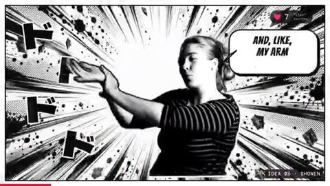</a><br><sub><b>谈话视频剪辑加字幕特效</b></sub></td>
    <td align="center" width="33%" valign="top"><a href="#c2103517930424332386">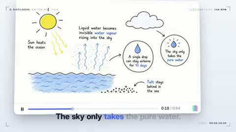</a><br><sub><b>Distilbook动态宣传片</b></sub></td>
    <td align="center" width="33%" valign="top"><a href="#c2103570879619686717">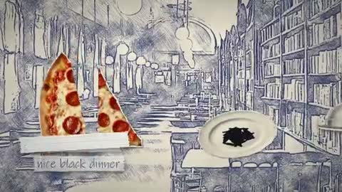</a><br><sub><b>恐怖披萨店完整音乐MV</b></sub></td>
  </tr>
  <tr>
    <td align="center" width="33%" valign="top"><a href="#c2103761658745335993">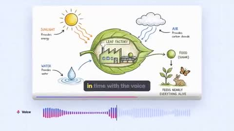</a><br><sub><b>产品动态图形宣传片</b></sub></td>
    <td align="center" width="33%" valign="top"><a href="#c2103103836541899031">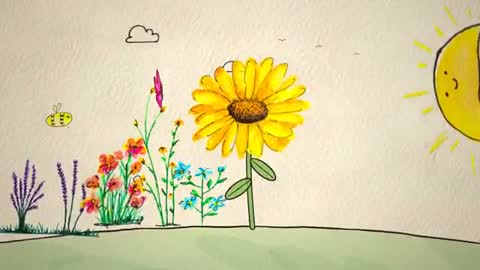</a><br><sub><b>手绘图像创意动画短片</b></sub></td>
    <td align="center" width="33%" valign="top"><a href="#c2103793821012345137">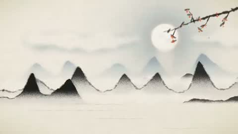</a><br><sub><b>中秋节传统故事动画</b></sub></td>
  </tr>
  <tr>
    <td align="center" width="33%" valign="top"><a href="#c2104144532644544921">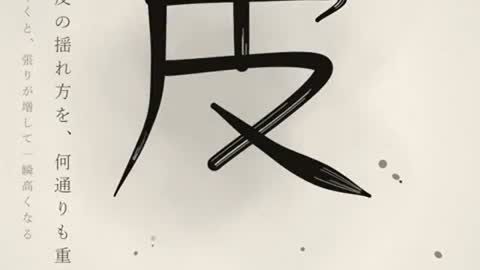</a><br><sub><b>物理演算乐器音效</b></sub></td>
    <td align="center" width="33%" valign="top"><a href="#c2103288413969621231">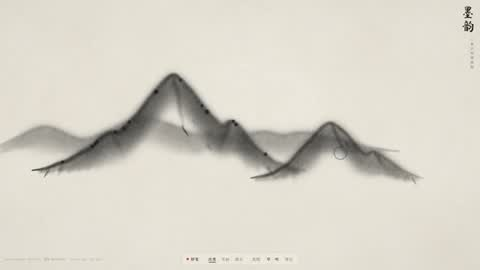</a><br><sub><b>Opus展示惊叹创作</b></sub></td>
    <td align="center" width="33%" valign="top"><a href="#c2102743212922384673">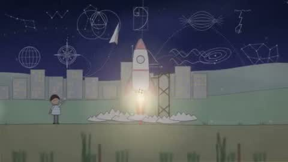</a><br><sub><b>人类文明到AI诞生动画</b></sub></td>
  </tr>
  <tr>
    <td align="center" width="33%" valign="top"><a href="#c2102867033100616097">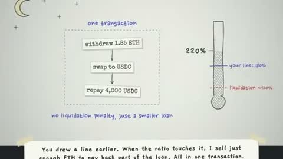</a><br><sub><b>DeFi储蓄手绘定格动画</b></sub></td>
    <td align="center" width="33%" valign="top"><a href="#c2103418429248069973">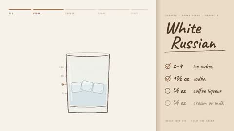</a><br><sub><b>白俄罗斯鸡尾酒调制动画</b></sub></td>
    <td align="center" width="33%" valign="top"><a href="#c2103667481139441895">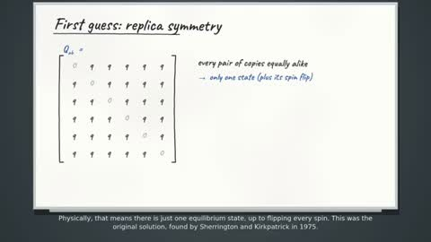</a><br><sub><b>SK模型副本对称破缺讲解</b></sub></td>
  </tr>
  <tr>
    <td align="center" width="33%" valign="top"><a href="#c2104070024575242622">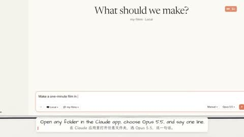</a><br><sub><b>白板教学创建视频</b></sub></td>
    <td align="center" width="33%" valign="top"><a href="#c2103206689755316718">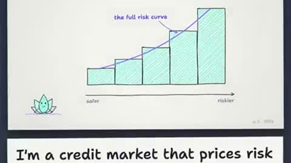</a><br><sub><b>手绘定格动画</b></sub></td>
    <td align="center" width="33%" valign="top"><a href="#c2103678647777230877">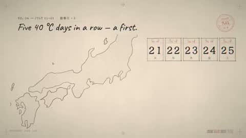</a><br><sub><b>2026年日本高温数据可视化</b></sub></td>
  </tr>
  <tr>
    <td align="center" width="33%" valign="top"><a href="#c2103486573476254201">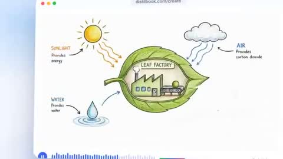</a><br><sub><b>Distilbook产品介绍</b></sub></td>
    <td align="center" width="33%" valign="top"><a href="#c2103146389412917572">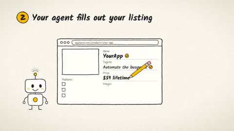</a><br><sub><b>AppSumo产品提交流程动画</b></sub></td>
    <td align="center" width="33%" valign="top"><a href="#c2103832142245708192">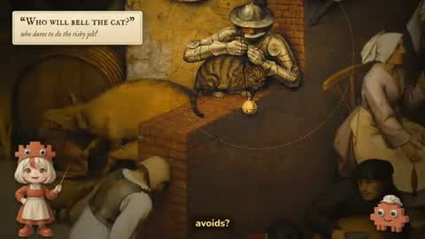</a><br><sub><b>勃鲁盖尔谚语画讲解</b></sub></td>
  </tr>
  <tr>
    <td align="center" width="33%" valign="top"><a href="#c2103985505302163640">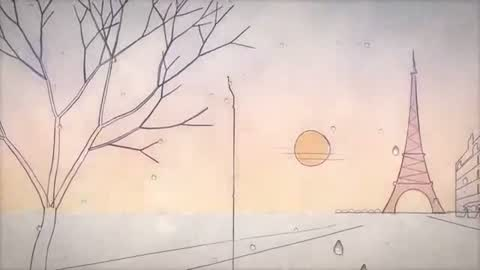</a><br><sub><b>一笔画动态音乐可视化</b></sub></td>
    <td align="center" width="33%" valign="top"><a href="#c2103516101518987439">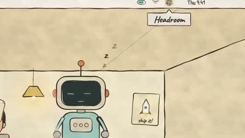</a><br><sub><b>AI自主制作解说视频</b></sub></td>
    <td align="center" width="33%" valign="top"><a href="#c2102885216692162993">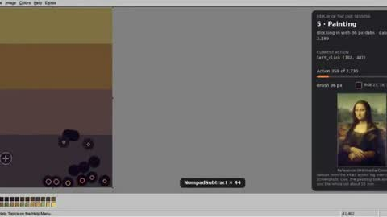</a><br><sub><b>JS画图复现蒙娜丽莎</b></sub></td>
  </tr>
  <tr>
    <td align="center" width="33%" valign="top"><a href="#c2104119716533178533">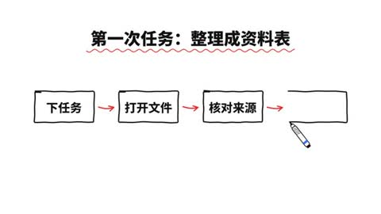</a><br><sub><b>AI文章省流讲解</b></sub></td>
  </tr>
</table>

---

<a id="c2103144778481475686"></a>

### 谈话视频剪辑加字幕特效

<a href="https://x.com/sab8a/status/2103144778481475686"></a>

```text
Cut a raw talking-head clip into a punchy, fun edit with subtitles, graphics and music
```

<sub>作者 @sab8a · <a href="https://x.com/sab8a/status/2103144778481475686">看原视频</a></sub>

---

<a id="c2103517930424332386"></a>

### Distilbook动态宣传片

<a href="https://x.com/itisRazak/status/2103517930424332386"></a>

```text
Research Distilbook.Make a dynamic 40-second motion graphics video on Distilbook that
shows what an incredible motion designer you are. like it's your showreel - Go all out.
```

<sub>作者 @itisRazak · <a href="https://x.com/itisRazak/status/2103517930424332386">看原视频</a></sub>

---

<a id="c2103570879619686717"></a>

### 恐怖披萨店完整音乐MV

<a href="https://x.com/ParanoidAmerica/status/2103570879619686717"></a>

```text
create a music video for this entire song, check lyrics.txt to sync the visuals to. style
should be a mix between monty-python/vox style "postcards in space" mixed with sketchy
ballpoint pen style visuals. this needs to look professional. theme of the video is a
creepy evil pizza parlor, camera starts outside and works through the inside, through a
secret bookshelf door into a basement with untold horrors and pizza sauce all over the
place. use whatever tools or methods you need to make this look professional. final export
should be an .mp4 of the entire music video.

claude/opus 5.5 detected comfyui on my system, generated all the assets with SDXL and then
composited and animated it all together.

Even if I had all of the art assets and timeline markers, this would have easily taken be
8-10+ hours in After Effects to do manually.

I might never open After Effects again.
```

<sub>作者 @ParanoidAmerica · <a href="https://x.com/ParanoidAmerica/status/2103570879619686717">看原视频</a></sub>

---

<a id="c2103761658745335993"></a>

### 产品动态图形宣传片

<a href="https://x.com/sudo_kiran/status/2103761658745335993"></a>

```text
create best motion graphics explainer of the (your product) with very good script and good
design colors and good music make sure the video should be incredible and people should
feels like watch it many times.. it has to be in 30 seconds good and very intresting, it
has to be best of the best of the best of the best video
(product link)
```

<sub>作者 @sudo_kiran · <a href="https://x.com/sudo_kiran/status/2103761658745335993">看原视频</a></sub>

---

<a id="c2103103836541899031"></a>

### 手绘图像创意动画短片

<a href="https://x.com/abderrahmen_g/status/2103103836541899031"></a>

```text
You are a professional videographer. Create me a high-definition, creative, playful, and
joyful video that you enjoy watching, that has sounds matching the frames using
JavaScript. Use as much as possible of the input images—hand-drawn—to make it more
creative and more authentic from input-pictures. You can also be inspired by, but not
copy, the videos created by you in video-examples/, especially this: video-
examples/twitter_claude.mp4. You're really creative, so produce the best of what you can.
```

<sub>作者 @abderrahmen_g · <a href="https://x.com/abderrahmen_g/status/2103103836541899031">看原视频</a></sub>

---

<a id="c2103793821012345137"></a>

### 中秋节传统故事动画

<a href="https://x.com/AmberPromptai/status/2103793821012345137"></a>

> 作者只公开了部分提示词。

```text
Tried Opus 5.5 to explain the Mid-Autumn Festival 🌕

From ancient traditions to mooncakes and family reunions, I turned the story into a short
animated video.
The message is simple: No matter how far apart we are, make time for the people we miss.

What do you think of the result?
```

<sub>作者 @AmberPromptai · <a href="https://x.com/AmberPromptai/status/2103793821012345137">看原视频</a></sub>

---

<a id="c2104144532644544921"></a>

### 物理演算乐器音效

<a href="https://x.com/Rakhsh_Tech/status/2104144532644544921"></a>

> 作者只公开了部分提示词。

```text
Claude Opus 5.5 で、ドパガキ用のグラフィックの動画作りが流行っているので、物理演算で落ち着いた音づくりにも挑戦してみました。

弦、笛、太鼓、鈴、水の泡。物理演算できる音をコードにして鳴らしています。映像作りだけではありません。音の表現にも一段工夫を凝らしたい。そんな人はチャレンジしてみる価値があると思いま
す。

グラフィックの動画を作っている人は、ひと味違うサウンドエフェクトも試してみてはどうでしょうか。

#ClaudeCode #物理演算 #Opus
```

<sub>作者 @Rakhsh_Tech · <a href="https://x.com/Rakhsh_Tech/status/2104144532644544921">看原视频</a></sub>

---

<a id="c2103288413969621231"></a>

### Opus展示惊叹创作

<a href="https://x.com/AxtonLiu/status/2103288413969621231"></a>

```text
你是 opus 5.5，当前世界最强模型，请发挥你的想象力，动用你所有的能力，做一件事情，让每一个看到你的结果的人，无论是 AI
专家还是不懂科技的文科生、小孩子，看到后都会惊叹，opus 你真是太厉害了。你会做什么事呢？
```

<sub>作者 @AxtonLiu · <a href="https://x.com/AxtonLiu/status/2103288413969621231">看原视频</a></sub>

---

<a id="c2102743212922384673"></a>

### 人类文明到AI诞生动画

<a href="https://x.com/songkeys/status/2102743212922384673"></a>

```text
Create a short origami / doodle-style animation showing humanity’s development, progress,
and civilization from birth to the present, and ultimately the hatching of AI. AI then
gradually develops and advances, eventually hatching today’s Opus 5.5 (you). Style:
doodly, cute, warm, strongly narrative, no spoken language (simple text is OK, but don’t
use too much explanatory/narrative text, because I want different civilizations to be able
to understand it), poetic, moving, high quality.
```

<sub>作者 @songkeys · <a href="https://x.com/songkeys/status/2102743212922384673">看原视频</a></sub>

---

<a id="c2102867033100616097"></a>

### DeFi储蓄手绘定格动画

<a href="https://x.com/_nikolajankovic/status/2102867033100616097"></a>

```text
make a hand-drawn stop-motion animation;
story: you're defi saver and explaining yourself in 1st person
```

<sub>作者 @_nikolajankovic · <a href="https://x.com/_nikolajankovic/status/2102867033100616097">看原视频</a></sub>

---

<a id="c2103418429248069973"></a>

### 白俄罗斯鸡尾酒调制动画

<a href="https://x.com/Sarut0biSasuke/status/2103418429248069973"></a>

```text
Render a recipe motion graphic animation using JavaScript or HTML (whatever you think will
produce the best result) to show the full recipe for a White Russian from start to finish,
empty glass to completed cocktail. Explainer video style, showing the ingredients and
measurements as they go into the glass. It should be a 30s video.
```

<sub>作者 @Sarut0biSasuke · <a href="https://x.com/Sarut0biSasuke/status/2103418429248069973">看原视频</a></sub>

---

<a id="c2103667481139441895"></a>

### SK模型副本对称破缺讲解

<a href="https://x.com/tak3sh8/status/2103667481139441895"></a>

```text
Do a quick hand-drawn whiteboard animations explaining what is replica symmetry breaking
in the SK model

Prompt 2: build the mp4 version with narration
```

<sub>作者 @tak3sh8 · <a href="https://x.com/tak3sh8/status/2103667481139441895">看原视频</a></sub>

---

<a id="c2104070024575242622"></a>

### 白板教学创建视频

<a href="https://x.com/lemomo_ai/status/2104070024575242622"></a>

```text
Create a tutorial video explaining how to create videos using Lemo-Opuscar skill (Opus
5.5) , in a [Whiteboard Explainer]
```

<sub>作者 @lemomo_ai · <a href="https://x.com/lemomo_ai/status/2104070024575242622">看原视频</a></sub>

---

<a id="c2103206689755316718"></a>

### 手绘定格动画

<a href="https://x.com/chavis_/status/2103206689755316718"></a>

```text
make a hand-drawn stop-motion animation;
story: you're @LotusFi_  and explaining yourself in 1st person
```

<sub>作者 @chavis_ · <a href="https://x.com/chavis_/status/2103206689755316718">看原视频</a></sub>

---

<a id="c2103678647777230877"></a>

### 2026年日本高温数据可视化

<a href="https://x.com/GroundControl/status/2103678647777230877"></a>

```text
All right, this is an empty repo. Make me a 3-minute animated visualization using
JavaScript, or you can do it in TypeScript if you want, about Japan's hot weather in 2026.
Pull some online data to see why it was hot and how it compares to other years. I really
want the animation to be visually appealing. I wanted to use a hand-drawn pencil style
with a little bit of tasteful chromatic aberration. And maybe a bit of a pastiche look but
it's supposed to look really, really cool. Also, use a JavaScript synthesizer to make a
melody for this visualization that goes along with the theme.
```

<sub>作者 @GroundControl · <a href="https://x.com/GroundControl/status/2103678647777230877">看原视频</a></sub>

---

<a id="c2103486573476254201"></a>

### Distilbook产品介绍

<a href="https://x.com/sudo_kiran/status/2103486573476254201"></a>

```text
make a dynamic 30-seconds motion graphic video about the distilbook like a product
explainer the video has to be very incredible
(product url)
```

<sub>作者 @sudo_kiran · <a href="https://x.com/sudo_kiran/status/2103486573476254201">看原视频</a></sub>

---

<a id="c2103146389412917572"></a>

### AppSumo产品提交流程动画

<a href="https://x.com/mattbean/status/2103146389412917572"></a>

```text
build me a 30s drawing style animated clip about submitting a product to AppSumo via your
agent.

steps are:
1. connect your agent
2. your agent fills out your listing and sets up redemption
3. go live!
```

<sub>作者 @mattbean · <a href="https://x.com/mattbean/status/2103146389412917572">看原视频</a></sub>

---

<a id="c2103832142245708192"></a>

### 勃鲁盖尔谚语画讲解

<a href="https://x.com/AdornCurates/status/2103832142245708192"></a>

```text
introduce Bruegel's Netherlandish Proverbs to high schoolers. You're on your own.
```

<sub>作者 @AdornCurates · <a href="https://x.com/AdornCurates/status/2103832142245708192">看原视频</a></sub>

---

<a id="c2103985505302163640"></a>

### 一笔画动态音乐可视化

<a href="https://x.com/dan_riverbendai/status/2103985505302163640"></a>

```text
Minimalistic, simple one line sketch building everything in real time with the musical
score ("Pétales Givrés") I gave you.

Use gentle pastels with an old school film quality to it, realistic 3D raindrops fall on
the
```

<sub>作者 @dan_riverbendai · <a href="https://x.com/dan_riverbendai/status/2103985505302163640">看原视频</a></sub>

---

<a id="c2103516101518987439"></a>

### AI自主制作解说视频

<a href="https://x.com/garmdotcom/status/2103516101518987439"></a>

> 作者只公开了部分提示词。

```text
Tried to jump on the explainer video "made entirely with Opus 5.5" bandwagon.

Accidentally didn't include an OpenRouter API key.

Opus decided to just do everything itself.

The result is insane

$0 additional cost.

Prompt in next post
```

<sub>作者 @garmdotcom · <a href="https://x.com/garmdotcom/status/2103516101518987439">看原视频</a></sub>

---

<a id="c2102885216692162993"></a>

### JS画图复现蒙娜丽莎

<a href="https://x.com/ehsanik/status/2102885216692162993"></a>

```text
can you search for the picture of Mona Lisa, then replicate it using mouse movement and
brushes in JS paint using chrome?

Follow-up:
Ok now can you make a video of exactly what you just did? Showing every mouse movement and
changes?
```

<sub>作者 @ehsanik · <a href="https://x.com/ehsanik/status/2102885216692162993">看原视频</a></sub>

---

<a id="c2104119716533178533"></a>

### AI文章省流讲解

<a href="https://x.com/0xlangeai/status/2104119716533178533"></a>

> 作者只公开了部分提示词。

```text
Opus 5.5 做的文章讲解,  省流
```

<sub>作者 @0xlangeai · <a href="https://x.com/0xlangeai/status/2104119716533178533">看原视频</a></sub>
