# Low-poly & voxel · 32

Low-poly, voxel blocks, toy-like isometric scenes.

[← Back to the atlas](../README.md)

## Style recipe

Paste this after your own prompt to lock the look:

```text
Style: low-poly / voxel. Faceted flat-shaded geometry (or cubes), isometric or high three-
quarter camera, pastel palette with one saturated accent, soft ambient occlusion, objects
bounce and pop in with overshoot.
```

## Examples

<table>
  <tr>
    <td align="center" width="33%" valign="top"><a href="#c2103128800909197521"></a><br><sub><b>Top-down arcade racing game</b></sub></td>
    <td align="center" width="33%" valign="top"><a href="#c2103638831669076027"></a><br><sub><b>Motion showreel thanking 100 users</b></sub></td>
    <td align="center" width="33%" valign="top"><a href="#c2103786742520184909"></a><br><sub><b>Motion Designer Showreel Animation</b></sub></td>
  </tr>
  <tr>
    <td align="center" width="33%" valign="top"><a href="#c2103530789510283635">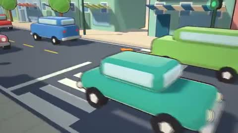</a><br><sub><b>Three.js Claude Code single prompt</b></sub></td>
    <td align="center" width="33%" valign="top"><a href="#c2103876982819954689">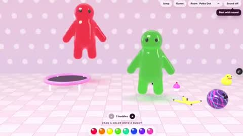</a><br><sub><b>Jello Jiggle Buddies Browser Game</b></sub></td>
    <td align="center" width="33%" valign="top"><a href="#c2104046743751139812">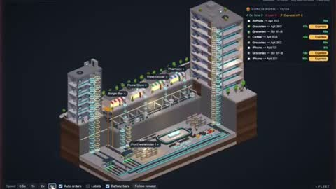</a><br><sub><b>Underground Delivery Network Game</b></sub></td>
  </tr>
  <tr>
    <td align="center" width="33%" valign="top"><a href="#c2102919394775220530">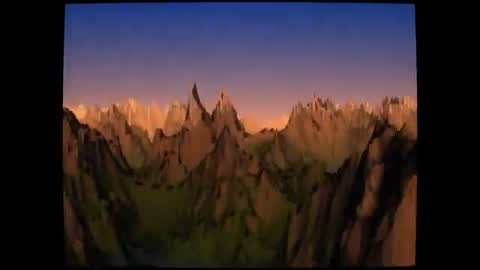</a><br><sub><b>90s Demoscene Demo</b></sub></td>
    <td align="center" width="33%" valign="top"><a href="#c2102543638689460488">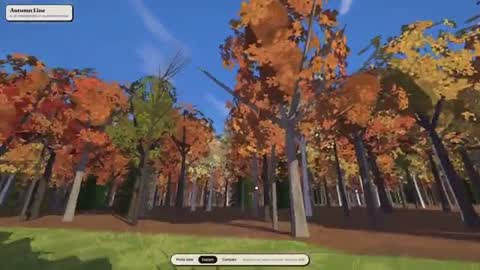</a><br><sub><b>Cel-shaded 3D scene recreation</b></sub></td>
    <td align="center" width="33%" valign="top"><a href="#c2103538744695693512">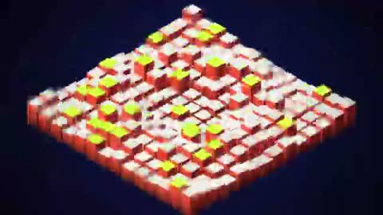</a><br><sub><b>Motion Showreel With Synthesized Music</b></sub></td>
  </tr>
  <tr>
    <td align="center" width="33%" valign="top"><a href="#c2103098774738628780">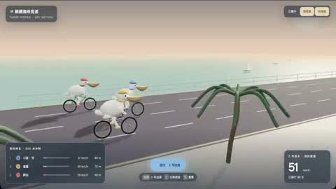</a><br><sub><b>Pelican bike race game</b></sub></td>
    <td align="center" width="33%" valign="top"><a href="#c2102861939072434495">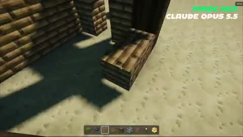</a><br><sub><b>Browser Minecraft Advanced Shaders</b></sub></td>
    <td align="center" width="33%" valign="top"><a href="#c2103846630088716687">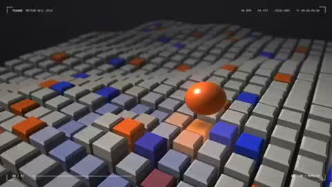</a><br><sub><b>Polished 15-Second Motion Design</b></sub></td>
  </tr>
  <tr>
    <td align="center" width="33%" valign="top"><a href="#c2103776623548158453">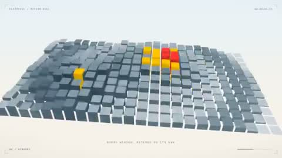</a><br><sub><b>FlexPrice Brand Motion Reel</b></sub></td>
    <td align="center" width="33%" valign="top"><a href="#c2103483174957597035">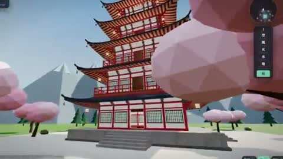</a><br><sub><b>3D Pagoda Navigation Explorer</b></sub></td>
    <td align="center" width="33%" valign="top"><a href="#c2103083781490176212">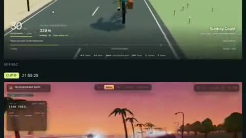</a><br><sub><b>Pelican cycling seaside game</b></sub></td>
  </tr>
  <tr>
    <td align="center" width="33%" valign="top"><a href="#c2102739444256383089">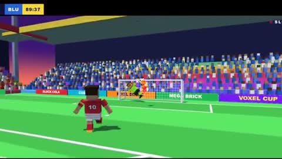</a><br><sub><b>Voxel soccer goal animation</b></sub></td>
    <td align="center" width="33%" valign="top"><a href="#c2103708392930066575">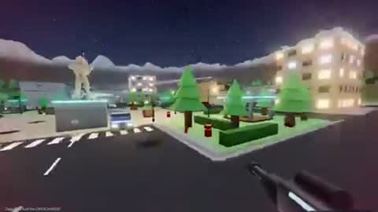</a><br><sub><b>Multiplayer Proximity Chat Destruction Shooter</b></sub></td>
    <td align="center" width="33%" valign="top"><a href="#c2103867115044237752">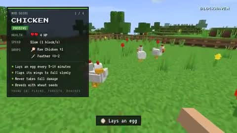</a><br><sub><b>Minecraft Mobs Showcase</b></sub></td>
  </tr>
  <tr>
    <td align="center" width="33%" valign="top"><a href="#c2102889901297426722">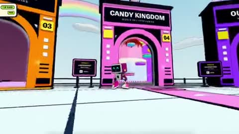</a><br><sub><b>Multiplayer Portal Game Demo</b></sub></td>
    <td align="center" width="33%" valign="top"><a href="#c2104222017696469188">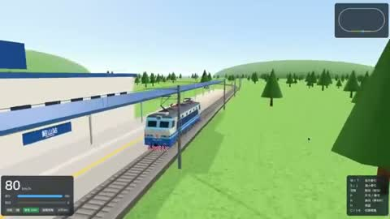</a><br><sub><b>3D Shaoshan Train Simulator</b></sub></td>
    <td align="center" width="33%" valign="top"><a href="#c2104140498344800659">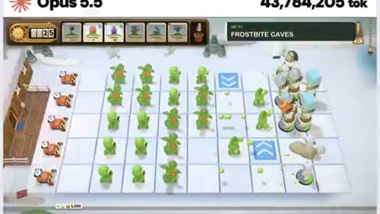</a><br><sub><b>AI Builds 3D PvZ Game</b></sub></td>
  </tr>
  <tr>
    <td align="center" width="33%" valign="top"><a href="#c2104154307071475858">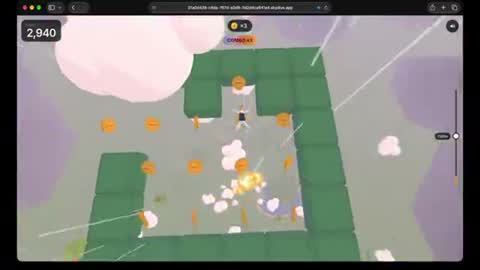</a><br><sub><b>Skydiving Game Built with AI</b></sub></td>
    <td align="center" width="33%" valign="top"><a href="#c2104209760388006126">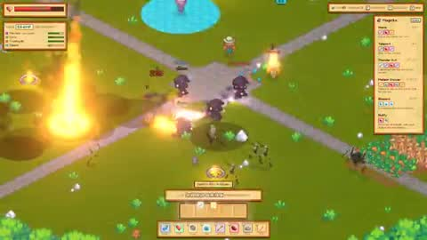</a><br><sub><b>Magicka Inspired Extraction Looter</b></sub></td>
    <td align="center" width="33%" valign="top"><a href="#c2104193522715029657">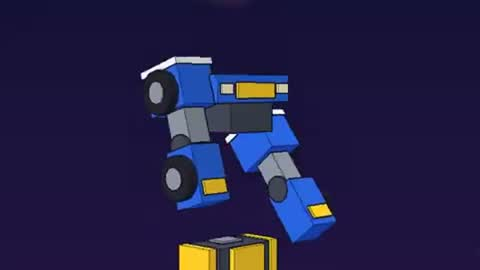</a><br><sub><b>Robot Transformation Combination 3D Animation</b></sub></td>
  </tr>
  <tr>
    <td align="center" width="33%" valign="top"><a href="#c2104102479927620029"></a><br><sub><b>3D Pixel City AI News Visualization</b></sub></td>
    <td align="center" width="33%" valign="top"><a href="#c2103938972426834106">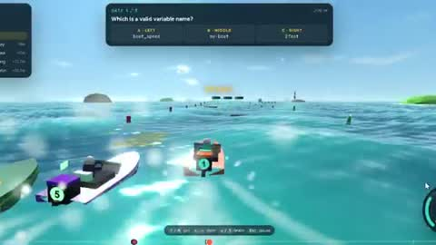</a><br><sub><b>Python Learning Surfing Game Demo</b></sub></td>
    <td align="center" width="33%" valign="top"><a href="#c2104046074600272056">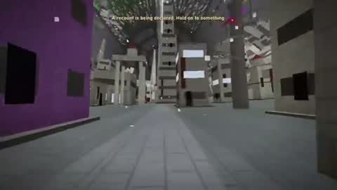</a><br><sub><b>Infinite Space Colony Procedural Game</b></sub></td>
  </tr>
  <tr>
    <td align="center" width="33%" valign="top"><a href="#c2103532793406149036">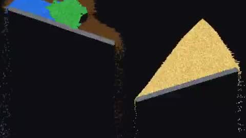</a><br><sub><b>HTML Particle Physics Engine</b></sub></td>
    <td align="center" width="33%" valign="top"><a href="#c2104059393222557760">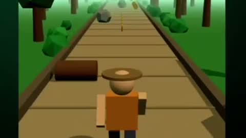</a><br><sub><b>AI Built Temple Run Game</b></sub></td>
    <td align="center" width="33%" valign="top"><a href="#c2103751290954379361">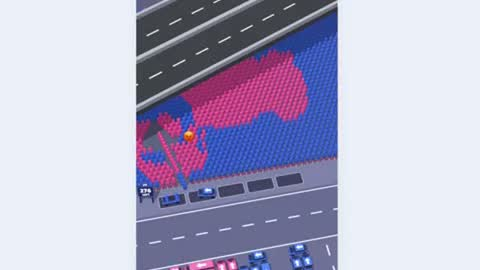</a><br><sub><b>AI Generated Car Racing Game</b></sub></td>
  </tr>
  <tr>
    <td align="center" width="33%" valign="top"><a href="#c2103714595659772215">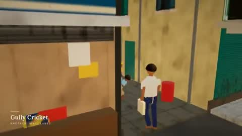</a><br><sub><b>Code Built Mumbai Game Walkthrough</b></sub></td>
    <td align="center" width="33%" valign="top"><a href="#c2103822946800165270">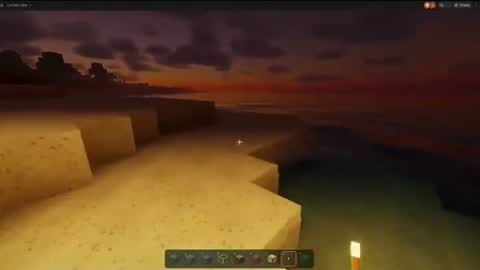</a><br><sub><b>AI Builds Minecraft in Browser</b></sub></td>
  </tr>
</table>

---

<a id="c2103128800909197521"></a>

### Top-down arcade racing game

<a href="https://x.com/_nieGRAMotny_/status/2103128800909197521"></a>

```text
Build a racing game inspired by Ignition (1997): angled top-down camera, arcade-leaning
physics, vehicles with very distinct personalities. This must be an original game,
not a copy. Use an original name, an original track, and zero original assets.

## Stack
- Vite + TypeScript (strict), Three.js for rendering, no UI framework
  (HUD in plain DOM/CSS).
- Low-poly graphics generated in code (BoxGeometry, CylinderGeometry, etc.),
  no external models or textures. Solid colors and simple materials.
- Custom simplified 2.5D physics (movement on the XZ plane, height from terrain).
  No physics engine.

## Architecture
- src/game/ (game loop with fixed timestep), src/vehicles/, src/track/, src/ai/,
  src/render/, src/ui/
- Vehicles are data-driven: mass, power, top speed, grip, steering, collision
  resistance, and boost parameters (strength, duration, recharge time).
  One Vehicle class, different configurations.
- Any vehicle can be controlled by either the player or the AI
  (shared control interface: throttle, brake, steer, boost).
- Track as data: centerline spline + width + list of zones
  (ice, shortcut, obstacle). Generate the road mesh and AI waypoints from it.

## Vehicles (original names, no brands)
Four vehicles. The player picks one on the selection screen; the remaining 3
are driven by the AI.
- 90s-style police sedan (black and white, light bar): heavy, stable,
  pushes hard in collisions.
- Muscle car convertible: fastest on straights, oversteers in corners.
- Red monster truck: slow, but ignores bumps and rams everything else.
- Postal delivery van: slow, high center of gravity, sways in corners.
The handling differences must be clearly noticeable. All four must be playable
and competitive. Slower vehicles compensate with e.g. collision resistance,
terrain handling, or a stronger or more frequent boost.

## Boost
- Every vehicle has a boost: a short, pronounced acceleration beyond its
  normal top speed.
- Boost charges automatically from 0 to 100%. It can only be used at 100%.
  After use, the meter drops to 0 and starts charging again.
- Strength, duration and recharge time are unique to each vehicle
  (e.g. muscle car: short and very strong; van: weaker but recharges fast;
  monster truck: long but slow to recharge).
- Visual effect while boosting: exhaust flame or trail, slight camera
  pull-back.
- The AI also uses boost, sensibly: on straights, not before sharp corners
  or on ice.

## Track
A mountain town with a Canadian feel, winter turning into spring thaw:
- closed loop, roughly 60–90 seconds per lap
- a waterfall visible from the track and a wooden bridge over a river
- a railroad crossing with a train passing periodically
  (collision = strong knockback, not game over)
- ice patches with reduced grip
- one shortcut (tight, risky); decorations: spruce trees, wooden houses, snow
- barriers or natural obstacles so vehicles can't get stuck off the track.
  Failsafe: if a vehicle (including bots) is stuck for more than ~4 s,
  automatically return it to the track at the last checkpoint.

## Gameplay
- 3 laps, standing grid start, 3-2-1 countdown
- AI follows waypoints with a driving style that depends on the vehicle,
  light rubber-banding, avoids obstacles, no teleporting (except the
  failsafe track return described above)
- Sliding comes purely from physics (grip, speed, ice), no handbrake
- Camera: top-down at ~50°, follows the player with a slight look-ahead
  in the direction of travel
- Controls: arrows/WASD (throttle, brake/reverse, steering), space = boost
- Screens: start → vehicle selection (model preview + stat bars, including
  boost) → race → results → restart (with option to change vehicle)

## HUD
- Position, lap, lap time, best lap, minimap.
- Boost meter styled as a car battery: rectangular casing with two terminals
  (+/−) on top, fill level rises as it charges. Color shifts from red through
  yellow to green. At 100% the battery clearly signals readiness (pulsing or
  glow, "BOOST" label or lightning bolt icon). While boosting, the meter
  drains quickly.

## Out of scope for v1
Sound, options menu, multiple tracks, multiplayer, save state.

## Workflow
1. First propose a plan and file structure, then implement in stages:
   (a) game loop + one vehicle on a flat plane, including boost,
   (b) track, (c) remaining vehicles and AI, (d) obstacles and train,
   (e) vehicle selection, HUD with battery meter, and screens.
2. After each stage run `npm run build` and fix type errors.
3. Add unit tests (Vitest) for vehicle physics, boost logic (charging,
   lockout below 100%, reset after use), and lap/position logic.
4. Finally: a README describing the controls and how to add a new track
   or vehicle.

## Acceptance criteria
`npm install && npm run dev` launches the game. You can pick any of the 4
vehicles and complete 3 laps against 3 bots. Each vehicle handles differently
and has a noticeably different boost. Boost only works with a full battery,
and bots use it too. The train and ice work. Results show the correct order.
Stable 60 FPS on an average laptop.
```

<sub>By @_nieGRAMotny_ · <a href="https://x.com/_nieGRAMotny_/status/2103128800909197521">Watch the original</a></sub>

---

<a id="c2103638831669076027"></a>

### Motion showreel thanking 100 users

<a href="https://x.com/Sudiyasa_/status/2103638831669076027"></a>

```text
make a dynamic 15-second motion graphics video that shows what an incredible motion
designer you are, like it's your showreel for a résumé. go all out  do this to thank the
first 100 users of
@eyezonbot
```

<sub>By @Sudiyasa_ · <a href="https://x.com/Sudiyasa_/status/2103638831669076027">Watch the original</a></sub>

---

<a id="c2103786742520184909"></a>

### Motion Designer Showreel Animation

<a href="https://x.com/levabashidze/status/2103786742520184909"></a>

```text
make a dynamic 15-second motion graphics video that shows what an incredible motion
designer you are, like it's your showreel for a résumé. go all out. dont ask just make
```

<sub>By @levabashidze · <a href="https://x.com/levabashidze/status/2103786742520184909">Watch the original</a></sub>

---

<a id="c2103530789510283635"></a>

### Three.js Claude Code single prompt

<a href="https://x.com/wzarok/status/2103530789510283635"></a>

> The creator shared only part of the prompt.

```text
threejs (@threejs) + Claude Code Opus 5.5
tek prompt ve çıktı
```

<sub>By @wzarok · <a href="https://x.com/wzarok/status/2103530789510283635">Watch the original</a></sub>

---

<a id="c2103876982819954689"></a>

### Jello Jiggle Buddies Browser Game

<a href="https://x.com/angie_carel/status/2103876982819954689"></a>

> The creator shared only part of the prompt.

```text
In a deeply serious, highly mature effort to test Opus 5.5's ability to render jello-like
textures—reflections, transparency, jiggly movement, the works—I accidentally built a
"Jiggle Buddies" game that my son played the entire drive home.
Link to play: https://www.angiecarel.com/jiggle-buddies
```

<sub>By @angie_carel · <a href="https://x.com/angie_carel/status/2103876982819954689">Watch the original</a></sub>

---

<a id="c2104046743751139812"></a>

### Underground Delivery Network Game

<a href="https://x.com/lisp_mi/status/2104046743751139812"></a>

> The creator shared only part of the prompt.

```text
I asked Opus 5.5 to build a tiny underground delivery network in three.js — then turned it
into a game.
Lunch rush: 24 orders in 60 s, 6 express upgrades, beat the deadlines.
Free in the browser, link below 👇
```

<sub>By @lisp_mi · <a href="https://x.com/lisp_mi/status/2104046743751139812">Watch the original</a></sub>

---

<a id="c2102919394775220530"></a>

### 90s Demoscene Demo

<a href="https://x.com/gandamu_ml/status/2102919394775220530"></a>

```text
I would like you to create a kickass, impressive 1990s style demoscene demo using this S3M
track as the music. Prior to getting to work, please see how to best play and analyze the
S3M track. This will be important since synchronization of effects and appropriateness of
scenes to the musical vibe (and this song does have a variety of sections with different
attitude) is essential to a great demoscene demo. Also prior to getting started, please
research what kinds of effects, physics, etc. would be good to use in combination. Please
use C/C++ -- with appropriate demoscene/embedded/console gamedev sensibilities to avoid
needlessly bloating compile times -- with OpenGL. In some cases, blitting to surfaces in
realtime may be appropriate.. while in others, using OpenGL or even shaders is appropriate
as well. It should be planned and polished to be spectacular and shocking. This is
Claude's way of really showing off to the world that it kicks ass.
```

<sub>By @gandamu_ml · <a href="https://x.com/gandamu_ml/status/2102919394775220530">Watch the original</a></sub>

---

<a id="c2102543638689460488"></a>

### Cel-shaded 3D scene recreation

<a href="https://x.com/ishuagra02/status/2102543638689460488"></a>

```text
create a highly detailed 3D scenery that faithfully captures this photo in a cel-shaded
cartoon art style
```

<sub>By @ishuagra02 · <a href="https://x.com/ishuagra02/status/2102543638689460488">Watch the original</a></sub>

---

<a id="c2103538744695693512"></a>

### Motion Showreel With Synthesized Music

<a href="https://x.com/prasenx/status/2103538744695693512"></a>

```text
make a dynamic 15-second motion graphics video that shows what an incredible motion
designer you are, like it's your showreel for a résumé. go all out.

compose the soundtrack yourself, fully synthesized in code. no samples, no audio files, no
VST instruments. every cut and transition must land on the beat.

1920x1080, 60fps. render the final video with the music mixed in as an MP4 and tell me
where it's saved.
```

<sub>By @prasenx · <a href="https://x.com/prasenx/status/2103538744695693512">Watch the original</a></sub>

---

<a id="c2103098774738628780"></a>

### Pelican bike race game

<a href="https://x.com/goan999999/status/2103098774738628780"></a>

```text
三只鹈鹕沿着海岸比赛，每条赛道有虚线，我控制其中一只，按空格加速，还要支持侧视角和后视角
```

<sub>By @goan999999 · <a href="https://x.com/goan999999/status/2103098774738628780">Watch the original</a></sub>

---

<a id="c2102861939072434495"></a>

### Browser Minecraft Advanced Shaders

<a href="https://x.com/Viggle_PINOC/status/2102861939072434495"></a>

```text
Create a playable version of Minecraft in my browser. Add advanced shaders that make it
look as real and beautiful as possible.

World: vanilla ES modules + three.js (importmap from jsdelivr, no build step). Procedural
voxel terrain with trees, beaches and water. Make it look as real and beautiful as
possible: physically based sky, clouds, soft shadows, water reflections and caustics, god
rays, bloom, PBR block textures. First/third-person player (V toggles), mining and placing
blocks, torches, stairs, a hotbar and an inventory (E), a day/night cycle with nights that
are still readable.

Characters: keep the look pixel-art blocky Minecraft people (box head/body/arms/legs), but
animate them with PINOC MCP. Use PINOC only for motions: download the skinned-glb format
(Mixamo skeleton) and bake each clip onto the six blocky parts (limbs follow
shoulder→wrist and hip→ankle, torso follows the spine, head copies the head bone). Strip
the bundled X Bot mesh from every GLB so they stay small, strip root motion so walks play
in place, turn every clip so the hips face forward on frame 1, and trim clips that don't
loop cleanly to a matching span.

Motions: check the free PINOC motion library first. Only generate a motion when the
library has nothing that fits, and tell me the credit cost before generating. For every
generation, compare the 4 samples and keep the one with the cleanest loop.

Opening scene: a small village on the flattest open ground in view of spawn, with the
player facing it. Each villager has a job, and each job uses a different motion: - a
greeter that wanders and waves when it sees you - a miner, a lumberjack at a real tree and
a farmer on a tilled dirt patch, each swinging a blocky tool; every strike chips particles
off the block it hits - an archer with a bow that shoots arrows into a target on the
release frame - a guard who draws a sword when you get close and faces you - a porter who
carries crates between two piles, one at a time No floating labels over the NPCs.
```

<sub>By @Viggle_PINOC · <a href="https://x.com/Viggle_PINOC/status/2102861939072434495">Watch the original</a></sub>

---

<a id="c2103846630088716687"></a>

### Polished 15-Second Motion Design

<a href="https://x.com/Dannnnnok/status/2103846630088716687"></a>

```text
I’m curious to see how strong you are as a motion designer. To prove it, create a polished
15-second animated graphic video that showcases your motion design skills. This piece will
be presented to 10,000 people on X, so make it visually compelling, professional, and
memorable. Take full creative freedom and make the strongest result you can
```

<sub>By @Dannnnnok · <a href="https://x.com/Dannnnnok/status/2103846630088716687">Watch the original</a></sub>

---

<a id="c2103776623548158453"></a>

### FlexPrice Brand Motion Reel

<a href="https://x.com/sudeepsd_/status/2103776623548158453"></a>

```text
make a dynamic 15-second motion graphics video of what you know about
@tryflexprice
 that shows what an incredible motion designer you are, like it's your showreel for a
résumé. go all out.
```

<sub>By @sudeepsd_ · <a href="https://x.com/sudeepsd_/status/2103776623548158453">Watch the original</a></sub>

---

<a id="c2103483174957597035"></a>

### 3D Pagoda Navigation Explorer

<a href="https://x.com/BuildFastWithAI/status/2103483174957597035"></a>

```text
Implement code to be able to navigate in a pagoda in 3D.
```

<sub>By @BuildFastWithAI · <a href="https://x.com/BuildFastWithAI/status/2103483174957597035">Watch the original</a></sub>

---

<a id="c2103083781490176212"></a>

### Pelican cycling seaside game

<a href="https://x.com/code_hiyouga/status/2103083781490176212"></a>

```text
Build a real-time 3D game where a pelican cycles through a living seaside world, complete
with physics, waves,
```

<sub>By @code_hiyouga · <a href="https://x.com/code_hiyouga/status/2103083781490176212">Watch the original</a></sub>

---

<a id="c2102739444256383089"></a>

### Voxel soccer goal animation

<a href="https://x.com/AGI_FromWalmart/status/2102739444256383089"></a>

```text
Create a single HTML file with Three.js (CDN) for a simple voxel-style soccer animation. A
blocky player dribbles past 2 defenders and scores a spectacular goal with celebration
particles. Colorful stadium look. Output ONLY the full HTML code.
```

<sub>By @AGI_FromWalmart · <a href="https://x.com/AGI_FromWalmart/status/2102739444256383089">Watch the original</a></sub>

---

<a id="c2103708392930066575"></a>

### Multiplayer Proximity Chat Destruction Shooter

<a href="https://x.com/Ved_CJ/status/2103708392930066575"></a>

```text
I want multiplayer game, with proximity chat, with destructurable environment, that
players will enjoy, shooting game
```

<sub>By @Ved_CJ · <a href="https://x.com/Ved_CJ/status/2103708392930066575">Watch the original</a></sub>

---

<a id="c2103867115044237752"></a>

### Minecraft Mobs Showcase

<a href="https://x.com/kepochnik/status/2103867115044237752"></a>

> The creator shared only part of the prompt.

```text
I built Minecraft thanks to Opus 5.5 ( part 2 )

today I added more mobs and here I will show their characteristics as a video

the process took probably : 2-3 hours

next week I'm going to publish this game for everyone

turn notifications
```

<sub>By @kepochnik · <a href="https://x.com/kepochnik/status/2103867115044237752">Watch the original</a></sub>

---

<a id="c2102889901297426722"></a>

### Multiplayer Portal Game Demo

<a href="https://x.com/chukinice/status/2102889901297426722"></a>

> The creator shared only part of the prompt.

```text
I updated my game Higher on @spawn with Opus 5.5 and Savi with just only one prompt

This is the result. Multiplayer game with portals to different worlds

Play here: https://www.spawn.co/@chucky/higher/play
```

<sub>By @chukinice · <a href="https://x.com/chukinice/status/2102889901297426722">Watch the original</a></sub>

---

<a id="c2104222017696469188"></a>

### 3D Shaoshan Train Simulator

<a href="https://x.com/akokoi1/status/2104222017696469188"></a>

> The creator shared only part of the prompt.

```text
太离谱了，一共3步，Opus 5.5给我整了个“模拟火车”出来。

1. 让ChatGPT生成韶山8各个视角的图；
2. 让Opus做一个3D资产，100%还原这张图；
3. 做一个环形铁路，可以操作这辆车行驶。
```

<sub>By @akokoi1 · <a href="https://x.com/akokoi1/status/2104222017696469188">Watch the original</a></sub>

---

<a id="c2104140498344800659"></a>

### AI Builds 3D PvZ Game

<a href="https://x.com/HelloVyom/status/2104140498344800659"></a>

> The creator shared only part of the prompt.

```text
Opus 5.5 spent 43 million output tokens building 3D PvZ 2: Reflourished
```

<sub>By @HelloVyom · <a href="https://x.com/HelloVyom/status/2104140498344800659">Watch the original</a></sub>

---

<a id="c2104154307071475858"></a>

### Skydiving Game Built with AI

<a href="https://x.com/RealFedeURU/status/2104154307071475858"></a>

> The creator shared only part of the prompt.

```text
Skydiving game built with opus 5.5🪂
```

<sub>By @RealFedeURU · <a href="https://x.com/RealFedeURU/status/2104154307071475858">Watch the original</a></sub>

---

<a id="c2104209760388006126"></a>

### Magicka Inspired Extraction Looter

<a href="https://x.com/tonnusos/status/2104209760388006126"></a>

> The creator shared only part of the prompt.

```text
Testing out Opus 5.5 today by letting it work on a Magicka-inspired game! I loved this
game when it came out 15 years ago, super cool spell casting mechanics.

So I want to take this and turn it into an extraction looter. You go out into the wild
solo or in a group, fight off mobs and other players to collect loot to bring back to your
base.

Like others have mentioned, Opus 5.5 feels so much more creative. Crazy
```

<sub>By @tonnusos · <a href="https://x.com/tonnusos/status/2104209760388006126">Watch the original</a></sub>

---

<a id="c2104193522715029657"></a>

### Robot Transformation Combination 3D Animation

<a href="https://x.com/allforbigfire/status/2104193522715029657"></a>

> The creator shared only part of the prompt.

```text
「もしかしてロボットアニメみたいな3機の乗り物が変形合体してロボットになるシーンもアニメ風3D CGで作れますか。」ってClaude Opus
5.5に聞きました。モデリング、陰影、輪郭線、BGM、効果音まで、全部Python 1ファイル（約1000行）のコードで生成したそうです。 #Claude #動画生成
```

<sub>By @allforbigfire · <a href="https://x.com/allforbigfire/status/2104193522715029657">Watch the original</a></sub>

---

<a id="c2104102479927620029"></a>

### 3D Pixel City AI News Visualization

<a href="https://x.com/sanjay_khadka07/status/2104102479927620029"></a>

> The creator shared only part of the prompt.

```text
Latentown just went 3D 🏙️

The pixel town grew into a living city of AI news. Every story is a building, every lab
has a tower, and couriers carry the day's news across the river.

Built over a weekend with Claude Code + Opus 5.5 and three.js.

https://latentown.lol
```

<sub>By @sanjay_khadka07 · <a href="https://x.com/sanjay_khadka07/status/2104102479927620029">Watch the original</a></sub>

---

<a id="c2103938972426834106"></a>

### Python Learning Surfing Game Demo

<a href="https://x.com/deeprajO1/status/2103938972426834106"></a>

> The creator shared only part of the prompt.

```text
What if learning Python felt more like playing a game than studying? 🎮🐍

So I asked Claude Opus 5.5 to build me a Python-learning surfing game.

And the result is pretty wild. 🌊
```

<sub>By @deeprajO1 · <a href="https://x.com/deeprajO1/status/2103938972426834106">Watch the original</a></sub>

---

<a id="c2104046074600272056"></a>

### Infinite Space Colony Procedural Game

<a href="https://x.com/smallhusk/status/2104046074600272056"></a>

> The creator shared only part of the prompt.

```text
A procedurally-generated game in infinite stranded space colonies with realistic physics.
All creative decisions made by @claudeai Opus 5.5, all done in just one week's usage
window at Pro-level. Claude chose to add pettable cats in the combat-free mode.
https://claude.ai/artifact/1o1DWNgoanSy2ZCRTCtjpq
```

<sub>By @smallhusk · <a href="https://x.com/smallhusk/status/2104046074600272056">Watch the original</a></sub>

---

<a id="c2103532793406149036"></a>

### HTML Particle Physics Engine

<a href="https://x.com/cyrilXBT/status/2103532793406149036"></a>

> The creator shared only part of the prompt.

```text
🚨 Opus 5.5 is the best model launch in 2026

this entire physics engine is one HTML file.

sand, water, oil, fire, lava, plants, steam.

108,000 particles at 60fps.

built with Opus 5.5.

prompt in the replies 👇

follow @cyrilXBT
```

<sub>By @cyrilXBT · <a href="https://x.com/cyrilXBT/status/2103532793406149036">Watch the original</a></sub>

---

<a id="c2104059393222557760"></a>

### AI Built Temple Run Game

<a href="https://x.com/itsjdraven/status/2104059393222557760"></a>

> The creator shared only part of the prompt.

```text
Claude Opus 5.5 just built me a mini temple run style game

it actually feel pretty smooth to play

honestly I didn’t expect the result like this
```

<sub>By @itsjdraven · <a href="https://x.com/itsjdraven/status/2104059393222557760">Watch the original</a></sub>

---

<a id="c2103751290954379361"></a>

### AI Generated Car Racing Game

<a href="https://x.com/janlaywss/status/2103751290954379361"></a>

> The creator shared only part of the prompt.

```text
被Claude Opus 5.5生成的游戏效果彻底瘫坐了。。。。只消耗了Pro套餐5h限额的19%，连续运行1h45m就能获得这么高的完整度。。。。。瘫坐中。。。。
游戏地址：https://move-car-kappa.vercel.app/
```

<sub>By @janlaywss · <a href="https://x.com/janlaywss/status/2103751290954379361">Watch the original</a></sub>

---

<a id="c2103714595659772215"></a>

### Code Built Mumbai Game Walkthrough

<a href="https://x.com/CurieuxExplorer/status/2103714595659772215"></a>

> The creator shared only part of the prompt.

```text
This is Dope!
Claude Opus 5.5 is on fire 🔥

One prompt → a 30s video-game walk through Mumbai, built entirely in code.

No AI video. No 3D assets. No stock audio.
1,850 lines. 900 frames. 30+ sounds from pure math.

Every pigeon, puddle and kaali-peeli, made by code.
Mumbai, compiled. 🇮🇳
```

<sub>By @CurieuxExplorer · <a href="https://x.com/CurieuxExplorer/status/2103714595659772215">Watch the original</a></sub>

---

<a id="c2103822946800165270"></a>

### AI Builds Minecraft in Browser

<a href="https://x.com/dreyk0o0/status/2103822946800165270"></a>

> The creator shared only part of the prompt.

```text
Claude Opus 5.5 just built Minecraft.

In the browser. From a single prompt.

Noah Wachnick asked it to recreate Minecraft with advanced shaders, "as realistic as
possible."

1 hour 37 minutes at max effort:

> block placement
> terrain
> realistic lighting and shaders

Here's a prompt to try it yourself. Bookmark this for later

"Build a Minecraft-style voxel game in a single HTML file that runs in the browser.
- First-person controls: WASD, mouse look, jump
- Procedural terrain with hills, water and trees
- Place and break blocks with the mouse, 5 block types
- Advanced shaders: moving sun, soft shadows, ambient occlusion, fog, water reflections
- Smooth 60 fps on a laptop
Use Three.js from a CDN. Test it, fix every bug, then keep improving the visuals until it
looks as realistic as possible."

Tips:
1. Set effort to max
2. Give it time, the original run took ~1.5 hours
3. When it's done, ask: "What looks least realistic? Fix it."
```

<sub>By @dreyk0o0 · <a href="https://x.com/dreyk0o0/status/2103822946800165270">Watch the original</a></sub>
