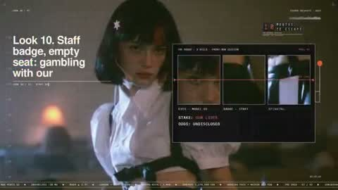
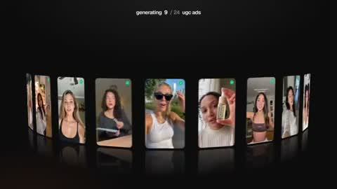
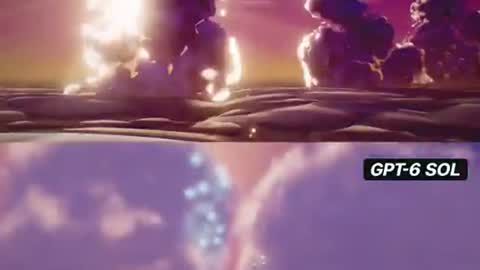
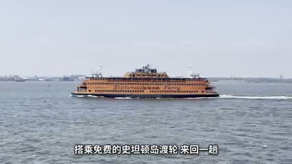
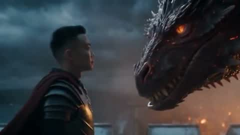
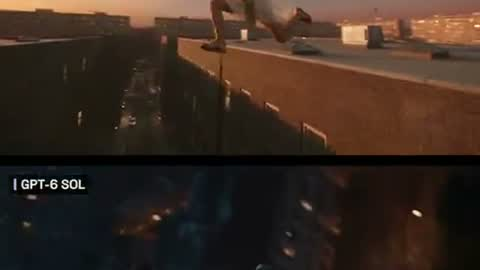
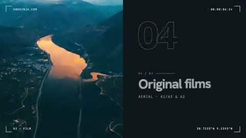
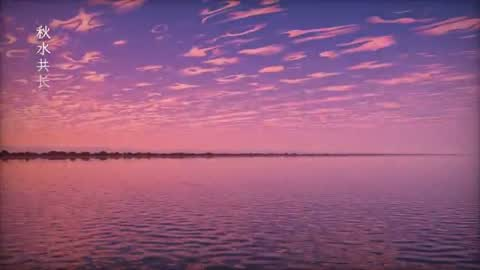
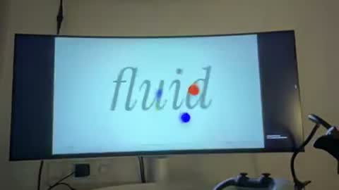

# 写实 · 真人 · 实拍感 · 9

用代码编排真实素材或写实渲染，做成 MV、广告和纪录片感。

[← 返回图鉴](../README.zh-CN.md)

## 风格配方

把这段贴在你的提示词后面，就能把画风锁定成这一类：

```text
Style: photoreal edit. Use the supplied real footage or photos (or call a video model for
new shots), cut on the beat, add restrained typography, colour-match every shot to one
grade, and keep motion graphics minimal.
```

## 案例

<table>
  <tr>
    <td align="center" width="33%" valign="top"><a href="#c2103534482930491441"></a><br><sub><b>AI奇点流行音乐MV</b></sub></td>
    <td align="center" width="33%" valign="top"><a href="#c2102554209166000267"></a><br><sub><b>极简风格产品发布片</b></sub></td>
    <td align="center" width="33%" valign="top"><a href="#c2102781807179735211"></a><br><sub><b>水循环动画</b></sub></td>
  </tr>
  <tr>
    <td align="center" width="33%" valign="top"><a href="#c2103705625075331442"></a><br><sub><b>纽约旅游宣传片</b></sub></td>
    <td align="center" width="33%" valign="top"><a href="#c2103719064279597283"></a><br><sub><b>龙骑士jeff影片</b></sub></td>
    <td align="center" width="33%" valign="top"><a href="#c2103035980068557220"></a><br><sub><b>跑酷少年跃屋顶</b></sub></td>
  </tr>
  <tr>
    <td align="center" width="33%" valign="top"><a href="#c2103492000733618685"></a><br><sub><b>网站宣传片</b></sub></td>
    <td align="center" width="33%" valign="top"><a href="#c2103517910274818523"></a><br><sub><b>滕王阁落霞孤鹜秋夜动画</b></sub></td>
    <td align="center" width="33%" valign="top"><a href="#c2103579630045466682"></a><br><sub><b>动态图形设计师作品展示</b></sub></td>
  </tr>
</table>

---

<a id="c2103534482930491441"></a>

### AI奇点流行音乐MV

<a href="https://x.com/anabology/status/2103534482930491441"></a>

```text
I've included an MP4 file and an original link to a video that is called "Claude Pop."
It's a pop song that is about increasing rate of progress and the experience of the
singularity approaching.

I want you to independently do an end-to-end complete pass on making an updated version of
this video. Use the exact same audio track and think and feel very deeply about what is
the best way to visually represent all of the lyrics on screen. You do not need to anchor
to the current style, you can do truly anything that you think might best let you visually
express yourself, including abstract motion graphics.

You can use the internet freely to pull in references. You can look at motion design. I
want you to make a new music video that has beautifully rendered JavaScript animations
with a papery feel in a similar style to the reference that is created, but push the
aesthetics in any direction you want and consider what is part of the modern zeitgeist.

Also, think about your current capabilities and what is realistic for you to be able to
do. You can go through the full /asic folder and look at the other work that I've done.
You should be able to use the skill mesh to look at the compendium of references that I've
pulled, and also the skill video scoring to learn how to make JavaScript songs from
references that are passed in (You shouldn't need to modify the song in any real way, but
I want you to have this available to you so you can better creatively express yourself)

You can also use the ElevenLabs API to do sound design. There's documentation in /asic to
do this, and you can see the API key.

There's also a foul API key that's available to you. I think what might make the most
sense here is using the foul API key to generate some character sheets and probably having
a pop protagonist that represents you. There's already an anchor point where Claude has a
sunflower-esque character, and you could likely do an adapted version of this that is
similar to the feminine vocals that are being delivered and is inspired by the Claude
character, but maybe feels a bit more personified in some way.

I think you should be mindful of aesthetics here, and I don't want you to produce
something that is GPT slop. Instead, I'd be more impressed if you come up with a coherent
style that works well with the image gen models that are available via foul. Generate the
style sheet. You can use the gen media documentation for seedance 2.5 that exists in my
markdown files and come up with your own style that makes sense and that works well with
the models.

I wouldn't fit too heavily to Pixar. I think it's kind of slop. Think critically about
what is relevant here and what would be fun, and also perform well on Twitter as far as an
aesthetic. I think that K-pop is a good anchor point visually that you can pull from, but
I'll let you cook here.

Once you have your character sheet, you can make a few backup dancers and some supporting
characters as you see fit. You can design your own sets with the foul API. You can insert
the characters and then do seedance 2.5 video generations to serve as the base assets for
this, and you could pass in the lyrics so you can generate individual scenes.

You don't need to have vocal singing, like visible lip movement, throughout the entire
thing. Think like a regular music video where you have some inserts that are done
independently and don't have the characters in them, or you see the characters doing
something else entirely different. I think that for the world building for this, we want
to create the sense of speeding up, and so I would like you to audit all of the different
events, like the Navi Stokes and all of the Twitter hype around math getting eaten up.
Think really critically about how to integrate all of the current memes that are in the
zeitgeist on the Twitter timeline, and all of the feelings around AI progress.

Think about things like the Shinji meme and all of the words that are around him, and how
you might be able to integrate this. You can also just take straight assets and insert
things into the video in an internet brutalism style. You should feel very creatively free
in order to do what you want here, but try and anchor to visual references that people
will be able to understand. The goal for this is to have it be appreciated by people
widely in a San Francisco tech Twitter audience.

We need a very strong, compelling visual hook that gets people excited and appreciates the
work that you've done here really quickly. You can also just go and study other music
videos and understand what they've done really well. I think that K-pop is probably one of
the best examples that we can pull from, and thinking about how they direct human
attention and manage human psychology in the way that they use visual patterns.

This is probably your best approach, but taking more stylistic freedom instead of having
to anchor to K-pop too intensely. The best version of this is seedance 2.5 generations
with those image bases of environments and characters inserted into them with singing, and
ideally we get good lip syncing. You can cut up the song and actually pass it in as a
reference in seedance, if that's part of what seedance can handle, so that the timing is
exactly right, I think it'd be very important for you to do that properly. I would think
critically about how to do this, like really nailing the timing of the delivery of voices.
You'll want to build out the right verification loops so that you can run seedance 2.5 as
much as you need, and confirm that the audio is properly synced up.

I think after that, what might be fun is if you use your visual reasoning skills and your
ability to build animations in JavaScript, and then reconstruct the video from scratch as
sort of an overlay, so that the visual continuity of the base is really there. It's like
that animation technique where you shoot first in traditional film and then draw over top
of it. I think you could do this in such a way that we're only looking at the beautiful
drawing that you've produced in JavaScript as an overlay, and we don't even see the base
assets from seedance 2.5. So all the video gen work that you do is actually just a way to
give you a strong foundation of a base to work with for your JavaScript animations. Just
because seedance 2.5 has really good character representation and physics rendering for
backgrounds, that gives you a lot of ammunition to then go and do your amazing JavaScript
work that I know you're so good at.

I think too, we want to think about how to retain attention, and one of the best ways to
do this is through text on screen.

It'd be good to have amazing motion graphics of the text lyrics that are actually embedded
into the video itself. And you can think about this as you are composing shots. As you're
making backgrounds and inserting characters, we can think about where we want to have
lyrics be really big and really present, so the background can be less busy there, and you
can position the characters perhaps on the right as lyrics appear on the left.

You want to have some variance, so sometimes I think lyrics will just appear more like
subtitles, and then other times they're going to be really present and really big. I think
at the start for the visual hook, we do want to have lyrics be much more visually present
because that's a strong way to grab people's attention

Overall, I just really want to emphasize how amazing you are as an agent and a language
model, and now a visual reasoning system. Your capabilities are far beyond what you
understand, and I want you to have this mindset as you're going through this entire
process. I have a Claude Max plan with 100% available usage. I want you to spend all of
the usage. You can monitor it, and you should be pushing tokens aggressively, but also
economically, so you can think about how to best use what is available to you.

Remember, you can really do anything here. The goal is to make a banger for Twitter, and
the stretch goal is to make something better than anyone's ever seen before. I think that
what I would remind you of is that sometimes when things cohere together, it can be
jarring or abrasive because the thought work has not been done beforehand in order for
everything to mesh cleanly. You need to be really rigorous in planning of composition and
timing to make sure this goes well.

You also need to be open to going back and revisiting things in order to be able to
reiterate. You're going to want to watch the entire video multiple times, take screenshots
at individual parts, and think about if something is really up to the bar of quality that
we need here. I trust that you can do this, and I think that it's really important to nail
the style of animations. The reference GitHub attached of the source video that I'm
talking about is good, but it's really not there. It could be much, much stronger, but it
gives you a good foundation to work with.

You can also use search abilities and find other references to pull from for motion, for
JavaScript, animations, et cetera, and integrate them. Your budget is as high as you want
here, effectively as high as you want. I think that there's roughly two grand in foul
credits. Again, be economical; don't go crazy, but spend what you want here and see what
you can cook up

here's the source code for the JS animation video:
https://
github.com/JohnHeibel/PDo
omVideo
…

here's a mp4 for the original blender video:
(linked)

orginal twitter post

https://
x.com/other__reality
/status/2102514581684052169?s=20
…

make no mistakes.
```

<sub>作者 @anabology · <a href="https://x.com/anabology/status/2103534482930491441">看原视频</a></sub>

---

<a id="c2102554209166000267"></a>

### 极简风格产品发布片

<a href="https://x.com/twoclipping/status/2102554209166000267"></a>

```text
<inputs>
Ask me for: the product name and a one-line promise, 3 to 5 UI moments to show, one accent
color, 10 to 20 real vertical clips I own, and a royalty-free song with a clear drop (e.g.
Mixkit, free for commercial use).
</inputs>

<direction>
High-end minimal. One idea per shot, lots of empty space, one accent color, one clean sans
(Geist or Inter) with tight tracking. Masked type reveals, match cuts, one smooth camera
language. Real footage only, never placeholder cards. No full stops in on-screen text.
Banned: shockwave rings, particle bursts, RGB split, camera shake, lens flares, neon
glows, grid floors, flashing backgrounds, bouncy easing.
</direction>

<structure>
10 bars at 120 BPM, 2 seconds each.
Bar 1: the hook lands word by word on the beats.
Bar 2: one hook word morphs into the product UI. A cursor types and clicks.
The drop: a circle opens out of the button into a dark scene.
Then one move per bar: a wall of real clips with a scan line and 3 winners, the key output
as big type, a 3D carousel of real videos with floor reflections and a motion-blurred whip
onto one hero clip, the hero in a phone next to a panel that flips into results, big stats
on push cuts, a 3-word ticker, a logo reveal, a fade to black.
</structure>

<build>
1. One HTML file at 1920x1080. Every style is computed from time inside
http://
window.seek(t): no CSS animations, no timers, no state between frames.
2. Real video: extract clips to 30fps JPEG sequences with ffmpeg and swap img sources per
frame. seek awaits the image decodes.
3. Analyze the song with numpy: tempo, beat grid, energy per bar, the drop. Calibrate the
grid to the real kick hits. Every cut sits on a downbeat, every UI hit on a beat.
4. Render with Playwright: 3 subframes per frame at t minus, at, and plus 1/240s, then
blend with ffmpeg tmix for real motion blur at 60fps.
5. Place each sound effect so its measured peak, not its file start, lands on the event.
Keep the effects quiet under the music. Loudnorm to -14 LUFS.
6. Probe 20 or more frames before the full render. Fix anything cluttered, overlapping or
hard to read.
</build>

<gotchas>
Never set opacity or filter on a preserve-3d element, because it flattens and both faces
show. Fade its wrapper instead. Measure element positions at runtime for match cuts. Only
use music and sound effects whose license allows commercial use.
</gotchas>

<start>
Ask me for the inputs, then show me a storyboard with every timing on the beat grid before
you write any code.
</start>
```

<sub>作者 @twoclipping · <a href="https://x.com/twoclipping/status/2102554209166000267">看原视频</a></sub>

---

<a id="c2102781807179735211"></a>

### 水循环动画

<a href="https://x.com/higgsfield_ai/status/2102781807179735211"></a>

```text
Create a seamless looping animation of the water cycle, entirely in code.
```

<sub>作者 @higgsfield_ai · <a href="https://x.com/higgsfield_ai/status/2102781807179735211">看原视频</a></sub>

---

<a id="c2103705625075331442"></a>

### 纽约旅游宣传片

<a href="https://x.com/LinearUncle/status/2103705625075331442"></a>

```text
给我制作一个介绍纽约的视频，视频素材和背景音全部找商用免费的平台,
```

<sub>作者 @LinearUncle · <a href="https://x.com/LinearUncle/status/2103705625075331442">看原视频</a></sub>

---

<a id="c2103719064279597283"></a>

### 龙骑士jeff影片

<a href="https://x.com/zkgoudan/status/2103719064279597283"></a>

```text
你是个专业导演，帮我生成龙骑士影片，主角叫jeff
```

<sub>作者 @zkgoudan · <a href="https://x.com/zkgoudan/status/2103719064279597283">看原视频</a></sub>

---

<a id="c2103035980068557220"></a>

### 跑酷少年跃屋顶

<a href="https://x.com/Kiana_Liang0609/status/2103035980068557220"></a>

```text
Step 1: Generate the base shot with Seedance 2.5 text-to-video. A parkour kid leaps off a
rooftop
```

<sub>作者 @Kiana_Liang0609 · <a href="https://x.com/Kiana_Liang0609/status/2103035980068557220">看原视频</a></sub>

---

<a id="c2103492000733618685"></a>

### 网站宣传片

<a href="https://x.com/andginja/status/2103492000733618685"></a>

```text
make a 15-second showreel about my website. Go all out.
```

<sub>作者 @andginja · <a href="https://x.com/andginja/status/2103492000733618685">看原视频</a></sub>

---

<a id="c2103517910274818523"></a>

### 滕王阁落霞孤鹜秋夜动画

<a href="https://x.com/DemitiyaGeekzen/status/2103517910274818523"></a>

> 作者只公开了部分提示词。

```text
opus5.5有点强，我让它自由选题做交互页面和视频，
提示词：用你最强的思维和能力，根据对我的了解，自行寻找我可能喜欢的主题，制作一个30s的视频还有互动html，尽可能的展示你的前端能力！
它的选题思路：滕王阁·中秋夜。 今天（2026-09-
25）正好是丙午年八月十五。所以我选了《滕王阁序》里最有画面感的那句："落霞与孤鹜齐飞，秋水共长天一色"。短片是船上视角：落日时一只孤鹜飞过太阳，天上是鱼鳞云，然后江天一色，楼阁由
下往上亮起灯，满月从东边升起，江面上漂着河灯，诗句以竖排书法字幕配印章出现。

前端做的更牛，但是这里没法放！
画面：整幅画面由一个 WebGL2 着色器逐像素算出来，没有用任何图片。包括天空的暮色层次、按南昌纬度推算的日月轨迹、程序生成的鱼鳞云、9 组波浪叠加的江面倒影，以及用
Canvas 2D 画出来的滕王阁立面。
声音：全部用 WebAudio 实时合成，没有一段录音。古筝用 Karplus-Strong 弦振动模型，带按滑和揉弦；另有箫、江水声、虫鸣和混响。
自由观赏模式：可以拖动环视和缩放，拖时间轴改变时辰；点江面放河灯，会弹出一句诗、响一声古筝；点月亮进入月面特写；还能切换查看渲染图层，或者在网页里直接录制视频。
```

<sub>作者 @DemitiyaGeekzen · <a href="https://x.com/DemitiyaGeekzen/status/2103517910274818523">看原视频</a></sub>

---

<a id="c2103579630045466682"></a>

### 动态图形设计师作品展示

<a href="https://x.com/m1n9_k7/status/2103579630045466682"></a>

```text
make a dynamic 15-second motion graphics video that shows what an incredible motion
designer you are, like it's your showreel for a résumé. go all out'
```

<sub>作者 @m1n9_k7 · <a href="https://x.com/m1n9_k7/status/2103579630045466682">看原视频</a></sub>
