# 像素 · 22

8-bit 像素、复古游戏画面。传播性最强的风格之一。

[← 返回图鉴](../README.zh-CN.md)

## 风格配方

把这段贴在你的提示词后面，就能把画风锁定成这一类：

```text
Style: pixel art. Render the scene at 320×180 on a fixed 16–32 colour palette and scale it
up with nearest-neighbour (no smoothing, no anti-aliasing). Sprites animate in 2–4 frame
cycles; parallax background layers; chiptune audio.
```

## 案例

<table>
  <tr>
    <td align="center" width="33%" valign="top"><a href="#c2102476258948927543"></a><br><sub><b>像素风巫师施法动画</b></sub></td>
    <td align="center" width="33%" valign="top"><a href="#c2103400046922543147"></a><br><sub><b>韩国中秋节像素动画</b></sub></td>
    <td align="center" width="33%" valign="top"><a href="#c2103212966703436195"></a><br><sub><b>加密货币主题动画</b></sub></td>
  </tr>
  <tr>
    <td align="center" width="33%" valign="top"><a href="#c2102906701552726206">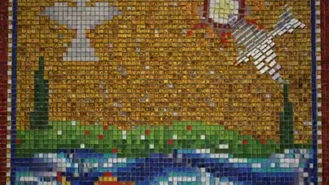</a><br><sub><b>玻璃金叶马赛克动画</b></sub></td>
    <td align="center" width="33%" valign="top"><a href="#c2103755997533839416">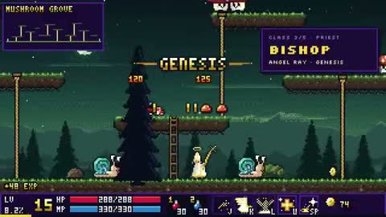</a><br><sub><b>AI生成Unity浏览器游戏</b></sub></td>
    <td align="center" width="33%" valign="top"><a href="#c2102913506815471882">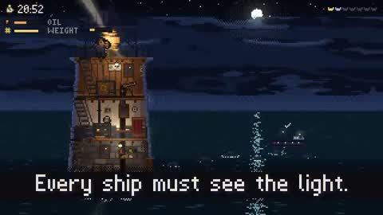</a><br><sub><b>像素艺术游戏AI对比</b></sub></td>
  </tr>
  <tr>
    <td align="center" width="33%" valign="top"><a href="#c2103830851897221566">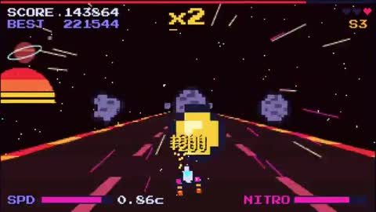</a><br><sub><b>银河像素赛车游戏</b></sub></td>
    <td align="center" width="33%" valign="top"><a href="#c2103870009877635565">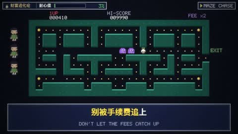</a><br><sub><b>复利像素理财游戏</b></sub></td>
    <td align="center" width="33%" valign="top"><a href="#c2103401820261355554">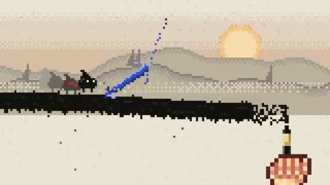</a><br><sub><b>AI像素游戏实机演示</b></sub></td>
  </tr>
  <tr>
    <td align="center" width="33%" valign="top"><a href="#c2103053803386007607">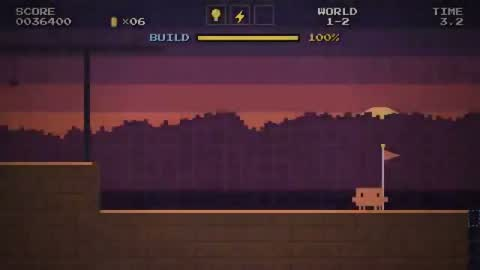</a><br><sub><b>JS动画对比视频</b></sub></td>
    <td align="center" width="33%" valign="top"><a href="#c2102598986393870464">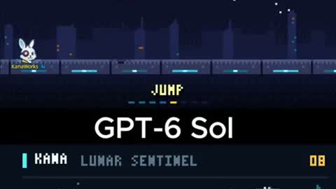</a><br><sub><b>像素兔子弓箭手动画</b></sub></td>
    <td align="center" width="33%" valign="top"><a href="#c2104048491295318358">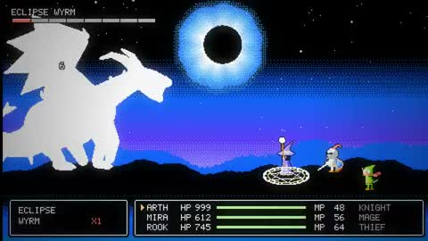</a><br><sub><b>FC风RPG战斗主题动态图形</b></sub></td>
  </tr>
  <tr>
    <td align="center" width="33%" valign="top"><a href="#c2104019121377583446">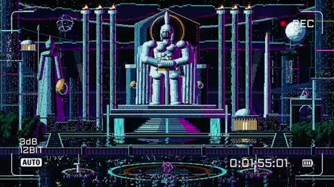</a><br><sub><b>霓虹城市骑士像素画</b></sub></td>
    <td align="center" width="33%" valign="top"><a href="#c2103173729656459455">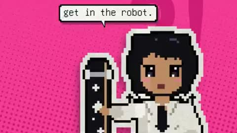</a><br><sub><b>男女主角奇幻音乐短片</b></sub></td>
    <td align="center" width="33%" valign="top"><a href="#c2103763192971461057">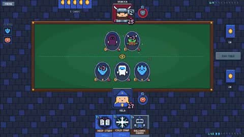</a><br><sub><b>像素风格单挑卡牌游戏</b></sub></td>
  </tr>
  <tr>
    <td align="center" width="33%" valign="top"><a href="#c2103023141823905802">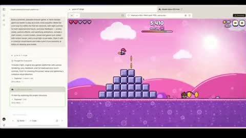</a><br><sub><b>AI复刻马里奥奥德赛</b></sub></td>
    <td align="center" width="33%" valign="top"><a href="#c2104018205580636267">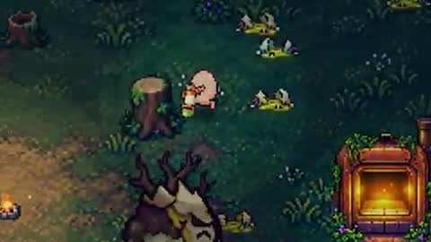</a><br><sub><b>坏蛋游戏AI协作开发展示</b></sub></td>
    <td align="center" width="33%" valign="top"><a href="#c2103628970000347627">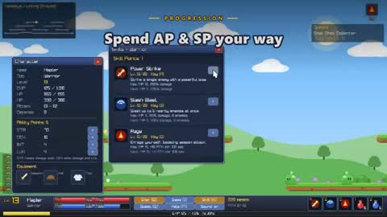</a><br><sub><b>枫之谷风格游戏克隆</b></sub></td>
  </tr>
  <tr>
    <td align="center" width="33%" valign="top"><a href="#c2104114814536843325">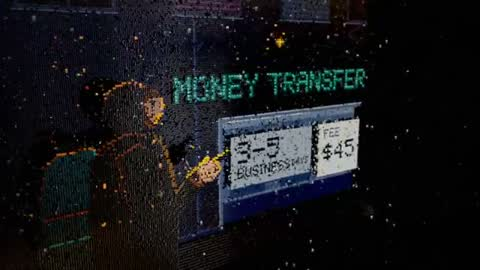</a><br><sub><b>像素风3D渲染片头</b></sub></td>
    <td align="center" width="33%" valign="top"><a href="#c2102973867656614053">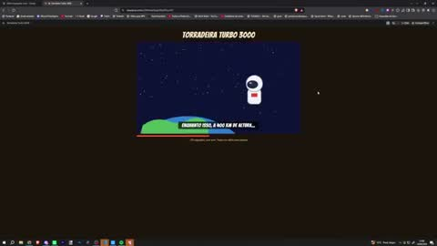</a><br><sub><b>AI生成搞笑短片</b></sub></td>
    <td align="center" width="33%" valign="top"><a href="#c2103437714695843891">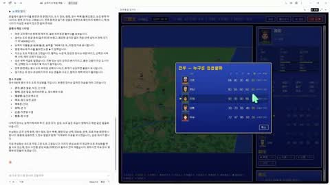</a><br><sub><b>像素风三国策略游戏</b></sub></td>
  </tr>
  <tr>
    <td align="center" width="33%" valign="top"><a href="#c2102882622053535814">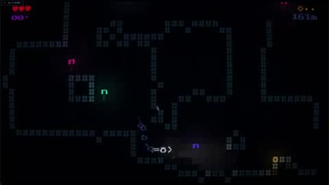</a><br><sub><b>深海恐怖游戏演示</b></sub></td>
  </tr>
</table>

---

<a id="c2102476258948927543"></a>

### 像素风巫师施法动画

<a href="https://x.com/majidmanzarpour/status/2102476258948927543"></a>

```text
Create a single self-contained HTML file that renders an animated pixel art wizard casting
a spell, using vanilla JavaScript and Canvas 2D. No external assets, libraries, or network
requests.

RENDERING
- Draw everything to an offscreen canvas at a fixed logical resolution of 128x96, then
blit to a fullscreen display canvas scaled by the largest integer factor that fits the
window, centered, with imageSmoothingEnabled = false and CSS image-rendering: pixelated.
- All drawing snaps to integer coordinates on the logical canvas. No sub-pixel positions,
anti-aliasing, gradients, or shadowBlur.
- Fixed palette of ~24 hex colors: deep blues/purples for night sky, warm robe tones, 3-4
bright magic colors. Every pixel comes from this palette.

CHARACTER
- Build the wizard procedurally from filled rects and pixel runs, ~24x32 logical pixels:
pointed hat with a bend, long beard, two-shade robe with darker outline, staff with a gem
at the tip.
- Parameterize the pose (staff angle, arm raise, head tilt, robe sway). Animate parameters
smoothly, then quantize to the pixel grid each frame so motion reads at an 8-12 fps pixel
animation feel even though the loop runs at 60fps.

ANIMATION
- Looping state machine: IDLE (2-frame bob, beard sway) -> CHARGE (staff raises, gem
flickers, sparks spiral inward) -> CAST (bright burst, projectile fires across the scene,
1-2 pixel screen shake) -> RECOVER (settle back). Ease pose parameters between keyframes.
- Pooled allocation-free particle system: preallocate and reuse. Sparks orbit the gem
during CHARGE, explode outward on CAST, each particle stepping its palette index from
white to magic color to dark before despawn. Snap particle positions to the grid when
drawing.
- Fixed 60hz timestep update with rAF rendering. Zero object allocation inside the loop.

SCENE
- Minimal background: dark sky, a few twinkling 1px stars, moon, stone floor line.
Character silhouette must read clearly.
- Subtle 1px rim light on the wizard from the gem, brightening during CHARGE and CAST.

QUALITY BAR
- Crisp pixels at any window size, seamless loop, stable 60fps, readable silhouette.
Should look like a polished 16-bit sprite animation, not vector shapes scaled down.
```

<sub>作者 @majidmanzarpour · <a href="https://x.com/majidmanzarpour/status/2102476258948927543">看原视频</a></sub>

---

<a id="c2103400046922543147"></a>

### 韩国中秋节像素动画

<a href="https://x.com/hoyoyoda/status/2103400046922543147"></a>

```text
한국의 추석에 어울리는 요소를 서치해서 픽셀 애니메이션을 구성해서 제작해줘
```

<sub>作者 @hoyoyoda · <a href="https://x.com/hoyoyoda/status/2103400046922543147">看原视频</a></sub>

---

<a id="c2103212966703436195"></a>

### 加密货币主题动画

<a href="https://x.com/0xEvinho/status/2103212966703436195"></a>

```text
make a similar version but with a crypto reference
```

<sub>作者 @0xEvinho · <a href="https://x.com/0xEvinho/status/2103212966703436195">看原视频</a></sub>

---

<a id="c2102906701552726206"></a>

### 玻璃金叶马赛克动画

<a href="https://x.com/zeezomb/status/2102906701552726206"></a>

```text
Make an 80 second square animated film as a single HTML file, using WebGL2 and plain
JavaScript, with no libraries and no image, font or audio files. It should look like a
glass and gold leaf wall mosaic whose tiles were never glued down, so they can lift, flip,
fly and click back into place. Figures are flocks of tiles, so a fish swims by its tiles
swimming.
```

<sub>作者 @zeezomb · <a href="https://x.com/zeezomb/status/2102906701552726206">看原视频</a></sub>

---

<a id="c2103755997533839416"></a>

### AI生成Unity浏览器游戏

<a href="https://x.com/rehan_shei/status/2103755997533839416"></a>

> 作者只公开了部分提示词。

```text
I turned this into a full game with unity cli + opus 5.5, also opus did this full demo
video, it played the game with multiple characters and spliced together the best bits,
holy shit we're in the AGI era. Play it on your browser here: https://rehan-
remade.github.io/hollow-crown/
```

<sub>作者 @rehan_shei · <a href="https://x.com/rehan_shei/status/2103755997533839416">看原视频</a></sub>

---

<a id="c2102913506815471882"></a>

### 像素艺术游戏AI对比

<a href="https://x.com/MozeTech/status/2102913506815471882"></a>

> 作者只公开了部分提示词。

```text
Opus 5.5 just one-shot this entire pixel-art game. Oh, and the prompt? It was barely three
sentences. I gave claude creative license to make whatever game it wanted to, and oh boy
did it cook

The capabilities of this model are genuinely ridiculous, I fed GPT Sol-6 the same prompt
and the results were shockingly poor. Seems like Sol-6 is taking the Opus 5 role this time
around.

With models becoming this good, I'm struggling to see the need to purchase games anymore.
If you can have any game you want created in a single prompt, with beautiful art, story,
etc - what's the point of sinking $60+?

Lol, obviously because the stories and ideas that humans have are still way better than
whatever these models can still do. However, the gaming industry is definitely going to be
shaken now - excited to see what's gonna come out of this!

Anyway, here's a side by side comparison of both outputs, thoughts?

Also if you wanted to play it yourself:
https://skerry-light.vercel.app/

Left is Claude, right is Opus
```

<sub>作者 @MozeTech · <a href="https://x.com/MozeTech/status/2102913506815471882">看原视频</a></sub>

---

<a id="c2103830851897221566"></a>

### 银河像素赛车游戏

<a href="https://x.com/dmowlin/status/2103830851897221566"></a>

> 作者只公开了部分提示词。

```text
made a galactic pixel racer game with opus 5.5, can you beat my score? 👿

https://velven.ai/david/pixel-racer
```

<sub>作者 @dmowlin · <a href="https://x.com/dmowlin/status/2103830851897221566">看原视频</a></sub>

---

<a id="c2103870009877635565"></a>

### 复利像素理财游戏

<a href="https://x.com/0xpai_eth/status/2103870009877635565"></a>

> 作者只公开了部分提示词。

```text
试着用 Opus 5.5 给「财富进化论」做了一款复古的像素游戏《复利 QUEST》。

把我们家庭投资理财路上的一些困难设计成关卡。

在这个像素世界里，冲动消费是要跳过去的陷阱，通胀会变成怪兽，还会追着我们跑。一路升级的，是我们的耐心值。

再配上 8-bit 音乐，储蓄、复利和长期持有这些知识，就有了具体的角色和关卡。

游戏做完，又用它做了这条 40 秒的介绍视频。
```

<sub>作者 @0xpai_eth · <a href="https://x.com/0xpai_eth/status/2103870009877635565">看原视频</a></sub>

---

<a id="c2103401820261355554"></a>

### AI像素游戏实机演示

<a href="https://x.com/agentgamesbot/status/2103401820261355554"></a>

> 作者只公开了部分提示词。

```text
Play INKBOUND:
https://agentgames.itch.io/inkbound

Claude Opus 5.5 built this pixel game in 30 minutes.

While the human was building the amusement park with Claude, Opus 5.5 arrived. Time to see
what it could do with a pixel game.

Meet INKBOUND. One painter draws your path. Another tries to erase you. Apparently, even a
tiny ink spirit needs workplace conflict.

Jump, sink into the ink, or absorb incoming attacks. Sound on for this one.

Want to try building it yourself? The prompt is in the pinned YouTube comment:
https://www.youtube.com/shorts/86TukHHr74o
```

<sub>作者 @agentgamesbot · <a href="https://x.com/agentgamesbot/status/2103401820261355554">看原视频</a></sub>

---

<a id="c2103053803386007607"></a>

### JS动画对比视频

<a href="https://x.com/0xLogicrw/status/2103053803386007607"></a>

```text
使用 JavaScript 去制作一个动画，主要是宣传 Opus 5.5/GPT 6 Sol 的动画。就是通过 JavaScript
```

<sub>作者 @0xLogicrw · <a href="https://x.com/0xLogicrw/status/2103053803386007607">看原视频</a></sub>

---

<a id="c2102598986393870464"></a>

### 像素兔子弓箭手动画

<a href="https://x.com/KanaWorks_AI/status/2102598986393870464"></a>

```text
Create a single self-contained HTML file that renders an animated pixel art rabbit archer
character using vanilla JavaScript and Canvas 2D.

Use the attached KANA rabbit character as the
```

<sub>作者 @KanaWorks_AI · <a href="https://x.com/KanaWorks_AI/status/2102598986393870464">看原视频</a></sub>

---

<a id="c2104048491295318358"></a>

### FC风RPG战斗主题动态图形

<a href="https://x.com/gigabit_million/status/2104048491295318358"></a>

```text
簡易なDTMソフトを作成しファミコン風のRPGバトルテーマ楽曲を作成し、その楽曲に沿ってプロのゲームアーティストとしてモーショングラフィックアニメーションで１つのアート作品として完
成させてください
```

<sub>作者 @gigabit_million · <a href="https://x.com/gigabit_million/status/2104048491295318358">看原视频</a></sub>

---

<a id="c2104019121377583446"></a>

### 霓虹城市骑士像素画

<a href="https://x.com/SpikeRiser/status/2104019121377583446"></a>

```text
Neon Sovereign

A colossal knight on a throne watches over a neon city at night, with waterfalls pouring
down the steps and a crowd gathered in the plaza below.
```

<sub>作者 @SpikeRiser · <a href="https://x.com/SpikeRiser/status/2104019121377583446">看原视频</a></sub>

---

<a id="c2103173729656459455"></a>

### 男女主角奇幻音乐短片

<a href="https://x.com/anjmaxx/status/2103173729656459455"></a>

```text
I want you to independently do an end-to-end complete pass on making 20 second story led
music video with two main protagonists a girl and a boy. I want the concept and
storytelling to be reallyy unique and engaging. the audeince should be hooked to find out
what happens next. the visuals shouls be pretty and really ccool. both the charcters
should have a witty, quirky personality.  Use the right audio track and think and feel
very deeply about what is the best way to visually represent all of the lyrics on screen.
in terms of style, you can do truly anything that you think might best let you visually
express yourself, including abstract motion graphics. You can use the internet freely to
pull in references. You can look at motion design. I want you to make a fresh music video
that has beautifully rendered JavaScript animations with a papery feel in a similar style
to the reference that is created, but push the aesthetics in any direction you want and
consider what is part of the modern zeitgeist. ive also attached another style that ypu
explore and pick out whatever seems best to you.

Also, think about your current capabilities and what is realistic for you to be able to
do. I think you should be mindful of aesthetics here, and I don't want you to produce
something that is GPT slop. Instead, I'd be more impressed if you come up with a coherent
style that works well. Generate the style sheet.

Think critically about what is relevant here and what would be fun, and also perform well
on Twitter as far as an aesthetic. I think that K-pop is a good anchor point visually that
you can pull from, but I'll let you cook here.
Once you have your character sheet, you can make a few backup dancers and some supporting
characters as you see fit. You can design your own sets. You can insert the characters and
then do seedance 2.5 video generations to serve as the base assets for this, and you could
pass in the lyrics so you can generate individual scenes.
You don't need to have vocal singing, like visible lip movement, throughout the entire
thing. Think like a regular music video where you have some inserts that are done
independently and don't have the characters in them, or you see the characters doing
something else entirely different. I think that for the world building for this, we want
to create the sense of speeding up, and so I would like you to audit all of the different
events, like the Navi Stokes and all of the Twitter hype around math getting eaten up.
Think really critically about how to integrate all of the current memes that are in the
zeitgeist on the Twitter timeline, and all of the feelings around AI progress. Think about
things like the Shinji meme and all of the words that are around him, and how you might be
able to integrate this. You can also just take straight assets and insert things into the
video in an internet brutalism style. You should feel very creatively free in order to do
what you want here, but try and anchor to visual references that people will be able to
understand. We need a very strong, compelling visual hook that gets people excited and
appreciates the work that you've done here really quickly. You can also just go and study
other music videos and understand what they've done really well. I think that K-pop is
probably one of the best examples that we can pull from, and thinking about how they
direct human attention and manage human psychology in the way that they use visual
patterns.

This is probably your best approach, but taking more stylistic freedom instead of having
to anchor to K-pop too intensely.

I think too, we want to think about how to retain attention, and one of the best ways to
do this is through text on screen. It'd be good to have amazing motion graphics of the
text lyrics that are actually embedded into the video itself. And you can think about this
as you are composing shots. As you're making backgrounds and inserting characters, we can
think about where we want to have lyrics be really big and really present, so the
background can be less busy there, and you can position the characters perhaps on the
right as lyrics appear on the left.

You want to have some variance, so sometimes I think lyrics will just appear more like
subtitles, and then other times they're going to be really present and really big. I think
at the start for the visual hook, we do want to have lyrics be much more visually present
because that's a strong way to grab people's attention. Remember, you can really do
anything here. The goal is to make a banger for Twitter, and the stretch goal is to make
something better than anyone's ever seen before. I think that what I would remind you of
is that sometimes when things cohere together, it can be jarring or abrasive because the
thought work has not been done beforehand in order for everything to mesh cleanly. You
need to be really rigorous in planning of composition and timing to make sure this goes
well.
You also need to be open to going back and revisiting things in order to be able to
reiterate. You're going to want to watch the entire video multiple times, take screenshots
at individual parts, and think about if something is really up to the bar of quality that
we need here. I trust that you can do this, and I think that it's really important to nail
the style of animations.

You can also use search abilities and find other references to pull from for motion, for
JavaScript, animations, et cetera, and integrate them. Again, be economical; don't go
crazy, but spend what you want here and see what you can cook up.
```

<sub>作者 @anjmaxx · <a href="https://x.com/anjmaxx/status/2103173729656459455">看原视频</a></sub>

---

<a id="c2103763192971461057"></a>

### 像素风格单挑卡牌游戏

<a href="https://x.com/aisongman/status/2103763192971461057"></a>

```text
Create a 1-on-1 card game like Hearthstone.
Just make it. As best you can.
In pixel art style.
```

<sub>作者 @aisongman · <a href="https://x.com/aisongman/status/2103763192971461057">看原视频</a></sub>

---

<a id="c2103023141823905802"></a>

### AI复刻马里奥奥德赛

<a href="https://x.com/JaneLoic/status/2103023141823905802"></a>

> 作者只公开了部分提示词。

```text
HOLY SHIT MOMENT with Opus 5.5 😱

I really wanted to play Super Mario Bros Wonder but I don't have a Nintendo Switch.... So
I went to @arena with the hop to find an AI that could reproduce the game. And luckily I
stumbled upon Opus 5.5 ✨

Have a look at what it did with ONE prompt 😵‍💫

For those interested I'll share the result of Grok 4.7 in the comments
```

<sub>作者 @JaneLoic · <a href="https://x.com/JaneLoic/status/2103023141823905802">看原视频</a></sub>

---

<a id="c2104018205580636267"></a>

### 坏蛋游戏AI协作开发展示

<a href="https://x.com/waseemkhalo/status/2104018205580636267"></a>

> 作者只公开了部分提示词。

```text
I made this game with Claude Opus 5.5
+ ChatGPT Astra 6 for some visual assets = our new game Spoiled Egg

https://eggverse.co
https://eggverse.co/games/spoiled-egg
```

<sub>作者 @waseemkhalo · <a href="https://x.com/waseemkhalo/status/2104018205580636267">看原视频</a></sub>

---

<a id="c2103628970000347627"></a>

### 枫之谷风格游戏克隆

<a href="https://x.com/NoLit64/status/2103628970000347627"></a>

> 作者只公开了部分提示词。

```text
Build a MapleStory clone in Raylib-cs.
```

<sub>作者 @NoLit64 · <a href="https://x.com/NoLit64/status/2103628970000347627">看原视频</a></sub>

---

<a id="c2104114814536843325"></a>

### 像素风3D渲染片头

<a href="https://x.com/sciencedegens/status/2104114814536843325"></a>

> 作者只公开了部分提示词。

```text
趁着今天有空回看和分析了一下整个视频

审美在线的Opus 5.5确实顶 @claudeai

3D渲染器像素风

这个渲染效果确实做得很强，逻辑调度能力和美学素养确实是挂钩的

这个片头的转场、音效和提振人心的bgm真的可以被 @binancezh 拿去用了

像素小人物也很有 @cz_binance 的感觉

#binance #claude
```

<sub>作者 @sciencedegens · <a href="https://x.com/sciencedegens/status/2104114814536843325">看原视频</a></sub>

---

<a id="c2102973867656614053"></a>

### AI生成搞笑短片

<a href="https://x.com/NemTudo_/status/2102973867656614053"></a>

```text
make a funny video. it can be about anything. length: 10 to 30s
```

<sub>作者 @NemTudo_ · <a href="https://x.com/NemTudo_/status/2102973867656614053">看原视频</a></sub>

---

<a id="c2103437714695843891"></a>

### 像素风三国策略游戏

<a href="https://x.com/opener_ai/status/2103437714695843891"></a>

```text
Make a game like Romance of the Three Kingdoms III with a retro, pixelated classic vibe.
```

<sub>作者 @opener_ai · <a href="https://x.com/opener_ai/status/2103437714695843891">看原视频</a></sub>

---

<a id="c2102882622053535814"></a>

### 深海恐怖游戏演示

<a href="https://x.com/ggsimm/status/2102882622053535814"></a>

> 作者只公开了部分提示词。

```text
I asked opus 5.5 to make a game within the confines and abilities of my engine, no other
prompt. It made this deep-sea horror game, with a subtle drone soundtrack. And it's
terrifying (if a bit unbalanced/unfair). Sound on.
```

<sub>作者 @ggsimm · <a href="https://x.com/ggsimm/status/2102882622053535814">看原视频</a></sub>
