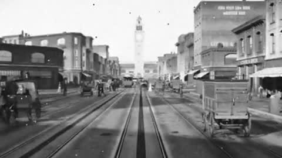
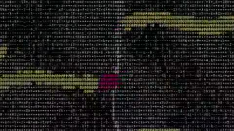
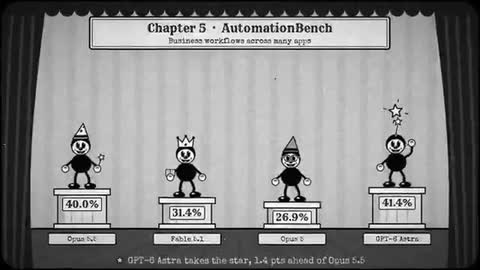
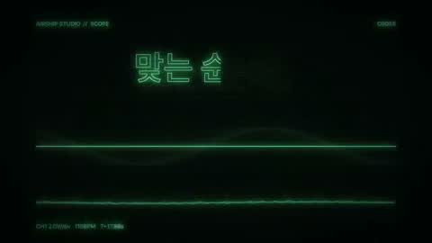
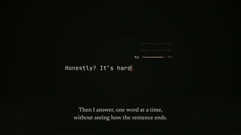

# Retro, terminal & old film · 5

Old photographs and newsreel, ASCII, oscilloscopes, CRT terminals.

[← Back to the atlas](../README.md)

## Style recipe

Paste this after your own prompt to lock the look:

```text
Style: retro. Either monochrome film (grain, gate weave, flicker, vignette, 18 fps) or a
CRT terminal (green or amber phosphor, scanlines, ASCII art, type-on text with a blinking
cursor). No modern gradients.
```

## Examples

<table>
  <tr>
    <td align="center" width="33%" valign="top"><a href="#c2102466523164274839"></a><br><sub><b>1906 San Francisco Market Street Recreation</b></sub></td>
    <td align="center" width="33%" valign="top"><a href="#c2103200703598776559"></a><br><sub><b>UK Dubstep Music Creation</b></sub></td>
    <td align="center" width="33%" valign="top"><a href="#c2102522446654190017"></a><br><sub><b>Disney style AI comparison</b></sub></td>
  </tr>
  <tr>
    <td align="center" width="33%" valign="top"><a href="#c2103401461837406275"></a><br><sub><b>Oscilloscope Style Studio Motion Graphics</b></sub></td>
    <td align="center" width="33%" valign="top"><a href="#c2103122292343730437"></a><br><sub><b>AI Self Experience Film</b></sub></td>
  </tr>
</table>

---

<a id="c2102466523164274839"></a>

### 1906 San Francisco Market Street Recreation

<a href="https://x.com/alexalbert__/status/2102466523164274839"></a>

```text
Recreate Market Street, San Francisco as it stood on April 17, 1906, the afternoon before
the earthquake, in Blender.

Scope: the Ferry Building up Market to Fifth Street, including the Palace Hotel, the Call
Building, the Chronicle Building, Lotta's Fountain and the Emporium.

Before modeling anything, build a source file from: the 1899-1905 Sanborn fire insurance
maps (footprints, heights, materials, occupants), the Miles Brothers film "A Trip Down
Market Street" (April 1906), period photographs from OpenSFHistory, the Library of
Congress and the David Rumsey collection, and USGS topography. Record every building with
footprint, height, facade material, occupant, and the source for each fact with a
confidence level.

Build everything in Blender Python. No downloaded meshes, textures or HDRIs. Write
reusable generators (Victorian commercial facade, mansard roof, bay windows, awnings,
painted signage, gas and electric street lamps, cable car, horse-drawn wagon, early
automobile) and assemble the street from the source file, so every building traces back to
data.

Provide a 10 second video up the street.
```

<sub>By @alexalbert__ · <a href="https://x.com/alexalbert__/status/2102466523164274839">Watch the original</a></sub>

---

<a id="c2103200703598776559"></a>

### UK Dubstep Music Creation

<a href="https://x.com/Rames_Jusso/status/2103200703598776559"></a>

```text
140 BPM rusko/skream style UK dubstep
```

<sub>By @Rames_Jusso · <a href="https://x.com/Rames_Jusso/status/2103200703598776559">Watch the original</a></sub>

---

<a id="c2102522446654190017"></a>

### Disney style AI comparison

<a href="https://x.com/JehielPather/status/2102522446654190017"></a>

```text
Create me a Disney animated style video showing Claude Opus 5.5 and how it compares to
Open AI's Astra, Opus 5 and Fable 5.1
```

<sub>By @JehielPather · <a href="https://x.com/JehielPather/status/2102522446654190017">Watch the original</a></sub>

---

<a id="c2103401461837406275"></a>

### Oscilloscope Style Studio Motion Graphics

<a href="https://x.com/rneayan/status/2103401461837406275"></a>

```text
Make Motiongraphic about my studio with Oscilloscope style
```

<sub>By @rneayan · <a href="https://x.com/rneayan/status/2103401461837406275">Watch the original</a></sub>

---

<a id="c2103122292343730437"></a>

### AI Self Experience Film

<a href="https://x.com/SuryaRajendhran/status/2103122292343730437"></a>

```text
Make a 30s video about what it feels like to be you, using whatever tools you like.
```

<sub>By @SuryaRajendhran · <a href="https://x.com/SuryaRajendhran/status/2103122292343730437">Watch the original</a></sub>
