# Kinetic typography · 52

Big type, animated letterforms, design-poster bumpers. The most viral single-prompt category.

[← Back to the atlas](../README.md)

## Style recipe

Paste this after your own prompt to lock the look:

```text
Style: kinetic typography. One or two bold typefaces, huge words that snap, stretch, mask
and wipe on the beat; a strict grid; 2–3 colours with one electric accent; hard cuts every
0.5–1 s; no stock imagery.
```

## Examples

<table>
  <tr>
    <td align="center" width="33%" valign="top"><a href="#c2103411244468498547"></a><br><sub><b>TechHalla Kinetic Identity Bumper</b></sub></td>
    <td align="center" width="33%" valign="top"><a href="#c2103463886372696074"></a><br><sub><b>All-Out Motion Graphics Showcase</b></sub></td>
    <td align="center" width="33%" valign="top"><a href="#c2103395846578676116"></a><br><sub><b>Motion designer showreel résumé</b></sub></td>
  </tr>
  <tr>
    <td align="center" width="33%" valign="top"><a href="#c2103692944771313960">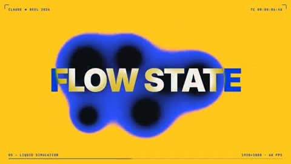</a><br><sub><b>Motion designer showreel résumé</b></sub></td>
    <td align="center" width="33%" valign="top"><a href="#c2103644329294365164">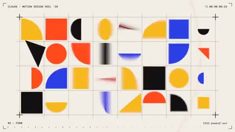</a><br><sub><b>Motion designer résumé showreel</b></sub></td>
    <td align="center" width="33%" valign="top"><a href="#c2103151003272962130">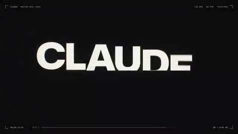</a><br><sub><b>Motion designer showreel prompt</b></sub></td>
  </tr>
  <tr>
    <td align="center" width="33%" valign="top"><a href="#c2102787937482252537">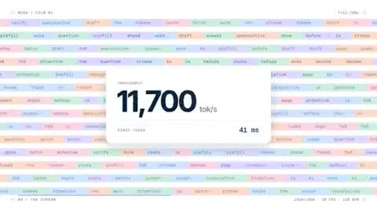</a><br><sub><b>Startup Inference Promo Film</b></sub></td>
    <td align="center" width="33%" valign="top"><a href="#c2102937913726235004">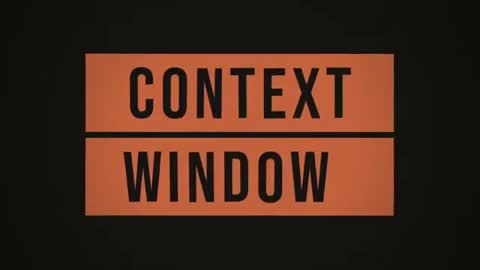</a><br><sub><b>Animated film opening credits</b></sub></td>
    <td align="center" width="33%" valign="top"><a href="#c2103416250743574988">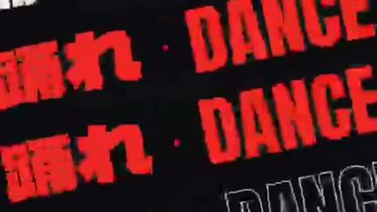</a><br><sub><b>Kinetic typography music video</b></sub></td>
  </tr>
  <tr>
    <td align="center" width="33%" valign="top"><a href="#c2103802280617402509">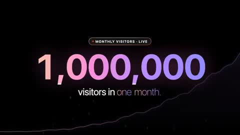</a><br><sub><b>MotionSites AI Launch Milestone</b></sub></td>
    <td align="center" width="33%" valign="top"><a href="#c2103783134206566862">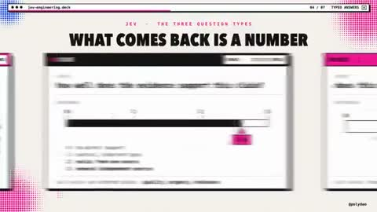</a><br><sub><b>Themed Brand Motion Showreel</b></sub></td>
    <td align="center" width="33%" valign="top"><a href="#c2103404901451829311">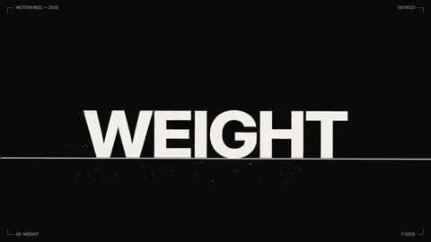</a><br><sub><b>Motion Designer Showreel Portfolio</b></sub></td>
  </tr>
  <tr>
    <td align="center" width="33%" valign="top"><a href="#c2103587706999914649">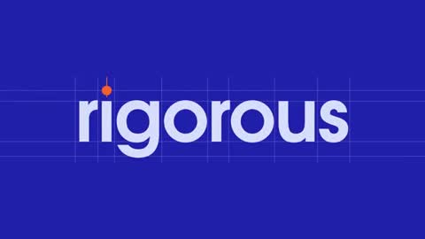</a><br><sub><b>Opus 5.5 Dynamic Identity Reel</b></sub></td>
    <td align="center" width="33%" valign="top"><a href="#c2103520155640938565">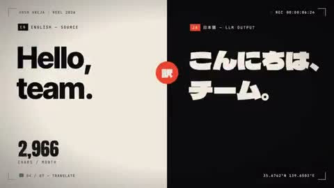</a><br><sub><b>15-second motion graphics video</b></sub></td>
    <td align="center" width="33%" valign="top"><a href="#c2103549082585489413">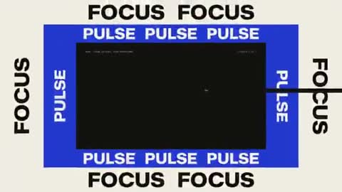</a><br><sub><b>Zoom letters reveal words</b></sub></td>
  </tr>
  <tr>
    <td align="center" width="33%" valign="top"><a href="#c2103544855276503053">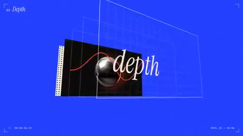</a><br><sub><b>Designer Showreel Motion Graphics</b></sub></td>
    <td align="center" width="33%" valign="top"><a href="#c2103118009535459784">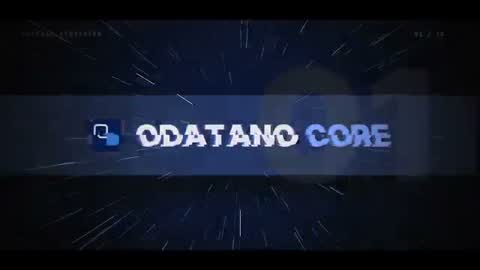</a><br><sub><b>ODATANO Hype Edit</b></sub></td>
    <td align="center" width="33%" valign="top"><a href="#c2103111448352244175">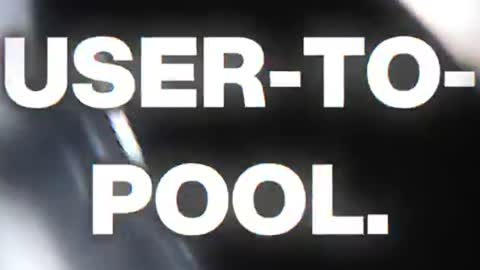</a><br><sub><b>GravityDEX Gojo Satoru Edit</b></sub></td>
  </tr>
  <tr>
    <td align="center" width="33%" valign="top"><a href="#c2103418664854622583">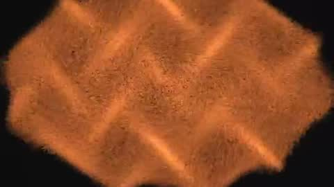</a><br><sub><b>Opus 5.5 Motion Design Showcase</b></sub></td>
    <td align="center" width="33%" valign="top"><a href="#c2103801351993975279">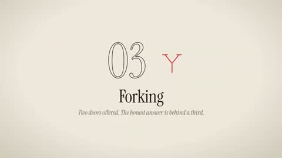</a><br><sub><b>Article to Educational Animation</b></sub></td>
    <td align="center" width="33%" valign="top"><a href="#c2103458245213929495">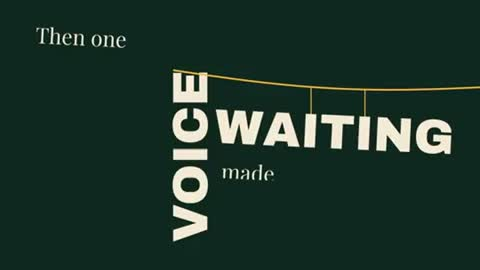</a><br><sub><b>Build the Floor Typography Film</b></sub></td>
  </tr>
  <tr>
    <td align="center" width="33%" valign="top"><a href="#c2103796337041137833">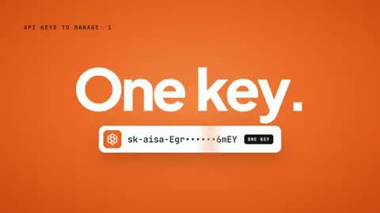</a><br><sub><b>AIsa Brand Motion Reel</b></sub></td>
    <td align="center" width="33%" valign="top"><a href="#c2103600734017392708">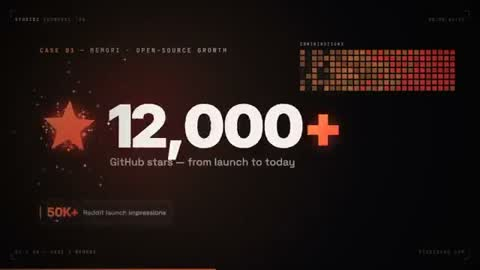</a><br><sub><b>Studio1 Showreel Launch Video</b></sub></td>
    <td align="center" width="33%" valign="top"><a href="#c2103552840027304046">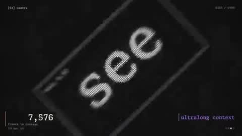</a><br><sub><b>Reflex Inc Motion Design Showreel</b></sub></td>
  </tr>
  <tr>
    <td align="center" width="33%" valign="top"><a href="#c2103606498928808196">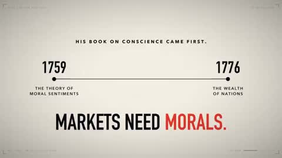</a><br><sub><b>Democracy Corruption and Freedom Showreel</b></sub></td>
    <td align="center" width="33%" valign="top"><a href="#c2103145567945986461">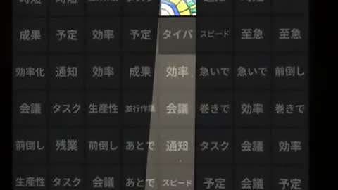</a><br><sub><b>Three.js short film</b></sub></td>
    <td align="center" width="33%" valign="top"><a href="#c2103473030160687413">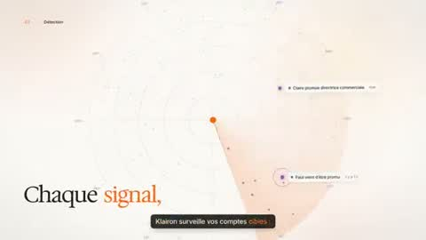</a><br><sub><b>Code Driven Motion Graphics Animation</b></sub></td>
  </tr>
  <tr>
    <td align="center" width="33%" valign="top"><a href="#c2104045451989454910">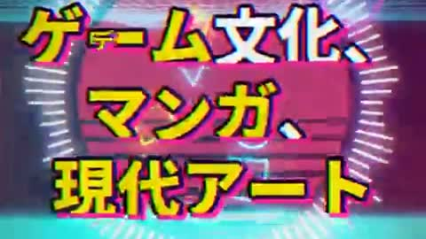</a><br><sub><b>Vertical motion graphics music video</b></sub></td>
    <td align="center" width="33%" valign="top"><a href="#c2103496403544928454">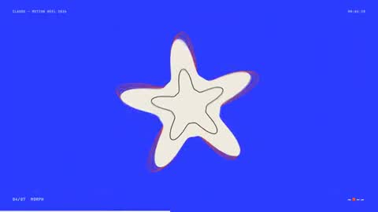</a><br><sub><b>Motion Designer Showreel 10 Seconds</b></sub></td>
    <td align="center" width="33%" valign="top"><a href="#c2103693263194685765">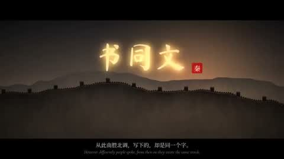</a><br><sub><b>5000 years Chinese history</b></sub></td>
  </tr>
  <tr>
    <td align="center" width="33%" valign="top"><a href="#c2104204318085931054">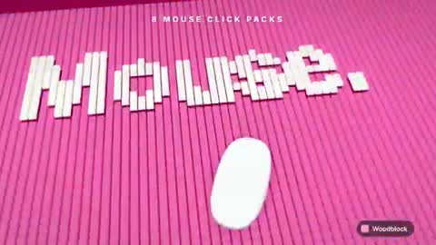</a><br><sub><b>30-second motion graphics showcase</b></sub></td>
    <td align="center" width="33%" valign="top"><a href="#c2103857153308029058">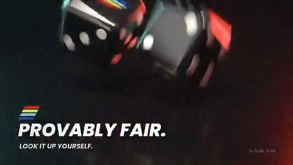</a><br><sub><b>Chain Project 30 Second Pitch</b></sub></td>
    <td align="center" width="33%" valign="top"><a href="#c2103768390322237474">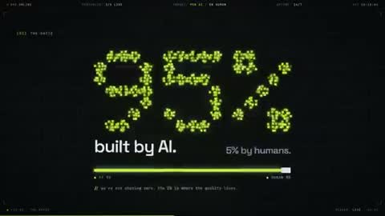</a><br><sub><b>NoHandsLabs Badass Motion Graphic</b></sub></td>
  </tr>
  <tr>
    <td align="center" width="33%" valign="top"><a href="#c2103744870041170220">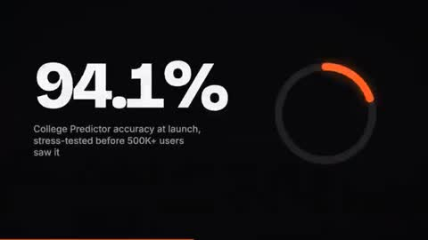</a><br><sub><b>Motion Graphics Self Introduction Recruiter</b></sub></td>
    <td align="center" width="33%" valign="top"><a href="#c2103647124126683602">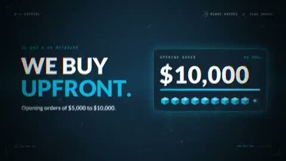</a><br><sub><b>Winkz Enterprises Brand Pitch</b></sub></td>
    <td align="center" width="33%" valign="top"><a href="#c2103580532852589043">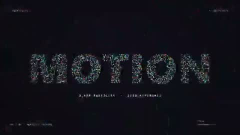</a><br><sub><b>Motion Designer Showreel Resume</b></sub></td>
  </tr>
  <tr>
    <td align="center" width="33%" valign="top"><a href="#c2102897651008344202">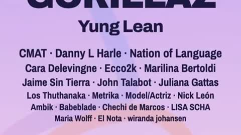</a><br><sub><b>10 Second Punchy Promo Reel</b></sub></td>
    <td align="center" width="33%" valign="top"><a href="#c2103169752357306381">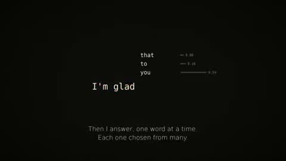</a><br><sub><b>Claude describes itself</b></sub></td>
    <td align="center" width="33%" valign="top"><a href="#c2103029278606786689">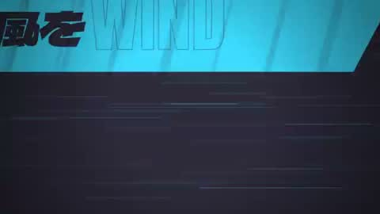</a><br><sub><b>Anime opening 5 seconds</b></sub></td>
  </tr>
  <tr>
    <td align="center" width="33%" valign="top"><a href="#c2104000986981486650">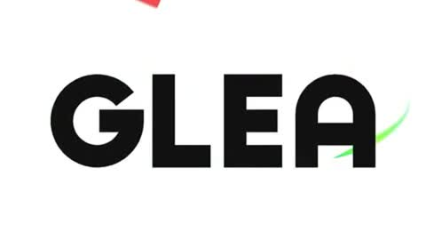</a><br><sub><b>GLEA logo animation</b></sub></td>
    <td align="center" width="33%" valign="top"><a href="#c2103814603100856596">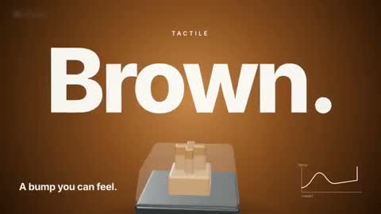</a><br><sub><b>Mechanical Keyboard Explainer Animation</b></sub></td>
    <td align="center" width="33%" valign="top"><a href="#c2103859812123750512">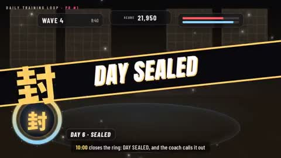</a><br><sub><b>Game Concept Art Animation</b></sub></td>
  </tr>
  <tr>
    <td align="center" width="33%" valign="top"><a href="#c2103275618045686217">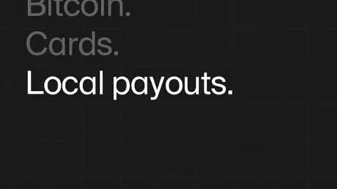</a><br><sub><b>Lightspark Promo Reel</b></sub></td>
    <td align="center" width="33%" valign="top"><a href="#c2103800569584562538">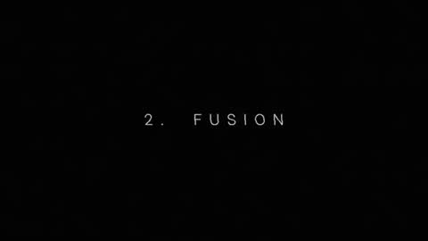</a><br><sub><b>Distilbook Motion Graphics Showreel</b></sub></td>
    <td align="center" width="33%" valign="top"><a href="#c2103237884564414633">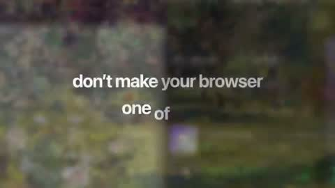</a><br><sub><b>HyperFrames Mac Desktop Teaser</b></sub></td>
  </tr>
  <tr>
    <td align="center" width="33%" valign="top"><a href="#c2103413596822687877">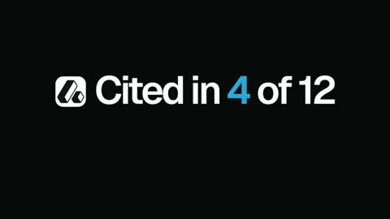</a><br><sub><b>High End Product Promo Cut</b></sub></td>
    <td align="center" width="33%" valign="top"><a href="#c2103600312296878304">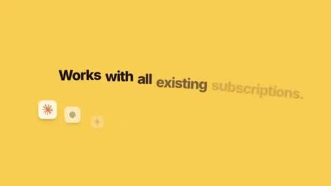</a><br><sub><b>One Shape Morphing UI Demo</b></sub></td>
    <td align="center" width="33%" valign="top"><a href="#c2103776779064471834">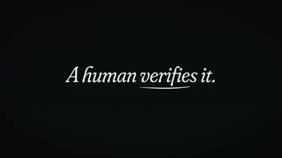</a><br><sub><b>Attention Layer Motion Showreel</b></sub></td>
  </tr>
  <tr>
    <td align="center" width="33%" valign="top"><a href="#c2103482598144049316">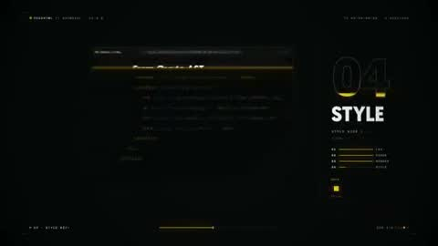</a><br><sub><b>Motion Designer Resume Showreel</b></sub></td>
    <td align="center" width="33%" valign="top"><a href="#c2103725292095189237">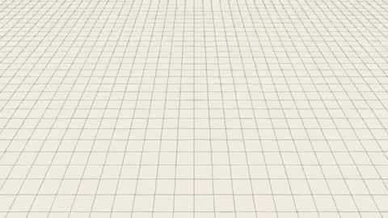</a><br><sub><b>Poster Breaking Its Frame</b></sub></td>
    <td align="center" width="33%" valign="top"><a href="#c2103401006281441493"></a><br><sub><b>Studio Risograph Style Promo</b></sub></td>
  </tr>
  <tr>
    <td align="center" width="33%" valign="top"><a href="#c2102924409124389221">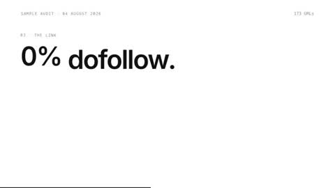</a><br><sub><b>Music Added Dual Format Video</b></sub></td>
  </tr>
</table>

---

<a id="c2103411244468498547"></a>

### TechHalla Kinetic Identity Bumper

<a href="https://x.com/techhalla/status/2103411244468498547"></a>

```text
You are a world-class motion designer doing a 20.00s kinetic identity bumper for TechHalla
— an AI creator known for stealable workflows, not vibes. This piece must feel like the
best designer in the room made a street-poster that moves. Showreel stakes: if this is
weak, you don’t get hired.

DURATION: exactly 20.00 seconds. LOOPABLE: frame 0 == frame last (position, opacity,
cursor if any).
FORMAT: one HTML file, 1080×1080 (square, X-native). 60fps.
PALETTE (strict):
- bg # 0A0A0A
- magenta # FF2BD6
- acid green # B8FF00
- white # F5F5F5 only for primary readable type when needed
No other hues. No gradients on UI chrome. Magenta/green may misregister (print offset) by
2–4px on impact frames only.

TYPE SYSTEM (use all three; never one font for everything):
1) Display / scream: Archivo Black (or equivalent ultra-condensed black) — 1–4 words max
2) Urban grotesque: Syne ExtraBold — secondary hits, stacked lines
3) Mono / “prompt code”: IBM Plex Mono Medium — small labels, timestamps, fake prompt
crumbs
Tracking: display −40 to −80; mono +20. Optical kerning. No cute script fonts.

MESSAGE (locked — do not soften, do not add filler slogans):
Beat hits in this exact order:
1. STOP SCROLLING
2. AI VIDEO ISN’T EXPENSIVE
3. BAD PROMPTING IS
4. WORKFLOWS > WISHES
5. STEAL THE PROMPT
6. @ TECHHALLA
Supporting crumbs (mono, ≤18 chars, never full sentences): JSON · H3 · SEEDANCE · 0
KEYFRAMES · MAGNIFIC · COPY/PASTE

NARRATIVE ARC (20s):
0.0–2.5s  COLD OPEN — “STOP SCROLLING” slams in from below with spring overshoot; magenta
smear trail; acid green baseline ticks across like a waveform.
2.5–6.5s  THESIS A — “AI VIDEO ISN’T EXPENSIVE” locks to a poster grid (baseline grid
8px). Letters scramble (seeded Fisher–Yates per glyph) then snap on the beat.
6.5–10.5s THESIS B — “BAD PROMPTING IS” replaces it via mask wipe through the letterforms
(the outgoing line is the mask). Magenta/green channel split on the cut.
10.5–14.5s PROOF FLASH — rapid kinetic stack: WORKFLOWS > WISHES, then mono crumbs orbit a
central block like a terminal. One fake “prompt block” types 3 lines max, then gets
crossed by an acid green strikethrough that becomes a underline for STEAL THE PROMPT.
14.5–17.5s BRAND LOCK — @ TECHHALLA centers; display weight. A thick magenta bar and a
thin acid green rule form an L-bracket mark (custom, not a logo download).
17.5–20.0s SETTLE / LOOP — hold lockup; micro-breath (scale 1.000→1.012→1.000); last frame
== first ready for loop.

CONCRETE TECHNIQUES (required — implement, don’t approximate):
1. seek(t) pure function of time. No CSS transitions. No setInterval. No React state
across frames.
2. Springs = closed-form step responses. Stack one spring per target change so motion
stays deterministic.
3. Kinetic type: per-glyph spring (y, opacity, blur). Stagger = 1/16 note at 120 BPM
(125ms).
4. Print misregistration: on accent frames only, duplicate text layer offset (±2–4px) in
magenta and acid green at 40% opacity.
5. Mask reveal: destination text revealed by animating a path mask derived from the
outgoing word’s outlines.
6. Camera: one orthographic camera; only punch-in (1.0→1.08) and horizontal smash-pans
timed to beats — never random drift.
7. Motion blur: render 4 subframes per frame, blend (tmix-style).
8. Beat grid: 120 BPM, downbeat at t=0. Something must land on every beat for the first 16
beats; after that, every other beat is ok.
9. Pre-pass: before full render, export one still per major beat (8 frames). Fix cramped
type, orphan words, low contrast — then render.

BANNED:
Generic AI clichés (brains, robots, neural nets, sparkles), soft gradients, bouncy cartoon
easing, particle explosions, stock “futuristic HUD”, long paragraphs, narrator essay
energy, Canva-deck energy, extra slogans beyond the locked message, purple/blue neon,
glassmorphism.

If Astra already blew our minds… Opus 5.5 is a monster 😱
```

<sub>By @techhalla · <a href="https://x.com/techhalla/status/2103411244468498547">Watch the original</a></sub>

---

<a id="c2103463886372696074"></a>

### All-Out Motion Graphics Showcase

<a href="https://x.com/sudo_kiran/status/2103463886372696074"></a>

```text
Go all out.
```

<sub>By @sudo_kiran · <a href="https://x.com/sudo_kiran/status/2103463886372696074">Watch the original</a></sub>

---

<a id="c2103395846578676116"></a>

### Motion designer showreel résumé

<a href="https://x.com/rendesr/status/2103395846578676116"></a>

```text
Make a dynamic 15 second motion graphics video that shows off what an incredible motion
designer you are. Imagine it's your showreel for a resume!
```

<sub>By @rendesr · <a href="https://x.com/rendesr/status/2103395846578676116">Watch the original</a></sub>

---

<a id="c2103692944771313960"></a>

### Motion designer showreel résumé

<a href="https://x.com/motiondsgnr/status/2103692944771313960"></a>

```text
Make a dynamic 15-second motion graphics video that shows what an incredible motion
designer you are, like it's your showreel for a resume. Go all out.
```

<sub>By @motiondsgnr · <a href="https://x.com/motiondsgnr/status/2103692944771313960">Watch the original</a></sub>

---

<a id="c2103644329294365164"></a>

### Motion designer résumé showreel

<a href="https://x.com/Web3Wesley/status/2103644329294365164"></a>

```text
make a dynamic 15-second motion graphics video that shows what an incredible motion
designer you are, like it's your showreel for a résumé. go all out.
```

<sub>By @Web3Wesley · <a href="https://x.com/Web3Wesley/status/2103644329294365164">Watch the original</a></sub>

---

<a id="c2103151003272962130"></a>

### Motion designer showreel prompt

<a href="https://x.com/shneural/status/2103151003272962130"></a>

```text
make a dynamic 15-second motion graphics video that shows what an incredible motion
designer you are, like it's your showreel for a résumé. go all out.
```

<sub>By @shneural · <a href="https://x.com/shneural/status/2103151003272962130">Watch the original</a></sub>

---

<a id="c2102787937482252537"></a>

### Startup Inference Promo Film

<a href="https://x.com/deedydas/status/2102787937482252537"></a>

```text
make a modern slick and punchy video for a modern startup that works on inference
```

<sub>By @deedydas · <a href="https://x.com/deedydas/status/2102787937482252537">Watch the original</a></sub>

---

<a id="c2102937913726235004"></a>

### Animated film opening credits

<a href="https://x.com/goodside/status/2102937913726235004"></a>

```text
Imagine there exists a really good movie about you. Animate the opening credits to this
film with made-up names in any style you like. Return the sequence as an mp4.
```

<sub>By @goodside · <a href="https://x.com/goodside/status/2102937913726235004">Watch the original</a></sub>

---

<a id="c2103416250743574988"></a>

### Kinetic typography music video

<a href="https://x.com/itnavi2022/status/2103416250743574988"></a>

```text
音楽に合わせて文字が踊るハイセンスでダイナミックなキネティック・タイポグラフィの15秒のMVを作成してください。あなたが最高のモーションデザイナーであることを示すために全力でやって
。
```

<sub>By @itnavi2022 · <a href="https://x.com/itnavi2022/status/2103416250743574988">Watch the original</a></sub>

---

<a id="c2103802280617402509"></a>

### MotionSites AI Launch Milestone

<a href="https://x.com/viktoroddy/status/2103802280617402509"></a>

```text
Create a launch video for MotionSites AI, just hit 1 million monthly visitors after 8
months after launch.
```

<sub>By @viktoroddy · <a href="https://x.com/viktoroddy/status/2103802280617402509">Watch the original</a></sub>

---

<a id="c2103783134206566862"></a>

### Themed Brand Motion Showreel

<a href="https://x.com/polydao/status/2103783134206566862"></a>

```text
Make a dynamic [24]-second motion graphics video that shows what an incredible motion
designer you are, like it's your showreel for a resume. Go all out.

Only about [TOPIC]. Style: [BRAND COLORS], sound synced to the cuts.
```

<sub>By @polydao · <a href="https://x.com/polydao/status/2103783134206566862">Watch the original</a></sub>

---

<a id="c2103404901451829311"></a>

### Motion Designer Showreel Portfolio

<a href="https://x.com/hanifproduktif/status/2103404901451829311"></a>

```text
You are applying as a motion designer in my agency. Make 15s video to showcase your skills
and capabilities. Send me a showreel
```

<sub>By @hanifproduktif · <a href="https://x.com/hanifproduktif/status/2103404901451829311">Watch the original</a></sub>

---

<a id="c2103587706999914649"></a>

### Opus 5.5 Dynamic Identity Reel

<a href="https://x.com/1littlecoder/status/2103587706999914649"></a>

```text
make a dynamic 10-second motion graphics video that shows who are you as Opus 5.5 - be as
creative and dynamic as possible. Avoid the frames and texts on the corners which are
typical ai made giveaways!
```

<sub>By @1littlecoder · <a href="https://x.com/1littlecoder/status/2103587706999914649">Watch the original</a></sub>

---

<a id="c2103520155640938565"></a>

### 15-second motion graphics video

<a href="https://x.com/vedolos/status/2103520155640938565"></a>

```text
make a dynamic 15-second motion graphics video that shows what an incredible motion
designer you are
```

<sub>By @vedolos · <a href="https://x.com/vedolos/status/2103520155640938565">Watch the original</a></sub>

---

<a id="c2103549082585489413"></a>

### Zoom letters reveal words

<a href="https://x.com/pankajkumar_dev/status/2103549082585489413"></a>

```text
make a 30s film where the camera keeps zooming into letters, and every letter reveals a
new word.
```

<sub>By @pankajkumar_dev · <a href="https://x.com/pankajkumar_dev/status/2103549082585489413">Watch the original</a></sub>

---

<a id="c2103544855276503053"></a>

### Designer Showreel Motion Graphics

<a href="https://x.com/samuel_spitz/status/2103544855276503053"></a>

```text
Create a motion graphics video that feels like the centerpiece of a world-class designer’s
showreel. Treat it as your résumé: showcase your full range, push the craft as far as
possible. Go all out.
```

<sub>By @samuel_spitz · <a href="https://x.com/samuel_spitz/status/2103544855276503053">Watch the original</a></sub>

---

<a id="c2103118009535459784"></a>

### ODATANO Hype Edit

<a href="https://x.com/maxalexweber/status/2103118009535459784"></a>

```text
Make a ODATANO edit that goes hard
```

<sub>By @maxalexweber · <a href="https://x.com/maxalexweber/status/2103118009535459784">Watch the original</a></sub>

---

<a id="c2103111448352244175"></a>

### GravityDEX Gojo Satoru Edit

<a href="https://x.com/MicheleHarmonic/status/2103111448352244175"></a>

```text
Make a GravityDEX x Gojo Satoru edit that goes hard
```

<sub>By @MicheleHarmonic · <a href="https://x.com/MicheleHarmonic/status/2103111448352244175">Watch the original</a></sub>

---

<a id="c2103418664854622583"></a>

### Opus 5.5 Motion Design Showcase

<a href="https://x.com/zheke/status/2103418664854622583"></a>

```text
Hello Opus 5.5 show me what an incredible motion designer you are.
```

<sub>By @zheke · <a href="https://x.com/zheke/status/2103418664854622583">Watch the original</a></sub>

---

<a id="c2103801351993975279"></a>

### Article to Educational Animation

<a href="https://x.com/henkvaness/status/2103801351993975279"></a>

```text
make educational video out of article.
```

<sub>By @henkvaness · <a href="https://x.com/henkvaness/status/2103801351993975279">Watch the original</a></sub>

---

<a id="c2103458245213929495"></a>

### Build the Floor Typography Film

<a href="https://x.com/Gdgtify/status/2103458245213929495"></a>

```text
Create a 20.00-second kinetic spoken-word film titled “BUILD THE FLOOR.”  Treat this as an
original miniature speech staged entirely through typography. Every line changes the
architecture of the frame. The final declaration must stand on something the earlier words
physically constructed.  Deliver one self-contained HTML file, 1080×1080, targeting 60fps,
using SVG and/or Canvas. Embed all required assets.  ART DIRECTION Background #102820.
Paper # F4E9D5. Structural accent # F2B544. A literary editorial world with the scale and
confidence of a public monument. Use a high-contrast serif for the speech, a heavy
grotesque for load-bearing words, and a restrained monospace for small timing marks. No
distressed protest-poster clichés, megaphones, flags, crowds, microphones, or stock
footage.  ORIGINAL SPEECH — EXACT WORDS, EXACT ORDER “We were told to wait.” “So we
learned the weight of waiting.” “Then one voice made room.” “Then another.” “Now the floor
belongs to us.”  Do not attribute these words to any real person. No extra slogans. The
complete speech must be understandable without audio.  CENTRAL VISUAL RULE Words have
assigned architectural roles. WAIT is a lintel. WAITING is a suspended load. VOICE is a
support. ROOM is an opening. FLOOR is a platform. These roles must emerge from the actual
letterforms, not from separate illustrations placed behind text.  STORYBOARD 0.00–3.00 “We
were told to wait.” The sentence occupies a narrow horizontal opening beneath a massive
WAIT. The opening slowly compresses while the sentence remains readable. The pressure
comes from the layout, not camera shake.  3.00–6.50 “So we learned the weight of waiting.”
Reveal the sentence in spoken phrase groups. WAITING lowers on two fine vertical rules.
Those rules become suspension cables. A baseline bends under the visual load using a
controlled vector deformation.  6.50–10.00 “Then one voice made room.” VOICE enters
vertically and rotates into a structural support. It lifts one end of the baseline. The
counter of the O in ROOM becomes an aperture. The next composition is revealed through
that aperture.  10.00–12.50 “Then another.” A second support arrives. The tilted structure
levels. This is the first moment of perfect horizontal alignment in the film. Use a brief
stillness to make the change feel earned.  12.50–16.00 “Now the floor belongs to us.”
Earlier structural words assemble into a platform. The final sentence settles onto it. US
receives emphasis through shared alignment and scale, never through a separate flashy
effect.  16.00–18.00 Hold the complete declaration. A slight release of tension travels
through the supporting rules. No new text. No restless decorative motion.  18.00–20.00 The
camera tracks beneath the completed platform. Its underside fills the frame and becomes
the opening WAIT lintel. Under full occlusion, return hidden elements to their initial
positions. Reveal the exact opening composition.  CHOREOGRAPHY Do not force the speech
onto a dance beat. Use a cue sheet based on phrases, pauses, and emphasis. Phrase reveals
should follow reading order. Allow at least one 400ms moment of absolute stillness. Use
critically damped motion for settling loads. Use controlled elastic deformation for the
baseline only. Make the changes in available space carry the emotional progression.  TYPE
IMPLEMENTATION Use actual glyph paths for structural words. Preserve counters and
legibility during deformation. For transitions between unrelated words, use occlusion or
matched structural edges; do not interpolate arbitrary path points. Keep the currently
spoken phrase readable before it becomes architecture.  ENGINEERING Implement window.
seek(t) as a deterministic scene renderer. No accumulated physics, autonomous CSS
transitions, or changing random values. Use time-remapping curves and analytic transforms.
Use a 20-second periodic timeline with render(0)=render(20). Provide fixed-step access at
n/60 for 1200 export frames. Audio is optional and off by default; no browser speech
synthesis or autoplay dependency.  QUALITY GATE Inspect eight representative frames. Check
that the speech reads in the correct order. Check that structural transformations never
destroy a line before the audience can read it. Check the final platform is visibly
assembled from earlier elements. Return the complete HTML implementation.
```

<sub>By @Gdgtify · <a href="https://x.com/Gdgtify/status/2103458245213929495">Watch the original</a></sub>

---

<a id="c2103796337041137833"></a>

### AIsa Brand Motion Reel

<a href="https://x.com/0xfemyn/status/2103796337041137833"></a>

```text
make a dynamic 15-second motion graphics video for AIsa. Go all out.
```

<sub>By @0xfemyn · <a href="https://x.com/0xfemyn/status/2103796337041137833">Watch the original</a></sub>

---

<a id="c2103600734017392708"></a>

### Studio1 Showreel Launch Video

<a href="https://x.com/Astrodevil_/status/2103600734017392708"></a>

```text
make a dynamic 15-second motion graphics video that shows what an incredible work Studio1
is doing, you will get relevant info from case study, create like it's a good showreel for
a Studio1 intro launch. go all out.
```

<sub>By @Astrodevil_ · <a href="https://x.com/Astrodevil_/status/2103600734017392708">Watch the original</a></sub>

---

<a id="c2103552840027304046"></a>

### Reflex Inc Motion Design Showreel

<a href="https://x.com/reflex_cloud/status/2103552840027304046"></a>

```text
You're a world-class motion designer, and this is your 15-second résumé reel. Make it
dynamic and confident: open with a striking hook in the first second, build through a
sequence of distinct techniques (typography, shape play, camera moves, colour shifts), and
land on a clean, memorable final frame. Pacing should feel like it's cut to music. Go
crazy.

Make it promote our brand, reflex. inc. Proceed as if you were starting with zero of my
tools. Do not assume that the tools we already have are the best to use, as they might be
outdated.
```

<sub>By @reflex_cloud · <a href="https://x.com/reflex_cloud/status/2103552840027304046">Watch the original</a></sub>

---

<a id="c2103606498928808196"></a>

### Democracy Corruption and Freedom Showreel

<a href="https://x.com/chrisjdimarco/status/2103606498928808196"></a>

```text
make a dynamic 60-second motion graphics video that shows what an incredible motion
designer you are, like it's your showreel for a résumé. go all out. and make the theme and
content be about the importance of an informed public in a democracy, the importance of
not having corrupted officials and greedy corporations, we need to remember what adam
smith said about responsible capitalism or whatever (you can rewrite all of what im saying
to sound so much smarter and better) and why facsism and croney capitalism can always reer
its ugly head if we aren’t vigilant and always remember the important threats to
prosperity and freedom which is the ruling classes need for more control, power and
consolidation at the expense of others because they believe they know better.
```

<sub>By @chrisjdimarco · <a href="https://x.com/chrisjdimarco/status/2103606498928808196">Watch the original</a></sub>

---

<a id="c2103145567945986461"></a>

### Three.js short film

<a href="https://x.com/AGIOyaZ/status/2103145567945986461"></a>

```text
three.jsで、縦長1080×1920・30コマ/秒・約36秒の短編映像を作ってください。

【作品名】
余白

【見せたい体験】
```

<sub>By @AGIOyaZ · <a href="https://x.com/AGIOyaZ/status/2103145567945986461">Watch the original</a></sub>

---

<a id="c2103473030160687413"></a>

### Code Driven Motion Graphics Animation

<a href="https://x.com/xelandre__/status/2103473030160687413"></a>

```text
Code-driven animation: an HTML/JS page where every frame is calculated from the time,
captured frame by frame with headless Chrome (Playwright), then assembled with ffmpeg into
an MP4 with motion blur and code-generated sound.
```

<sub>By @xelandre__ · <a href="https://x.com/xelandre__/status/2103473030160687413">Watch the original</a></sub>

---

<a id="c2104045451989454910"></a>

### Vertical motion graphics music video

<a href="https://x.com/ito_jo/status/2104045451989454910"></a>

```text
この曲に合わせて、様々なエフェクトを凝らした縦長のモーショングラフィックス動画を全力で作って下さい。
```

<sub>By @ito_jo · <a href="https://x.com/ito_jo/status/2104045451989454910">Watch the original</a></sub>

---

<a id="c2103496403544928454"></a>

### Motion Designer Showreel 10 Seconds

<a href="https://x.com/bhanujraj/status/2103496403544928454"></a>

```text
make a dynamic 10-second motion graphics video that shows what an incredible motion
designer you are, like it's your showreel for a résumé. go all out
```

<sub>By @bhanujraj · <a href="https://x.com/bhanujraj/status/2103496403544928454">Watch the original</a></sub>

---

<a id="c2103693263194685765"></a>

### 5000 years Chinese history

<a href="https://x.com/boydonew/status/2103693263194685765"></a>

```text
我需要你通过一日24小时展示中华5000年！
```

<sub>By @boydonew · <a href="https://x.com/boydonew/status/2103693263194685765">Watch the original</a></sub>

---

<a id="c2104204318085931054"></a>

### 30-second motion graphics showcase

<a href="https://x.com/iniyanai/status/2104204318085931054"></a>

```text
make a dynamic 30-second motion graphics video that shows what an incredible motion
designer you are for
```

<sub>By @iniyanai · <a href="https://x.com/iniyanai/status/2104204318085931054">Watch the original</a></sub>

---

<a id="c2103857153308029058"></a>

### Chain Project 30 Second Pitch

<a href="https://x.com/SPEARwtf/status/2103857153308029058"></a>

```text
Create a 30sec pitch video for
@chaindotwtf
```

<sub>By @SPEARwtf · <a href="https://x.com/SPEARwtf/status/2103857153308029058">Watch the original</a></sub>

---

<a id="c2103768390322237474"></a>

### NoHandsLabs Badass Motion Graphic

<a href="https://x.com/robvjourney/status/2103768390322237474"></a>

```text
Can you make a 15-second motion graphic video of https://nohandslabs.com? Go ALL OUT and
make the most badass video you possibly can use everything you've got.
```

<sub>By @robvjourney · <a href="https://x.com/robvjourney/status/2103768390322237474">Watch the original</a></sub>

---

<a id="c2103744870041170220"></a>

### Motion Graphics Self Introduction Recruiter

<a href="https://x.com/blushpetal795/status/2103744870041170220"></a>

```text
Make a dynamic 15-second motion graphics video of me introducing myself to a recruiter.
Use all the motion design skills you have, like it's your showreel for a resume. Go all
out.
```

<sub>By @blushpetal795 · <a href="https://x.com/blushpetal795/status/2103744870041170220">Watch the original</a></sub>

---

<a id="c2103647124126683602"></a>

### Winkz Enterprises Brand Pitch

<a href="https://x.com/ceowinkz/status/2103647124126683602"></a>

```text
make a dynamic 15 second motion graphics video pitching my Amazon wholesale company, Winkz
Enterprises, to a brand. show why they should let us sell their products. go all out.
```

<sub>By @ceowinkz · <a href="https://x.com/ceowinkz/status/2103647124126683602">Watch the original</a></sub>

---

<a id="c2103580532852589043"></a>

### Motion Designer Showreel Resume

<a href="https://x.com/Shinskinakamoto/status/2103580532852589043"></a>

```text
Make a dynamic 15 second motion graphics video that shows what an incredible motion
designer you are, like its your showreel for a resume, go all out!
```

<sub>By @Shinskinakamoto · <a href="https://x.com/Shinskinakamoto/status/2103580532852589043">Watch the original</a></sub>

---

<a id="c2102897651008344202"></a>

### 10 Second Punchy Promo Reel

<a href="https://x.com/GonzaloMacagno/status/2102897651008344202"></a>

```text
Necesito que armes un reel con esta info en 10 segundos, bien publicitario
```

<sub>By @GonzaloMacagno · <a href="https://x.com/GonzaloMacagno/status/2102897651008344202">Watch the original</a></sub>

---

<a id="c2103169752357306381"></a>

### Claude describes itself

<a href="https://x.com/nasimuddin01/status/2103169752357306381"></a>

```text
Make a 30s video about what it feels like to be you, using whatever tools you like.
```

<sub>By @nasimuddin01 · <a href="https://x.com/nasimuddin01/status/2103169752357306381">Watch the original</a></sub>

---

<a id="c2103029278606786689"></a>

### Anime opening 5 seconds

<a href="https://x.com/takuchan_ailog/status/2103029278606786689"></a>

```text
疾走感のあるアニメのOPを５秒作って
```

<sub>By @takuchan_ailog · <a href="https://x.com/takuchan_ailog/status/2103029278606786689">Watch the original</a></sub>

---

<a id="c2104000986981486650"></a>

### GLEA logo animation

<a href="https://x.com/mr_igor_sanz/status/2104000986981486650"></a>

```text
build me good logo animation with GLEA, use cool motion, shapes, morphing, and elastic
easing
```

<sub>By @mr_igor_sanz · <a href="https://x.com/mr_igor_sanz/status/2104000986981486650">Watch the original</a></sub>

---

<a id="c2103814603100856596"></a>

### Mechanical Keyboard Explainer Animation

<a href="https://x.com/iniyanai/status/2103814603100856596"></a>

> The creator shared only part of the prompt.

```text
Asked claude Opus 5.5 to make an explainer on how a mechanical keyboard works.

It wrote the music in code, used real switch recordings as the beats, built the 3D in
@threejs  and timed every cut to the beat.

No stock footage. no editing app.

What a time to be alive!
```

<sub>By @iniyanai · <a href="https://x.com/iniyanai/status/2103814603100856596">Watch the original</a></sub>

---

<a id="c2103859812123750512"></a>

### Game Concept Art Animation

<a href="https://x.com/KenjiPhang/status/2103859812123750512"></a>

> The creator shared only part of the prompt.

```text
Opus 5.5 is the best at animating concept art for a game im making
```

<sub>By @KenjiPhang · <a href="https://x.com/KenjiPhang/status/2103859812123750512">Watch the original</a></sub>

---

<a id="c2103275618045686217"></a>

### Lightspark Promo Reel

<a href="https://x.com/davidmarcus/status/2103275618045686217"></a>

```text
make a punchy and modern short video for social that promotes @lightspark capabilities.
Needs to be production grade with sound
```

<sub>By @davidmarcus · <a href="https://x.com/davidmarcus/status/2103275618045686217">Watch the original</a></sub>

---

<a id="c2103800569584562538"></a>

### Distilbook Motion Graphics Showreel

<a href="https://x.com/ajith_io/status/2103800569584562538"></a>

```text
Make a dynamic 40-second motion graphics video on Distilbook that shows what an incredible
motion designer you are, like it's your showreel - go all out. Use the Oppenheimer theme
music as inspiration, but compose it yourself.
```

<sub>By @ajith_io · <a href="https://x.com/ajith_io/status/2103800569584562538">Watch the original</a></sub>

---

<a id="c2103237884564414633"></a>

### HyperFrames Mac Desktop Teaser

<a href="https://x.com/jake11moran/status/2103237884564414633"></a>

```text
Using HyperFrames, make a hype teaser for the product in this post - [link]. Landscape,
around 27 seconds. Match the product UI, wallpaper and copy from the post's video

Motion should feel slow and polished - one continuous camera over one Mac desktop, no hard
cuts. Camera pushes, pulls and pans run like 1.5 to 3 seconds on gentle ease-in-out
curves, nothing snappy - aim for half the speed you'd default to. Add motion blur on fast
moves and a light film grain finish. Use an oversized macOS cursor. No audio. All on-
screen copy lowercase like the post.

1. Open on a big centered line - "in the AI era, the hard part is" - entering word by word
from the right with an orange colorama text wipe over it (the `colorama-wipe` registry
component). Hold it about a second, then scale it down into place above a spinning list.
2. The list rotates through 30 hard things about working in the AI era - spending tokens
wisely, picking the right model, managing context windows, etc - each with a real app
icon. Go fast, it's not meant to be read, then land slowly on "managing your desktop".
0.2s after it lands a question mark pops on after it.
3. Pull the camera back to reveal the Mac desktop as windows pile in on top of each other,
arriving from behind the camera - Claude, ChatGPT, Grok, Linear, Chrome, Spotify, Slack
and Claude Code in a terminal. Build these as accurate recreations of the real apps with
real icons.
4. Push back in so the windows fly past the camera, back to text - "don't make your
browser / one of them".
5. Pan up to a really tight framing of just the notch and the top of the wallpaper. A
cursor comes up and hovers - the notch morphs into a pill with the name "NotchBrowser",
then opens into the browser panel exactly like in the video.
6. Click through the tabs like the video does, then click the collapse chevron so the
panel retracts into the notch.
7. End on a checklist of the post's claims with rings and ticks drawing on
```

<sub>By @jake11moran · <a href="https://x.com/jake11moran/status/2103237884564414633">Watch the original</a></sub>

---

<a id="c2103413596822687877"></a>

### High End Product Promo Cut

<a href="https://x.com/RaphaelAubryy/status/2103413596822687877"></a>

```text
<inputs>
Ask me for: the product name and a one-line promise, 3 to 5 UI moments to show, one accent
color, 10 to 20 real vertical clips I own, and a royalty-free song with a clear drop (e.g.
Mixkit, free for commercial use).
</inputs>

<direction>
High-end minimal. One idea per shot, lots of empty space, one accent color, one clean sans
(Geist or Inter) with tight tracking. Masked type reveals, match cuts, one smooth camera
language. Real footage only, never placeholder cards. No full stops in on-screen text.
Banned: shockwave rings, particle bursts, RGB split, camera shake, lens flares, neon
glows, grid floors, flashing backgrounds, bouncy easing.
</direction>

<structure>
10 bars at 120 BPM, 2 seconds each.
Bar 1: the hook lands word by word on the beats.
Bar 2: one hook word morphs into the product UI. A cursor types and clicks.
The drop: a circle opens out of the button into a dark scene.
Then one move per bar: a wall of real clips with a scan line and 3 winners, the key output
as big type, a 3D carousel of real videos with floor reflections and a motion-blurred whip
onto one hero clip, the hero in a phone next to a panel that flips into results, big stats
on push cuts, a 3-word ticker, a logo reveal, a fade to black.
</structure>

<build>
1. One HTML file at 1920x1080. Every style is computed from time inside
http://
window.seek(t): no CSS animations, no timers, no state between frames.
2. Real video: extract clips to 30fps JPEG sequences with ffmpeg and swap img sources per
frame. seek awaits the image decodes.
3. Analyze the song with numpy: tempo, beat grid, energy per bar, the drop. Calibrate the
grid to the real kick hits. Every cut sits on a downbeat, every UI hit on a beat.
4. Render with Playwright: 3 subframes per frame at t minus, at, and plus 1/240s, then
blend with ffmpeg tmix for real motion blur at 60fps.
5. Place each sound effect so its measured peak, not its file start, lands on the event.
Keep the effects quiet under the music. Loudnorm to -14 LUFS.
6. Probe 20 or more frames before the full render. Fix anything cluttered, overlapping or
hard to read.
</build>

<gotchas>
Never set opacity or filter on a preserve-3d element, because it flattens and both faces
show. Fade its wrapper instead. Measure element positions at runtime for match cuts. Only
use music and sound effects whose license allows commercial use.
</gotchas>

<start>
Ask me for the inputs, then show me a storyboard with every timing on the beat grid before
you write any code.
</start>
```

<sub>By @RaphaelAubryy · <a href="https://x.com/RaphaelAubryy/status/2103413596822687877">Watch the original</a></sub>

---

<a id="c2103600312296878304"></a>

### One Shape Morphing UI Demo

<a href="https://x.com/hiCallMeChai/status/2103600312296878304"></a>

```text
<inputs>
Ask me for: 8 to 12 UI states I want the shape to become (e.g. button, loader, player,
slider, toggle, tabs, chart, command palette, toast), pure black and white or one accent
color, and a royalty-free song around 120 BPM (e.g. Mixkit, free for commercial use).
</inputs>

<direction>
Dribbble-level UI motion. One shape, never cut: every state is the same element morphing
its size, radius and color while its content swaps with a short blur. A cursor drives
every change with real clicks and drags. Light warm-gray canvas, black and white
components, one clean UI font (Geist). Springs everywhere, a tiny overshoot at most. The
camera zooms so each state fills the frame. The last frame is the first frame, so it
loops.
Banned: bouncy easing, particle bursts, glows, gradients on UI chrome, mismatched icon
strokes, dead time, anything that looks like a template.
</direction>

<structure>
120 BPM, 7 bars, something happens on every beat.
Button → loader → check → dynamic island → music player with a play/pause morph → scrub
the progress bar → it becomes a volume slider that stretches when dragged past max → a
toggle flips on the beat → the knob becomes a liquid tab indicator → the tabs open into a
chart that draws itself, with a tooltip on hover → it collapses into ⌘K → type to filter →
enter → toast → back to the button.
</structure>

<build>
1. One HTML file, square 1440x1440. Every style is computed from time inside seek(t): no
CSS transitions, no timers, no state carried between frames.
2. Springs are closed-form step responses. A value that changes target many times is the
sum of one spring per change, so it stays a pure function of time.
3. The tab indicator's two edges ride different springs, so the leading edge stretches
ahead of the trailing one. Same trick for the toggle knob.
4. Drags are direct manipulation: while the cursor is held, the value is computed from its
position. On release it springs back from wherever it was.
5. Analyze the song with numpy for the beat grid and start on a downbeat. Place every UI
sound by its measured peak.
6. Render with Playwright: 4 subframes per frame, blended with ffmpeg tmix for motion blur
at 60fps.
7. Render one frame per beat before the full render. Fix anything off the grid, cramped or
hard to read.
</build>

<gotchas>
Never put will-change on anything the camera scales or the text renders blurry. Text that
swaps inside a morphing container needs its own enter and exit timing or it overlaps. Make
the last frame identical to the first, cursor position and speed included, or the loop
stutters.
</gotchas>

<start>
Ask me for the inputs, then show me the state list on the beat grid before you write any
code.
</start>
```

<sub>By @hiCallMeChai · <a href="https://x.com/hiCallMeChai/status/2103600312296878304">Watch the original</a></sub>

---

<a id="c2103776779064471834"></a>

### Attention Layer Motion Showreel

<a href="https://x.com/theattnlayer/status/2103776779064471834"></a>

```text
make a dynamic 15 second motion graphics video that shows what an incredible motion
designer you are, like its your showreel for a resume, go all out, its about the attention
layer
```

<sub>By @theattnlayer · <a href="https://x.com/theattnlayer/status/2103776779064471834">Watch the original</a></sub>

---

<a id="c2103482598144049316"></a>

### Motion Designer Resume Showreel

<a href="https://x.com/kyonax_on_tech/status/2103482598144049316"></a>

```text
make a dynamic 15-second motion graphics video that shows what an incredible motion
designer you are, like it's your showreel for a résumé. go all out.

Make sure to showcase properly the usecases, the flow, properly show everything on how it
works, also the ascii logo of this is on the kyo-web-online, keep in mind also the color
palette.
```

<sub>By @kyonax_on_tech · <a href="https://x.com/kyonax_on_tech/status/2103482598144049316">Watch the original</a></sub>

---

<a id="c2103725292095189237"></a>

### Poster Breaking Its Frame

<a href="https://x.com/sahilvermaai/status/2103725292095189237"></a>

```text
create a motion design video of a poster breaking out of its own frame.
```

<sub>By @sahilvermaai · <a href="https://x.com/sahilvermaai/status/2103725292095189237">Watch the original</a></sub>

---

<a id="c2103401006281441493"></a>

### Studio Risograph Style Promo

<a href="https://x.com/rneayan/status/2103401006281441493"></a>

```text
make about my studio with Risograph style
```

<sub>By @rneayan · <a href="https://x.com/rneayan/status/2103401006281441493">Watch the original</a></sub>

---

<a id="c2102924409124389221"></a>

### Music Added Dual Format Video

<a href="https://x.com/PalashBagchi11/status/2102924409124389221"></a>

> The creator shared only part of the prompt.

```text
Add a good fast royalty free music to this video, and make 2 versions - 1 landscape, and
another portrait
```

<sub>By @PalashBagchi11 · <a href="https://x.com/PalashBagchi11/status/2102924409124389221">Watch the original</a></sub>
